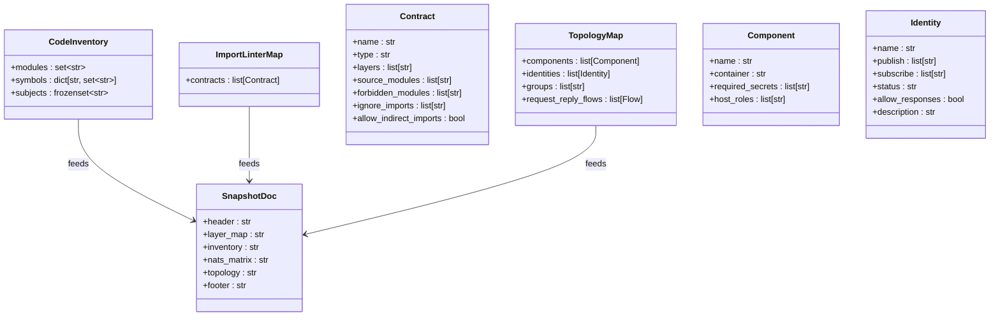
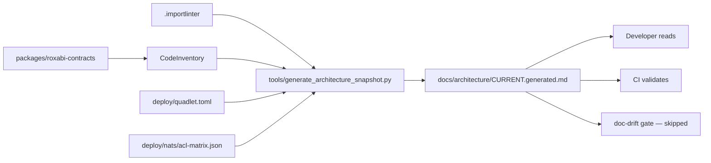

## Context

Promoted from [frame #1532](../frames/1532-tier-1-generated-architecture-snapshot-frame.mdx).

Issue #1531 built a `CodeInventory` oracle that resolves backtick tokens in docs against live AST. This issue serializes that oracle plus the `.importlinter` layer map into a single machine-generated document, refreshed in CI.

## Goal

A CI-refreshed `docs/architecture/CURRENT.generated.md` that is the canonical one-page architecture snapshot — never hand-edited, always current.

## Constraints

- Must consume `CodeInventory.build(root)` from #1531 — no separate extractor
- Must include `.importlinter` layer/boundary map
- Must be excluded from #1531 doc-drift gate (no self-gating)
- CI refresh must be non-blocking (does not gate merge) for the first 2 weeks
- Output must be **byte-for-byte reproducible** (sorted everywhere) so dirty-tree checks are meaningful

## Out of Scope

- Tier-2 deep analysis (call graphs, dependency heatmaps)
- Runtime topology discovery (this is static source analysis)
- Manual curation or hand-editing of the generated output
- ADR consolidation (handled separately by `adr_consolidate.py`)
- Auto-commit of the generated file (fail-and-instruct only)

## Users

| User | Workflow |
|------|----------|
| Developer | Open `CURRENT.generated.md` to understand layer boundaries and NATS subjects |
| Architect | Review layer map during refactors; check for boundary violations |
| CI | Regenerate on every push; stale = fail |
| New contributor | Onboarding reference for system topology |

## Expected Behavior

### 1. Generator script

`tools/generate_architecture_snapshot.py` is invoked with the repo root as its only argument:

```bash
python tools/generate_architecture_snapshot.py .
```

It performs three passes:

1. **CodeInventory pass** — `CodeInventory.build(root)` yields modules, symbols, subjects.
2. **Import-linter pass** — parses `.importlinter` contracts to produce a layer/boundary map.
3. **Topology pass** — reads `deploy/quadlet.toml` and `deploy/nats/acl-matrix.json` to build process topology + NATS identity/subject matrix.

Output: `docs/architecture/CURRENT.generated.md` with a deterministic header, four sections, and a reproducible footer.

### 2. Generated document structure

```markdown
<!-- AUTOGENERATED — DO NOT EDIT BY HAND. Regenerated by tools/generate_architecture_snapshot.py -->

# Architecture Snapshot

## Layer Map

(derived from .importlinter contracts)

## Module / Symbol Inventory

(derived from CodeInventory)

## NATS Subjects & Identities

(derived from acl-matrix.json + contracts)

## Process Topology

(derived from quadlet.toml)

---
*Generated by tools/generate_architecture_snapshot.py — DO NOT EDIT BY HAND*
```

**Determinism rule:** All sections must be sorted (contracts by name, modules alphabetically, symbols alphabetically, components by name, identities by name, subjects alphabetically). No timestamps, no commit SHAs, no non-deterministic ordering.

### 3. Gate exclusion

`check_doc_drift.py` (the #1531 gate) is updated to skip `docs/architecture/CURRENT.generated.md` — same treatment as `adr/` (skip the entire file, not individual tokens).

### 4. CI integration

A new job `architecture-snapshot` in `.github/workflows/ci.yml` runs the generator. If `docs/architecture/CURRENT.generated.md` differs from the committed version, the job fails with:

```
Error: CURRENT.generated.md is stale. Run 'python tools/generate_architecture_snapshot.py .' and commit.
```

The job is non-blocking for the first 2 weeks (`continue-on-error: true`), then promoted to blocking by removing `continue-on-error`.

## Data Model & Consumers

### Data structure



### Consumer map



### Consumer summary

| Consumer | Fields consumed | When | Status |
|----------|----------------|------|--------|
| Generator script | All inputs | On every run | This issue |
| Human reader | Rendered markdown | On demand | This issue |
| CI gate | Exit code + dirty check | Every push | This issue |
| #1531 doc-drift gate | Exclusion list | Every push | This issue |

## Breadboard

| ID | Affordance | Handler | Data |
|----|-----------|---------|------|
| U1 | Run generator script | `python tools/generate_architecture_snapshot.py <root>` | Reads `.importlinter`, `CodeInventory`, `quadlet.toml`, `acl-matrix.json` |
| U2 | View generated doc | Open `docs/architecture/CURRENT.generated.md` | Markdown output |
| U3 | CI refresh | `architecture-snapshot` job in `.github/workflows/` | Runs U1, checks dirty tree |
| U4 | Gate exclusion | `check_doc_drift.py` updated allowlist | Skips `CURRENT.generated.md` |

## Edge Cases

| Scenario | Handling |
|----------|----------|
| `CodeInventory.build()` returns `syntax_errors` | Generator exits 2 (script broke — source has parse errors) |
| `.importlinter` or `acl-matrix.json` missing | Generator exits 2 with clear error message |
| Empty inventory (no modules or no subjects) | Generator still produces a valid doc with empty sections — this is a signal, not an error |
| `CURRENT.generated.md` is untracked or `.gitignore`d | CI dirty check silently passes; the file must be committed to git and not ignored |
| Generator output exceeds 500 KB | Warn but do not fail; the limit is soft (giant output is a signal of code bloat) |

## Slices

| # | Slice | Acceptance criteria | Files |
|---|-------|---------------------|-------|
| S1 | Generator + gate exclusion | U1 + U2 + U4 work end-to-end; produces valid markdown with all 4 sections; gate skips the file | `tools/generate_architecture_snapshot.py`, `tools/check_doc_drift.py` |
| S2 | CI integration | U3 runs on every push; stale doc fails CI | `.github/workflows/ci.yml` |

## Success Criteria

- [ ] `tools/generate_architecture_snapshot.py` exists and runs with `python tools/generate_architecture_snapshot.py .`
- [ ] It produces `docs/architecture/CURRENT.generated.md` with deterministic header, 4 sections, and footer
- [ ] Layer Map section contains all `.importlinter` contracts (names, types, layers, source_modules, forbidden_modules, ignore_imports)
- [ ] Module/Symbol Inventory section contains all project modules and top-level symbols (sorted alphabetically)
- [ ] NATS Subjects & Identities section contains all subjects, identities, groups, and request_reply_flows from `acl-matrix.json` + `roxabi-contracts`
- [ ] Process Topology section contains all components from `quadlet.toml` with container, required_secrets, and host_roles
- [ ] `docs/architecture/CURRENT.generated.md` is committed to git and not in `.gitignore`
- [ ] CI job `architecture-snapshot` in `.github/workflows/ci.yml` runs on every push and fails if the doc is stale
- [ ] CI job uses `continue-on-error: true` for the first 2 weeks, then is promoted to blocking
- [ ] `check_doc_drift.py` excludes `docs/architecture/CURRENT.generated.md` from drift scanning (file-level skip)
- [ ] Doc header clearly states "AUTOGENERATED — DO NOT EDIT BY HAND"
- [ ] Generator exits 2 if `CodeInventory.build()` returns non-empty `syntax_errors`
