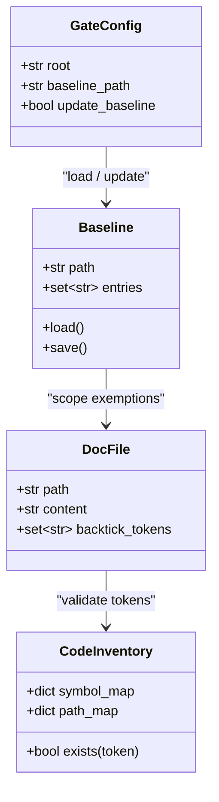

## Context

Promoted from [frame #1536](artifacts/frames/1536-fix-docs-burn-down-doc-drift-baseline-purge-121-dead-refs-living-docs-claude-md-frame.mdx). Origin: #1531 (doc-drift gate). The gate catches dead references in backtick tokens across docs and CLAUDE.md files. It shipped with a baseline of 112 pre-existing dead refs (`tools/doc_drift_baseline.txt`). This spec defines the systematic purge.

## Goal

Eliminate every entry in `tools/doc_drift_baseline.txt` by updating docs to reference live symbols/paths or adding historical annotations, then delete the baseline file so the gate exits 0 with 0 entries.

## Users

- **Primary:** Lyra maintainers reading architecture docs or CLAUDE.md for current system state
- **Secondary:** CI gate operators; new contributors onboarding via docs

## Expected Behavior

1. `tools/check_doc_drift.py` runs against all docs and CLAUDE.md files
2. Every dead ref in `tools/doc_drift_baseline.txt` is resolved by ONE of:
   a. **Update** the doc to reference the live symbol/path (e.g., renamed module, moved function)
   b. **Annotate** with a historical marker (`deleted #1281`) if the doc intentionally documents a removal
   c. **Remove** the reference if it's no longer relevant to the doc's purpose
3. The gate's path-resolution bug for `packages/*/CLAUDE.md` is fixed (package-root-relative vs repo-root-relative)
4. `tools/doc_drift_baseline.txt` is emptied and removed
5. `uv run python tools/check_doc_drift.py` exits 0 with 0 baseline entries

## Data Model & Consumers

**Consumer summary:**

| Consumer | Fields consumed | When | Status |
|----------|-------------------|------|--------|
| CI pipeline (pre-commit) | `GateConfig.root`, `Baseline.entries` | Every commit | This issue |
| Doc authors | `DocFile.backtick_tokens`, `CodeInventory.exists()` | Writing docs | This issue |
| Package maintainers | `GateConfig.root` (package-relative paths) | Writing `packages/*/CLAUDE.md` | This issue |

## Breadboard

| ID | Affordance | Handler | Data |
|----|------------|---------|------|
| D1 | Living docs (ARCHITECTURE.md, architecture/*.md, standards/*.md) | Manual audit + edit | `tools/doc_drift_baseline.txt` entries |
| D2 | CLAUDE.md network (src/lyra/*/, packages/*/) | Manual audit + edit | Baseline entries + package-relative paths |
| D3 | `tools/doc_drift_baseline.txt` | Delete when empty | Baseline file |
| D4 | `tools/check_doc_drift.py` | Fix path resolution bug | `packages/` root handling |
| D5 | CI gate | Validate exit 0 | `check_doc_drift.py` |

## Slices

| # | Slice | Files touched | Demo-able |
|---|-------|---------------|-----------|
| S1 | Living docs purge — highest priority docs | `docs/ARCHITECTURE.md`, `docs/architecture/*.md`, `docs/standards/*.md` | `check_doc_drift.py` shows fewer baseline entries |
| S2 | CLAUDE.md network purge | `src/lyra/*/CLAUDE.md`, `packages/*/CLAUDE.md` | Baseline entries drop to ~0 |
| S3 | Gate fix + baseline deletion | `tools/check_doc_drift.py`, `tools/doc_drift_baseline.txt` | Gate exits 0 with 0 entries |

## Success Criteria

- [ ] `tools/doc_drift_baseline.txt` contains 0 entries (or file is removed)
- [ ] `uv run python tools/check_doc_drift.py` exits 0 with 0 baseline entries
- [ ] `packages/*/CLAUDE.md` `src/…` paths are resolved relative to package root (not repo root)
- [ ] No new dead refs are introduced in the process
- [ ] All historical annotations (`deleted #NNNN`) are accurate and cite real merged PRs/issues
- [ ] `docs/ARCHITECTURE.md` and `docs/architecture/*.md` pass `check_doc_drift.py` without exemptions
- [ ] `src/lyra/*/CLAUDE.md` and `packages/*/CLAUDE.md` pass `check_doc_drift.py` without exemptions
