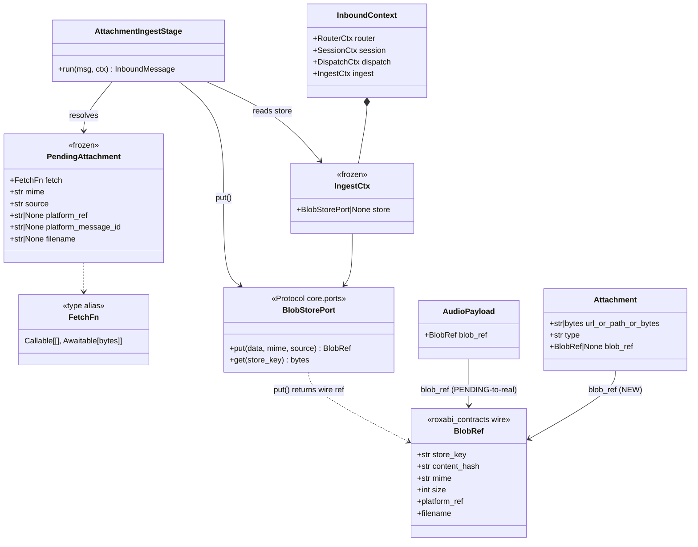
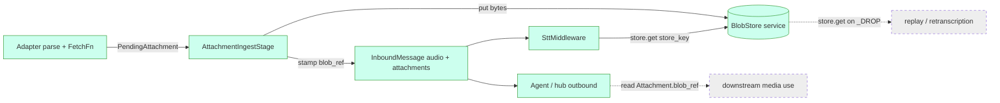

## Context

Source: design analysis `artifacts/analyses/1537-central-inbound-ingestion-design.md`
+ **ADR-083** (central inbound attachment-ingest stage). Frame:
`artifacts/frames/1537-central-attachment-ingestion-stage-frame.mdx`.

Inbound attachments are normalized adapter-side with `store_key=PENDING_STORE_KEY` and
the bytes are dropped — prod blobstore shows **0** `source=telegram`/`source=discord`
refs, and STT failure permanently loses the voice. ADR-083 chose **Option B**: a single
`AttachmentIngestStage` on the **stage axis**, fed a platform-agnostic
`PendingAttachment` descriptor (carrying a `FetchFn` byte-fetch closure) so adapters
contribute only parsing + the closure — closing the N×M trap and guaranteeing blob
durability before `SttMiddleware` runs. ADR-082's `BlobStorePort` + `from_store_ref()`
(merged PR #1546, today) are the consumed seam.

## Goal

Persist every inbound attachment — voice, image, document, video, sticker, animation,
GIF — from Telegram and Discord to BlobStore via one central `AttachmentIngestStage` in
`src/lyra/inbound/`, stamping a real `BlobRef` **before** STT, with zero ingest logic
duplicated per adapter.

## Users

- **Primary:** end users sending attachments to Lyra bots — today their voice notes
  vanish on STT failure and no attachment is durably stored.
- **Secondary:** STT/TTS workers (#1067) consuming a real `store_key` instead of the
  `platform_ref` fallback; future replay / manual-retranscription tooling.

## Expected Behavior

1. **Voice (Telegram/Discord).** Adapter parses the update, builds a `FetchFn` closure
   capturing the platform client (Telegram `bot.get_file()`+`download()`, Discord
   `attachment.read()`), wraps it in `PendingAttachment`, and routes the light
   `InboundMessage` through `InboundPipeline.run()`. The stage awaits the closure and
   calls `ctx.ingest.store.put(data=bytes, mime=…, source=…)` — the injected
   `BlobStorePort`, which returns a fully-populated **wire** `roxabi_contracts.BlobRef`.
   The storage→wire conversion (`BlobRef.from_store_ref`) + `PENDING_STORE_KEY` guard live
   inside the port's `HttpBlobStoreAdapter` (ADR-082, shipped #1546) — **not** the stage,
   which keeps `lyra.inbound` free of `roxabi_blobs`. The stage replaces
   `AudioPayload.blob_ref` (`PENDING_STORE_KEY` → real) before the dispatcher enqueues on
   the bus. STT then runs on a real `store_key`; an STT failure no longer loses the blob
   (already persisted).
2. **Non-audio (image/document/video/sticker/animation/GIF).** Same flow; the stage
   populates a **new** `Attachment.blob_ref` field. `url_or_path_or_bytes` keeps the
   original platform reference for provenance.
3. **Size ceiling.** Before download of any non-audio attachment, the stage enforces
   `MAX_ATTACHMENT_INGEST_BYTES` (20 MiB = TG `getFile` cap) — reject + log + user-facing
   error. Audio keeps its existing `LYRA_MAX_AUDIO_BYTES` (5 MiB) cap.
4. **Oversize at service.** `BlobStorePort.put()` returns **HTTP 500** (not 413) on
   oversize; the stage maps it to a user-facing error — never propagated silently.
5. **store=None (CLI/test).** Stage is a no-op passthrough — `PENDING_STORE_KEY`
   preserved, pipeline unchanged (backward compatible). Production bootstrap **asserts**
   `ctx.ingest.store is not None`.
6. **Fetch failure (decision A, resolved).** During transition (S2–S8): voice → degraded
   mode (keep `PENDING_STORE_KEY`, STT `platform_ref` fallback survives); non-audio → drop
   + user-facing error reply (the attachment *is* the content). **Post-S9** (sentinel +
   `platform_ref` fallback retired): voice has no sentinel to degrade to → converges to the
   same drop + error reply as non-audio (`blob_ref=None`, logged). S9 is gated on this
   convergence so degraded mode never emits a retired sentinel.
7. **Discord CDN expiry.** CDN URLs expire within minutes → ingest is eager, inside the
   pipeline before bus enqueue. The `HttpBlobStore` 5 s write timeout is verified /
   per-call-overridden if CDN→PUT streaming can exceed the idle window.

## Data Model & Consumers

### Data structures



### Consumer map



### Consumer summary

| Consumer | Fields consumed | When | Status |
|---|---|---|---|
| `AttachmentIngestStage` | `PendingAttachment.fetch/mime/source` | inbound, per attachment | **this issue** |
| `SttMiddleware` → `NatsSttClient` | `AudioPayload.blob_ref.store_key` | post-stage, pre-transcribe | **this issue** (#1067 coord) |
| Agent / hub outbound | `Attachment.blob_ref` | post-route | **this issue** (field populated; full consumption may extend later) |
| Replay / retranscription | `blob_ref.store_key` via `store.get()` | on STT `_DROP` | future (enabled, out of scope) |

### Pipeline wiring (S1/S2)

The stage insertion is explicit, not implied:

- `InboundPipeline.__init__` gains `ingest_stage: AttachmentIngestStage | None = None`
  (stored as `self._ingest_stage`). Default `None` preserves every existing caller.
- `InboundContext` (frozen dataclass) gains `ingest: IngestCtx | None = None` — the
  `None` default matches the established optional-field pattern (`SessionCtx.turn_publisher
  = None`) and means no construction site outside production must change.
- In `InboundPipeline.run()`, immediately after `msg = parser.parse(raw, ctx)` (and its
  `None` guard) and **before** the `pre_route_hook` block, insert:

  ```python
  if (
      self._ingest_stage is not None
      and ctx.ingest is not None
      and ctx.ingest.store is not None
  ):
      msg = await self._ingest_stage.run(msg, ctx)
  ```

  `pre_route_hook` keeps its `(msg, ctx) -> None` signature; the stage is the only step
  that returns a rebound `msg`. When any guard is falsy (CLI/test, store=None), the
  pipeline runs exactly as today — `PENDING_STORE_KEY` passes through untouched.

## Breadboard

Backend pipeline affordances (referenced by slices):

| ID | Affordance | Place | Handler | Data |
|---|---|---|---|---|
| N1 | `PendingAttachment` + `FetchFn` + `IngestCtx` | `inbound/attachment_ingest.py` (new) | dataclass defs | descriptor, closure type, store ref |
| N2 | `InboundContext.ingest` + `InboundPipeline._ingest_stage` | `inbound/context.py`, `inbound/pipeline.py` | add `ingest: IngestCtx \| None = None`; `ingest_stage` ctor param | `IngestCtx` |
| N3 | `AttachmentIngestStage.run` — voice | `inbound/attachment_ingest.py` | await `fetch()` → `ctx.ingest.store.put()` → stamp `AudioPayload.blob_ref` (port returns wire ref; no `from_store_ref` here) | real `BlobRef` |
| N4 | Pipeline stage insertion | `inbound/pipeline.py` | run stage after `parse`, before `pre_route_hook`, guarded on `_ingest_stage`+`ctx.ingest.store` (see §Pipeline wiring) | resolved `InboundMessage` |
| N5 | Telegram voice closure | `adapters/telegram/telegram_inbound.py`, `telegram_normalize.py` | build `FetchFn`, route via pipeline (drop direct `push_to_hub_guarded`) | `PendingAttachment` |
| N6 | Discord voice closure | `adapters/discord/discord_audio.py`, `discord_inbound.py` | same as N5 for Discord | `PendingAttachment` |
| N7 | `Attachment.blob_ref` field | `core/messaging/message.py` | add `blob_ref: BlobRef \| None = None` | typed ref |
| N8 | Stage — non-audio + size cap + HTTP-500 map | `inbound/attachment_ingest.py` | `MAX_ATTACHMENT_INGEST_BYTES` (new const, env `LYRA_MAX_ATTACHMENT_INGEST_BYTES`, default 20 MiB — mirrors `LYRA_MAX_AUDIO_BYTES`) guard before download; `put()`; catch HTTP 500 → user error | `Attachment.blob_ref`, user error |
| N9 | Telegram non-audio closures | `adapters/telegram/telegram_normalize.py` | `_extract_attachments` emits `FetchFn` | `PendingAttachment[]` |
| N10 | Discord non-audio closures | `adapters/discord/discord_normalize.py`, `discord_formatting.py` | extract → `FetchFn` | `PendingAttachment[]` |
| N11 | Bootstrap wiring + prod assert + Quadlet | `bootstrap/factory/voice_overlay.py` (reuse `init_blobstore()`), telegram/discord standalone bootstrap, `deploy/quadlet/lyra-{telegram,discord}.container` | inject `BlobStorePort`→`IngestCtx`; assert non-None in prod; **add `LYRA_BLOBSTORE_URL`+`LYRA_BLOBSTORE_TOKEN_PATH` env + `Secret=lyra_blobstore_token,type=mount`** to both adapter units (else `init_blobstore()`→None→silent no-op) | wired stage |
| N12 | STT client cleanup | `nats/nats_stt_client.py` | drop `isinstance(bytes)` + inline `PENDING_STORE_KEY` | real-ref-only path |
| N13 | `PENDING_STORE_KEY` retirement | `roxabi_contracts/blob_ref.py`, `cli_voice_smoke.py`, `nats_tts_codec.py` | remove sentinel + validator (CI-guarded) | sentinel gone |

## Slices

Dependency-ordered (analysis §7); each ≤ F-lite. Phasing surfaced at approval gate.

| # | Slice | Nodes | Falsifiable AC | Issue |
|---|---|---|---|---|
| S1 | Descriptor + `FetchFn` + `IngestCtx` + context/pipeline plumbing | N1,N2 | `inbound-no-adapters` importlinter green; `PendingAttachment` constructible w/ plain `async def`; no `discord`/`aiogram` import in `lyra.inbound`; `InboundContext.ingest: IngestCtx \| None = None` default → no existing construction site changes; `InboundPipeline(ingest_stage=None)` default → all existing callers green | infra |
| S2 | Stage — voice path (PENDING→real) | N3,N4 | unit: stage + `AudioPayload(PENDING)` + closure → message w/ `store_key != PENDING_STORE_KEY` | #1065 |
| S3 | Wire Telegram voice | N5 | e2e: TG voice → `ingest_bytes_to_blob_ref` called **once** → `audio.blob_ref.store_key != PENDING` before hub enqueue | #1065 |
| S4 | Wire Discord voice | N6 | same AC as S3 for Discord; eager-ingest before CDN expiry | #1066 |
| S5 | `Attachment.blob_ref` + stage non-audio + size guard + 500-map | N7,N8 | unit: `Attachment("tg:file_id:x")` + closure → real `blob_ref`; oversize rejected **before** download; HTTP 500 → user error | #1065/#1066 |
| S6 | Wire Telegram non-audio | N9 | e2e: TG image → `Attachment.blob_ref` populated before hub | #1065 |
| S7 | Wire Discord non-audio | N10 | same AC as S6 for Discord | #1066 |
| S8 | Bootstrap wiring + prod assert + adapter Quadlet | N11 | prod bootstrap injects store; asserts `ctx.ingest.store is not None`; `lyra-{telegram,discord}.container` carry blobstore url+token-secret; integration: stage **not** a no-op in prod path | wiring |
| S9 | STT cleanup + `PENDING_STORE_KEY` retirement | N12,N13 | CI: `grep -r PENDING_STORE_KEY src/` = 0; STT integration passes on real `BlobRef`; voice degraded-mode emits `blob_ref=None` (not the retired sentinel) → converges to drop+error | #1067 |

**Dependencies & disposition:**
- **S8 co-merges with S3/S4.** Bootstrap wiring (S8) is a hard prerequisite for the
  voice path being non-no-op in production — S1–S4 landing without S8 ships dead code.
  Group them (see phasing).
- **Issue disposition:** #1065 (Telegram) already CLOSED — S2/S3/S5/S6 preserve its
  traceability. **#1066 (Discord) closes-as-superseded at merge of S7** (completes
  Discord non-audio symmetry; S4 covers Discord voice). #1067 (workers) already CLOSED —
  S9 retires the `PENDING_STORE_KEY` it consumed as fallback.
- **Axial guard (impl):** `PendingAttachment.source` (`"telegram"`/`"discord"`) is
  **metadata only** — it must never drive a branch in `AttachmentIngestStage.run()`, or
  the N×M trap creeps back in. Stage logic stays platform-agnostic.

## Success Criteria

- [ ] Single `AttachmentIngestStage` in `src/lyra/inbound/` builds `InboundMessage`
      payloads with real `BlobRef` (no `PENDING_STORE_KEY`) for **all** attachment types.
- [ ] Telegram + Discord both plug in via a `FetchFn` closure; **zero** ingest logic
      duplicated per adapter.
- [ ] `grep -n 'store.put(' src/lyra/adapters/` = 0 (adapters use the shared stage, not
      direct store writes).
- [ ] The stage is the **single** ingest site: `git grep -lE 'store\.put\(|ingest_bytes_to_blob_ref' src/lyra/adapters/`
      = empty; the one `BlobStorePort.put()` ingest call lives in `inbound/attachment_ingest.py`.
- [ ] Stage modules import neither `discord` nor `aiogram` — `import-layers` /
      `inbound-no-adapters` green.
- [ ] Inbound voice/doc/image/etc. produces a BlobStore row
      (`source=telegram`/`source=discord`) + durable blob, persisted **before** STT.
- [ ] `IngestCtx.store: BlobStorePort | None`; the stage calls `store.put()` (returns the
      wire `BlobRef`). `from_store_ref` conversion stays owned by
      `infrastructure/blobstore_adapter.py` (ADR-082, shipped #1546) — **not** re-implemented
      in the stage; no manual field-copy anywhere.
- [ ] Adapter Quadlet units (`deploy/quadlet/lyra-telegram.container`,
      `lyra-discord.container`) carry `LYRA_BLOBSTORE_URL` + token secret so `init_blobstore()`
      returns a real store in prod (no silent no-op).
- [ ] `AttachmentIngestStage` uses `BlobStorePort.put()` single-shot; `put_multipart()`
      (#1334) **not** referenced.
- [ ] `MAX_ATTACHMENT_INGEST_BYTES` (20 MiB) enforced for non-audio, reject + log
      **before** download.
- [ ] Stage catches HTTP 500 from `put()` → user-facing error (no silent propagation).
- [ ] `HttpBlobStore` write-timeout sufficiency verified (or per-call override applied)
      for CDN→PUT streaming.
- [ ] Production bootstrap asserts `ctx.ingest.store is not None`.
- [ ] STT path consumes the real `store_key`; `NatsSttClient` `PENDING_STORE_KEY`
      construction removed (coordinate #1067).
- [ ] `PENDING_STORE_KEY` sentinel + validator removed; `grep -r PENDING_STORE_KEY src/`
      = 0.
- [ ] store=None mode is a safe no-op (existing CLI/test suite green).

## Open Questions

1. `[NEEDS CLARIFICATION]` `HttpBlobStore` write-timeout: devops confirmed the 5 s timeout
   is fixed at client construction (`http_store.py:89`) with **no per-call override API**
   today. For a 20 MiB body over a slow CDN→PUT leg this may be insufficient. Resolution
   (decide in S5/S8): add a `timeout` kwarg to `HttpBlobStore.put()`, **or** measure the
   worst-case attachment/link and confirm 5 s suffices.
2. `[NEEDS CLARIFICATION]` Phasing — resolved at approval gate. Panel (product-lead +
   devops) recommends **(S1–S4 + S8) → (S5–S7) → (S9)**: S8 must co-ship with voice (else
   prod no-op); S5–S7 (new `Attachment.blob_ref` wire field) is the highest-risk surface;
   S9 is the safe final retirement once both adapters are cut over.

Out of scope (no clarification needed): animated/video stickers (`.tgs`/`.webm`),
`put_multipart`/chunked upload, outbound attachments.
