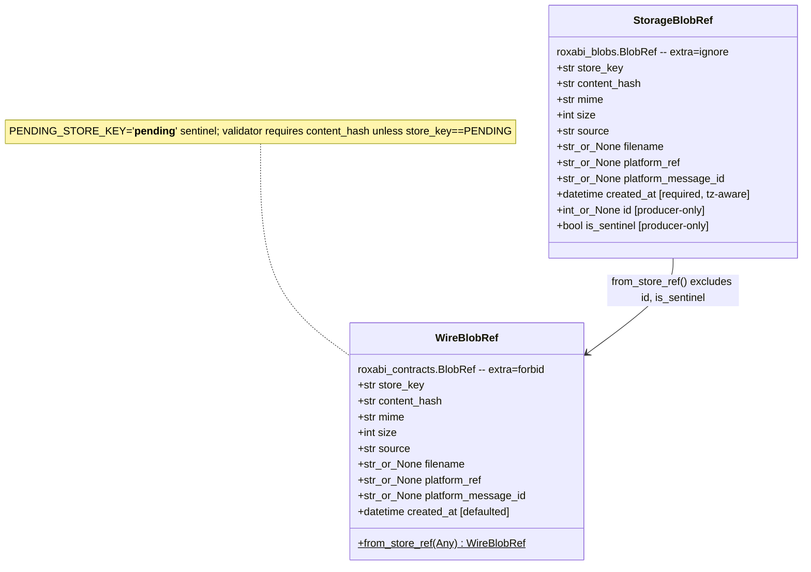
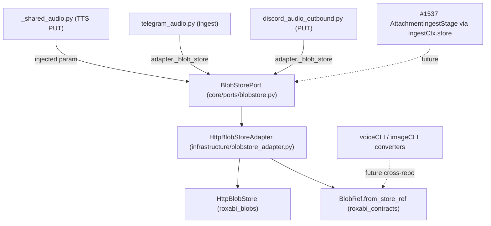

## Context

Source: approved frame `artifacts/frames/1540-blobstore-driven-port-frame.mdx` (analysis
skipped — F-lite). Design SSoT: **ADR-082** (Accepted; architect ENDORSE-WITH-CHANGES +
axial ORTHOGONAL-OK). This spec operationalises ADR-082 Option B into a buildable contract;
it does not re-litigate the decision.

Blob storage is the only external capability lyra consumes outside its hexagonal
driven-port discipline: three callsites call `get_blobstore_client()` directly (no
`core/ports` port, no bootstrap injection), and each boundary crossing hand-rolls a
storage→wire `BlobRef` conversion — divergently, with the lyra copy (`_shared_audio.py:93`)
dropping provenance fields (materially `created_at`; `filename`/`platform_ref`/
`platform_message_id` are also unconveyed).

**ADR-number note:** the central-inbound ADR formerly cited as `ADR-080:93` was renumbered
to **ADR-083** (2026-05-30; #1535 took 080/081 in parallel). Any "ADR-080" reference in the
issue body is stale → ADR-083. The ADR-083/`1537-analysis` amendments are **#1537-owned**
(see Out of Scope).

## Goal

Give blob storage the same driven-port shape as STT/TTS/LLM: one `BlobStorePort` Protocol,
one infra adapter that owns the storage→wire seam, one canonical `from_store_ref` converter
in `roxabi-contracts` — eliminating the bare factory and all divergent converters in lyra.

## Users

- **Primary:** lyra outbound/ingest audio paths (`_shared_audio.py`, `telegram_audio.py`,
  `discord_audio_outbound.py`) — consume the injected port instead of the bare factory.
- **Secondary:** #1537 central-inbound stage (receives `BlobStorePort` via `IngestCtx` —
  **#1537 wires it, out of scope here**); future blob consumers; voiceCLI/imageCLI
  (already converge on the `from_store_ref` shape — cross-repo migration deferred).

## Expected Behavior

1. A caller needing blob storage receives a `BlobStorePort` by injection (never constructs
   `HttpBlobStore` itself, never imports `roxabi_blobs`).
2. `await port.put(data, mime=…, source=…, filename=…, platform_ref=…, platform_message_id=…)`
   returns a **wire** `roxabi_contracts.BlobRef` with all fields carried (incl. `created_at`).
3. Internally the adapter calls `HttpBlobStore.put()` (storage `BlobRef`), converts via
   `roxabi_contracts.BlobRef.from_store_ref()`, and rejects a `PENDING_STORE_KEY` result
   before returning.
4. `await port.get(store_key)` returns bytes; `await port.exists(content_hash)` returns a
   wire `BlobRef | None`.
5. In a unit test, a `MockBlobStore` satisfying `BlobStorePort` is injected with no HTTP/env.
6. `get_blobstore_client()` and `_blobstore_client.py` no longer exist.

## Data Model & Consumers

### Data structure (storage vs wire BlobRef)

Invariant the parity test enforces: `wire_fields == storage_fields − {id, is_sentinel}`.
The two types are kept in sync by **spec + test**, not by import (no storage↔transport cycle).

### Consumer map

### Consumer summary

| Consumer | Uses | When | Status |
|---|---|---|---|
| `_shared_audio.py` | `put()` → wire BlobRef (via injected `blob_store` param) | TTS outbound audio | **this issue** |
| `telegram_audio.py` | `put()` via `adapter._blob_store` | Telegram audio | **this issue** |
| `discord_audio_outbound.py` | `put()` via `adapter._blob_store` | Discord outbound audio | **this issue** |
| `#1537 IngestCtx.store` | `BlobStorePort` injection | inbound attachment ingest | future (#1537) |
| voiceCLI/imageCLI | `from_store_ref` | NATS wire emit | future (cross-repo follow-up) |

## Breadboard

| ID | Affordance | Handler | Data |
|----|------------|---------|------|
| N1 | `BlobStorePort.put(data, *, mime, source, filename?, platform_ref?, platform_message_id?)` (exact mirror of `HttpBlobStore.put`, ADR-067-locked) | `HttpBlobStoreAdapter.put` → `HttpBlobStore.put` → `from_store_ref` → PENDING-guard | → wire `BlobRef` |
| N2 | `BlobStorePort.get(store_key)` | `HttpBlobStoreAdapter.get` → `HttpBlobStore.get` | → `bytes` |
| N3 | `BlobStorePort.exists(content_hash)` | `HttpBlobStoreAdapter.exists` → `HttpBlobStore.exists` | → wire `BlobRef \| None` |
| N4 | `roxabi_contracts.BlobRef.from_store_ref(store_ref: Any)` | `model_validate(model_dump(exclude={id,is_sentinel}))` | storage → wire `BlobRef` |
| N5 | `init_blobstore() -> BlobStorePort` factory | reads `LYRA_BLOBSTORE_URL` + token-at-startup; constructs adapter | env → adapter |
| N6a | new field `BuildHubDeps.blob_store: BlobStorePort \| None` | bootstrap constructs via N5; mirrors `VoiceBundle.stt_service`/`tts_service` | adapter → deps |
| N6b | inject into `TelegramAdapter`/`DiscordAdapter` ctors (→ `self._blob_store`) via wiring helpers | `bootstrap_wiring` passes `blob_store` to each adapter `__init__` | deps → adapters |
| N7 | migrate 3 callsites | `_shared_audio.buffer_audio_chunks`/`buffer_and_render_audio` gain explicit `blob_store: BlobStorePort` param (no adapter context, per its own comment); `telegram_audio.n_audio` + `discord_audio_outbound.n` use `adapter._blob_store` | replace `store = get_blobstore_client()` |
| N8 | field-set parity test | `tests/` asserts `wire == storage − {id,is_sentinel}` | CI gate |
| N9 | delete `get_blobstore_client()` + `_blobstore_client.py` | rm + drop imports | — |
| N10 | doc amendments + ADR/meta registration | reference `from_store_ref`/`BlobStorePort` in #1540-owned docs | — |

## Slices

| # | Slice | Affordances | Independently demo-able |
|---|-------|-------------|--------------------------|
| S1 | `roxabi-contracts` converter | N4, N8 + version bump 0.4.0→0.4.1 | `from_store_ref` round-trips a storage ref; parity test green |
| S2 | Port + adapter | N1, N2, N3 | `MockBlobStore` satisfies `BlobStorePort`; adapter unit test (from_store_ref + PENDING-guard) |
| S3 | Bootstrap + injection seam | N5, N6a, N6b | `init_blobstore()` builds the port; `BuildHubDeps.blob_store` set; both adapter ctors accept + store `blob_store` |
| S4 | Callsite migration + deletion | N7, N9 | `grep get_blobstore_client src/lyra` = 0; `_shared_audio` carries `created_at` via `from_store_ref` |
| S5 | Docs | N10 | ADR-082 in meta.json; #1540-owned doc refs point to new port/converter |

**Ordering = dependency, not independence:** S4 cannot merge without S1–S3 (deleting the
factory requires the injected port + seam to exist). This is **one cohesive PR with internal
slices**, not separable sub-issues — confirmed by architect + product-lead review (analog:
`TurnStoreProtocol` #1506, which likewise landed port + adapter + bootstrap + migration in
one PR). |criteria|=12 and |slices|=5 exceed Gate 2.5 thresholds, but split is rejected by design.

## Success Criteria

- [ ] `BlobStorePort` Protocol in `src/lyra/core/ports/blobstore.py` — `put`/`get`/`exists(content_hash)->BlobRef|None`, `put` signature mirrors the ADR-067-locked `HttpBlobStore.put`, returns **wire** `BlobRef`, **no** `delete`, `@runtime_checkable`.
- [ ] `HttpBlobStoreAdapter` in `src/lyra/infrastructure/blobstore_adapter.py` wraps `HttpBlobStore`, converts via `from_store_ref`, rejects `PENDING_STORE_KEY` (semantic guard only — **no** `sha256:` regex).
- [ ] `roxabi_contracts.BlobRef.from_store_ref(store_ref: Any)` exists; `roxabi-contracts` does **not** import `roxabi-blobs`.
- [ ] Field-set parity test green: `wire_fields == storage_fields − {id, is_sentinel}`.
- [ ] `roxabi-contracts` version bumped 0.4.0 → 0.4.1 (additive minor). lyra consumes via `workspace=true` (no repin); branch-tracked satellites (voiceCLI/imageCLI on `branch="staging"`) auto-pick-up — no manual repin.
- [ ] `init_blobstore() -> BlobStorePort` factory exists in `bootstrap/factory/` and reads the bearer token **once at startup** (preserves restart-not-HUP).
- [ ] New field `BuildHubDeps.blob_store: BlobStorePort | None` set from `init_blobstore()`; `TelegramAdapter`/`DiscordAdapter` constructors accept `blob_store` and store `self._blob_store` (threaded by the wiring helpers).
- [ ] 3 callsites migrated to the injected port; `grep get_blobstore_client src/lyra` returns 0.
- [ ] `get_blobstore_client()` and `_blobstore_client.py` deleted.
- [ ] `_shared_audio.py` PUT path carries `created_at` (and any present `filename`/`platform_ref`/`platform_message_id`) via `from_store_ref` — no hand-built `ContractBlobRef(...)`.
- [ ] `uv run pyright` + `uv run ruff` clean; importlinter `clean-architecture-layers` passes (core/ports imports only `roxabi_contracts`, never infrastructure) with **no new exemption**.
- [ ] `BlobStorePort` is importable from `lyra.core.ports` and is the documented injection point #1537 will consume (handoff: #1537 composes `init_blobstore()`/`BuildHubDeps.blob_store`, never re-imports a factory); ADR-082 registered in `meta.json`.

## Out of Scope

- `IngestCtx.store: BlobStorePort | None` wiring — **#1537** (IngestCtx is #1537's artifact; `rg -l IngestCtx src` = 0).
- **ADR-083 §5 + `artifacts/analyses/1537-central-inbound-ingestion-design.md` §5 amendment** — #1537-owned docs (was the stale "ADR-080:93" bullet in the issue). #1540 does **not** edit #1537's analysis/ADR.
- Cross-repo voiceCLI/imageCLI converter migration; voiceCLI `requests.py` inbound fix.
- `BlobStorePort.delete()` (non-breaking future addition).

## Edge Cases

| Edge | Handling |
|------|----------|
| `HttpBlobStore.put` returns `store_key == PENDING_STORE_KEY` | adapter raises (semantic guard) — never returned to domain |
| storage ref has extra fields beyond wire | `from_store_ref` drops `{id, is_sentinel}`; wire `extra="forbid"` rejects any *other* unexpected field → parity test catches at CI |
| outbound TTS audio (`source="lyra-tts"`) | `filename`/`platform_ref`/`platform_message_id` are legitimately None; the materially-dropped field today is `created_at` — `from_store_ref` restores it |
| blob_store not injected (None) | callers handle `BlobStorePort \| None` (same pattern as `stt_service: STTProtocol \| None`) |
| future S3/MinIO `store_key` (non-`sha256:`) | adapter guard is semantic (PENDING), not format — opaque `store_key` survives |

## Expert Review (Step 4)

Panel (parallel): architect, doc-writer, product-lead, devops, axial-adr-review.

| Reviewer | Verdict | Resolution |
|---|---|---|
| architect | needs-improvement | **Applied** — injection seam was assumed but absent: `BuildHubDeps.blob_store` is a NEW field (S3/N6a); shared `buffer_audio_chunks` gets an explicit `blob_store` param (N7); adapter ctors gain `blob_store` (N6b). `HttpBlobStore.put` sig verified = exact mirror. No-split confirmed. |
| doc-writer | needs-improvement | **Applied** — classDiagram `\n` label flattened; guillemets→ASCII `[...]`; dashed-arrow spacing; SC6 split into N5(factory) + N6(field/inject). |
| product-lead | needs-improvement | **Applied** — 1537-analysis §5 amendment explicitly disowned to Out of Scope (#1537 doc); IngestCtx handoff now a traceable criterion. No-split + IngestCtx-deferral confirmed correct. |
| devops | good | Token-lifecycle **preserved** (read-once-at-startup, more conformant than per-call factory). Minor bump correct; importlinter green; folder-size clear (ports 6→7, infra 2→3, gate 12). Repin wording clarified. |
| axial-adr-review | ORTHOGONAL-OK | 1 converter site post-migration (N×M closed); injection is 1 field not N. **#1537 handoff notes:** (a) two PENDING-`BlobRef` inbound placeholders survive in discord/telegram normalizers — a 3rd platform would trip ADR-073 three-strikes; #1537's stage should absorb. (b) #1537 must compose the port, not re-import a factory. |

Handoff notes (a)/(b) are recorded for #1537, not actioned here.
