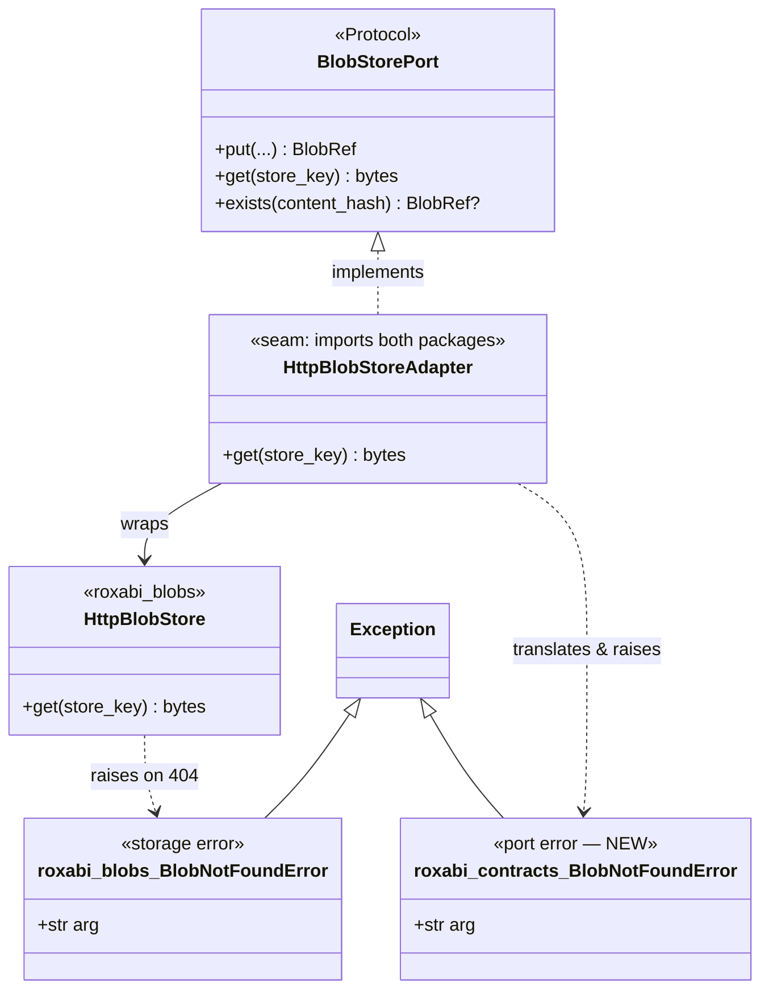

## Context

Source: `artifacts/frames/1547-blobstore-consumption-hardening-frame.mdx` (approved frame).
Closes three **non-blocking** findings deferred from the ADR-082 / PR #1546 review.

**Correction vs frame (grounded in code):** the frame assumed F2 needed a new HTTP-boundary
traversal test. It already exists — `tests/blobstore/test_serve_api.py::TestPathTraversal`
(`test_get_returns_404_on_path_traversal_no_oracle`, "Fix C") **and**
`packages/roxabi-blobs/tests/test_security.py::TestPathTraversal` (unit: absolute/relative
traversal + symlink escape + no-leak). The server guard (`FsBlobStore._safe_resolve_in_root`)
is therefore already test-locked at both layers. **F2 reduces to a docstring note** — no new
code, no new test.

Net real work: **F1** (HTTPS-scheme warning) and **F3** (port-level `BlobNotFoundError` +
adapter translation). **F2** is documentation only.

## Goal

Close the 3 deferred blobstore review findings — warn on cleartext-token URLs (F1), document
the already-enforced server-side traversal boundary (F2), and route `BlobNotFoundError` through
a port-level type in `roxabi_contracts` via adapter translation (F3) — while preserving the
deliberate `contracts ⊥ blobs` decoupling and changing no server behavior.

## Users

| User | Cares about |
|------|-------------|
| Lyra operators | F1 — a warning when a misconfigured non-loopback `http://` blobstore URL would ship the bearer token in cleartext |
| Maintainers / port consumers | F2 — knowing the server is the traversal-enforcement point (don't add redundant client validation); F3 — catching the not-found error without importing `roxabi_blobs` |
| M₂ cross-host workers | unchanged consumption path; benefit from the clearer port contract |

## Expected Behavior

**F1 — HTTPS-scheme warning.** At `init_blobstore()` construction time, after reading
`LYRA_BLOBSTORE_URL`, the scheme + host are inspected. If scheme is `http` **and** host is not
loopback — `localhost`, or an IP literal for which `ipaddress.ip_address(host).is_loopback` is
True (covers the full `127.0.0.0/8` range and `::1`) — a single warning is logged naming the URL
and the cleartext-token risk (and noting Tailnet transport-encryption as the standing mitigation).
Loopback-`http` (the default `http://localhost:8449`) and any `https://` URL stay silent. The
guard **never rejects** — it only warns; the store is still constructed.

**F2 — server-side traversal boundary (doc only).** `HttpBlobStore.get` and the
`BlobStorePort.get` docstring gain a note: `store_key` is server-issued and opaque; the BlobStore
**server** enforces path containment (`FsBlobStore._safe_resolve_in_root`, traversal → 404, no
oracle), and that invariant is regression-locked by `tests/blobstore/test_serve_api.py` +
`packages/roxabi-blobs/tests/test_security.py`. Consumers must not add client-side `store_key`
sanitisation (it would break the legitimate `:path` legacy-key slash semantics). No behavior change.

**F3 — port-level not-found error.** A new `BlobNotFoundError` is defined in
`roxabi_contracts.blob_errors` (independent `Exception` subclass, mirroring the public shape of the
`roxabi_blobs` one) and exported from the `roxabi_contracts` package `__all__` (via `__init__`).
`HttpBlobStoreAdapter` — already the single seam allowed to
import both packages — catches `roxabi_blobs.BlobNotFoundError` in `get()` and re-raises the
`roxabi_contracts.BlobNotFoundError`. The `BlobStorePort.get` docstring is updated to tell callers
to import the error from `roxabi_contracts`. The BlobStore **server** (`_handlers.py`, `_keys.py`)
is untouched — it legitimately imports from `roxabi_blobs.errors` as the storage layer itself.

## Data Model & Consumers

### Error / port structure

### Error-propagation / consumer map

```mermaid
flowchart LR
    caller["port consumer<br/>(future catchers)"]
    port["BlobStorePort.get"]
    adapter["HttpBlobStoreAdapter.get<br/>catch blobs-err → raise contracts-err"]
    http["HttpBlobStore.get<br/>(roxabi_blobs)"]
    server["BlobStore server<br/>_handlers / _keys"]
    fsguard["FsBlobStore._safe_resolve_in_root<br/>traversal → 404"]

    caller -->|catches roxabi_contracts.BlobNotFoundError| port
    port --> adapter
    adapter --> http
    http -->|HTTP 404| adapter
    server --> fsguard
    http -.HTTP GET.-> server

    classDef future stroke-dasharray: 5 5;
    class caller future;
```

### Consumer summary

| Consumer | Imports `BlobNotFoundError` from | When | Status |
|----------|----------------------------------|------|--------|
| Port consumers (adapters/stages catching not-found) | `roxabi_contracts` (after F3) | on `get()` of a deleted/absent key | **future** — none catch it today; F3 future-proofs the contract |
| `HttpBlobStoreAdapter` (the seam) | both (`roxabi_blobs` in, `roxabi_contracts` out) | translation in `get()` | **this issue** |
| BlobStore server (`_handlers.py`, `_keys.py`) | `roxabi_blobs` (storage layer — legitimate) | server-side 404 mapping | **unchanged** |

## Breadboard

### Backend affordances

| ID | Element | Location | Finding |
|----|---------|----------|---------|
| N1 | non-loopback-`http` scheme check + warning log | `src/lyra/bootstrap/factory/voice_overlay.py` `init_blobstore()` | F1 |
| N2 | `HttpBlobStore.get` docstring — server-enforced opaque key | `packages/roxabi-blobs/src/roxabi_blobs/http_store.py` | F2 |
| N3 | `roxabi_contracts.BlobNotFoundError` class | `packages/roxabi-contracts/src/roxabi_contracts/errors.py` | F3 |
| N4 | export N3 from `errors.__all__` + package `__init__` `__all__` | `roxabi_contracts/errors.py` + `roxabi_contracts/__init__.py` | F3 |
| N5 | `HttpBlobStoreAdapter.get` translation (catch `roxabi_blobs` → raise `roxabi_contracts`) | `src/lyra/infrastructure/blobstore_adapter.py` | F3 |
| N6 | `BlobStorePort.get` docstring — import from `roxabi_contracts` + server-enforces-traversal note | `src/lyra/core/ports/blobstore.py` | F2+F3 |

### Wiring

- N1 reads the env var already present in `init_blobstore`; warning uses the module `log`.
- N5 is the only behavioral change to the consumption path: the raised type changes from
  `roxabi_blobs.BlobNotFoundError` → `roxabi_contracts.BlobNotFoundError`. Safe — no in-tree
  consumer catches it today (verified by grep).
- **Translation scope = `get()` only.** `BlobStorePort` declares `put`/`get`/`exists` (no
  `delete`); `put`/`exists` never raise `BlobNotFoundError`. `HttpBlobStore.delete()` *does* raise
  the `roxabi_blobs` error on 404, but it is unreachable through the port — the adapter exposes no
  `delete`. If `delete` is ever added to `BlobStorePort`, its translation must land with it
  (noted in N5 / port docstring).
- N3/N4 keep `roxabi_contracts` free of any `roxabi_blobs` import (enforced by import-linter).

## Slices

| Slice | Finding | Affordances | Independently demo-able outcome |
|-------|---------|-------------|---------------------------------|
| S1 | F1 | N1 + test | `LYRA_BLOBSTORE_URL=http://10.0.0.5:8449` → warning logged; `http://localhost:8449` & `https://host:8449` → silent |
| S2 | F2 | N2 + N6(note) | docstrings state server-enforces-containment + cite existing traversal tests; reviewer C62 concern permanently answered; no code/test change |
| S3 | F3 | N3 + N4 + N5 + N6(import) + tests | `from roxabi_contracts import BlobNotFoundError` works; `adapter.get` on 404 raises the contracts error; `roxabi_contracts` imports no `roxabi_blobs` |

Each slice is independently shippable; recommended order S1 → S2 → S3 (S3 is the largest).

## Success Criteria

- [ ] `init_blobstore` logs exactly one warning when `LYRA_BLOBSTORE_URL` scheme is `http` and the host is non-loopback (loopback := host `localhost` **or** `ipaddress.ip_address(host).is_loopback` — i.e. `127.0.0.0/8` and `::1`); **no** warning for loopback-`http` (incl. `127.0.0.1`/`::1`) or any `https` (unit test asserts both branches).
- [ ] The F1 guard never rejects — `init_blobstore` still returns the adapter for a non-loopback `http` URL (only warns).
- [ ] `HttpBlobStore.get` and `BlobStorePort.get` docstrings state `store_key` is server-issued/opaque and the **server** enforces path containment, citing `_safe_resolve_in_root` + the existing traversal tests.
- [ ] `roxabi_contracts.BlobNotFoundError` exists, subclasses `Exception`, and imports via both `from roxabi_contracts import BlobNotFoundError` and `from roxabi_contracts.errors import BlobNotFoundError`.
- [ ] `HttpBlobStoreAdapter.get` raises `roxabi_contracts.BlobNotFoundError` (not the `roxabi_blobs` one) on a wrapped 404; a test asserts the raised type.
- [ ] `BlobStorePort.get` docstring instructs callers to import `BlobNotFoundError` from `roxabi_contracts`; the adapter uses module-qualified `import roxabi_blobs` + `except roxabi_blobs.BlobNotFoundError` (never `from roxabi_blobs import BlobNotFoundError`), so `grep -rn 'from roxabi_blobs import BlobNotFoundError' src/lyra` returns zero matches; the server files (`_handlers.py`, `_keys.py`) import via `roxabi_blobs.errors` and stay unchanged.
- [ ] `roxabi_contracts` does not import `roxabi_blobs` (decoupling preserved — import-linter / grep green); server files `_handlers.py` / `_keys.py` unchanged.
- [ ] Full existing blobstore + contracts + bootstrap test suites still pass.
