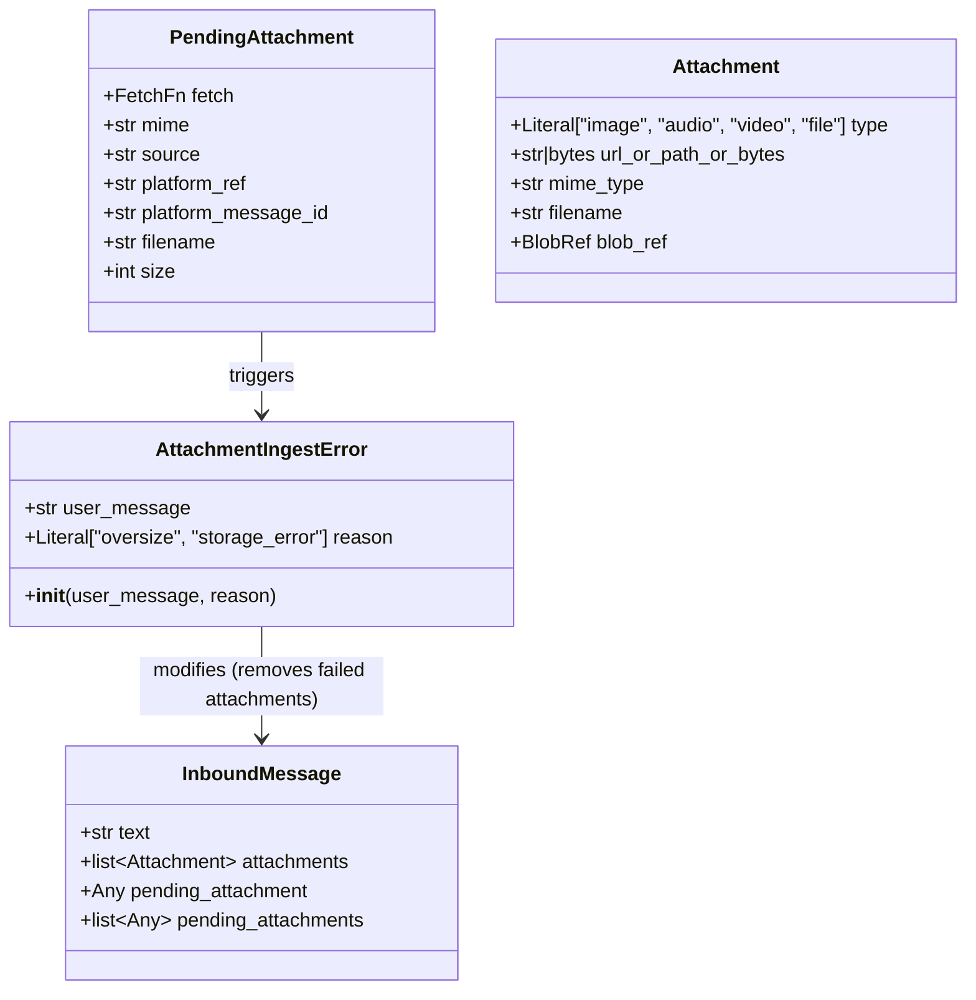

## Context

Deferred review findings from PR #1559 (S5–S7 of #1552). The non-audio attachment ingest pipeline (`AttachmentIngestStage`) has three gaps that degrade the user experience and create implicit operational contracts.

Source: `src/lyra/inbound/attachment_ingest.py`, `src/lyra/adapters/{telegram,discord}/*_inbound.py`.

## Goal

Make the attachment ingest pipeline resilient to oversize attachments (text preserved, attachment rejected), explicit about partial-failure behavior (no orphan blobs), and machine-readable about failure reasons (adapter can branch).

## Users

- **Primary:** Users sending mixed text+attachment messages where one or more attachments exceed the size cap.
- **Secondary:** Operators debugging attachment failures; adapter maintainers deciding whether to let text through.

## Expected Behavior

### A1 — Mixed text+oversize: text preserved

When a message contains both text and an oversize attachment, the adapter must send the text to the hub (users expect the text to be processed) while notifying the user that the attachment was too large. The current behavior (drop the entire message) is a product gap.

**Approach:** Move the oversize guard to the adapter's parse/normalize phase, where the adapter already knows the declared `size` of each `PendingAttachment`. Before calling `_pipeline.run()`, the adapter filters out oversize attachments from both `attachments` and `pending_attachments`, logs the skip, optionally sends a "too large" reply, and dispatches the cleaned message.

**Rationale:** The adapter has the size metadata at parse time; rejecting early avoids creating a `PendingAttachment` that we know will fail. The pipeline then sees a text-only (or reduced-attachment) message and proceeds normally. No `AttachmentIngestError` is raised for oversize.

**Defense-in-depth:** The ingest stage retains a post-fetch size check (`len(data) > MAX_ATTACHMENT_INGEST_BYTES`) as a safety net against platform size misreporting. If this fires, it raises `AttachmentIngestError` with `reason="storage_error"` (not oversize), because the adapter already filtered declared oversize.

### A2 — Partial-failure: no orphans

When `_ingest_non_audio` raises on item *i*, items `0..i-1` have already been `store.put()`-ed and their `blob_ref` stamped. But the stage raises before returning, so the message never reaches the hub. The blob refs are "orphaned" — they exist in BlobStore but are not referenced by any message.

**Approach:** Accumulate per-item results inside `_ingest_non_audio`. For each item, attempt fetch + store. On success, stamp the `blob_ref`. On failure (storage 5xx), record the failure. After the loop, stamp all successful `blob_ref`s onto the message, clear `pending_attachments`, and return. If any items failed, raise a summary `AttachmentIngestError` with a `reason` field.

**Rationale:** BlobStore uses content-addressed dedup, so orphan cost is low today, but the implicit no-rollback contract is a footgun. Making it explicit and accumulating results prevents the surprise.

### A4 — Flat error: machine-readable reason

`AttachmentIngestError` currently carries only `user_message: str`. Both "oversize" and "storage 5xx" raise the same flat type, so the adapter boundary cannot branch (e.g., let text through on oversize but not on storage failure).

**Approach:** Add `reason: Literal["oversize", "storage_error"]` to `AttachmentIngestError`. After A1, the adapter will only see `storage_error` (or `oversize` from the defense-in-depth post-fetch check). The adapter boundary branches:
- `reason="oversize"`: text-only message already in pipeline (per A1), but send a notification reply.
- `reason="storage_error"`: fail hard — send error reply and return (current behavior).

## Data Model & Consumers

### classDiagram


### Consumer map

```mermaid
flowchart LR
    A[Adapter parse] -->|filters oversize| B[PendingAttachment]
    B -->|_ingest_non_audio| C[AttachmentIngestStage]
    C -->|stamps blob_ref| D[Attachment]
    D -->|serializes| E[NATS / Hub]
    C -->|raises| F[AttachmentIngestError]
    F -->|reason="storage_error"| G[Adapter boundary reply]
    F -->|reason="oversize"| H[Adapter already filtered]
```

### Consumer summary

| Consumer | Fields consumed | When | Status |
|----------|----------------|------|--------|
| Adapter parse | `PendingAttachment.size` | Before pipeline | this issue |
| AttachmentIngestStage | `PendingAttachment.fetch`, `size`, `mime` | During pipeline | this issue |
| Adapter boundary | `AttachmentIngestError.reason`, `user_message` | After pipeline | this issue |
| NATS serialiser | `Attachment.blob_ref` | After pipeline | existing |

## Breadboard

| ID | Affordance | Handler | Data | Notes |
|----|-----------|---------|------|-------|
| U1 | User sends text+oversize attachment | Adapter parse filters oversize | `PendingAttachment.size` | Text proceeds; attachment dropped |
| U2 | User sends text+storage-failing attachment | `_ingest_non_audio` raises | `AttachmentIngestError.reason="storage_error"` | Text dropped; error reply sent |
| U3 | Operator inspects logs | `log.warning` | `AttachmentIngestError` | Reason visible in logs |
| N1 | Adapter parse phase | `MAX_ATTACHMENT_INGEST_BYTES` check | `PendingAttachment.size` | New: filter before pipeline |
| N2 | Ingest stage loop | Accumulate results | `list[AttachmentResult]` | New: per-item success/failure |
| N3 | Adapter boundary catch | Branch on reason | `AttachmentIngestError.reason` | New: `storage_error` vs `oversize` |

## Slices

| Slice | Scope | Vertical | Acceptance |
|-------|-------|----------|------------|
| S1 | A4: Add `reason` to `AttachmentIngestError` | Error type + all raise sites | `AttachmentIngestError` has `reason` field; all 3 raise sites pass it |
| S2 | A1: Adapter oversize filter (Telegram) | `telegram_attachments.py` + `telegram_inbound.py` | Oversize attachments filtered before pipeline; text proceeds; "too large" reply sent |
| S3 | A1: Adapter oversize filter (Discord) | `discord_formatting.py` + `discord_inbound.py` | Same as S2 for Discord |
| S4 | A2: Accumulate per-item results in `_ingest_non_audio` | `attachment_ingest.py` | Partial failures stamp successes before raising summary error |
| S5 | Integration: end-to-end mixed text+oversize | Test + adapter | Text-only message reaches hub when attachment is oversize |

## Success Criteria

- [ ] `AttachmentIngestError` carries a `reason` field with `Literal["oversize", "storage_error"]` type.
- [ ] All raise sites in `_ingest_non_audio` pass the correct `reason`.
- [ ] Telegram adapter filters oversize attachments before pipeline (`_extract_attachments` or `telegram_inbound.py` pre-pipeline check).
- [ ] Discord adapter filters oversize attachments before pipeline (`extract_non_audio_attachments` or `discord_inbound.py` pre-pipeline check).
- [ ] When an oversize attachment is filtered, the adapter still sends a "too large" user-facing reply.
- [ ] When only oversize attachments are present (no text), the adapter drops the message gracefully (no empty message to hub).
- [ ] `_ingest_non_audio` accumulates per-item results and stamps successful `blob_ref`s before raising a summary error.
- [ ] If a storage error occurs mid-loop, earlier successful attachments are preserved on the returned `InboundMessage`.
- [ ] The post-fetch size defense-in-depth check raises `reason="storage_error"` (not `oversize`), because declared oversize is already filtered.
- [ ] Existing audio ingest path (`_ingest_audio`) is unchanged (ADR-079 regression guard).
- [ ] No `AttachmentIngestError` is raised from `_ingest_audio` (existing degrade-to-None behavior preserved).
