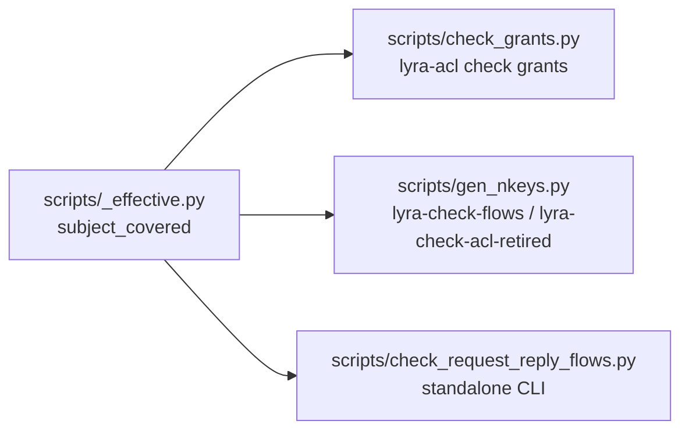

## Context

Promoted from [frame #1567](../frames/1567-refactor-acl-unify-subject-covered-3-copies-single-token-nats-semantics-frame.mdx).

`subject_covered` (NATS-wildcard coverage check) exists in **3 copies** across the ACL script suite:
- `scripts/_effective.py:subject_covered` (canonical, imported by `check_grants.py`)
- `scripts/gen_nkeys.py:_subject_covered` (private, used in `_flow_errors`)
- `scripts/check_request_reply_flows.py:_subject_covered` (private, used in `main()`)

All three are logically identical today but maintained independently. A future correction applied to one silently diverges the others.

## Goal

Consolidate to one `subject_covered` in `_effective.py`, migrate the other two copies to import it, and fix two NATS-wildcard semantic gaps in the same change.

## Users

- **Primary:** Lyra developers maintaining ACL scripts
- **Secondary:** CI pipeline (`factory-acl check grants`, `lyra-check-flows`, `lyra-check-acl-retired` falsification gates)

## Expected Behavior

### Current state (all 3 copies)

```python
def subject_covered(subject: str, grants: list[str]) -> bool:
    for grant in grants:
        if grant == subject or grant == ">":
            return True
        if grant.endswith(".>"):
            prefix = grant[:-1]      # "foo."
            bare = grant[:-2]        # "foo"
            if subject == bare or subject.startswith(prefix):
                return True
    return False
```

### Gaps

1. **No `.*` handling** — `foo.*` is treated as a literal string. NATS `foo.*` matches `foo.bar` (single token), not `foo.bar.baz`.
2. **Bare-prefix `.>` match** — `foo.>` matches `foo` (bare prefix). NATS `foo.>` does NOT match `foo`; it matches `foo.bar` and deeper.

### Target state (single `_effective.py` function)

```python
def subject_covered(subject: str, grants: list[str]) -> bool:
    for grant in grants:
        if grant == subject or grant == ">":
            return True
        if grant.endswith(".>"):
            prefix = grant[:-1]      # "foo."
            if subject.startswith(prefix):
                return True
        if grant.endswith(".*"):
            prefix = grant[:-1]      # "foo."
            if subject.startswith(prefix) and "." not in subject[len(prefix):]:
                return True
    return False
```

## Data Model & Consumers

### Consumer map



### Consumer summary

| Consumer | Fields consumed | When | Status |
|----------|-----------------|------|--------|
| `check_grants.py` | `subject_covered(subject, grants)` | CI falsification gate | this issue |
| `gen_nkeys.py` | `subject_covered(subject, publish)` | `_flow_errors` for flow validation | this issue |
| `check_request_reply_flows.py` | `subject_covered(subject, publish)` | standalone CLI + subprocess tests | this issue |

## Breadboard

| Affordance | Handler | Data |
|------------|---------|------|
| `subject_covered(subject, grants)` | `_effective.py` | NATS subject + grant list |
| `lyra-check-flows` | `gen_nkeys.py:_cmd_check_flows` → `_flow_errors` | `acl-matrix.json` |
| `lyra-check-acl-retired` | `gen_nkeys.py:_check_retired` | `acl-matrix.json` |
| `check_request_reply_flows.py` | `main()` | `acl-matrix.json` |

## Slices

| Slice | What | Files | Independent? |
|-------|------|-------|--------------|
| S1 | Harden `subject_covered` in `_effective.py` + add parametric tests (new test class `TestSubjectCovered` in `test_effective.py` — does not exist today) | `_effective.py`, `test_effective.py` | ✓ |
| S2 | Migrate `gen_nkeys.py` to import from `_effective.py` | `gen_nkeys.py` | ✓ |
| S3 | Migrate `check_request_reply_flows.py` to import from `_effective.py` | `check_request_reply_flows.py` | ✓ |
| S4 | Verify all CI gates green | CI workflows | ✓ |

S1 must land before S2/S3 (semantic correctness). S2 and S3 are file-independent and can be prepared in parallel.

## Success Criteria

- [ ] `subject_covered` in `scripts/_effective.py` handles exact match, `>`, `.*`, and `.>` correctly per NATS semantics
- [ ] `.>` grants match sub-levels (e.g., `foo.>` → `foo.bar`, `foo.bar.baz`) but NOT bare prefix `foo`
- [ ] `.*` grants match single-token suffixes (e.g., `foo.*` → `foo.bar`) but NOT multi-token `foo.bar.baz` nor bare prefix `foo`
- [ ] `scripts/gen_nkeys.py` no longer contains a private `_subject_covered` implementation; imports from `_effective.py`
- [ ] `scripts/check_request_reply_flows.py` no longer contains a private `_subject_covered` implementation; imports from `_effective.py`
- [ ] `scripts/check_grants.py` continues to import `subject_covered` from `_effective.py` (unchanged)
- [ ] Parametric tests in `tests/scripts/test_effective.py` cover: exact match, `>`, `.*` positive/negative, `.>` positive/negative, mixed grant list
- [ ] `tests/scripts/test_check_request_reply_flows.py` still passes (subprocess CLI against prod matrix)
- [ ] `lyra-check-flows` CI step passes (no regression in flow validation)
- [ ] `factory-acl check grants` CI step passes (no regression in coverage validation)
