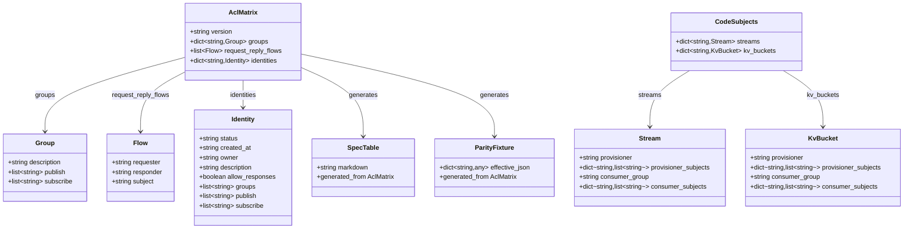
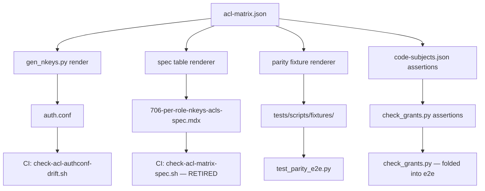

## Context

The NATS ACL configuration for Lyra is maintained in **5 hand-mirrored representations**:

1. `deploy/nats/acl-matrix.json` — the JSON matrix defining per-role subjects
2. `deploy/nats/auth.conf` — generated from the matrix, but checked in
3. `artifacts/specs/706-per-role-nkeys-acls-spec.mdx` — the spec table (manual)
4. Test fixtures under `tests/scripts/fixtures/` — copied snapshots of the matrix for testing
5. `deploy/nats/code-subjects.json` — resource-keyed subject manifest consumed by `check_grants.py`

These are kept in sync by **4 cross-check scripts** plus a **CI drift gate**. The drift gate **failed twice** during recent PRs (#1572, #1575), meaning the manual sync is both error-prone and a recurring tax on every ACL change.

## Goal

**Single source of truth:** `deploy/nats/acl-matrix.json` is the only hand-edited file. All other views (spec table, parity fixture, code-subjects assertions) are generated from it.

## Users

- **Primary:** Developers adding or modifying NATS ACL roles/subjects
- **Secondary:** Reviewers verifying ACL coverage; CI maintainers debugging drift-gate failures

## Expected Behavior

When a developer edits `deploy/nats/acl-matrix.json`:

1. The spec table in `artifacts/specs/706-per-role-nkeys-acls-spec.mdx` is auto-regenerated by a script
2. The test fixtures under `tests/scripts/fixtures/` are derived from the matrix at test time (or regenerated on demand)
3. `deploy/nats/code-subjects.json` is removed; its assertions are folded into the e2e conformance test
4. The CI drift gate `check-acl-matrix-spec.sh` is retired because the spec table is now generated

## Data Model & Consumers

| Consumer | Fields consumed | When | Status |
|---|---|---|---|
| `gen_nkeys.py` | identities, groups, request_reply_flows | At auth.conf generation | This issue |
| `check-acl-matrix-spec.sh` | identities, groups, request_reply_flows | At CI drift check | **Retired** |
| `test_renderer.py` | identities, groups, request_reply_flows | At test time | This issue |
| `test_parity_e2e.py` | identities, groups, request_reply_flows | At test time | This issue |
| `check_grants.py` | streams, kv_buckets | At CI drift check | **Folded into e2e** |

## Breadboard

| Affordance | Handler | Data |
|---|---|---|
| **U1** — Edit `acl-matrix.json` | Developer | `deploy/nats/acl-matrix.json` |
| **U2** — Regenerate spec table | `scripts/render_acl_spec.py` | Reads `acl-matrix.json` → writes `706-per-role-nkeys-acls-spec.mdx` sentinel block |
| **U3** — Regenerate parity fixture | `scripts/render_acl_parity.py` | Reads `acl-matrix.json` → writes effective JSON fixture |
| **U4** — Run e2e conformance | `pytest tests/scripts/test_parity_e2e.py` | Uses rendered auth.conf + real nats-server |

## Slices

| Slice | Scope | Demo-able |
|---|---|---|
| **S1** — Spec table renderer | Extract `check-acl-matrix-spec.sh` table-rendering logic into a standalone Python script that writes the sentinel block in `706-per-role-nkeys-acls-spec.mdx` | Yes — run script, diff shows spec table updated |
| **S2** — Parity fixture renderer | Extract effective-JSON computation from `check-acl-matrix-spec.sh` into a standalone script that writes `tests/scripts/fixtures/v3-current.json` (or similar) from the live matrix | Yes — run script, fixture updated |
| **S3** — Fold code-subjects into e2e | Move `check_grants.py` assertions into `test_parity_e2e.py` or a new `test_grants_e2e.py`; retire `deploy/nats/code-subjects.json` | Yes — run pytest, grants assertions pass |
| **S4** — CI gate cleanup | Remove `check-acl-matrix-spec.sh` from CI; add pre-commit hook or Makefile target for `render_acl_spec.py` | Yes — CI passes without drift gate |

## Success Criteria

- [ ] `scripts/render_acl_spec.py` exists and generates the spec table from `acl-matrix.json` into the sentinel block of `706-per-role-nkeys-acls-spec.mdx`
- [ ] `scripts/render_acl_parity.py` exists and generates an effective-JSON parity fixture from `acl-matrix.json` (equivalent to `check-acl-matrix-spec.sh` Pass 1+2)
- [ ] `tests/scripts/fixtures/v3-current.json` is auto-generated (or generated on-demand) and `test_parity_e2e.py` uses it instead of hand-maintained fixtures
- [ ] `deploy/nats/code-subjects.json` is deleted; its assertions are covered by a new or existing e2e test
- [ ] `scripts/check_grants.py` is either retired or refactored to read from `acl-matrix.json` directly (no `code-subjects.json`)
- [ ] `scripts/check-acl-matrix-spec.sh` is removed from CI and from the repo
- [ ] `scripts/check-acl-authconf-drift.sh` remains (it validates auth.conf generation, which is already automated)
- [ ] `scripts/check_subject_literals.py` remains (it validates source literals against the oracle, not against the matrix directly)
- [ ] `scripts/check_acl_matrix_retired.py` remains (it validates lifecycle fields, unrelated to the sync problem)
- [ ] A README or Makefile target documents how to regenerate the spec table + fixture
