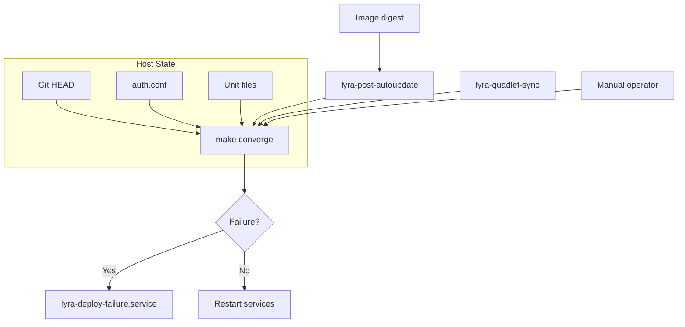
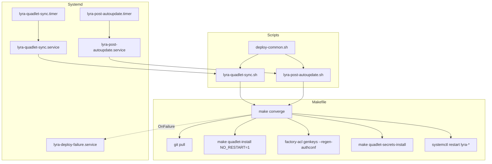

## Context

Promoted from [analysis](artifacts/analyses/1578-collapse-deploy-atomic-analysis.mdx) — Shape 2 recommended (new atomic `make converge` + dual wiring to sync timer and autoupdate).

## Goal

Any deploy trigger (staging merge, autoupdate, or manual) converges the host to HEAD via a single idempotent verb: `make converge`.

## Users

- **Primary:** Mickael (operator, deploys on M₁ roxabituwer)
- **Secondary:** Autoupdate hook (`lyra-post-autoupdate.timer`, headless, no human intervention)

## Expected Behavior

1. **Manual trigger:** Operator runs `make converge` on M₁. The verb:
   - Checks if host is already converged (git HEAD = origin/staging, unit files unchanged, auth.conf fresh, image digest current). If yes, exits 0.
   - Pulls `origin/staging` for `lyra` (and `voiceCLI` if `VOICE_DIR` is present)
   - Runs `make quadlet-install NO_RESTART=1` (render units, daemon-reload, no restart)
   - If `voiceCLI` is present, runs `make -C "$$VOICE_DIR" quadlet-install NO_RESTART=1`
   - Runs `factory-acl genkeys --regen-authconf`
   - Runs `make quadlet-secrets-install`
   - Restarts `lyra-nats` (first, to refresh `type=mount` secrets)
   - Restarts `lyra-hub lyra-telegram lyra-discord lyra-clipool lyra-turn-writer lyra-gh-helper lyra-blobstore`
   - If `voiceCLI` is present, restarts `voicecli-tts voicecli-stt`
   - Uses `flock -n` to prevent concurrent runs (exits 0 if another converge is in progress)
   - Stops on any failure (`set -euo pipefail`) before restart

2. **Sync timer trigger:** `lyra-quadlet-sync.timer` (5 min) fires → `lyra-quadlet-sync.service` checks if `lyra` git HEAD differs from `origin/staging` OR if `deploy/quadlet/`, `Makefile`, or `tools/render_quadlet.py` changed. If yes → runs `make converge`.

3. **Autoupdate trigger:** `lyra-post-autoupdate.timer` (5 min) checks if the local `ghcr.io/roxabi/lyra:staging-svc` digest differs from GHCR (via `skopeo inspect` or `podman manifest inspect`). If yes → `lyra-post-autoupdate.service` pulls the new image and runs `make converge`.

4. **Failure notification:** If `make converge` fails, `lyra-deploy-failure.service` (triggered by `OnFailure`) logs to journal. A follow-up issue will add Telegram/Discord alerting (deferred, out of scope for this cycle).

5. **PATH fix:** Both `lyra-quadlet-sync.service` and `lyra-post-autoupdate.service` include `%h/projects/lyra/.venv/bin` in `PATH`, making `factory-acl`, `uv`, and `lyra` available headless.

6. **Unit installation:** New systemd units (`lyra-post-autoupdate.service`, `lyra-post-autoupdate.timer`, `lyra-deploy-failure.service`) are installed by `make quadlet-sync-install` (expanded to include these units).

## Data Model & Consumers

This issue does not introduce new data structures. It modifies the deploy state machine and trigger wiring. The relevant state is:

| State | Source | Consumer | Change Detection |
|-------|--------|----------|------------------|
| Git HEAD SHA | `git rev-parse HEAD` | `make converge` | `git rev-parse origin/staging` |
| Image digest | `podman images --digests` | `lyra-post-autoupdate` | `skopeo inspect` vs GHCR |
| auth.conf SHA | `sha256sum ~/.lyra/nkeys/auth.conf` | `make converge` | Compare before/after regen |
| Unit file checksums | `md5sum ~/.config/containers/systemd/lyra-*` | `make converge` | Compare before/after install |

## Breadboard

### Affordance Table

| ID | Affordance | Type | Where | Notes |
|----|------------|------|-------|-------|
| N1 | `make converge` | Target | Makefile | New atomic verb. Change-gated, idempotent. |
| N2 | `deploy/lib/deploy-common.sh` | Script | `deploy/lib/` | Shared: `flock` wrapper, PATH export, change detection helpers. |
| N3 | `lyra-quadlet-sync.sh` | Script | `deploy/` | Modified: change-gated, calls `make converge`. |
| N4 | `lyra-quadlet-sync.service` | Unit | `deploy/systemd/` | Modified: PATH includes `.venv/bin`. |
| N5 | `lyra-post-autoupdate.service` | Unit | `deploy/systemd/` | New: digest check + `make converge`. |
| N6 | `lyra-post-autoupdate.timer` | Unit | `deploy/systemd/` | New: 5-minute poll for image digest changes. |
| N7 | `lyra-deploy-failure.service` | Unit | `deploy/systemd/` | New: `OnFailure` journal notification. |
| N8 | `lyra-post-autoupdate.sh` | Script | `deploy/` | New: digest check logic, calls `make converge`. |
| S1 | `deploy`, `full-deploy` | Target | Makefile | Deprecated (still functional, print warning). |

### Wiring

## Slices

| # | Slice | Files | Demo-able |
|---|-------|-------|-----------|
| 1 | `make converge` target + shared library | `Makefile`, `deploy/lib/deploy-common.sh` | `make converge` runs locally, idempotent on second run |
| 2 | Sync script wiring | `deploy/lyra-quadlet-sync.sh`, `deploy/systemd/lyra-quadlet-sync.service` | Timer detects code change and triggers `make converge` |
| 3 | Autoupdate digest poll | `deploy/systemd/lyra-post-autoupdate.service`, `deploy/systemd/lyra-post-autoupdate.timer`, `deploy/lyra-post-autoupdate.sh` | Timer detects image digest change and triggers `make converge` |
| 4 | Failure notification | `deploy/systemd/lyra-deploy-failure.service` | `make converge` fails → journal notification fires |
| 5 | Unit installation + deprecation | `Makefile`, `deploy/CLAUDE.md`, `deploy/systemd/lyra-quadlet-sync.sh` | New units installable via `make quadlet-sync-install`; old targets print deprecation |

## Success Criteria

- [ ] `make converge` exists in Makefile and runs the full sequence (git pull → quadlet-install NO_RESTART=1 → regen auth.conf → secrets → restart) without error on M₁
- [ ] `make converge` is idempotent — running it twice when no changes exist exits 0 with no side effects
- [ ] `make converge` detects changes before acting (git HEAD, unit checksums, auth.conf SHA, image digest)
- [ ] `make converge` uses `flock -n` to prevent concurrent execution — second invocation exits 0 silently
- [ ] `make converge` stops before restart if any step fails (`set -euo pipefail`)
- [ ] `deploy/lib/deploy-common.sh` exists and provides `flock` wrapper, PATH setup, and change detection helpers
- [ ] `lyra-quadlet-sync.sh` is change-gated and calls `make converge` when code changes
- [ ] `lyra-quadlet-sync.service` includes `%h/projects/lyra/.venv/bin` in PATH
- [ ] `lyra-post-autoupdate.timer` polls image digest every 5 minutes
- [ ] `lyra-post-autoupdate.service` pulls the new image and runs `make converge` when digest changes
- [ ] `lyra-deploy-failure.service` triggers on `OnFailure` and logs to journal
- [ ] `deploy` and `full-deploy` targets print deprecation warning but still function
- [ ] `make quadlet-sync-install` installs the new `lyra-post-autoupdate` and `lyra-deploy-failure` units
- [ ] `deploy/CLAUDE.md` documents the new `make converge` verb and trigger wiring
- [ ] voiceCLI pull + quadlet-install is included in `make converge` when `VOICE_DIR` is present
- [ ] `lyra-turn-writer`, `lyra-gh-helper`, and `lyra-blobstore` are included in the restart list
- [ ] No references to `factory-acl`, `uv`, or `lyra` fail with "command not found" in headless service context

## [NEEDS CLARIFICATION]

1. **Failure notification channel:** `lyra-deploy-failure.service` logs to journal. A follow-up issue will add Telegram/Discord alerting. Is journal-only acceptable for the first iteration?
2. **podman-auto-update interaction:** `lyra-post-autoupdate` replaces `podman-auto-update` for lyra units by checking digest + pulling directly. Should we remove `Label=io.containers.autoupdate=registry` from lyra container files to prevent double-updates?
