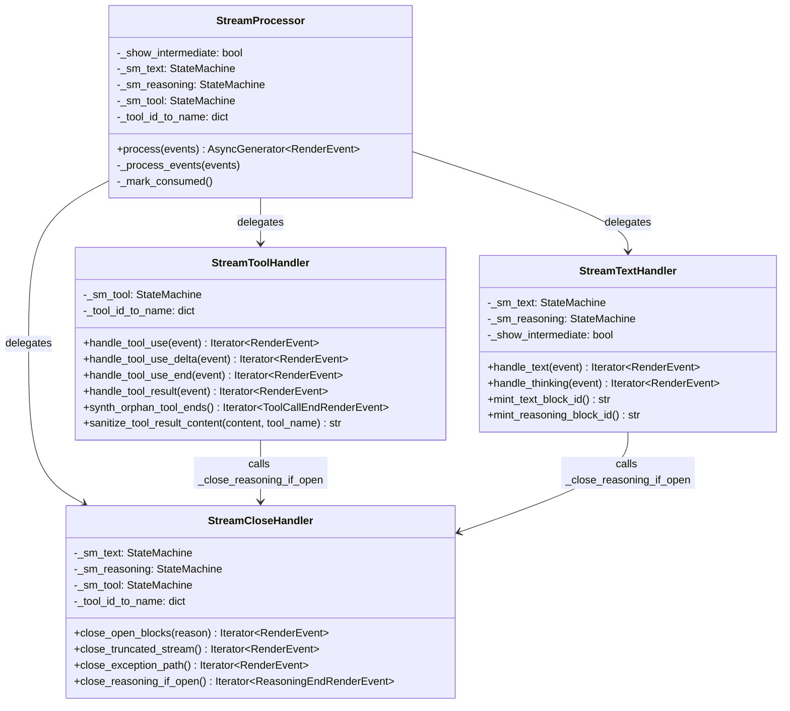

## Context

Derived from frame: `artifacts/frames/1590-stream-processor-sub-handler-split-frame.mdx`.

`stream_processor.py` (550 lines) contains 7+ event handlers, 4 close helpers, and 3
module-level utilities mixed with the `process()` orchestrator. The streaming subsystem
(event_emitter, state_machine) was extracted in #1282, but all event handlers remain in
the monolithic class. This issue extracts the remaining handlers into focused modules.

## Goal

Extract remaining sub-handlers into focused modules so `stream_processor.py` becomes a thin
orchestrator (< 300 lines) with zero functional change.

## Users

- **Primary:** Developers working on streaming pipeline logic
- **Secondary:** Code reviewers (smaller files = faster, safer reviews)

## Expected Behavior

No behavioral change. The public API (`process()` signature, `Parser[LlmEvent, RenderEvent]`
Protocol contract, `StreamProcessor.__init__` signature) stays identical. All internal
handler methods are moved to new modules; `stream_processor.py` imports and delegates.

Internal wiring: `StreamProcessor.__init__` instantiates handler classes and passes the
state-machine references it already owns. The public signature (`show_intermediate=True`)
does not change — handlers are an internal implementation detail.

### State Sharing

Handlers are instantiated in `StreamProcessor.__init__` with the same `StateMachine`
instances the monolith currently holds. Constructor signatures:

```python
class StreamTextHandler:
    def __init__(self, sm_text: StateMachine, sm_reasoning: StateMachine, show_intermediate: bool) -> None: ...

class StreamToolHandler:
    def __init__(self, sm_tool: StateMachine, tool_id_to_name: dict[str, str]) -> None: ...

class StreamCloseHandler:
    def __init__(self, sm_text: StateMachine, sm_reasoning: StateMachine, sm_tool: StateMachine, tool_id_to_name: dict[str, str]) -> None: ...
```

`StreamProcessor` retains ownership of all state machines; handlers hold references.
This is the same sharing model as today (all methods on one class).

## Data Model & Consumers



**Consumer summary:**

| Consumer | Fields / Methods | When | Status |
|----------|------------------|------|--------|
| `StreamProcessor.process` | All handlers | Runtime | This issue |
| `StreamProcessor._process_events` | `_dispatch_event` | Runtime | This issue |
| `CliStreamingParser` (outbound) | `RenderEvent` types | Post-processing | Future / out of scope |

## Breadboard

| ID | Affordance | Handler | Notes |
|----|-----------|---------|-------|
| N1 | `TextLlmEvent` chunk | `StreamTextHandler.handle_text` | Manages open text block via `_sm_text` |
| N2 | `ThinkingLlmEvent` chunk | `StreamTextHandler.handle_thinking` | Manages reasoning block via `_sm_reasoning` |
| N3 | `ToolUseLlmEvent` start | `StreamToolHandler.handle_tool_use` | Registers tool call, closes open text |
| N4 | `ToolUseDeltaLlmEvent` | `StreamToolHandler.handle_tool_use_delta` | Emits args delta |
| N5 | `ToolUseEndLlmEvent` | `StreamToolHandler.handle_tool_use_end` | Closes tool call |
| N6 | `ToolResultLlmEvent` | `StreamToolHandler.handle_tool_result` | Sanitizes content via allowlist |
| N7 | `ResultLlmEvent` | `StreamProcessor._handle_result` | Orchestrator; closes all open blocks, synthesizes orphans |
| N8 | Stream truncation | `StreamCloseHandler.close_truncated_stream` | Closes blocks without ResultLlmEvent |
| N9 | Infrastructure exception | `StreamCloseHandler.close_exception_path` | Closes blocks before RunErrorRenderEvent |
| S1 | Security constants | `stream_tool.py` | `_NON_SENSITIVE_TOOL_NAMES`, `_MAX_CONTENT_BYTES`, `_REDACTED_PLACEHOLDER` |
| S2 | Minting helpers | `stream_text.py` | `_mint_text_block_id`, `_mint_reasoning_block_id` |

## Slices

| # | Slice | Scope | Files | Affordances | Depends on |
|---|-------|-------|-------|-------------|------------|
| 1 | Extract close helpers | `StreamCloseHandler` + truncation/exception paths | `stream_close.py` | N8, N9 | — |
| 2 | Extract text + reasoning handlers | `StreamTextHandler` + minting helpers | `stream_text.py` | N1, N2, S2 | Slice 1 |
| 3 | Extract tool handlers | `StreamToolHandler` + sanitization + orphan synthesis | `stream_tool.py` | N3, N4, N5, N6, S1 | Slice 1 |
| 4 | Thin orchestrator | `stream_processor.py` imports + delegates; `_handle_result` stays | `stream_processor.py` | N7, All (orchestration) | Slices 1–3 |

**Dependency rationale:** `StreamTextHandler` and `StreamToolHandler` call `_close_reasoning_if_open`
(← `StreamCloseHandler`), so close helpers must be extracted first. `_close_open_blocks` calls
`_synth_orphan_tool_ends` (← `StreamToolHandler`), so `StreamCloseHandler` receives a
`StreamToolHandler` reference in its constructor.

## Success Criteria

- [ ] `tools/check_file_length.sh` passes for `stream_processor.py` (< 300 lines)
- [ ] `tools/check_file_length.sh` passes for `stream_text.py` (< 300 lines)
- [ ] `tools/check_file_length.sh` passes for `stream_tool.py` (< 300 lines)
- [ ] `tools/check_file_length.sh` passes for `stream_close.py` (< 300 lines)
- [ ] All existing streaming tests pass with zero changes
- [ ] `StreamProcessor` still implements `Parser[LlmEvent, RenderEvent]` Protocol
- [ ] No adapter/LLM-driver imports in extracted modules
- [ ] Extracted modules import zero symbols from `stream_processor.py` (no circular deps)
- [ ] `.importlinter` passes (no cross-layer violations)
- [ ] Hexagonal-boundary test covers all `.py` files in `src/lyra/core/processors/`
- [ ] `pyright` passes on all modified files
- [ ] `ruff check` passes on all modified files

## Maintenance Notes

`_handle_result` (Slice 4, orchestrator) and `_close_open_blocks` (Slice 1, `StreamCloseHandler`)
are parallel close paths — both close reasoning + text + synthesize orphan tool ends. Any future
fix to one must be applied to the other. Consider a shared `_close_all` helper if this pattern
proliferates.
