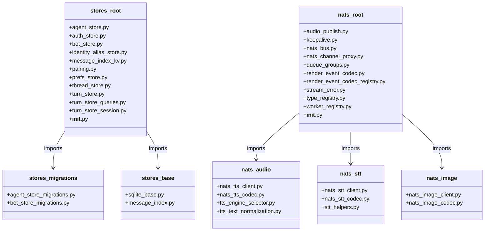

## Context

Promoted from [frame #1595](../frames/1595-refactor-folder-reorg-infrastructure-stores-nats-subpackages-frame.mdx).

## Goal

Reorganize `src/lyra/infrastructure/stores` (17 files) and `src/lyra/nats` (20 files) into logical subpackages so every folder stays under the 12-file quality-gate cap, then remove folder exemptions.

## Users

- **Primary:** Developers navigating the codebase
- **Secondary:** CI/pre-push hooks enforcing `check-folder-size`

## Expected Behavior

1. `src/lyra/infrastructure/stores` is split into:
   - `stores/migrations/` — `agent_store_migrations.py`, `bot_store_migrations.py`
   - `stores/base/` — `sqlite_base.py`, `message_index.py`
   - `stores/` root — remaining 11 files (including `__init__.py`)

2. `src/lyra/nats` is split into:
   - `nats/audio/` — `nats_tts_client.py`, `nats_tts_codec.py`, `tts_engine_selector.py`, `tts_text_normalization.py`
   - `nats/stt/` — `nats_stt_client.py`, `nats_stt_codec.py`, `stt_helpers.py`
   - `nats/image/` — `nats_image_client.py`, `nats_image_codec.py`
   - `nats/` root — remaining 11 files (including `__init__.py`)

3. All internal imports updated to reflect new paths.
4. `__init__.py` re-exports maintained at root level so external consumers don't change.
5. `tools/folder_exemptions.txt` entries for both folders removed.
6. No test regressions.

## Data Model & Consumers

**Consumer summary:**

| Consumer | Fields / Modules | Status |
|----------|----------------|--------|
| `bootstrap/bootstrap_stores.py` | `stores.*` | this issue — no change |
| `bootstrap/factory/voice_overlay.py` | `nats.tts`, `nats.stt`, `nats.image` | this issue — import path update |
| `adapters/nats/*.py` | `nats.render_event_codec`, `nats.type_registry` | this issue — no change |
| `bootstrap/factory/hub/*.py` | `nats.nats_bus`, `nats.worker_registry` | this issue — no change |

## Breadboard

| Module | Moved to | Import updates required |
|--------|----------|------------------------|
| `stores.agent_store_migrations` | `stores.migrations.agent_store_migrations` | `stores/agent_store.py` |
| `stores.bot_store_migrations` | `stores.migrations.bot_store_migrations` | `stores/bot_store.py` |
| `stores.sqlite_base` | `stores.base.sqlite_base` | `stores/{agent,auth,identity_alias,message_index,prefs,thread,turn}_store.py` |
| `stores.message_index` | `stores.base.message_index` | `stores/__init__.py`, `core/pool/pool_observer.py` |
| `nats.nats_tts_client` | `nats.audio.nats_tts_client` | `nats/__init__.py`, `bootstrap/factory/voice_overlay.py` |
| `nats.nats_tts_codec` | `nats.audio.nats_tts_codec` | `nats/__init__.py`, `bootstrap/factory/voice_overlay.py`, `nats/nats_tts_client.py` |
| `nats.tts_engine_selector` | `nats.audio.tts_engine_selector` | `nats/__init__.py`, `nats/nats_tts_client.py` |
| `nats.tts_text_normalization` | `nats.audio.tts_text_normalization` | `nats/__init__.py`, `nats/nats_tts_client.py` |
| `nats.nats_stt_client` | `nats.stt.nats_stt_client` | `nats/__init__.py`, `bootstrap/factory/voice_overlay.py` |
| `nats.nats_stt_codec` | `nats.stt.nats_stt_codec` | `nats/__init__.py`, `bootstrap/factory/voice_overlay.py`, `nats/nats_stt_client.py` |
| `nats.stt_helpers` | `nats.stt.stt_helpers` | `nats/__init__.py`, `nats/nats_stt_client.py` |
| `nats.nats_image_client` | `nats.image.nats_image_client` | `nats/__init__.py`, `bootstrap/factory/voice_overlay.py` |
| `nats.nats_image_codec` | `nats.image.nats_image_codec` | `nats/__init__.py`, `bootstrap/factory/voice_overlay.py`, `nats/nats_image_client.py` |

## Slices

| # | Slice | Files | Demo |
|---|-------|-------|------|
| 1 | Reorg `stores` | Move 4 files to `migrations/` + `base/`, update imports, fix `__init__.py` | `check-folder-size` passes for `stores/` |
| 2 | Reorg `nats` | Move 9 files to `audio/`, `stt/`, `image/`, update imports, fix `__init__.py` | `check-folder-size` passes for `nats/` |
| 3 | Clean exemptions | Remove entries from `tools/folder_exemptions.txt` | Gate passes CI |

## Success Criteria

- [ ] `src/lyra/infrastructure/stores` root has ≤ 12 `.py` files
- [ ] `src/lyra/infrastructure/stores/migrations` has ≤ 12 `.py` files
- [ ] `src/lyra/infrastructure/stores/base` has ≤ 12 `.py` files
- [ ] `src/lyra/nats` root has ≤ 12 `.py` files
- [ ] `src/lyra/nats/audio` has ≤ 12 `.py` files
- [ ] `src/lyra/nats/stt` has ≤ 12 `.py` files
- [ ] `src/lyra/nats/image` has ≤ 12 `.py` files
- [ ] `tools/folder_exemptions.txt` no longer lists `src/lyra/infrastructure/stores` or `src/lyra/nats`
- [ ] `tools/check_folder_size.sh` passes for all affected folders
- [ ] All tests pass (`uv run pytest`)
- [ ] No import errors (`uv run pyright` or `python -c "import lyra"`)
- [ ] `lyra.infrastructure.stores.*` and `lyra.nats.*` re-exports still accessible via root `__init__.py`
