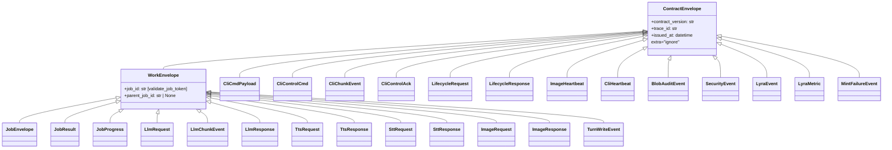
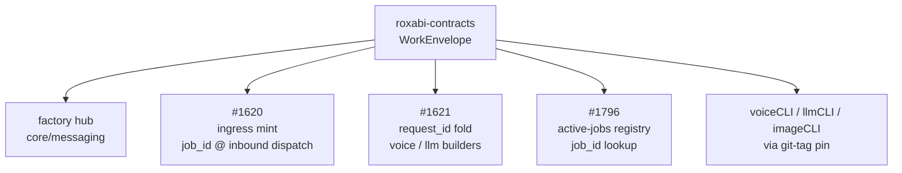

## Context

`ContractEnvelope` is the universal base for all NATS contract models in
`roxabi-contracts`. It carries `contract_version`, `trace_id`, `issued_at`, and
`ConfigDict(extra="ignore")`. It does not carry `job_id`. Work-bearing messages
(LLM, voice, image, turns, jobs, cli work ops) and infra messages (heartbeats,
lifecycle) live on the same base class. "This message belongs to a unit of work"
is a runtime convention — not a type guarantee.

ADR-084 resolves this by introducing `WorkEnvelope(ContractEnvelope)`, which
adds mandatory `job_id: str` (min_length=1, validated by `validate_job_token`)
and nullable `parent_job_id: str | None`. 13 work-plane models are reparented
to `WorkEnvelope` in this PR (S1+S2: jobs, llm, voice, image, turns); 4 CLI work
models (`CliCmdPayload`, `CliControlCmd`, `CliChunkEvent`, `CliControlAck`)
classified as WORK via OQ-1/EB-4 but deferred to #1838 (gate: #1009 rename);
9 infra models stay on bare `ContractEnvelope`. A new model-classification
enforcement test replaces convention with assertion. `CONTRACT_VERSION` stays `"1"`
(additive minor bump; neither field is security-bearing).

The M1 downstream issues (#1620 ingress mint, #1621 request_id fold, #1796
active-jobs registry) treat `job_id` presence on work messages as an upstream
invariant. This PR closes that gap before ingress wiring begins.

---

## Goal

Introduce `WorkEnvelope(ContractEnvelope)` in `roxabi-contracts`, reparent all
work-plane contract models to it, remove now-redundant local `job_id`/`parent_job_id`
declarations from the jobs family, and enforce the work/infra split with a
subject→envelope test.

---

## Users

| Persona | Need |
|---|---|
| Downstream issue authors (#1620, #1621, #1796) | `WorkEnvelope` importable from `roxabi_contracts`; `isinstance(msg, WorkEnvelope)` reliable |
| Contributors adding new work-plane models | Clear type-level signal: subclass `WorkEnvelope`, not `ContractEnvelope` |
| Observability / active-jobs registry | `job_id` presence on all work messages guaranteed by type, not runtime probe |

---

## Expected Behavior

### EB-1 — WorkEnvelope class

`WorkEnvelope(ContractEnvelope)` is defined in
`packages/roxabi-contracts/src/roxabi_contracts/envelope.py` and exported from
`roxabi_contracts.__init__` (+ `__all__`). It carries:

- `job_id: Annotated[str, StringConstraints(min_length=1)]` — mandatory,
  field validator reuses `validate_job_token` from
  `roxabi_contracts._nats_utils` (regex `[A-Za-z0-9_-]+(\.[A-Za-z0-9_-]+)*`).
- `parent_job_id: str | None = None` — nullable, same validator on non-null.

It inherits `model_config = ConfigDict(extra="ignore")` from `ContractEnvelope`.
It adds no other fields (tracing, timing, version all inherited).

### EB-2 — Jobs family reparent (non-breaking)

`JobEnvelope`, `JobResult`, `JobProgress` in `jobs/models.py` all reparent from
`ContractEnvelope` to `WorkEnvelope`.

- `JobEnvelope` already declares `job_id: str` and `parent_job_id: str | None`
  locally. Both local declarations MUST be removed post-reparent; Pydantic v2
  raises `PydanticUserError` for field-redefinition.
  Additionally, remove the redundant job-token validators that `WorkEnvelope`
  now owns:
  - `@field_validator("job_id", "job_name")` / `_validate_job_tokens`: change to
    `@field_validator("job_name")` only (remove `"job_id"` from the decorator — it
    is already validated by `WorkEnvelope`; keep `"job_name"` validation in place).
  - Remove `@field_validator("parent_job_id")` / `_validate_parent_job_id` entirely
    (`WorkEnvelope` handles `parent_job_id` validation).
- `JobResult` and `JobProgress` already declare `job_id: str` locally. The local
  declaration MUST be removed; `parent_job_id` is then additive-inherited.
  Additionally:
  - Remove `@field_validator("job_id")` / `_validate_job_id` from both `JobResult`
    and `JobProgress` (validation migrated to `WorkEnvelope`).
- Wire compatibility: `job_id` was already required on these models; reparenting
  does not change serialized shape. This is non-breaking for the jobs domain.

### EB-3 — LLM / voice / image / turns reparent

The following models reparent from `ContractEnvelope` to `WorkEnvelope`:

| Domain | Model(s) | Note |
|---|---|---|
| `llm` | `LlmRequest`, `LlmChunkEvent`, `LlmResponse` | `LifecycleRequest`, `LifecycleResponse` stay on `ContractEnvelope` (INFRA) |
| `voice` | `TtsRequest`, `TtsResponse`, `SttRequest`, `SttResponse` | All 4 — carry `request_id`, are work ops |
| `image` | `ImageRequest`, `ImageResponse` | `ImageHeartbeat` stays on `ContractEnvelope` (INFRA) |
| `turns` | `TurnWriteEvent` | Sole model in turns — carries `pool_id`, `session_id`, is a work event |

These models gain a new required field (`job_id`) on the wire. This is a
breaking change for each domain; each requires a coordinated minor version bump
in the same PR. `#1620` (ingress mint) populates `job_id` at inbound dispatch.

### EB-4 — CLI classification (gap resolution)

ADR-084 classification table has three explicit rows for the cli domain:
`CliCmdPayload` → WORK, `CliControlCmd` → WORK, `CliHeartbeat` → INFRA.

Two models are absent from the ADR-084 table. This spec resolves the gap:

| Model | Classification | Rationale |
|---|---|---|
| `CliChunkEvent` | WORK | Response side of a work op (cli execution); carries `pool_id` + `event_type`; tied to a running cli session |
| `CliControlAck` | WORK | Acknowledgement of a work control op (`ok`/`resumed`); reply to `CliControlCmd` |

Both are classified as WORK here. Their actual reparent to `WorkEnvelope` is
**deferred to #1838**, gated on #1009 (`lyra_session_id` → `cli_session_id`
rename) to keep the `cli` minor bump atomic.
`CliHeartbeat` stays on `ContractEnvelope` (INFRA, no change).

The 4 CLI WORK models (`CliCmdPayload`, `CliControlCmd`, `CliChunkEvent`,
`CliControlAck`) are tracked in `PENDING_MODELS` in
`test_work_envelope_subjects.py` and must NOT subclass `WorkEnvelope` until
#1838 lands. Do not merge `cli/models.py` changes in this PR.

### EB-5 — Subject→envelope enforcement test

A new test file `packages/roxabi-contracts/tests/test_work_envelope_subjects.py`
asserts:

- All subjects listed in the `WORK_SUBJECTS` test fixture deserialize to an
  instance of `WorkEnvelope` (via `roxabi_nats.deserialize()`).
- All subjects listed in `INFRA_SUBJECTS` deserialize to `ContractEnvelope` but
  NOT `WorkEnvelope`.
- The union of `WORK_SUBJECTS` and `INFRA_SUBJECTS` equals the set of all
  `SUBJECTS` constants exported by every domain submodule that defines a `SUBJECTS`
  singleton. Domains that do NOT export a `SUBJECTS` singleton are excluded from
  the union scan with explicit rationale:
  - `audit/` — no `subjects.py`; subjects are dynamic (built via `subject_for()`
    classmethod); excluded from the union scan.
  - `outbound/` — exports `OutboundAudioSubjects` class and `STREAM_AUDIO`
    constant, not a `SUBJECTS` singleton; excluded from the union scan.
  `INFRA_SUBJECTS` must include subjects from all INFRA-classified singleton
  domains: `factory.llm.lifecycle.*`, `factory.image.heartbeat`,
  `factory.cli.heartbeat`, `factory.event.>`, `factory.metric.>`,
  `factory.gh.mint_failure` (prefix), `factory.verify.deny` (prefix).

This test is CI-only (requires `[testing]` extra) and follows the pattern of
`test_voice_subjects.py` / `test_image_subjects.py`.

### EB-6 — Version bump

`packages/roxabi-contracts/CHANGELOG.md` receives a minor version entry
documenting:

- Addition of `WorkEnvelope` to `envelope.py` and `__init__.py`.
- Reparenting of `jobs/*` (non-breaking), `llm/*`, `voice/*`, `image/*`,
  `turns/*`, `cli/*` models (breaking per domain — new required `job_id` field).
- Entry for `CliChunkEvent`/`CliControlAck` classification.

### EB-7 — Infra stay-list (no-touch)

The following models remain on bare `ContractEnvelope` with no change:

| Domain | Model | Note |
|---|---|---|
| `llm` | `LifecycleRequest`, `LifecycleResponse` | Infra lifecycle — not work ops |
| `image` | `ImageHeartbeat` | Heartbeat — not work op |
| `cli` | `CliHeartbeat` | Heartbeat — not work op |
| `audit` | `BlobAuditEvent`, `SecurityEvent` | Audit trail — no job_id invariant applies |
| `event` | `LyraEvent`, `LyraMetric` | Internal observability events — not work ops |
| `gh` | `MintFailureEvent` | Infra alert — not a work op |

All `ContractEnvelope` subclasses in `packages/roxabi-contracts/src/` are
accounted for across WORK (EB-3, EB-4) and INFRA (this table). Verified by
`grep -rn "(ContractEnvelope)" packages/roxabi-contracts/src/`.

---

## Data Model & Consumers

### Class hierarchy

### Consumer map

### Consumer deserialization invariant

All consumers MUST call `roxabi_nats.deserialize(WorkEnvelope, msg)` (or the
appropriate subclass), NOT `WorkEnvelope.model_validate_json(msg.data)` directly.
Direct Pydantic calls bypass the 1 MB byte-size gate in `roxabi-nats` (per
`roxabi-contracts` CLAUDE.md). This invariant is unchanged by this PR.

---

## Breadboard

Affordance IDs use `S*` prefix (backend-only; no UI layer).

| ID | Affordance | Slice |
|---|---|---|
| S1-a | `WorkEnvelope` class in `envelope.py` | S1 |
| S1-b | `WorkEnvelope` exported from `__init__.py` + `__all__` | S1 |
| S1-c | `JobEnvelope` / `JobResult` / `JobProgress` reparented; local `job_id` / `parent_job_id` removed | S1 |
| S1-d | `test_envelope.py` — `WorkEnvelope` round-trip tests + field validator tests | S1 |
| S2-a | `LlmRequest`, `LlmChunkEvent`, `LlmResponse` reparented | S2 |
| S2-b | `TtsRequest`, `TtsResponse`, `SttRequest`, `SttResponse` reparented | S2 |
| S2-c | `ImageRequest`, `ImageResponse` reparented (`ImageHeartbeat` untouched) | S2 |
| S2-d | `TurnWriteEvent` reparented | S2 |
| S3-a | `CliCmdPayload`, `CliControlCmd`, `CliChunkEvent`, `CliControlAck` reparented (`CliHeartbeat` untouched) — **deferred to #1838** (gate: #1009) | S3 |
| S3-b | `test_work_envelope_subjects.py` — full subject→envelope enforcement | S3 |
| S3-c | `CHANGELOG.md` minor version entry | S3 |

---

## Slices

### S1 — WorkEnvelope class + jobs family reparent

**Files:** `envelope.py`, `__init__.py`, `jobs/models.py`, `tests/test_envelope.py`

1. Add `WorkEnvelope(ContractEnvelope)` to `envelope.py`:
   - Import `validate_job_token` from `._nats_utils`.
   - Declare `job_id: Annotated[str, StringConstraints(min_length=1)]`.
   - Declare `parent_job_id: str | None = None`.
   - Add `@field_validator("job_id", "parent_job_id", mode="before")` that calls
     `validate_job_token(v)` and **returns `v`** — do NOT `return validate_job_token(v)`
     because `validate_job_token` returns `None` (see `_nats_utils.py` line 39).
     Skip the call and return `v` unchanged when `v is None` (for `parent_job_id`).
     Note: `StringConstraints(min_length=1)` on `job_id` is belt-and-suspenders
     with the regex (both enforce non-empty; either would catch `job_id=""`).

2. Add `WorkEnvelope` to `__init__.py` imports and `__all__`.
3. In `jobs/models.py`:
   - Change `JobEnvelope(ContractEnvelope)` → `JobEnvelope(WorkEnvelope)`.
   - Remove local `job_id: str` declaration.
   - Remove local `parent_job_id: str | None = None` declaration.
   - Change `JobResult(ContractEnvelope)` → `JobResult(WorkEnvelope)`.
   - Remove local `job_id: str` declaration from `JobResult`.
   - Change `JobProgress(ContractEnvelope)` → `JobProgress(WorkEnvelope)`.
   - Remove local `job_id: str` declaration from `JobProgress`.
4. Add tests to `tests/test_envelope.py`:
   - `test_work_envelope_accepts_valid_job_id` — round-trip with `job_id="run-001"`.
   - `test_work_envelope_rejects_empty_job_id` — `ValidationError` on `job_id=""`.
   - `test_work_envelope_rejects_invalid_chars` — `ValidationError` on `job_id="bad id"` (space).
   - `test_work_envelope_parent_job_id_nullable` — `parent_job_id=None` accepted.
   - `test_work_envelope_parent_job_id_validated` — `parent_job_id="bad id"` raises.
   - `test_job_envelope_inherits_job_id` — `JobEnvelope` serializes `job_id` correctly.
   - `test_job_result_inherits_job_id` — `JobResult` has `job_id` from `WorkEnvelope`.
   - `test_job_progress_inherits_job_id` — `JobProgress` has `job_id` from `WorkEnvelope`.

**Acceptance:** all existing `tests/jobs/` tests green; new envelope tests green.

---

### S2 — LLM / voice / image / turns reparent

**Files:** `llm/models.py`, `voice/models.py`, `image/models.py`, `turns/models.py`

For each file:
- Change the three WORK model base classes from `ContractEnvelope` to `WorkEnvelope`.
- Update the import line: `from roxabi_contracts.envelope import ContractEnvelope, WorkEnvelope`.
- Do NOT touch INFRA models (`LifecycleRequest`, `LifecycleResponse`, `ImageHeartbeat`).

Specific changes:

| File | Models reparented | Models left |
|---|---|---|
| `llm/models.py` | `LlmRequest`, `LlmChunkEvent`, `LlmResponse` | `LifecycleRequest`, `LifecycleResponse` |
| `voice/models.py` | `TtsRequest`, `TtsResponse`, `SttRequest`, `SttResponse` | — |
| `image/models.py` | `ImageRequest`, `ImageResponse` | `ImageHeartbeat` |
| `turns/models.py` | `TurnWriteEvent` | — |

**Acceptance:** `pytest packages/roxabi-contracts/tests/ -x` green (existing test
suite); `isinstance(LlmRequest(..., job_id="test"), WorkEnvelope)` asserts True in a REPL.

---

### S3 — Classification enforcement test + version bump (CLI reparent deferred)

> **Note:** The CLI reparent (`CliCmdPayload`, `CliControlCmd`, `CliChunkEvent`,
> `CliControlAck`) is **deferred to #1838**, gated on #1009
> (`lyra_session_id` → `cli_session_id` rename) which must co-land in the same
> `cli` minor bump (ADR-084).  The 4 models are classified as WORK in EB-4 and
> tracked as `PENDING_MODELS` in `test_work_envelope_subjects.py`.
>
> **Do NOT merge `cli/models.py` in this PR.**

**Files:** `tests/test_work_envelope_subjects.py` (new),
`tests/test_envelope.py` (addendum), `CHANGELOG.md`

1. Create `tests/test_work_envelope_subjects.py`:
   - Define `WORK_SUBJECTS: frozenset[str]` — all subject constants from WORK models
     (`factory.jobs.*`, `factory.llm.*` work subjects, `factory.voice.*`,
     `factory.image.generate.*`, `factory.turns.write`, `factory.cli.*` work subjects).
   - Define `INFRA_SUBJECTS: frozenset[str]` — `factory.llm.lifecycle.*`,
     `factory.image.heartbeat`, `factory.cli.heartbeat`,
     `factory.event.>`, `factory.metric.>`,
     `factory.gh.mint_failure` (prefix), `factory.verify.deny` (prefix).
   - Domains excluded from union scan: `audit/` (no `SUBJECTS` singleton — uses
     `subject_for()` classmethod) and `outbound/` (exports `OutboundAudioSubjects`
     class + `STREAM_AUDIO`, not a `SUBJECTS` singleton). Document exclusions inline.
   - `test_all_subjects_covered`: `WORK_SUBJECTS | INFRA_SUBJECTS` == all `SUBJECTS`
     singletons exported by `roxabi_contracts.*` (excluding `audit/` and `outbound/`
     per documented rationale above).
   - `test_work_subjects_deserialize_to_work_envelope`: for each subject in
     `WORK_SUBJECTS`, a synthetic fixture message round-trips to an instance of
     `WorkEnvelope` (deserialize via `roxabi_nats.deserialize()`).
   - `test_infra_subjects_not_work_envelope`: for each subject in `INFRA_SUBJECTS`,
     deserialized model is `ContractEnvelope` but NOT `WorkEnvelope`.
3. In `CHANGELOG.md`:
   - Add minor version entry with:
     - New `WorkEnvelope` class (additive).
     - jobs reparent (non-breaking).
     - llm/voice/image/turns/cli reparent (breaking per domain — new required `job_id`).
     - `CliChunkEvent` / `CliControlAck` classified as WORK (EB-4).
     - `cli_session_id` rename from #1009 (breaking for cli domain, co-landed).

**Acceptance:** full `pytest packages/roxabi-contracts/tests/ -x` green including
new enforcement test;
`grep -rn "(ContractEnvelope)" packages/roxabi-contracts/src/roxabi_contracts/{llm,voice,image,turns,cli,jobs}/models.py | grep -v "LifecycleRequest\|LifecycleResponse\|ImageHeartbeat\|CliHeartbeat"` returns zero lines (all WORK models in those domains now on `WorkEnvelope`);
`grep "LifecycleRequest\|LifecycleResponse\|ImageHeartbeat\|CliHeartbeat" packages/roxabi-contracts/src/roxabi_contracts/*/models.py` still shows `ContractEnvelope` as base;
`lyra_session_id` does not appear in `cli/models.py` after S3 merges.

---

## Success Criteria

All criteria are binary (pass / fail).

| # | Criterion |
|---|---|
| SC-1 | `from roxabi_contracts import WorkEnvelope` succeeds with no import error. |
| SC-2 | `issubclass(WorkEnvelope, ContractEnvelope)` is `True`. |
| SC-3 | `WorkEnvelope(contract_version="1", trace_id="t", issued_at=datetime.now(tz=timezone.utc), job_id="")` raises `ValidationError`. (Import: `from datetime import datetime, timezone`) |
| SC-4 | All 13 work-plane models reparented in this PR (`JobEnvelope`, `JobResult`, `JobProgress`, `LlmRequest`, `LlmChunkEvent`, `LlmResponse`, `TtsRequest`, `TtsResponse`, `SttRequest`, `SttResponse`, `ImageRequest`, `ImageResponse`, `TurnWriteEvent`) pass `issubclass(M, WorkEnvelope)`. (`CliCmdPayload` and `CliControlCmd` are PENDING — deferred to #1838.) |
| SC-5 | `CliChunkEvent` and `CliControlAck` are PENDING (deferred to #1838, gated on #1009) — `issubclass(M, WorkEnvelope)` is currently `False` for both; they remain on `ContractEnvelope` until #1838 lands. |
| SC-6 | `LifecycleRequest`, `LifecycleResponse`, `ImageHeartbeat`, `CliHeartbeat` do NOT pass `issubclass(M, WorkEnvelope)`. |
| SC-7 | `test_work_envelope_subjects.py::test_completeness_coverage` is green (count-based: 13 WORK + 9 INFRA + 4 PENDING = 26). |
| SC-8 | `test_work_envelope_subjects.py::test_work_model_is_subclass_of_work_envelope` is green (parametrized over 13 WORK models). |
| SC-9 | `test_work_envelope_subjects.py::test_non_work_model_not_subclass_of_work_envelope` is green (parametrized over 9 INFRA + 4 PENDING models). |
| SC-10 | `CONTRACT_VERSION` is still `"1"` (locked by `test_contract_version_current_value`). |
| SC-11 | All pre-existing tests in `packages/roxabi-contracts/tests/` are green. |

---

## Open Questions

| # | Question | Owner | Status |
|---|---|---|---|
| OQ-1 | **CliChunkEvent / CliControlAck classification** — both classified as WORK in this spec (EB-4). If the architect disagrees, cli reparent must be deferred until ADR-084 is updated. | Architect | **Resolved as WORK** in this spec — confirm at review |
| OQ-2 | **Outbound scope item** — the issue lists "inbound/outbound messages" but no Pydantic models exist in the outbound submodule yet. Treating as a forward-compat note: any future outbound Pydantic model must land as `WorkEnvelope`. Confirm scope interpretation. | Issue author | **Treat as forward-compat** in this spec — confirm at review |

---

## Pre-check

**Testable criteria:** All 11 Success Criteria reference observable code properties
or test outcomes; none is prose-only.

**Dangling refs:**
- `validate_job_token` — confirmed present in `_nats_utils.py`; not touched by
  this PR. If #1782 renames it: update the import in `envelope.py`.
- `test_voice_subjects.py` / `test_image_subjects.py` — confirmed pattern exists;
  `test_work_envelope_subjects.py` follows same structure.
- `lyra_session_id` in `CliCmdPayload` — confirmed in `cli/models.py`; rename
  owned by #1009 and co-landed in S3.

**Ambiguity (≤5):**
1. `CliChunkEvent` / `CliControlAck` classification — resolved as WORK (OQ-1).
2. Outbound scope — resolved as forward-compat note (OQ-2).
3. `parent_job_id` validator on `WorkEnvelope` — specified as same regex,
   applied only to non-null values (mode="before" with None guard).
4. `audit/` + `outbound/` exclusion from SC-7 union scan — resolved: `audit/`
   has no `SUBJECTS` singleton; `outbound/` exports a class + `STREAM_AUDIO`,
   not a singleton. Both excluded with inline rationale in the test fixture.

**Slice coverage:** S1 (WorkEnvelope + jobs, non-breaking) → S2 (llm/voice/image/turns,
breaking per domain) → S3 (cli + enforcement + version bump, gated by #1009).
Each slice is independently merge-able after its predecessor is green in CI.
S1 unblocks #1620/#1621/#1796 immediately.

**Edge completeness:**
- Pydantic v2 field-redefinition trap: handled in S1 EB-2 (explicit remove of
  local declarations from `JobEnvelope`, `JobResult`, `JobProgress`).
- `validate_job_token` returns `None` trap: S1 step 1 explicitly requires
  `validate_job_token(v); return v` — returning `validate_job_token(v)` would
  silently assign `None` to `job_id` via mode="before" validator.
- Redundant validators: S1 EB-2 explicitly removes `_validate_job_tokens`,
  `_validate_parent_job_id`, and `_validate_job_id` from the jobs family.
  `@field_validator("job_name")` in `JobEnvelope` is retained (not redundant).
- `extra="ignore"` inheritance: `WorkEnvelope` inherits via `ContractEnvelope`
  without redeclaration; confirmed by Pydantic v2 `model_config` inheritance rules.
- `CONTRACT_VERSION` constant: no change (SC-10 locks it via existing test).
- `doc_drift` gate: `WorkEnvelope` is UNBUILT until S1 merges; no backtick
  reference added in any non-ADR docs page in this PR.
- `file_length` gate: `packages/roxabi-contracts/**` is outside `src/factory/**`;
  exempt from 300 SLOC gate; no exemption entry needed.
- #1782 coordination: if #1782 lands first and renames `validate_job_token`,
  update the import in `envelope.py` only; no other change needed.
- #1791 coordination: `WorkEnvelope` added to `__init__.__all__` in S1; if #1791
  reorganizes `__all__` structure, merge after S1 or rebase on S1.
- SC-7 union scan: `audit/` and `outbound/` are excluded from the `SUBJECTS`
  singleton scan (EB-5). All other 8 domains with `SUBJECTS` singletons are
  covered (`jobs`, `llm`, `voice`, `image`, `turns`, `event`, `gh`, `verify`).
