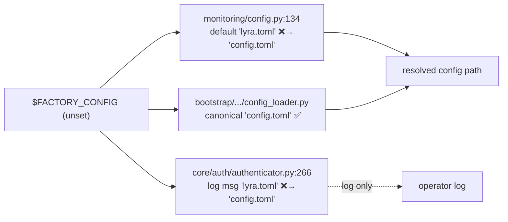

## Context

Source: `artifacts/frames/1668-finish-lyra-factory-cleanup-frame.mdx`.
The `lyra`→`factory` rename (PR #1669) is merged to `staging` — package, CLI, env vars,
container identity, deploy artifacts (`deploy/quadlet/factory-*.container`, image
`ghcr.io/roxabi/factory`), and `paths.py` data-dir default (`~/.roxabi/factory`) are all
done. This spec covers the 3 deferred residual classes that still misrepresent the project.

**Grounded facts (verified in tree):** CLI verb is `factory` (pyproject `[project.scripts]`);
data-dir default is `~/.roxabi/factory` (`src/factory/paths.py:16`); modules are `factory.*`;
repo is `Roxabi/roxabi-factory`; Quadlet units are `factory-*`. Living docs still carrying
`lyra` forms therefore **disagree with the code** and are stale (not merely cosmetic).

## Goal

Eliminate every *misleading* `lyra` reference from **living** docs + dead config, without
touching the NATS wire contract (#1670), app identity, or historical records.

## Users

- **Primary:** contributors + Claude reading living docs (`CLAUDE.md`, `docs/`, `deploy/`)
  as SSoT — stale refs yield wrong commands/paths.
- **Secondary:** anyone setting a phantom `FACTORY_STT_ENABLED`/`FACTORY_TTS_*` toggle.

## Expected Behavior

After this change, `git grep` over the living-doc fileset finds **zero** replaceable
`lyra` tokens (per the rename map below); `.env.example` has no dead toggle vars;
`FACTORY_CONFIG` resolves to `config.toml` in all three resolvers; and every exclusion
(subjects, streams, persona, plugins, history) is **untouched** (counts stable).

## Data Model & Consumers

### Rename map (living docs only)

| Stale token | → Replacement | Note |
|---|---|---|
| `LYRA_<X>` env | `FACTORY_<X>` | **except** stream/KV names below |
| `lyra <verb>` (hub/start/agent/bot/adapter/turn-writer) | `factory <verb>` | CLI |
| `from lyra` / `import lyra` / `python -m lyra` / `src/lyra` | `factory` / `src/factory` | module/import |
| `~/.lyra` , `/.lyra` | `~/.roxabi/factory` | data dir |
| `Roxabi/lyra` | `Roxabi/roxabi-factory` | repo slug |
| `ghcr.io/roxabi/lyra` | `ghcr.io/roxabi/factory` | image |
| `projects/lyra` | `projects/roxabi-factory` | path |
| `lyra-{nats,hub,telegram,discord,clipool,turn-writer,blobstore}` | `factory-*` | unit/container |

### KEEP — explicit exclusion set (must NOT change)

| Class | Examples | Why |
|---|---|---|
| NATS subjects | `lyra.inbound.*`, `lyra.outbound.*`, `lyra.typing.*` | wire contract → #1670 |
| JetStream streams / KV | `LYRA_OUTBOUND_AUDIO`, `LYRA_AUDIT`, `LYRA_TURNS`, `LYRA_STATE` | wire contract → #1670 |
| App identity | `"Lyra"` persona, `lyra_default`, `bot_id "lyra"`, `/svc`, `lyra-bot@` | intentional |
| Plugin dirs/names | `plugins/lyra-ops`, `plugins/lyra-send` | match disk; rename = separate functional change |
| Code field | `lyra_session_id` | functional identifier (possible contract field) |
| Historical records | `artifacts/**`, `CHANGELOG.md`, `packages/**/CHANGELOG.md`, `docs/history/**`, `docs/architecture/adr/**`, fixture `v3-pre-grant-group.json` | point-in-time truth |

### Item-3 config resolver (the one with real consumers)

Consumer summary: 3 resolvers read `$FACTORY_CONFIG`; only `config_loader.py` is already
canonical. `monitoring/config.py` (default + 2 docstrings) and `authenticator.py` (log
string) must align to `config.toml`. `tests/test_monitoring_config.py` asserts the default.

## Breadboard

| ID | Work item | Files | Action |
|---|---|---|---|
| W1 | Config-filename alignment | `src/factory/monitoring/config.py` (L21,129,134), `src/factory/core/auth/authenticator.py` (L266), `tests/test_monitoring_config.py` | replace `lyra.toml`→`config.toml`; update test expectation |
| W2 | Dead env-var removal | `.env.example` | delete `FACTORY_STT_ENABLED`, `FACTORY_TTS_ENABLED`, `FACTORY_TTS_ENGINE`, `FACTORY_TTS_VOICE`, `FACTORY_TTS_LANGUAGE`, `FACTORY_STT_TIMEOUT`, `FACTORY_CONFIG_SECRET`, deprecated `TTS_ENGINE` |
| W3 | Living-doc sweep | 59 files (per audit), apply rename map, honor KEEP set | targeted replace + verify |

## Slices

| # | Slice | Affordances | Demo |
|---|---|---|---|
| S1 | Config alignment + test | W1 | `pytest tests/test_monitoring_config.py` green; grep `lyra.toml` in src → 0 |
| S2 | Dead env vars | W2 | `.env.example` clean; the 7+1 vars gone; still zero readers |
| S3 | Living-doc sweep | W3 | living-doc grep (rename map) → 0; KEEP-set counts unchanged; doc-drift gate green |

Slices independent; S1+S2 tiny/code-adjacent, S3 is the bulk (mechanical, agent-parallelizable by directory cluster).

## Success Criteria

- [ ] `git grep -nE '<rename-map patterns>'` over the living-doc fileset (CLAUDE.md anywhere, root community docs, `docs/**` ∖ `history`+`adr`, `deploy/**.md`, `packages/**` ∖ CHANGELOG) returns **0**, after excluding the KEEP set.
- [ ] `.env.example`: all 7 dead `FACTORY_*` vars + deprecated `TTS_ENGINE` removed; `git grep -nE 'FACTORY_(STT_ENABLED|TTS_ENABLED|TTS_ENGINE|TTS_VOICE|TTS_LANGUAGE|STT_TIMEOUT|CONFIG_SECRET)'` across repo confirms still **zero readers** (no wiring added).
- [ ] `FACTORY_CONFIG` default is `config.toml` in `monitoring/config.py:134`; docstrings L21/L129 and `authenticator.py:266` log say `config.toml`.
- [ ] KEEP set unchanged: subject `lyra.*` count, stream names (`LYRA_OUTBOUND_AUDIO`/`LYRA_AUDIT`/`LYRA_TURNS`/`LYRA_STATE`), `"Lyra"`/`lyra_default`/`bot_id`, `plugins/lyra-{ops,send}`, `lyra_session_id`, and all historical files — verified by before/after diff scoped to those patterns = empty.
- [ ] `uv run pytest` green (esp. `tests/test_monitoring_config.py`).
- [ ] `tools/check_doc_drift.py` passes; `ruff check`/`ruff format`/`pyright` clean.
