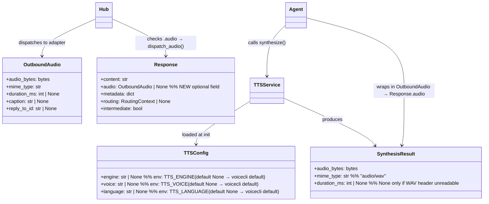
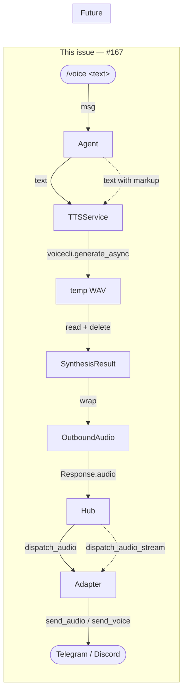

## Constraints

- voiceCLI is called as a **library** (not subprocess/daemon) — mirrors `STTService` pattern (#80).
- DI pattern mirrors `stt`: `tts: TTSService | None` injected into Hub and base agent.
- WAV is the only output format produced by voiceCLI; format conversion (WAV→OGG) is out of scope for `TTSService` — handled by adapter routing.
- No abstraction for alternative TTS engines in this issue (voiceCLI only).
- `voicecli.generate_async()` implements **daemon-first / library-fallback automatically** for Qwen
  engines: it checks `~/.local/share/voicecli/daemon.sock` and routes to the daemon queue if the
  socket exists, otherwise falls back to a direct in-process engine call. `TTSService` gets this
  behavior for free — no explicit daemon detection code needed. When voiceCLI #31 lands (FIFO queue
  in daemon), Lyra benefits automatically without any changes.

## Out of Scope

- Streaming TTS via `dispatch_audio_stream` (future)
- SSML / markup in TTS input (future)
- Voice output triggered by anything other than the `/voice` command (e.g., LLM-generated audio)
- WAV→OGG transcoding inside TTSService (adapter routes by mime_type instead)
- MCP server TTS backend (Phase 2, per frame)
- Multi-engine abstraction / voice selection beyond env-var config

## Context

Part of the voice pipeline epic (#74). The outbound audio dispatch stack is fully wired
(`dispatch_audio()` in Hub, `OutboundDispatcher.enqueue_audio()`, `render_audio()` in adapters).
The STT side is complete (#80). The only missing piece is the TTS service layer: nothing in Lyra
calls voiceCLI for speech synthesis.

This spec creates `TTSService` (mirroring `STTService`), wires it into the DI chain, extends
`Response` to carry optional audio, and adds a `/voice` built-in command as the first trigger.

---

## Goal

When a user sends `/voice <text>`, Lyra synthesizes speech via voiceCLI and sends an audio
message back through the existing adapter pipeline.

---

## Users

- **Primary:** Lyra users who want voice output (Telegram / Discord).
- **Secondary:** Developers adding voice-enabled agent flows — they get a typed, testable
  `TTSService` with known DI contract.

---

## Expected Behavior

1. User sends `/voice Hello, how are you?`
2. Agent detects the `/voice` built-in (pre-router, in `process()`).
3. Agent calls `TTSService.synthesize("Hello, how are you?")`.
4. `TTSService` calls `voicecli.generate_async(text, ...)` → WAV written to a temp file.
5. `TTSService` reads WAV bytes, calculates `duration_ms` from WAV header (stdlib `wave`),
   deletes the temp file, returns `SynthesisResult(audio_bytes, mime_type="audio/wav", duration_ms)`.
6. Agent wraps result in `OutboundAudio(audio_bytes=..., mime_type=..., duration_ms=...)`.
7. Agent returns `Response(content="", audio=outbound_audio)`.
8. Hub's `run()` detects `response.audio is not None` → calls `dispatch_audio(inbound, response.audio)`.
   **Note:** Hub's run() guard currently checks `result.response.content` (truthy string). Since
   `/voice` returns `Response(content="", audio=...)`, the guard must be extended to
   `content or response.audio` — otherwise audio-only responses are silently dropped.
9. Adapter `render_audio()` sends audio to the platform.
10. **Fallback:** If `TTSService.synthesize()` raises, agent catches the exception, logs at `ERROR`
    level, and returns `Response(content="Sorry, I couldn't generate audio.")` (text fallback, no crash).

**Format routing — Telegram adapter:** `render_audio()` currently hardcodes `send_voice()` which
requires OGG/Opus. TTSService returns WAV. As part of Slice 4, Telegram adapter's `render_audio()`
is updated to route by `mime_type`: `audio/ogg` → `send_voice()` (voice bubble UI), `audio/wav` or
`audio/mpeg` → `send_audio()` (file player UI — no voice bubble). This is an accepted UX trade-off
for this issue; OGG/Opus conversion is out of scope.
Discord's `render_audio()` sends as a file attachment — no change needed.

**mime_type forwarding:** The agent must explicitly pass `mime_type` from `SynthesisResult` through
to `OutboundAudio`. `OutboundAudio.mime_type` defaults to `"audio/ogg"` — relying on that default
would silently produce wrong routing.

**Temp file ownership:** The WAV temp file is created and deleted entirely within `TTSService`
(contrast with STT where the temp file is adapter-created and agent-owned per ADR-013). TTS temp
file is an internal implementation detail of the service.

---

## Data Model & Consumers





| Consumer | Fields consumed | When | Status |
|----------|----------------|------|--------|
| `Agent` (AnthropicAgent, SimpleAgent) | `SynthesisResult.audio_bytes`, `mime_type`, `duration_ms` | `/voice` command | This issue |
| `Hub.run()` | `Response.audio` | After agent returns Response | This issue |
| `OutboundDispatcher` | `OutboundAudio.audio_bytes`, `mime_type` | Via dispatch_audio() | This issue (infra done) |
| `TelegramAdapter.render_audio()` | `OutboundAudio.audio_bytes`, `mime_type` (routing) | On audio dispatch | This issue (format routing update) |
| Future agent flows | `TTSService.synthesize()` | On voice intent | Future |

---

## Breadboard

### Affordances

| ID | Affordance | Handler | Data in | Data out |
|----|-----------|---------|---------|---------|
| U1 | `/voice <text>` sent by user | `process()` pre-router check | `msg.content` | enters TTS branch |
| N1 | Synthesize speech | `TTSService.synthesize(text)` | text string | `SynthesisResult` |
| N2 | Wrap in OutboundAudio | `process()` | `SynthesisResult` | `OutboundAudio` |
| N3 | Return Response with audio | `process()` | `OutboundAudio` | `Response(content="", audio=...)` |
| N4 | Hub dispatches audio | `Hub.run()` | `Response.audio` | `dispatch_audio()` called |
| N5 | Adapter sends audio | `render_audio()` | `OutboundAudio` | audio sent to platform |
| N6 | Telegram format routing | `TelegramAdapter.render_audio()` | `mime_type` | `send_audio()` for WAV |
| E1 | TTS failure fallback | `process()` except block | exception | text reply returned |
| C1 | Temp WAV cleanup | `TTSService._synthesize_sync()` finally | tmp path | file deleted |

### Wiring

```
U1 → N1 → N2 → N3 → N4 → N5 → N6
      ↓ (exception)
      E1
C1 (always, in TTSService finally)
```

---

## Slices

| # | Name | Affordances | Deliverable |
|---|------|-------------|-------------|
| 1 | `TTSService` + `SynthesisResult` + `TTSConfig` | N1, C1 | `TTSService` exposes `async def synthesize(self, text: str) -> SynthesisResult`. Wraps `voicecli.generate_async` (daemon-first / library-fallback built into voicecli — no extra detection code needed). Reads WAV bytes, calculates `duration_ms` via stdlib `wave` (`None` if header unreadable), deletes temp file in `finally`. Unit-testable with voicecli mocked. |
| 2 | `Response.audio` + Hub dispatch | N3, N4 | `Response` gets optional `audio: OutboundAudio \| None` field. Hub's `run()` guard extended: `if result.response and (result.response.content or result.response.audio)` — prevents silent drop of audio-only responses. Slice 2 tests use a `TTSService` stub (Slice 3 not required first). |
| 3 | Agent DI wiring | *(infra — no breadboard affordance)* | `TTSService` injected via `tts: TTSService \| None` into `AgentBase.__init__` only (mirrors `stt` there). Hub does **not** get a `tts` parameter — Hub's only TTS-related change is the `run()` guard from Slice 2. `__main__.py` creates `TTSService` via `load_tts_config()` + `TTSService(cfg)` and passes it to agents. |
| 4 | `/voice` trigger + format routing + fallback | U1, N2, N5, N6, E1 | `process()` pre-router detects `/voice`, calls TTSService, returns `Response` with audio. Telegram adapter routes by mime_type. Text fallback on failure. |

---

## Success Criteria

- [ ] `TTSService.synthesize("hello")` returns `SynthesisResult` with non-empty `audio_bytes` and `mime_type="audio/wav"`
- [ ] `SynthesisResult.duration_ms` is populated (>0) for any non-trivial synthesis
- [ ] `TTSConfig` loads `engine`, `voice`, `language` from `TTS_ENGINE`, `TTS_VOICE`, `TTS_LANGUAGE` env vars (all default to `None`)
- [ ] Temp WAV file is deleted after `TTSService.synthesize()` — verified in test (success and failure paths)
- [ ] Sending `/voice hello` on Telegram delivers an audio message (not text)
- [ ] Sending `/voice hello` on Discord delivers an audio file attachment
- [ ] If `TTSService.synthesize()` raises, agent returns a text fallback reply (no crash, no silent failure)
- [ ] Non-voice messages are unaffected — text commands, LLM replies, inbound audio all work as before (no regression)
- [ ] `TTSConfig` has a `load_tts_config()` factory (mirrors `load_stt_config()`); `__main__.py` calls it to create `TTSService`
- [ ] `TTSService` is injected as `tts: TTSService | None` into `AgentBase` (not Hub); agents in `__main__.py` receive the instance
- [ ] `TelegramAdapter.render_audio()` routes `audio/wav` to `send_audio()` and `audio/ogg` to `send_voice()`
