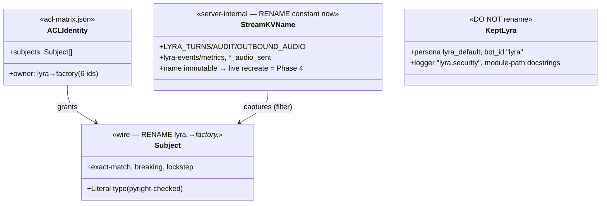
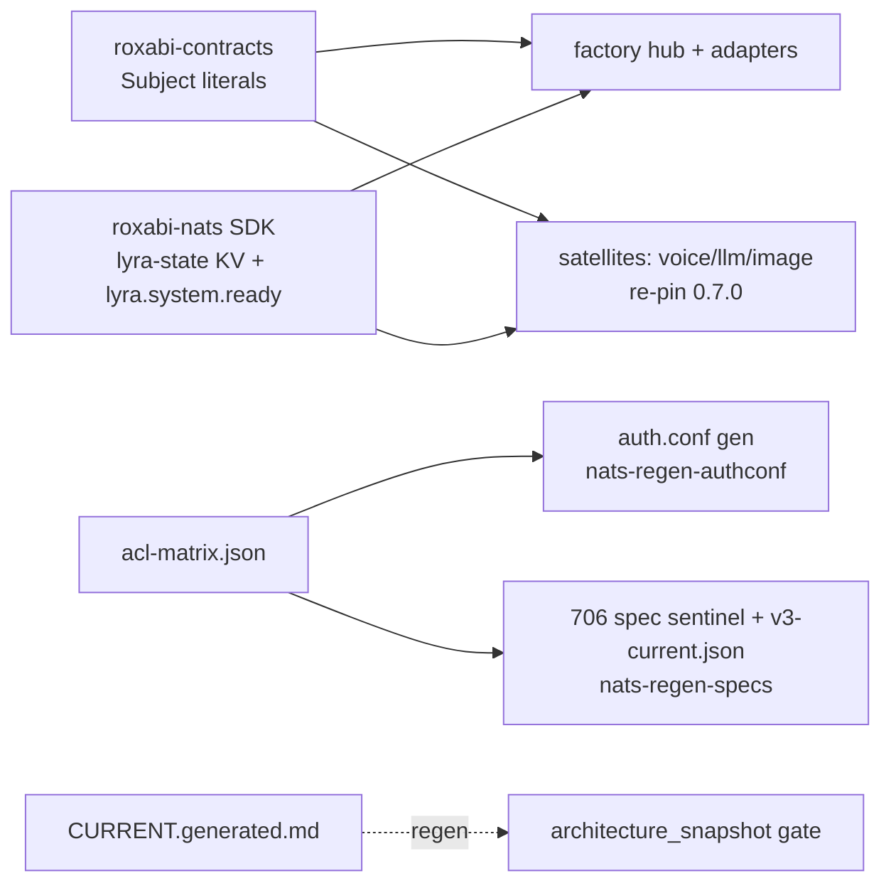

## Context

Epic #1671 Phase 3. Package/CLI identity is already `factory.*` (PR #1669); the NATS **wire** is
still `lyra.*`. This spec renames the wire `lyra.*` → `factory.*` across the roxabi-contracts SSoT,
~25 inline subject literals, the JetStream stream/KV **name constants** in code, the
`roxabi-nats` SDK, the NATS ACL matrix + generated artifacts, and supporting tooling/tests/docs.

Decisions (from analysis, user-approved): **D2 = No split** — the `roxabi-nats` SDK rename ships
in this PR (satellites then re-pin contracts **and** nats together). **D5 = Yes** — flip
`owner:"lyra"` → `"factory"` on the 6 lyra-owned ACL identities. Stream-name constants rename
**now** in code; the *live* stream recreation + `LYRA_AUDIT` 90-day history copy are the
**Phase-4 prod-cutover ticket** (separate), executed with `podman-auto-update.timer` kept disabled.

Source-of-truth detail (file:line, per-stream strategy, gate traps) lives in the analysis —
this spec does not duplicate it.

## Goal

Flip the entire NATS wire namespace from `lyra.*` to `factory.*` (subjects + stream/KV names) in
one breaking, type-safe, gate-green PR that is ready for the Phase-4 prod cutover.

## Users

- **Primary:** the NATS peers — `factory-hub` + adapters/workers. A namespace mismatch = silent
  message loss.
- **Secondary:** satellite repos (voiceCLI#189, llmCLI#105, imageCLI#104) — re-pin
  roxabi-contracts 0.7.0 **and** the new roxabi-nats version in their lockstep cutover.
- **Operator:** runs the Phase-4 maintenance window (stream recreate, audit copy, secret rotation).

## Expected Behavior

After merge to staging: the tree contains **zero** `lyra.*` wire subjects and **zero** `LYRA_*` /
`lyra-state` / `lyra-events|metrics` stream/KV **name constants** (persona/logger/module-path
`lyra` refs are kept). pyright is clean (every subject stays a `Literal[...]`). All pre-push +
CI gates pass: `check_subject_literals`, both ACL drift gates, `architecture_snapshot`,
`doc_drift`. Staging/test environments provision `FACTORY_*` streams cleanly on boot. **Prod is
untouched** (auto-update timer disabled) until the Phase-4 ticket runs.

## Data Model & Consumers

| Consumer | Renamed identifiers it reads | When | Status |
|---|---|---|---|
| hub + adapters (in-repo) | subjects, stream/KV names | runtime | this issue |
| roxabi-contracts tests | subject Literals | CI | this issue |
| satellites (voice/llm/image) | contracts subjects + roxabi-nats KV/readiness subj | their cutover | follow-up (their sub-issues) |
| ACL gates (authconf + specs drift) | acl-matrix subjects + owners | CI/pre-push | this issue |
| architecture_snapshot gate | CURRENT.generated.md subjects | pre-push | this issue |
| Phase-4 operator | live stream names | maintenance window | future (Phase-4 ticket) |

## Breadboard

**Surfaces → operation → output** (this is a migration, not a UI feature):

| ID | Surface | Operation | Output / verifier |
|----|---------|-----------|-------------------|
| N1 | `roxabi-contracts/*/subjects.py` (+tests, version) | literal-for-literal `lyra.`→`factory.` sweep; bump 0.6.0→0.7.0 | contracts tests green, pyright clean |
| N2 | ~25 inline subjects in `src/factory/**` + `nats_bus.py:67` | sweep + drop `lyra.inbound` from allowlist | `check_subject_literals.py` exits 0 |
| N3 | stream/KV name constants (`turn_writer`, `audit`, `outbound_audio`, `bootstrap_streams.py`, contracts `STREAM_AUDIO`, `checks_audio.py`, `*_audio_sent`) | rename constants; fix latent bug 2 (`checks_audio.py` → import `STREAM_AUDIO`). *Optional/axial:* add `STREAM_AUDIT` to contracts so `jetstream_sink.py` imports it like `STREAM_AUDIO` (else follow-up issue) | unit tests green |
| N4 | `packages/roxabi-nats/readiness.py` + in-repo `blobstore/serve.py` (lyra-state) | rename `lyra-state`→`factory-state` KV, `READINESS_SUBJECT` `lyra.system.ready`→`factory.system.ready`; bump roxabi-nats version; update `serve.py` together (no broken intermediate) | roxabi-nats tests green |
| N5 | `deploy/nats/acl-matrix.json` | subjects→`factory.*`; `owner:"lyra"`→`"factory"` ×6; fix latent bug 1 (KV direct-get path → `KV_factory-state`) | hand-edited SSoT |
| N6 | **patch `render_acl_spec.py:31` `SUBJECT_FILTERS` += `"factory."` FIRST**, then regen: `make nats-regen-specs` + auth.conf. ⚠️ `make nats-regen-authconf` restarts `factory-nats` + mutates the podman secret — do NOT run locally against a prod-connected NATS; rely on the drift gates / template-only path in dev | both ACL drift gates exit 0; `test_parity_e2e` green; `v3-pre-grant-group.json` untouched |
| N7 | tooling: `code_inventory.py` classifier += `factory.`; regen `CURRENT.generated.md`; `smoke_llm_e2e.sh` | update + regenerate | `architecture_snapshot` gate exits 0 |
| N8 | tests fixtures (v1/v2/v3, clipool, mint-failure, audio, loader) + docs (`ARCHITECTURE.md`, `GETTING-STARTED.md`, ADRs, CLAUDE.md subject tables) | sweep | full suite green, `doc_drift` exits 0 |
| N9 | Phase-4 prod-cutover ticket + satellite sub-issue updates (re-pin roxabi-nats) | create/update issues | issues exist |

## Slices

Vertical, each independently reviewable; all land in **one PR** (the breaking wire flip cannot
split into separately-mergeable PRs without a broken intermediate wire state — see Open Questions).

| # | Slice | Breadboard nodes (N-IDs above) | Independently verifiable by |
|---|-------|-------------|------------------------------|
| 1 | Contracts SSoT + version | N1 | `uv run pytest packages/roxabi-contracts`; pyright |
| 2 | In-repo subjects + allowlist | N2 | `check_subject_literals.py` |
| 3 | Stream/KV name constants + latent bug 2 | N3 | infra unit tests |
| 4 | roxabi-nats SDK + in-repo lyra-state (serve.py) | N4 | `uv run pytest packages/roxabi-nats` |
| 5 | ACL matrix + owners + regen (filter-patch FIRST) + latent bug 1 | N5, N6 | both ACL drift gates + `test_parity_e2e` |
| 6 | Tooling + snapshot + tests/fixtures + docs | N7, N8 | `architecture_snapshot`, `doc_drift`, full suite |
| 7 | Coordination issues (Phase-4 + satellite re-pin) | N9 | issues created/updated |

## Success Criteria

- [ ] roxabi-contracts: all `lyra.*` subject Literals + builders renamed to `factory.*`; version `0.7.0`; `pytest packages/roxabi-contracts` + pyright green.
- [ ] All ~25 inline `lyra.*` subjects in `src/factory/**` renamed (incl. `nats_bus.py:67` → `factory.inbound`); `lyra.inbound` removed from `subject_literals_allowlist.txt`; `check_subject_literals.py` exits 0.
- [ ] Stream/KV name constants renamed (each verified individually):
  - [ ] `LYRA_TURNS`→`FACTORY_TURNS`, `LYRA_AUDIT`→`FACTORY_AUDIT`, `LYRA_OUTBOUND_AUDIO`→`FACTORY_OUTBOUND_AUDIO` (incl. contracts `STREAM_AUDIO`)
  - [ ] `lyra-events`→`factory-events`, `lyra-metrics`→`factory-metrics`, `lyra_outbound_audio_sent`→`factory_outbound_audio_sent` KV
  - [ ] `checks_audio.py` imports `STREAM_AUDIO` from contracts (latent bug 2 / axial target-axis-trap fixed — no bare stream-name literal)
- [ ] roxabi-nats: `lyra-state`→`factory-state` KV + `READINESS_SUBJECT` `lyra.system.ready`→`factory.system.ready`; version bumped; in-repo `blobstore/serve.py` lyra-state updated; `pytest packages/roxabi-nats` green.
- [ ] `acl-matrix.json`: all subjects → `factory.*`; `owner:"lyra"`→`"factory"` on the 6 identities (others unchanged); latent bug 1 fixed (KV direct-get ACL path → `KV_factory-state`).
- [ ] `render_acl_spec.py` `SUBJECT_FILTERS` includes `"factory."`; auth.conf + 706 spec sentinel + `v3-current.json` regenerated; `check-acl-authconf-drift.sh` + `check-acl-specs-drift.sh` + `test_parity_e2e` green; `v3-pre-grant-group.json` unchanged.
- [ ] `code_inventory.py` classifier accepts `factory.`; `CURRENT.generated.md` regenerated; `architecture_snapshot` gate exits 0.
- [ ] Docs + CLAUDE.md subject tables updated; `doc_drift` exits 0; `smoke_llm_e2e.sh` uses `factory.llm.generate.request`.
- [ ] Repo-wide check: zero `lyra.*` wire subjects and zero `LYRA_*`/`lyra-state`/`lyra-events|metrics` stream-name constants remain in `src/` + `packages/` (kept: persona `lyra_default`/`bot_id "lyra"`, logger `lyra.security`, module-path docstrings).
- [ ] Full `uv run pytest` + all pre-push gates green.
- [ ] **CI-coverage gap acknowledged:** `bootstrap_streams.py` (live-NATS executable, not in CI) — its `factory-events`/`factory-metrics` configs are validated by **manual staging smoke**, not CI. Smoke step: run it on staging, confirm `nats stream ls` shows `FACTORY_*` (no `LYRA_*`) — recorded in the PR description, not gate-blocked.
- [ ] **Prod-safety latch confirmed:** `podman-auto-update.timer` verified **disabled** on M₁ before merge (epic #1671 latch) — so merge-to-staging cannot auto-flip prod. Stated in PR description.
- [ ] Phase-4 prod-cutover ticket **exists** (carries the per-stream plan: `LYRA_AUDIT` create-new+copy+verify+delete, durable-consumer re-provision, secret rotation, timer stays disabled) **and** the 3 satellite sub-issues reference re-pinning roxabi-nats (not just contracts).

## Edge Notes (resolved)

1. **Atomic-by-design:** the breaking subject flip cannot be split into separately-mergeable PRs —
   any intermediate where subjects and ACL/streams disagree breaks CI gates and the wire. Slices
   are in-PR increments. The only true external splits are the Phase-4 ticket + satellite re-pins.
   *(Resolves Gate-2.5 smart-splitting: do NOT split into sub-issues.)*
2. **`LYRA_AUDIT` subject-metadata (was NEEDS CLARIFICATION — resolved):** copied history keeps its
   original `lyra.audit.*` subject in stored metadata. Provisional decision: **assume no consumer
   keys on `msg.Subject`** (audit is a write-mostly security log; the sink publishes, nothing in-repo
   re-reads by subject — confirmed no in-repo audit *consumer* exists). Phase-4 copy replays by
   sequence; the Phase-4 ticket carries a one-line "grep satellite repos for subject-keyed audit
   readers" verification. Not a `/plan` blocker.

## Pre-implementation checks (do before/while coding — cheap fact-checks)

- **`factory-acl check grants` owner-sensitivity (D5):** grep the ACL checker before flipping
  `owner:"lyra"`→`"factory"` — confirm it doesn't hardcode the owner string (CI step `ci.yml:90`).
- **`auth.conf` public nkeys:** confirm the committed file holds only **public** nkeys (the diff
  exposes them) — public nkeys are safe to commit; seeds are not.
- **`LYRA_TYPING_ENABLED` (ci.yml integration job):** confirm it's an orthogonal env var, not a
  subject constant, so the rename sweep doesn't need to touch it (env vars were `LYRA_*`→`FACTORY_*`
  in PR #1669 already — verify this one didn't get missed).
- **`blobstore/CLAUDE.md`:** documents `lyra.audit.blobs.*` in prose (not a table) — include in the
  slice-6 doc sweep so `doc_drift` doesn't trip.
- **`bootstrap_streams.py` CI gap:** see Success Criteria — manual staging smoke, not gate-blocked.
