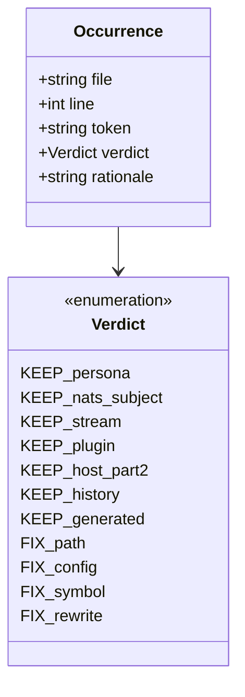

## Context

Promoted from [frame](../frames/1674-lyra-factory-judgment-tail-frame.mdx). Follow-up to
#1668 (mechanical `lyra→factory` rename) — epic #1671. Covers the judgment-dependent tail:
occurrences a sed cannot safely touch. Expert-reviewed; the findings below are baked in.

Ground-truth established during framing + expert review:

1. **Item D is a rewrite to a multi-site contract, not a rename.** `LyraUserError`,
   `ErrorBoundaryMiddleware`, `AudioDownloadError`/`AudioTooLargeError`/`AudioInvalidFormatError`/
   `SttError` — all absent from `src/` (grep = 0). The docs describe a subsystem that does not
   exist. The **actual** user-visible error mechanism (verified by architect review):
   - **Cross-layer exception classes:** `src/factory/core/exceptions.py` — `StreamChunkTimeout`,
     `WorkerUnavailableError`, `HubUnavailableError`, `ScrapeFailed`, `VaultWriteFailed`.
   - **Stream errors → user reply:** `src/factory/outbound/error_handler.py`
     (`OutboundErrorHandler.classify_stream_error`, ~L76–104) maps stream exceptions to
     user-facing template keys (`error_timeout`, `error_stream`).
   - **STT errors → user reply:** `src/factory/core/hub/middleware/middleware_stt.py` catches
     `STTNoiseError`/`STTUnavailableError` (defined in `src/factory/core/ports/stt.py`).
   - **Not** `inbound/dispatcher.py` for these classes (it handles backpressure/circuit-open).
   The rewrite must describe THIS pattern (typed exceptions raised at source → classified into
   user replies by the outbound error handler; STT has its own typed errors + middleware) and
   MUST NOT invent a base class.

2. **Item F ("~337 prose words") is mostly KEEP.** 423 living-doc `lyra`/`Lyra` occurrences;
   the overwhelming majority are legitimate KEEP (NATS subjects, persona, plugin names,
   host-identity deferred to Part 2, autogenerated file). The genuine stale set is small and
   enumerated below (state-dir + `lyra-gh` paths/binary, across 5 known files).

## Goal

Every `lyra`/`Lyra` token in **living docs** either resolves to a real name in `src/`+`deploy/`
or is a documented intentional KEEP; the error-handling doc section names the actual current
contract; `doc_drift` stays green.

## Users

- **Primary:** contributors / Claude agents reading living docs for the error contract, config
  conventions, deploy layout. Today they meet names absent from code (`LyraUserError`,
  `deploy/lyra-gh/`).
- **Secondary:** the `doc_drift` gate; future `/dev` runs trusting docs as ground-truth.

## Expected Behavior

A reader of `backend-patterns.md` / `architecture-patterns.md` sees the real error mechanism
(typed exceptions + outbound classification + STT middleware), citing files that exist. A reader
of `DEPLOYMENT.md` / `agent-management.md` / `ops/*.md` sees `~/.local/state/factory/...`,
`deploy/factory-gh/`, `git-credential-factory-gh`. `.env.example` no longer advertises the
deprecated `STT_MODEL_SIZE` (code `_deprecated_env` fallback untouched). Every surviving `lyra`
token is one a maintainer can justify (persona / NATS subject / Part-2 host identity / generated
/ dated history).

## Data Model & Consumers

The "data" is the **classification of each `lyra`/`Lyra` occurrence** in living docs.



The audit deliverable (SC-6) is a committed table at
`artifacts/analyses/1674-living-doc-lyra-audit.md` with exactly the `Occurrence` columns:
`file | line | token | verdict | rationale`.

```mermaid
flowchart LR
    A[living-doc lyra token] --> C{classify}
    C -->|persona/agent/bot| K1[KEEP_persona]
    C -->|lyra.* subject / LYRA_* stream / KV lyra-state| K2[KEEP → #1670]
    C -->|plugins/lyra-send, lyra-ops| K3[KEEP_plugin]
    C -->|lyra@ /home/lyra lyra_agent chown lyra| K4[KEEP → Part 2]
    C -->|CURRENT.generated.md| K5[KEEP_generated, excluded]
    C -->|adr/ history/ changelog| K6[excluded]
    C -->|deploy/lyra-gh, git-credential-lyra-gh| F1[FIX → factory-gh]
    C -->|~/.local/state/lyra| F2[FIX → factory]
    C -->|LyraUserError + error subsystem| F3[FIX → rewrite to real contract]
```

### Consumer summary

| Consumer | Reads | When | Status |
|---|---|---|---|
| contributor / agent | error contract section | learning error handling | this issue (D) |
| contributor / agent | deploy paths, state dir | deploying / debugging | this issue (C, gh-paths) |
| `doc_drift` gate | living-doc symbol refs | pre-push / CI | this issue |
| #1670 wire workstream | `lyra.*` subjects, `LYRA_*` streams | future | out of scope (KEEP) |
| Part 2 cutover | host identity refs | future | out of scope (KEEP) |

## Breadboard

| ID | Affordance (target) | Action | Resulting state |
|---|---|---|---|
| A1 | `docs/DEPLOYMENT.md` (`~/.local/state/lyra/logs/`) | rename `lyra`→`factory` | matches `deploy/setup.py:245` hardcoded `~/.local/state/factory/logs/` |
| A2 | `.env.example` (`STT_MODEL_SIZE` line) | delete commented advert line | deprecated env not advertised; code fallback intact |
| A3 | `docs/agent-management.md`, `docs/ops/clipool-git.md`, `docs/ops/clipool-uid-model.md`, `docs/ops/gh-key-rotation.md` (+ any other SC-3 grep hit) | rename `lyra-gh`/`git-credential-lyra-gh` → `factory-gh` | paths/binary resolve to real `deploy/factory-gh/` + `/opt/factory-gh/git-credential-factory-gh` |
| A4 | `docs/standards/backend-patterns.md` (error section) | rewrite to real multi-site contract | names `core/exceptions.py` + `outbound/error_handler.py` + `middleware_stt.py`/`core/ports/stt.py`; no invented base class |
| A5 | `docs/architecture/architecture-patterns.md` (error section) | rewrite to real multi-site contract | same as A4 |
| A6 | all living docs (remaining `lyra` tokens) | audit + classify; FIX stale only; write audit table | every token KEEP-justified or fixed; `artifacts/analyses/1674-living-doc-lyra-audit.md` produced |
| A7 | `docs/CONFIGURATION.md` (`workspaces.lyra`/`/lyra`), `docs/architecture/deployment.md` (ADR-043 `lyra/scripts/`), `docs/architecture/CURRENT.generated.md`, host-identity refs | **verify unchanged** (KEEP) | `git diff` shows no change to these |

### Wiring

A1–A3 are confirmed-stale mechanical fixes (the SC-3 grep is the authoritative file set for A3,
not the enumerated list). A4–A5 are the judgment rewrite (cite real sites only). A6 is the sweep
that subsumes A1–A3 discovery + catches any remaining stale ref and produces the audit table.
A7 is the negative affordance (assert KEEP held, incl. host-identity/#1670/generated).

## Slices

| Slice | Affordances | Demo (independently verifiable) |
|---|---|---|
| **S1 — confirmed-stale mechanical** | A1, A2, A3 | SC-1, SC-2, SC-3 greps pass; code fallback grep still present |
| **S2 — error-section rewrite** | A4, A5 | SC-4 (absent-class grep = 0) + SC-5 (cited sites exist) |
| **S3 — living-doc prose audit** | A6, A7 | SC-6 audit table complete; A7 lines unchanged in `git diff` |

## Success Criteria

Living-docs universe (used by SC-1, SC-3, SC-6) =
```bash
git ls-files '*.md' '*.mdx' \
  | grep -vE '^(docs/history/|docs/architecture/adr/|artifacts/)' \
  | grep -vE '(^|/)CHANGELOG' \
  | grep -v '^docs/architecture/CURRENT.generated.md'
```

- [ ] **SC-1 (A1):** `grep -rIn "state/lyra" $(<universe>)` returns 0; the path now reads `~/.local/state/factory/` (broadened from `local/state/lyra` to catch variants).
- [ ] **SC-2 (A2):** `.env.example` contains no `STT_MODEL_SIZE` line; `grep -c 'STT_MODEL_SIZE' src/factory/bootstrap/factory/voice_overlay.py` is unchanged (≥1 — `_deprecated_env` fallback intact, non-behavioral).
- [ ] **SC-3 (A3):** `grep -rIn "lyra-gh\|git-credential-lyra-gh" $(<universe>)` returns 0; all such refs now read `factory-gh` / `git-credential-factory-gh`.
- [ ] **SC-4 (A4,A5):** `grep -rEn "LyraUserError|ErrorBoundaryMiddleware|AudioDownloadError|AudioTooLargeError|AudioInvalidFormatError|SttError" docs/standards/backend-patterns.md docs/architecture/architecture-patterns.md` returns 0.
- [ ] **SC-5 (A4,A5):** the rewritten error sections cite only real sites — every class/path named appears in `grep -rEn "^class " src/factory/core/exceptions.py src/factory/core/ports/stt.py` ∪ `src/factory/outbound/error_handler.py` ∪ `src/factory/core/hub/middleware/middleware_stt.py`. No class absent from `src/` is named (reviewer runs the greps against the prose).
- [ ] **SC-6 (A6,A7):** `artifacts/analyses/1674-living-doc-lyra-audit.md` exists with columns `file|line|token|verdict|rationale`, enumerating every `lyra`/`Lyra` occurrence in the living-docs universe; 0 rows are stale-and-unfixed; host-identity (Part 2) and `lyra.*`/`LYRA_*` (#1670) rows appear as KEEP with rationale; `git diff` shows `workspaces.lyra`/`/lyra` (CONFIGURATION.md), ADR-043 `lyra/scripts/` (deployment.md), and `CURRENT.generated.md` unchanged.
- [ ] **SC-7 (gates):** `uv run ruff check .`, `uv run pyright`, `uv run pytest`, and `uv run python tools/check_doc_drift.py` all exit 0.

## Edge Cases

| Edge | Handling |
|---|---|
| `CURRENT.generated.md` contains `lyra.*` | Excluded from universe — autogenerated + reflects real NATS subjects; never hand-edit. |
| Host-identity refs (`lyra@`, `/home/lyra`, `lyra_agent`, `chown lyra`) | KEEP — Part 2 owns. Appear in audit as `KEEP_host_part2`. |
| NATS subjects (`lyra.clipool.*`, `$KV.lyra-state.>`) / streams (`LYRA_*`) | KEEP — #1670 owns. Appear in audit as `KEEP_nats_subject`/`KEEP_stream`. |
| Plugin names (`lyra-send`, `lyra-ops`) | KEEP — real current `plugins/` dirs. |
| Persona/bot (`lyra_default`, `bot_id="lyra"`, `lyra[bot]`, `*@lyra.internal`) | KEEP — the Lyra agent example. |
| STT error path in rewrite | `STTNoiseError`/`STTUnavailableError` (`core/ports/stt.py` + `middleware_stt.py`) is a real user-visible path — the rewrite includes it, not just stream errors. |
| `WorkerUnavailableError` surfacing | Raised in `adapters/nats/nats_stream_decoder.py`; no user-reply catch site confirmed → the rewrite describes it as a cross-layer exception, NOT as a distinct user reply, unless implement finds a catch site. |
| ADR-043 historical paths | KEEP — dated design record. |
| A living-doc `lyra-gh` that is genuinely upgrade-history | None expected (dir+binary already renamed); if found, it still FIXes — migration history belongs in `adr/`/`history/`, not living ops docs. |
