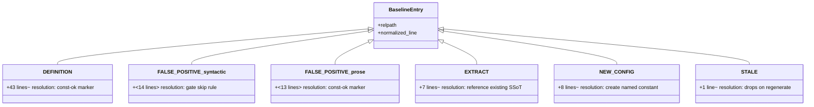
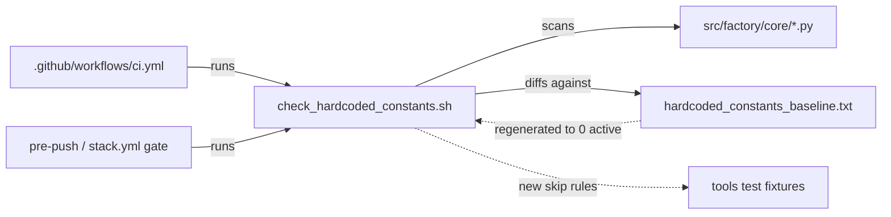

## Context

Source: `artifacts/analyses/1698-burn-down-hardcoded-constants-analysis.mdx` (Shape 3 approved).
The hardcoded-constant gate (`tools/check_hardcoded_constants.sh`, #1654) grandfathers 86 numeric
literals in `src/factory/core/` via `tools/hardcoded_constants_baseline.txt`. Categorization showed
**43 DEFINITION + 27 FALSE-POSITIVE + 7 EXTRACT + 8 NEW-CONFIG + 1 STALE**: ~70 are gate-precision
artifacts, ~15 are genuine extractions. Shape 3 = narrow safe gate skips + honest markers + extract.

## Goal

Drive `tools/hardcoded_constants_baseline.txt` to **0 active entries** while
`check_hardcoded_constants.sh` exits 0 on a clean tree and **no runtime value changes** — resolving
each entry honestly (definition→marker, non-number→gate-skip-or-marker, magic-number→extract).

## Users

- **Primary:** roxabi-factory maintainers — gain a precise gate that protects all core constants and
  stops flagging its own cure (named definitions).
- **Secondary:** future contributors — fewer spurious gate failures; clearer config surface.

## Expected Behavior

1. The gate learns two **narrow, high-precision** skip rules — f-string format specs and regex
   quantifiers — so it stops flagging ~14 syntactically-unambiguous non-numbers. A regression fixture
   proves it still catches a real magic number (no false-negative regression).
2. The 15 genuine magic numbers are extracted: usage sites reference an existing named constant, or a
   new named constant is created; two cross-file duplications are consolidated to one SSoT each.
3. The 43 definition lines and the remaining prose false-positives (docstrings, HTTP codes, time math)
   get honest `# const-ok: <reason>` markers stating *why* the line is not a new magic number.
4. The baseline is regenerated. Because every formerly-flagged line is now skipped, referenced,
   extracted, or marked, regeneration yields **0 active entries**. The file is left header-only (0
   active entries); the gate exits 0.

## Data Model & Consumers

### Taxonomy of the 86 entries

### Consumer map

| Consumer | Uses | When | Status |
|---|---|---|---|
| `check_hardcoded_constants.sh` | core `.py` lines + baseline | every run | modified (2 skip rules) |
| `.github/workflows/ci.yml` (`check-hardcoded-constants` step) | gate exit code | CI | unchanged contract (still exit 0/1/2) |
| `stack.yml` `quality_gates.hardcoded_constants` | gate + baseline path | local/pre-push | unchanged |
| new gate fixtures | gate behavior | test | this issue |

## Breadboard — resolution wiring

| Category | Affordance (gate/source change) | Handler | Result |
|---|---|---|---|
| N1 FALSE-POSITIVE syntactic | f-string format-spec skip (`:[<>^]N`, `:Nd`, `:N.Nf`) + regex-quantifier skip **requiring a preceding regex escape-class** (`\d`/`\w`/`\s`/`\D`/`\W`/`\S` immediately before `{N}`/`{N,}`/`{N,M}`, so Python set literals like `{10, 20}` are NOT exempted) — inserted as new conditions in the **`emit_signatures` awk exclusion block** of `tools/check_hardcoded_constants.sh` (alongside the existing comment/`Config.`/`# const-ok:` skips) | gate awk filter | ~14 lines no longer flagged; **fixture proves a bare `_planted = 4096` is still flagged** |
| N2 EXTRACT (7) | replace literal with reference to existing named constant | source edit | usage points at SSoT |
| N3 NEW-CONFIG (8) | add named constant (Config field / module `_CONST`) + reference | source edit | literal named |
| N4 consolidate (2) | one shared constant for `_MAX_PROMPT_BYTES` and `MAX_MERGED_CHARS` | source edit | single SSoT each |
| N5 DEFINITION (43) + prose FP (~13) | append `# const-ok: <reason>` | source edit | gate-exempt, self-documented |
| N6 teardown | regenerate baseline (`--generate-baseline`) | gate | 0 active entries; gate exits 0 |

## Slices

| # | Slice | Independently demo-able by |
|---|---|---|
| S1 | **Gate precision** — add the two skip rules to `emit_signatures` in `tools/check_hardcoded_constants.sh`; extend `tests/tools/test_check_hardcoded_constants.sh` with cases F (f-string width not flagged), G (regex quantifier not flagged), H (false-negative guard: `_planted = 4096` still flagged); **wire that test harness into CI** (add a `Test hardcoded-constants gate` step to `.github/workflows/ci.yml` — it is currently not run by CI, only the gate itself is) | gate no longer flags the `builtin_commands` width block + `trace.py` regex; the harness runs green in CI; the planted magic number still fails the gate |
| S2 | **Genuine extractions** — the 7 EXTRACT + 8 NEW-CONFIG + 2 consolidations (`_MAX_PROMPT_BYTES`, `MAX_MERGED_CHARS`) | grep shows no raw literal at the 15 sites; values unchanged; `pytest` green |
| S3 | **Honest markers** — `# const-ok: <reason>` on the 43 DEFINITION lines + remaining prose false-positives (docstrings, HTTP 429/500, time math 60/3600/86400) | every marked line states a reason; ruff/pyright clean |
| S4 | **Baseline teardown** — regenerate baseline; confirm 0 active entries; gate exits 0 on clean tree | `grep -vc '^#' baseline == 0`; `bash tools/check_hardcoded_constants.sh; echo $?` == 0 |

Slices are sequential by dependency (S4 must run last — regeneration only yields empty once S1–S3
remove every flag). Each is independently verifiable by running the gate + test suite.

## Success Criteria

- [ ] Gate skips f-string format specs: a fixture line `f"{x:<20}"` under `src/factory/core/` is NOT flagged.
- [ ] Gate skips regex quantifiers: a fixture line containing `\d{8,12}` is NOT flagged.
- [ ] **False-negative regression guard:** a fixture line `_planted = 4096` (no marker, not a definition pattern the rule whitelists at a usage site) IS still flagged — the skip rules did not blind the gate.
- [ ] All 7 EXTRACT sites reference an existing named constant (no raw literal): `bot_models len(row)` → `_N_BOT_COLS`; `agent_builder history_size`; `command_loader priority`; `debounce_ms`×2 → `LifecycleConfig.DEFAULT_DEBOUNCE_MS`; `messaging/bus maxsize` → `BusConfig.DEFAULT_MAXSIZE`.
- [ ] All 8 NEW-CONFIG sites have a named constant: `token_budget`, `agent_refiner max_turns`, `runtime_config` bounds (5000/50/500), `session_commands _TITLE_RESUME`, `session_lifecycle SUMMARY_TURN_LIMIT`, `max_merged_chars`.
- [ ] `_MAX_PROMPT_BYTES` is a single shared constant — defined once in a neutral home `src/factory/core/config/limits.py` as `MAX_PROMPT_BYTES` and imported by both `persona.py` and `agent_config.py` (neither owns it; `persona.py` is currently import-pure so this adds one allowed intra-`core` edge `core.persona → core.config`).
- [ ] `4096` max-merged-chars is a single `LifecycleConfig.MAX_MERGED_CHARS` referenced by `debouncer.py`, `HubConfig`, `PoolConfig`.
- [ ] Every remaining flagged line carries `# const-ok: <reason>` (presence is gate-enforced; **non-empty reason is a human-review criterion** — the gate checks only for the marker token).
- [ ] `grep -vc '^#' tools/hardcoded_constants_baseline.txt` == 0 (0 active entries).
- [ ] `bash tools/check_hardcoded_constants.sh` exits 0 on a clean tree.
- [ ] No runtime value changed: every extracted/marked constant keeps its prior numeric value (**human-review criterion — diff-verified at PR review**; pytest covers behavioral regressions but does not assert value-equality per constant).
- [ ] `uv run pytest` passes; `uv run ruff check .` + `uv run pyright` clean.

## Design Decisions (resolved — not blocking)

- **Baseline file: keep header-only, not deleted.** The gate exits 2 on a *missing* baseline (it tests
  `[ ! -f "$BASELINE_FILE" ]`). Leaving the file with 0 active entries (comment header only) satisfies
  "0 active entries" + "gate exits 0" with zero extra gate change (verified: an empty scan early-exits
  `exit 0` before the baseline is loaded). Physical deletion (issue's "…and can be deleted") is a
  **known, conscious deviation** from the issue's stated end-state, deferred because it requires
  teaching the gate to treat an absent baseline as the empty set. **Action: open a follow-up child
  issue** for "delete baseline + handle absent-baseline-as-empty in the gate" and link it from the PR,
  so the deviation is tracked rather than silent.
- **`# const-ok:` on definitions is legitimate, not laundering.** A marker on a named-constant
  definition or a true non-number is honest (per analysis "laundering vs legitimate" distinction).
  Laundering — marking a usage-site magic number to dodge extraction — is forbidden; the 15 EXTRACT/
  NEW-CONFIG entries are extracted, never marked.
- **Gate skip rules stay narrow.** Only f-string format specs and regex quantifiers — both
  syntactically unambiguous with ~0 false-negative risk. Definition-detection is intentionally NOT
  added to the gate (Shape 2's fragile part); definitions use markers instead.

## Gate 2.5 — Smart Splitting

Triggers fire (|criteria| = 12 > 8; |slices| = 4 > 3) but **recommend NOT splitting**: the work is one
cohesive refactor against a single artifact (one baseline, one gate) with a single done-condition (0
active entries) and a hard sequential dependency (S4 must follow S1–S3). Splitting into sub-issues
would fragment one atomic teardown across multiple PRs with no independent-ship value. Keep as one PR.
