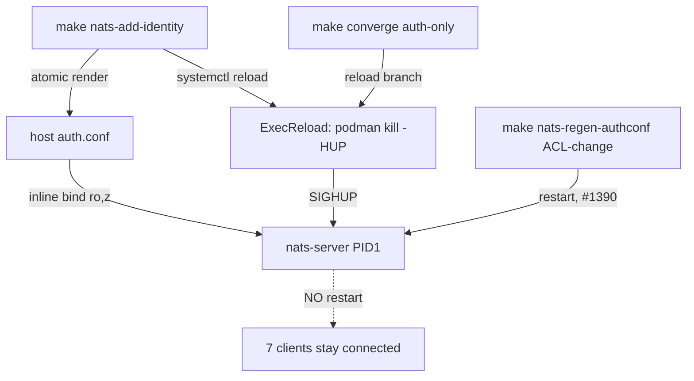

## Context

Promoted from [analysis](../analyses/1719-nats-identity-add-sighup-bind-mount-analysis.mdx)
(Shape C approved). `make nats-add-identity NAME=<x>` restarts `factory-nats` + all 7
`FACTORY_NATS_CLIENTS` because `auth.conf` is a Podman `type=mount` secret (tmpfs, stale until
restart). Switch auth.conf to an **inline bind mount** (the pattern already used for
`nats-container.conf` at `factory-nats.container:20`) and add SIGHUP reload, so a **pure identity
add** goes live with zero client restart and zero connection drop. ACL **changes** keep the restart
path (respects #1390, scoped out).

## Goal

A pure `make nats-add-identity NAME=<x>` brings the new identity live via a SIGHUP reload of
`factory-nats` alone — **zero** of the 7 clients restarted, **zero** connections dropped — and the
next `make converge` does not undo that by restarting.

## Users

- **Primary:** operator on M₁ running `make nats-add-identity`.
- **Secondary:** the 7 NATS clients (hub, telegram, discord, clipool, turn-writer, gh-helper,
  blobstore) — no longer bounced on add.

## Expected Behavior

1. Operator runs `make nats-add-identity NAME=image-worker`.
2. `factory-acl genkeys --add-identity` renders the new identity into auth.conf on the host,
   **atomically** (temp file + `os.rename`).
3. Because auth.conf is an inline bind mount, the updated file is immediately visible inside the
   `factory-nats` container.
4. The target runs `systemctl --user reload factory-nats` → Quadlet's `ExecReload=` sends
   `SIGHUP` (`podman kill --signal=HUP factory-nats`) → nats-server (PID 1) re-reads its config
   tree (`include "nkeys/auth.conf"`) and applies the new user. **No restart. No client fan-out.**
5. The new identity authenticates; existing client connections stay up.
6. Later, `factory-post-autoupdate.timer` → `make converge` detects the auth.conf hash change but,
   for **auth-only** drift, takes a reload branch (not the full restart sequence).
7. An ACL **change** (`make nats-regen-authconf`) still restarts `factory-nats` — unchanged.

## Data Model & Consumers

```mermaid
classDiagram
    class AuthConf {
      +path ~/.roxabi/factory/nkeys/auth.conf (host)
      +mount inline Volume bind :ro,z  (was: Secret type=mount)
      +content authorization{ users[] }  PUBLIC nkeys U... + ACLs
      +render full-file, atomic (temp+rename)
    }
    class AclMatrix {
      +path deploy/nats/acl-matrix.json  (SSoT)
      +identities 14
    }
    class Seed {
      +mount Secret type=mount  (UNCHANGED — private S... keys)
    }
    AclMatrix --> AuthConf : factory-acl genkeys renders
    AuthConf --> NatsServer : include + SIGHUP reload
    Seed --> NatsServer : client auth (unchanged)
```



| Consumer | Reads | When | Status |
|----------|-------|------|--------|
| nats-server | auth.conf (via include) | on start + on SIGHUP | this issue |
| 7 NATS clients | their own seed secret | on connect | unchanged |
| `converge.sh` fingerprint | sha256(auth.conf) | each converge | this issue (reload branch) |
| host `factory-acl`/`podman secret` | host auth.conf file | render/rotate | this issue (bind relabel `:z` — F14) |

## Breadboard

| Affordance | Handler | Data / Effect |
|-----------|---------|---------------|
| N1 `factory-nats.container` Secret line | replace with inline `Volume=%h/.roxabi/factory/nkeys/auth.conf:/etc/nats/nkeys/auth.conf:ro,z` | auth.conf live, not tmpfs |
| N2 `factory-nats.container` `[Service]` | add `ExecReload=/usr/bin/podman kill --signal=HUP factory-nats` | `systemctl reload` → SIGHUP to PID 1 |
| N3 drop `factory-nats-auth` from secret store — **6 locations** | (1) `factory-nats.container:28` Secret line; (2) `quadlet.toml:7` required_secrets; (3) `secrets-policy.toml` `nats-auth` entry; (4) `Makefile:214` `quadlet-secrets-install` create; (5) `Makefile:342` `nats-regen-authconf` create; (6) `Makefile:370` `nats-add-identity` create. Then **regenerate** `deploy/generated/secrets-manifest.sh` via `python3 tools/emit_secrets_manifest.py` (generated, ¬hand-edit) | `check_secrets_drift.sh` (a)+(b) green; no orphan secret left installed |
| N4 `scripts/gen_nkeys.py` writer | temp file + `os.rename` to host auth.conf path | SIGHUP never reads half-written file |
| N5 `install.sh` first-boot guard | render auth.conf if absent, **before the unit-copy step (~L298)** — mirror the existing `turns.db` pre-create pattern (`install.sh:291-296`); existing `UDET*`-placeholder validation (`install.sh:56-64`) stays | no Podman "directory at mount target" trap (F13) |
| N6 `Makefile nats-add-identity` | replace restart+fan-out (`Makefile:370-377`) with `systemctl --user reload factory-nats`; delete the `podman secret create --replace factory-nats-auth` line (L370) and the client fan-out loop (L372-377) | 0 client restarts |
| N7 `converge.sh` + `deploy-common.sh` | auth-only drift → reload branch (split the `:`-joined fingerprint, compare auth field vs structural fields, handle `none`/3-vs-4-field); drop `podman secret create --replace factory-nats-auth` (`converge.sh:48`) | converge preserves the win |
| N8 new ADR | supersede/amend ADR-055: public ACL bundle exempt from `type=mount`; seeds unchanged. Update the `factory-nats.container:25-27` ADR-054 comment | hardening invariant reconciled |
| N9 docs | `deploy/CLAUDE.md` (carve-out at L145 + fix convergence-step prose L95-97), `deployment.md` Volumes table + "Credentials use type=mount" invariant (L225), `nats-authconf-update.md` "Why restart not SIGHUP" rewrite | `check_doc_drift.py` green |
| N10 `Makefile nats-regen-authconf` | restart semantics **unchanged** (#1390), but **remove** its now-orphan `podman secret create --replace factory-nats-auth` (L342) | #1390 respected; no orphan secret |

## Slices

| # | Slice | Affordances | Independently demo-able |
|---|-------|-------------|-------------------------|
| 1 | **Delivery + add-path (atomic) + reconcile gates/docs/ADR** — delivery change and every Makefile target that references the dropped secret MUST land together; splitting them leaves `nats-add-identity`/`nats-regen-authconf` creating orphan secrets + still fanning out | N1, N2, N3, N4, N5, N6, N8, N9, N10 | `make quadlet-install` clean; `check_secrets_drift.sh`+`check_volumes_table.sh`+`check_doc_drift.py` exit 0; (M₁) `systemctl reload factory-nats` logs "Reloading server configuration"; (M₁) `make nats-add-identity NAME=test` restarts 0 of 7 clients, new identity authenticates; `nats-regen-authconf` still restarts |
| 2 | **Converge auth-only reload branch** | N7 | (M₁) `make converge` after a SIGHUP-only add reloads (not restarts) and touches 0 clients |

**Commit to Shape C.** The spike is a **pre-deploy gate**, not an acceptance-criterion variant.
Slice 1 ships behind it: code + CI-verifiable criteria can land/merge, but the change is **not
deployed to M₁** until the spike (analysis §C1 checklist) passes. **Spike fail → the issue is
blocked pending a separate decision** (fall back to Shape B is a frame-rejected regression — it
requires its own issue/spec amendment, not a silent acceptance here).

## Success Criteria

CI-blocking (verified on the PR):
- [ ] `factory-nats.container` delivers auth.conf via inline `Volume=` bind (no `Secret=factory-nats-auth`) **and** has `ExecReload=…--signal=HUP factory-nats`; `factory-nats-auth` removed from all 6 secret-store locations (N3) and `secrets-manifest.sh` regenerated.
- [ ] `check_secrets_drift.sh`, `check_volumes_table.sh`, and `check_doc_drift.py` all exit 0 on the branch.
- [ ] New ADR superseding/amending ADR-055 carves public ACL bundles out of the `type=mount` rule (private seeds unchanged); `deploy/CLAUDE.md`, `docs/architecture/deployment.md`, `docs/ops/nats-authconf-update.md` reconciled; `factory-nats.container:25-27` ADR comment updated.
- [ ] First-boot guard renders host auth.conf before `factory-nats` first start; `gen_nkeys.py` writes auth.conf atomically (temp + `os.rename`) — covered by a unit test asserting temp-then-rename.
- [ ] `make nats-regen-authconf` still restarts `factory-nats` and creates no `factory-nats-auth` secret (#1390 respected; no orphan).

M₁-validated (post-merge, on the deploy/spike — non-CI-blocking):
- [ ] `make nats-add-identity NAME=<x>` (pure add) issues `systemctl --user reload factory-nats`, restarts **0** of the 7 `FACTORY_NATS_CLIENTS`, **and an existing client connection stays up across the reload** (frame success condition (c) — zero drop, unconditional for Shape C).
- [ ] `make converge` on auth-only drift reloads (not restarts) `factory-nats` and restarts **0** clients.
- [ ] Spike checklist passes: ExecReload reaches nats-server PID 1, host read survives `:z`, reload logged, new identity authenticates. (Gate — see note above; spike-fail blocks deploy, not merge.)

## Edge Cases

| Edge | Handling |
|------|----------|
| auth.conf absent on fresh host at first start | N5 guard renders it first; else Podman creates a directory at the mount target (F13) |
| SIGHUP arrives mid-render | N4 atomic temp+rename → nats-server reads either old or new full file, never partial (C4) |
| Spike shows connections drop on reload | **Deploy blocked**; the issue does not ship as Shape C until resolved. Shape B is a frame-rejected regression → separate decision/issue, not a silent fallback |
| `:z` relabel breaks host read of auth.conf | Spike step verifies host `sha256sum` exits 0 post-start; M₁ is AppArmor so `:z` likely no-op (F14) |
| converge run after Slice 1 but before Slice 2 lands | full restart still occurs (degraded, not broken — known, time-boxed) — Slice 2 closes it |
| Slice 1 atomicity | delivery (N1-N3) + every Makefile target referencing the secret (N6, N10) ship together — never split, else orphan-secret + broken add window |
| `nats-regen-authconf` operator expects reload too | out of scope; documented — ACL changes intentionally restart (#1390) |
