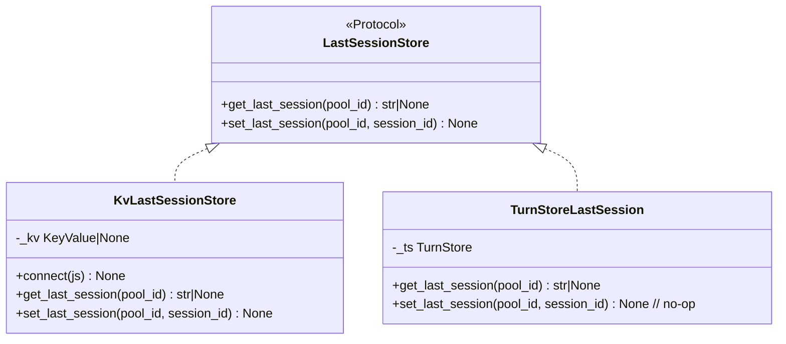
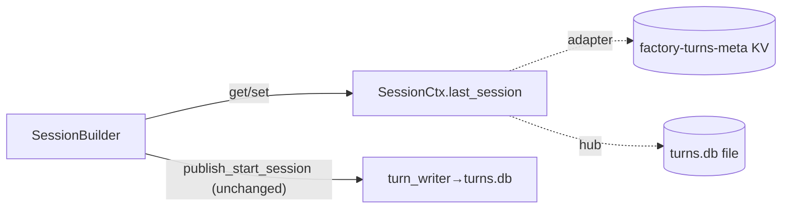

## Context

Promoted from `artifacts/analyses/1721-drop-factory-data-volume-analysis.mdx` (epic #1049 close).
Residual adapter coupling to the shared `factory-data.volume` is two store-opens:
`get_last_session` (turns.db read) + `discord.db` (ThreadStore). Write path already off adapters
(turn_writer, ADR-075). Design refined after ACL investigation — see Decisions.

## Goal

`Volume=factory-data.volume` is mounted **only** by `factory-hub.container`; adapters resolve
last-session over NATS KV and keep no store on a hub-shared host path → epic #1049 closes.

## Users

- **Ops (M₁ `factory-hub`):** shared mount gone from adapters; Volumes table truthful.
- **Adapter runtime:** last-session read/write moves to KV; degrades to new-session on miss.

## Decisions (resolve analysis open questions)

| # | Decision | Rationale |
|---|----------|-----------|
| D1 | **New bucket `factory-turns-meta`** (TTL = turns retention), not reuse `factory-state` | ACL change unavoidable for any path; pick clean separation + retention; mirror `factory-msg-index` (#1059) |
| D2 | **Adapter writes+reads** last-session (via `LastSessionStore` port), NOT turn_writer | fewest identities (2 adapters; turn-writer untouched); immediate consistency; adapter owns its pools |
| D3 | **Hub provisions** the bucket (sole-provisioner, ADR-079) in `open_stores`; adapters bind idempotently (`ensure_kv` create-or-bind), reader returns `None` on miss | matches `factory-msg-index` provisioning; cold-boot before hub = degrade-to-new-session, never crash |
| D4 | **discord.db moves to private dir** `%h/.roxabi/factory-discord/` (one-time copy), own `factory-discord-data.volume`; telegram drops the volume entirely | satisfies failure-criterion (b): no adapter store on a host path the hub mounts; telegram has no stores left |
| D5 | Hub-side pools (CLI/clipool) keep the **TurnStore file** path via a `TurnStoreLastSession` wrapper (get=file, set=no-op) | hub still mounts factory-data.volume + turns.db; only adapter pools move to KV |
| D6 | Prod `turns.db` deletion (epic AC#2) = **documented converge step** in QUADLET runbook, not CI | manual M₁ ops action, not testable in CI |
| D7 | **Port placement = `core/ports/last_session_store.py`** (driven port); `KvLastSessionStore` → `infrastructure/stores/turn_session_kv.py`; `TurnStoreLastSession` → `bootstrap/wiring/` (composition, NOT infrastructure/stores) | axial: avoid leaking inbound-composition concern into the storage layer; `inbound → core.ports` is the legal import (ADR-048/059) |
| D8 | **Bucket name literal `factory-turns-meta`** must byte-match the ACL subject prefix `$KV.factory-turns-meta.>` | mismatch → kv.put/get auth-denied at runtime, **silent** under the degrade-to-new-session path |
| D9 | SessionBuilder reads/writes **only** `ctx.last_session` for last-session; `ctx.turn_store.get_last_session` call (session_builder.py:94) is **replaced, not supplemented** | axial: no dual resolution path surviving transition |
| D10 | Epic #1049 closes only after **AC#3 (keyring.key) + AC#4 (config.db) verified satisfied by earlier children**, and AC#2 prod-file deletion confirmed on M₁ post-converge | product-lead: spec is silent on AC#3/#4; don't auto-close on merge |

## Expected Behavior

1. Hub boots → `open_stores` provisions KV bucket `factory-turns-meta` (idempotent).
2. Adapter boots → binds `factory-turns-meta` (create-or-bind); wires a `LastSessionStore` KV impl
   into `SessionCtx.last_session`; opens **no** turns.db. Discord additionally opens discord.db from
   its private volume.
3. Inbound message (adapter): `SessionBuilder` reads `ctx.last_session.get_last_session(pool_id)`
   from KV → resume-vs-new decision. On KV miss/error → `None` → new session (unchanged behavior).
4. After session assigned, `_turnstore_update_fn` publishes `start_session` (NATS, as today) **and**
   `ctx.last_session.set_last_session(pool_id, session_id)` (KV put). Hub impl: `set` is a no-op
   (turn_writer persists; hub reads the file).
5. CI: `volumes_table` + `secrets_drift` gates green; no adapter mounts `factory-data.volume`.

## Data Model & Consumers





| Consumer | Reads/Writes | Key | Status |
|----------|-------------|-----|--------|
| Adapter SessionBuilder | get + set `last_session.<pool_id>` | `factory-turns-meta` | this issue |
| Hub SessionBuilder | get (file), set no-op | turns.db | unchanged |
| turn_writer | writes turns.db (start_session) | — | unchanged |

## Breadboard

| ID | Affordance | Handler | Data |
|----|-----------|---------|------|
| N1 | `LastSessionStore` Protocol | `core/ports/last_session_store.py` (driven port — **no** inbound hedge, D7) | get/set(pool_id) |
| N2 | `KvLastSessionStore` | new `infrastructure/stores/turn_session_kv.py` (mirror `message_index_kv.py`) | KV `last_session.<pool_id>` |
| N3 | `TurnStoreLastSession` wrapper | `bootstrap/wiring/` (composition, **not** infrastructure/stores — D7) | file get; set no-op |
| N4 | bucket provisioning | `bootstrap_stores.open_stores` | `factory-turns-meta` ensure_kv |
| N5 | `SessionCtx.last_session` field + read/write swap | `inbound/context.py`; SessionBuilder `:94` read replaced + `_turnstore_update_fn` set added (D9) | port |
| N6 | **standalone** adapter wiring | `standalone_discord.py` (remove `_create_dc_stores` TurnStore open + `dc_turn_store.close()` teardown), `standalone_telegram.py` (remove TurnStore open `:45` + `tg_turn_store.close()` `:81`); inject N2 | — |
| N6b | **unified** adapter wiring | `bootstrap_wiring.py:213,270` swap `turn_store=deps.hub._turn_store` → `last_session=<store>` in adapter ctor calls (else `factory start` path still opens turns.db) | — |
| N7 | adapter constructors | `telegram.py:84,100` + `discord/adapter.py:104,131` swap `turn_store`→`last_session`; update `telegram_inbound.py:112,278` + `discord_inbound.py:64` SessionCtx wiring | port |
| N8 | ACL grants + regen | `acl-matrix.json` telegram+discord +3 subjects each (see ACL set below); regen 4 derived artifacts | — |
| N9 | discord private volume | new `factory-discord-data.volume` (bind `%h/.roxabi/factory-discord`) + `.tmpl` swap + one-time copy | discord.db |
| N10 | telegram volume drop | `factory-telegram.container.tmpl` remove `Volume=factory-data.volume` | — |
| N11 | deployment.md Volumes table | de-stale (drop turns.db/message_index adapter rows) + add discord-private row | doc |

### ACL grant set (N8) — exact subjects

Mirror the `factory_outbound_audio_sent` **adapter publish** pattern (NOT msg-index, which is hub-only).
Add to **both** `telegram-adapter` and `discord-adapter` identities (publish array); **no** subscribe
(no `kv.watch`), turn-writer **unchanged**:

```
$KV.factory-turns-meta.>                       # kv.put
$JS.API.STREAM.INFO.KV_factory-turns-meta      # bind (key_value())
$JS.API.STREAM.MSG.GET.KV_factory-turns-meta   # kv.get non-direct path (allow_direct=False)
```

**Regen after editing `acl-matrix.json` (ordered, S4 staged last + committed atomically):**
1. `deploy/nats/auth.conf` — regen (genkeys; confirm flag `--template-only` vs `--regen-authconf` at implement)
2. `artifacts/specs/706-per-role-nkeys-acls-spec.mdx` + `tests/scripts/fixtures/v3-current.json` — render-acl scripts (`make nats-regen-specs` or `scripts/render_acl_*.py`)
3. `docs/architecture/CURRENT.generated.md` — `tools/generate_architecture_snapshot.py`
4. Verify green: `check-acl-authconf-drift.sh`, `check-acl-specs-drift.sh`, `check_secrets_drift.sh`

## Slices

Tightly coupled → **one PR** (splitting leaves the volume half-mounted or KV unwritten). Sequential demo increments:

| S | Slice | Affordances | Demo |
|---|-------|-------------|------|
| S1 | KV last-session store + provisioning | N1,N2,N3,N4 | hub boot provisions bucket; unit test put/get + miss→None |
| S2 | SessionBuilder uses port | N5 | hub path unchanged (TurnStoreLastSession-backed); tests green |
| S3 | Adapter wiring drops TurnStore (both paths) | N6,N6b,N7 | standalone **and** `factory start` boot without opening turns.db; KV read/write live |
| S4 | ACL grants + regen (staged last, atomic) | N8 | `secrets_drift` + acl-drift gates green; auth.conf/706/fixture/CURRENT regenerated |
| S5 | Quadlet volumes + docs | N9,N10,N11 | `volumes_table` green (pre-push); `grep Volume=factory-data` → hub only |

## Success Criteria

- [ ] `grep -rn "Volume=factory-data.volume" deploy/quadlet/factory-{discord,telegram}*` returns nothing.
- [ ] `factory-data.volume` appears only in `factory-hub.container`.
- [ ] No adapter process file-opens a store under `~/.roxabi/factory/` (the hub-mounted dir) — verified on **both** standalone and `factory start` (unified) entry points; discord.db served from `~/.roxabi/factory-discord/`.
- [ ] Adapter `SessionBuilder` reads/writes last-session **only** via `ctx.last_session` (`factory-turns-meta` KV); the `ctx.turn_store.get_last_session` call at session_builder.py:94 is removed; KV miss → new session (no crash).
- [ ] Bucket name literal in `KvLastSessionStore` byte-matches the ACL subject prefix `factory-turns-meta` (no silent auth-deny).
- [ ] Hub-side session resolution unchanged (TurnStore file path) — existing hub tests green.
- [ ] `factory-turns-meta` provisioned idempotently by hub `open_stores`; adapter bind tolerates missing bucket (degrade).
- [ ] `acl-matrix.json` grants telegram-adapter + discord-adapter read+write on `KV_factory-turns-meta`; auth.conf + 706 spec + v3-current fixture + CURRENT.generated.md regenerated; `secrets_drift` gate green.
- [ ] `deployment.md` Volumes table reflects reality (no stale turns.db/message_index adapter rows; discord-private row present); `volumes_table` gate green.
- [ ] QUADLET runbook (`docs/QUADLET-DEPLOYMENT.md`) gains a **one-time data migration** section: copy `~/.roxabi/factory/discord.db` → `~/.roxabi/factory-discord/discord.db` before converge + prod turns.db cleanup (epic #1049 AC#2).
- [ ] `uv run pytest` + `ruff` + `pyright` green.
- [ ] `.importlinter` permits `factory.inbound → factory.core.ports` (confirm contract; else adjust).

## Epic #1049 closure checklist (D10 — do NOT auto-close on merge)

- [ ] AC#1 (volume off adapters) — satisfied by this PR.
- [ ] AC#5/AC#6 (deployment.md truthful + `volumes_table` gate) — satisfied by this PR.
- [ ] **AC#3 (`keyring.key` Secret-only)** — verify closed by an earlier child (#1056) before close.
- [ ] **AC#4 (`config.db` hub-only at runtime)** — verify closed by #1057/#1060 before close.
- [ ] AC#2 (prod `turns.db` + `message_index.db` deleted on M₁) — confirm post-converge, then close epic.

> **Scope note (PR description):** D4 moves `discord.db` to a private volume. The epic lists discord.db
> migration as *out of scope* — but removing the volume from the discord container (AC#1) *requires*
> relocating discord.db off the shared mount. This is a necessary mount move, **not** a NATS migration;
> call it out explicitly in the PR to avoid review surprise.

## Edge Cases

| Edge | Handling |
|------|----------|
| Adapter boots before hub provisions bucket | `ensure_kv` create-or-bind; reader `None` on `KeyNotFoundError`/`NoKeysError` → new session |
| KV put fails mid-flight | log + continue; next message degrades to new session (benign, last-write-wins hint) |
| discord.db copy missed at converge | discord cold-starts with empty ThreadStore → new sessions for active threads (documented risk; copy step in runbook) |
| KV key growth (one per pool) | TTL on `factory-turns-meta` bounds retention (= turns retention_days) |
| Hub `set_last_session` | no-op impl — turn_writer remains sole turns.db writer (ADR-075 preserved) |
| Bucket name ≠ ACL prefix | kv.put/get auth-denied → caught only by degrade path (silent) → guard via D8 byte-match criterion + an integration assert |
| Adapter crash after publish_start_session, before KV set | KV stale; next message degrades to new session (benign, last-write-wins hint) — confirmed by architect |

## NEEDS CLARIFICATION

- None blocking. (Bucket TTL value defaults to turns `retention_days`; confirm at implement.)
