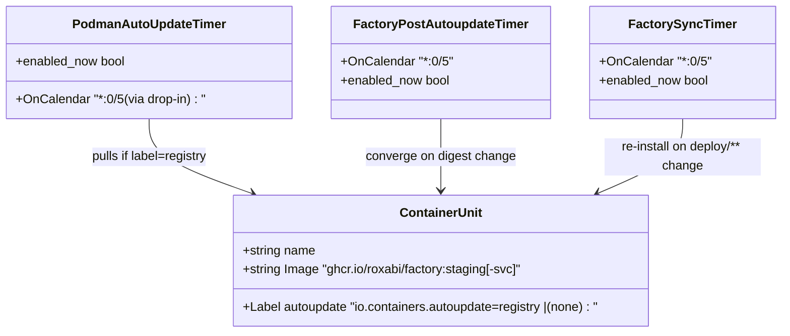
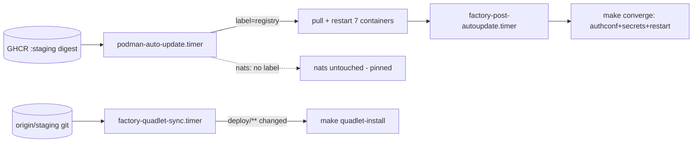

## Context

Source: [frame](../frames/1729-m1-auto-deploy-dead-frame.mdx) (analyze skipped, F-lite).
M₁ auto-deploy is non-functional. Investigation found the units exist in-repo; the failure is a
cluster of code defects + an operational gap + doc drift. This spec repairs the code paths so a
fresh `install.sh` + host-provision greens M₁ and keeps it green, then reconciles the doc and
ships an M₁ remediation runbook.

The three-timer prod deploy model (the intended design, now made real):

| Timer | Installed by | Role |
|---|---|---|
| `podman-auto-update.timer` (podman static unit) | `provision.sh` (host bootstrap) | Pulls new `:staging`/`:staging-svc` image digests for containers labelled `io.containers.autoupdate=registry` |
| `factory-quadlet-sync.timer` | `make quadlet-sync-install` | `git pull --ff-only origin staging`; conditional `make converge` on `deploy/**`/Makefile/render changes |
| `factory-post-autoupdate.timer` | `make quadlet-sync-install` | Detects image-digest change → full `make converge` (auth.conf regen + secret refresh + restarts) → carries ACL/auth.conf changes to NATS |

## Goal

A staging merge reaches M₁ with zero manual steps — image **and** quadlet/auth.conf — and the
repo encodes the fix so re-provision/fresh-host reproduces a working state, not the outage.

## Users

- **Primary:** ops (Mickael) — eliminate per-merge manual M₁ pull/restart/authconf-regen.
- **Secondary:** every contributor whose merged change must reach prod automatically.

## Expected Behavior

1. CI merges `staging` → `publish.yml` pushes `:staging` / `:staging-svc` images to GHCR.
2. Within 5 min, `podman-auto-update.timer` pulls new digests for the **7** registry-labelled
   containers (hub, telegram, discord, clipool, gh-helper, turn-writer, blobstore); `nats`
   stays pinned-by-digest (no label).
3. `factory-post-autoupdate.timer` observes the digest change → `make converge` →
   auth.conf/secret/quadlet re-render + restart (NATS gets ACL changes via restart-not-HUP).
4. `factory-quadlet-sync.timer` independently fast-forwards the git checkout + conditionally
   re-installs quadlets when `deploy/**` changed.
5. Operator verifies on M₁: `is-enabled podman-auto-update.timer` → `enabled`,
   `is-active factory-quadlet-sync.timer` → `active`, `podman auto-update --dry-run` lists 7
   registry-tracked containers.

## Data Model & Consumers

The "data" is the set of systemd units + the per-container AutoUpdate label that gates them.

Consumer summary:

| Consumer | Reads | When | Status |
|---|---|---|---|
| `podman-auto-update.timer` | container `autoupdate` label + GHCR digest | every 5 min | this issue (label add + drop-in) |
| `factory-post-autoupdate.timer` | image digest delta | every 5 min | this issue (start with `--now`) |
| `factory-quadlet-sync.timer` | `origin/staging` HEAD + `deploy/**` diff | every 5 min | this issue (start with `--now`) |
| operator runbook | timer state on M₁ | one-time remediation | this issue (doc) |

## Breadboard

| ID | Affordance | Handler / Location | Effect |
|----|-----------|--------------------|--------|
| C1 | `Label=io.containers.autoupdate=registry` | `deploy/quadlet/factory-{hub,clipool,gh-helper,turn-writer,blobstore}.container` `[Container]` | makes 5 currently-unlabelled containers registry-tracked (telegram+discord already labelled via `.container.tmpl`) |
| C2 | `nats` stays unlabelled | `deploy/quadlet/factory-nats.container` | asserts pinned-by-digest container is NOT auto-updated (negative criterion) |
| M1 | `enable --now` | `Makefile:quadlet-sync-install` (lines ~197–198) | start sync + post-autoupdate timers immediately, not just on reboot. **Must preserve the existing `cp factory-deploy-failure.service` line (~194) when editing the target.** |
| D1 | `podman-auto-update.timer.d/override.conf` | `deploy/systemd/podman-auto-update.timer.d/override.conf` (new) + installed by `quadlet-sync-install` | sets `OnCalendar=*:0/5`. **`quadlet-sync-install` currently does flat `cp` of unit files — it must add `mkdir -p "$(QUADLET_SYNC_DST)/podman-auto-update.timer.d"` before copying the drop-in, then `daemon-reload` (already present).** Ownership: the drop-in is installed by `quadlet-sync-install` (single source — not "or documented"). |
| I1 | enable host timer idempotently | `deploy/install.sh` (after step 9, ~line 296) | `install.sh` has **no** `podman-auto-update.timer` block today. Add `systemctl --user enable --now podman-auto-update.timer` **without** an `is-active` guard (stronger idempotent form than provision.sh — handles enabled-but-stopped). A plain `install.sh` then greens the host timer without a full re-provision. |
| DOC1 | reconcile mechanism + container table | `docs/ops/container-publishing.md` | (a) "Containers managed" table → all 8 factory containers w/ correct AutoUpdate column: add `factory-gh-helper`, `factory-turn-writer`, `factory-blobstore`; remove/relocate cross-repo `voicecli-tts`/`voicecli-stt` rows (separate repo); nats = none. (b) Fix stale "M₁ manual pull + restart" section (lists 4 — add gh-helper/turn-writer/blobstore, align to deploy/CLAUDE.md converge order). (c) Document the 3-timer model + correct cadence; replace bare "no manual intervention" with a prerequisite-qualified statement. |
| DOC2 | M₁ remediation runbook | `docs/QUADLET-DEPLOYMENT.md` — expand the existing "Auto-update not pulling" diagnostic entry (~line 384) | exact idempotent commands to green the live M₁ host once (install drop-in, `enable --now` all 3 timers, verify). QUADLET-DEPLOYMENT.md is the M₁ ops runbook; container-publishing.md is CI/GHCR-pattern oriented. |
| DOC3 | 3rd-timer row | `deploy/CLAUDE.md` "Two systemd user timers" table (~lines 103–108) | add `podman-auto-update.timer` row (host-static, installed by provision.sh/install.sh) + retitle "Three systemd user timers". |

## Slices

| # | Slice | Affordances | Independently demo-able |
|---|-------|-------------|--------------------------|
| 1 | **AutoUpdate label coverage** | C1, C2 | `grep -lc 'autoupdate=registry' deploy/quadlet/*.container deploy/quadlet/*.container.tmpl` → 7 files match (5 static + 2 tmpl); `factory-nats.container` absent |
| 2 | **Timer start + cadence** | M1, D1, I1 | `quadlet-sync-install` uses `enable --now` + `mkdir -p .d/` + drop-in copy (preserves deploy-failure cp); `install.sh` enables host timer idempotently |
| 3 | **Doc reconcile + runbook** | DOC1, DOC2, DOC3 | container-publishing.md table = 8 factory containers, no cross-repo rows; QUADLET-DEPLOYMENT.md runbook copy-pasteable; deploy/CLAUDE.md shows 3 timers |

## Success Criteria

> Note: the frame's Premise Validity says "all 8 container units carry the AutoUpdate label" — that was imprecise. `factory-nats` is **pinned-by-digest and intentionally excluded**, so the correct target is **7 labelled** (hub, telegram, discord, clipool, gh-helper, turn-writer, blobstore) and nats unlabelled. The frame's "<8 registry-tracked" failure condition becomes "<7" below.

- [ ] All 7 non-nats container units (`hub, telegram, discord, clipool, gh-helper, turn-writer, blobstore`) carry `io.containers.autoupdate=registry`; `factory-nats` does **not**. Verify: `grep -l 'autoupdate=registry' deploy/quadlet/*.container deploy/quadlet/*.container.tmpl | wc -l` → 7, and `grep -L 'autoupdate=registry' deploy/quadlet/factory-nats.container` matches.
- [ ] `make quadlet-sync-install` uses `systemctl --user enable --now` for both `factory-quadlet-sync.timer` and `factory-post-autoupdate.timer`; the `cp factory-deploy-failure.service` line is preserved (idempotent target).
- [ ] `deploy/systemd/podman-auto-update.timer.d/override.conf` exists with `OnCalendar=*:0/5`, and `quadlet-sync-install` `mkdir -p`s the `.d/` dir and copies it (single install path — `quadlet-sync-install`, not optional). Verify: `grep -A2 'mkdir -p.*podman-auto-update.timer.d' Makefile`.
- [ ] `deploy/install.sh` runs `systemctl --user enable --now podman-auto-update.timer` (no `is-active` guard) idempotently — a plain install greens the host timer without re-provision. Verify: `grep 'enable --now podman-auto-update.timer' deploy/install.sh`.
- [ ] `docs/ops/container-publishing.md` "Containers managed" table lists all 8 factory containers with correct AutoUpdate column (gh-helper + turn-writer + blobstore added; nats = none); cross-repo `voicecli-tts`/`voicecli-stt` rows removed or relocated; the stale "M₁ manual pull + restart" section lists all 7 service containers.
- [ ] `docs/ops/container-publishing.md` no longer contains the bare phrase "No manual intervention is needed after a staging merge" — it is replaced by a prerequisite-qualified statement naming the 3 timers. Verify: `! grep -q 'No manual intervention is needed' docs/ops/container-publishing.md`.
- [ ] `deploy/CLAUDE.md` timer table documents all 3 timers (adds `podman-auto-update.timer` row; title reflects three).
- [ ] `docs/QUADLET-DEPLOYMENT.md` "Auto-update not pulling" entry is expanded into idempotent M₁ remediation commands (install drop-in, `enable --now` all 3 timers, verify); cross-referenced from #1729.
- [ ] **Prod-green (operator, post-merge):** after running the runbook on M₁, `podman auto-update --dry-run` lists 7 registry-tracked containers, `systemctl --user is-enabled podman-auto-update.timer` → `enabled`, `is-active factory-quadlet-sync.timer` → `active`. Operator records the output as a comment on #1729. (Not CI-verifiable — the PR cannot mutate M₁; this is the falsifiability anchor.)
- [ ] `secrets_drift` + `volumes_table` + `doc_drift` pre-push gates pass with the quadlet/doc edits.

## Follow-up (out of scope — open as separate issue)

- **`factory-post-autoupdate.sh` tracks only `:staging-svc`.** It hardcodes `IMAGE=ghcr.io/roxabi/factory:staging-svc` and compares only that digest. `factory-clipool` + `factory-gh-helper` use `:staging` (no `-svc`); a `:staging`-only rebuild won't trigger `make converge` (podman auto-update still pulls+restarts them via label, but the auth.conf/secret converge path won't fire). Pre-existing bug, not introduced here — file a follow-up; this spec's prod-green criterion uses `:staging-svc`-carrying services for its converge assertion.
