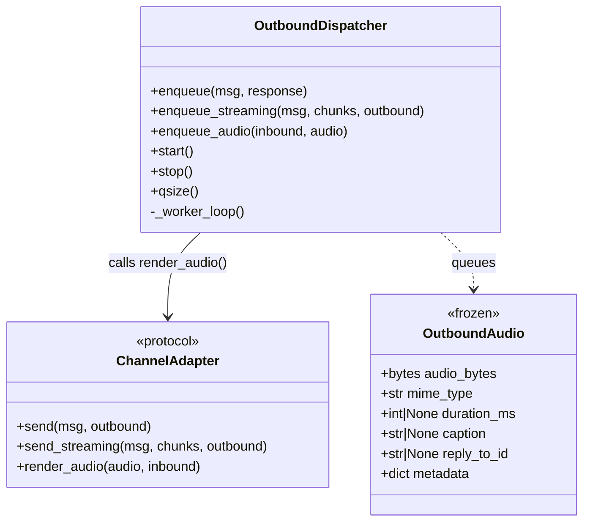
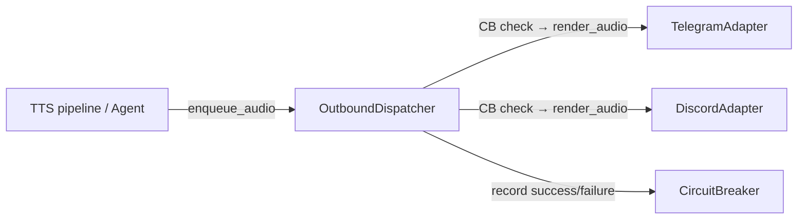

## Context

Promoted from [frame #175](../frames/175-outbound-dispatcher-enqueue-audio-frame.mdx). No analysis (F-lite tier — skipped).

## Goal

Route audio outbound through `OutboundDispatcher` so that `render_audio()` gets the same circuit breaker check, queue, and failure recording as `send()` and `send_streaming()`.

## Users

- **Primary:** Lyra engine — unified outbound path for all message kinds
- **Secondary:** Operators — consistent CB behavior and failure metrics across text/streaming/audio

## Expected Behavior

1. Caller produces an `OutboundAudio` (from TTS pipeline or agent)
2. Caller calls `dispatcher.enqueue_audio(inbound, audio)` — fire-and-forget, returns immediately
3. Worker loop dequeues the item, checks the circuit breaker
4. CB open → log drop, skip delivery, continue
5. CB closed → call `adapter.render_audio(audio, inbound)`, record success/failure on the circuit breaker
6. Anthropic API errors recorded on the Anthropic CB (same as existing send/streaming path)

## Data Model & Consumers

| Consumer | Fields consumed | When | Status |
|----------|----------------|------|--------|
| OutboundDispatcher._worker_loop | kind, inbound, audio | Dequeue | This issue |
| TelegramAdapter.render_audio | audio_bytes, mime_type, duration_ms, caption, reply_to_id | Dispatch | Existing |
| DiscordAdapter.render_audio | audio_bytes, mime_type, caption, reply_to_id | Dispatch | Existing |
| CircuitBreaker | success/failure signal | Post-dispatch | Existing |

## Breadboard

| Affordance | Handler | Data |
|------------|---------|------|
| `enqueue_audio(inbound, audio)` | `OutboundDispatcher` | `("audio", inbound, audio)` queued |
| Worker loop `kind == "audio"` branch | `_worker_loop()` | Dequeue → CB check → `adapter.render_audio()` |
| `render_audio()` on protocol | `ChannelAdapter` protocol | Method signature added |
| Callers switch to dispatcher | TTS pipeline / agent layer | Replace direct `adapter.render_audio()` with `dispatcher.enqueue_audio()` |

## Slices

| # | Slice | Description | Files |
|---|-------|-------------|-------|
| 1 | Protocol + dispatcher method | Add `render_audio` to `ChannelAdapter` protocol (with `OutboundAudio` import), add `enqueue_audio()` to `OutboundDispatcher`, add explicit `elif kind == "audio"` branch in worker loop (not fall-through under existing `else`) | `hub.py`, `outbound_dispatcher.py` |
| 2 | Wire callers + tests | Update any future callers to use `enqueue_audio()` instead of direct `adapter.render_audio()`. Add unit tests for enqueue_audio path (CB open → drop, CB closed → deliver, failure → record). | `outbound_dispatcher.py`, `tests/core/test_outbound_dispatcher.py` |

## Success Criteria

- [ ] `ChannelAdapter` protocol includes `render_audio(self, audio: OutboundAudio, inbound: InboundMessage) -> None`
- [ ] `OutboundDispatcher.enqueue_audio(inbound, audio)` enqueues an `("audio", inbound, audio)` item
- [ ] Worker loop handles `kind == "audio"` → calls `adapter.render_audio(audio, inbound)`
- [ ] CB open → audio item is dropped with a log warning (no delivery)
- [ ] CB closed + success → `circuit.record_success()` called
- [ ] CB closed + failure → `circuit.record_failure()` called + Anthropic CB recorded if applicable
- [ ] `uv run pytest` passes with new tests covering all three CB paths (open/success/failure)
- [ ] `uv run ruff check .` passes with zero violations
