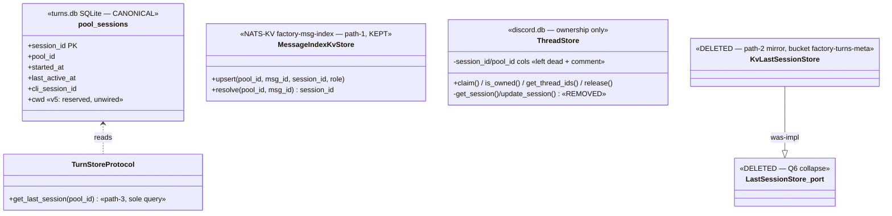
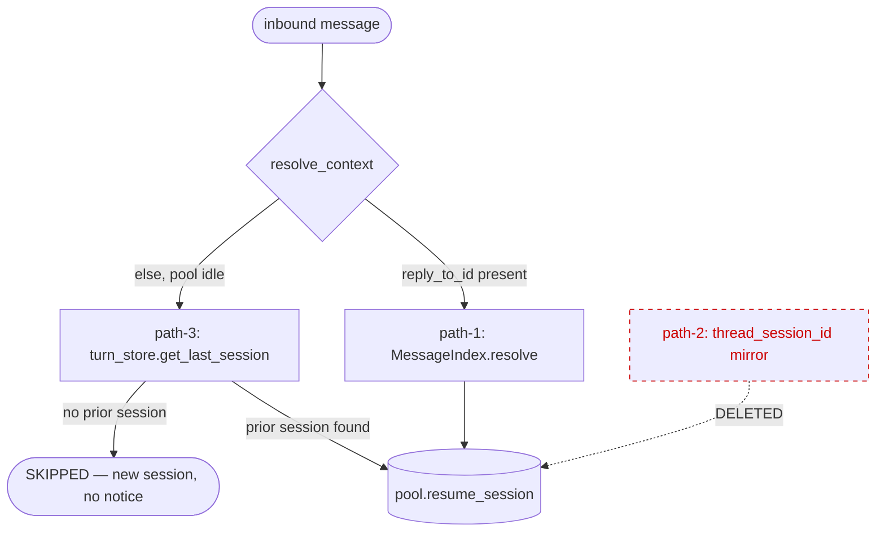

## Context

Promoted from `artifacts/analyses/1777-single-ssot-last-session-analysis.mdx` (code-grounded) and
the ratified `artifacts/analyses/job-model-concept-analysis.md` §8–11. Three disjoint stores hold
"last session per pool"; two are adapter mirrors never cleared by `/clear` → resurrection.
`turns.db` `pool_sessions` is already canonical and self-heals.

Decisions carried in: D1 (remove path-2), Q6 (collapse `LastSessionStore` port), Q7/Q8 (strip
inbound + ThreadStore session-pointer), Q9 (reply-to survives `/clear`), **FRESH notice dropped
here, re-introduced in #1805**, ThreadStore session-pointer **columns left dead** (no DROP). Out of
scope → #1805: CLI `--resume` fallback, `cwd` wiring, `/folder`, rename migration.

**Expert-panel deltas folded in (2026-06-09):** axial-review = *good, no drift* (net axial
improvement: 3 stores N×M → 1 stage primitive). architect/doc-writer/product-lead/devops surfaced
test-suite + ACL/doc fan-out + criteria-sharpening — all incorporated below and grep-verified.

## Goal

`turns.db` `pool_sessions` becomes the **sole** source of truth for Shape-A last-session; adapters
hold nothing for resume; `/clear` is genuinely fresh; explicit reply-to still resumes deterministically.

## Users

- **Primary:** bot users (Telegram / Discord DM / Discord thread / CLI) — `/clear` no longer
  resurrects; reply-to resume is deterministic.
- **Secondary:** ops — no more hand-patching store divergence; cleaner NATS ACL surface.

## Expected Behavior

1. **`/clear` then a new message** → `reset_session()` rotates the UUID + publishes `start_session`;
   turn-writer `INSERT OR IGNORE`s a fresh `pool_sessions` row. Next message: path-1 finds no
   reply-to, path-3 reads the *new* session from `turns.db`. No mirror to resurrect the old one.
2. **Reply to a pre-`/clear` message** → path-1 (`MessageIndex.resolve`) returns that message's
   session and resumes it — explicit intent trumps the clear (Q9). MessageIndex untouched by `/clear`.
3. **Idle Telegram DM / Discord DM / Discord thread, second message** → no adapter-side lookup; hub
   path-3 calls `turn_store.get_last_session(pool_id)`. Discord thread uses the already-wired
   `pool_id = discord:bot:{id}:thread:{tid}`, so its last-session is in `pool_sessions` already.
4. **No prior session (empty pool)** → path-1 + path-3 both miss → `resolve_context` returns
   `SKIPPED` → a genuinely new session, no notice.
5. **A previously path-2-only "session fell through" notice** is removed (unreachable). The proper
   "couldn't resume → fresh" notice returns with #1805's dead-resume detection — **silence is the
   accepted interim state** between #1777 and #1805 (product decision).

## Data Model & Consumers

### Store topology (after #1777)

### Resume-path consumers

### Consumer summary

| Consumer | Reads | When | Status |
|---|---|---|---|
| `_resume_path1` | `MessageIndex.resolve(pool_id, reply_to_id)` | explicit reply-to | **kept** — verified survives `/clear` |
| `_resume_path3` | `turn_store.get_last_session(pool_id)` | pool idle, no reply-to | **kept** — now sole last-session reader |
| `_resume_path2` | `platform_meta.thread_session_id` (adapter mirror) | — | **removed** |
| `#1805` resume-failure UX | `cwd` column + dead-resume detection + re-introduced fresh-notice | future | dashed — `cwd` reserved here |

## Breadboard

| ID | Affordance (code surface) | Handler | Slice |
|----|---------------------------|---------|-------|
| N1 | `resolve_context()` | drop path-2 call; `return SKIPPED`; flow ends `SKIPPED` on empty pool | B |
| N2 | `_resume_path2` | **delete**; narrow `DiscordMeta`/`TelegramMeta` import | B |
| N3 | `middleware_submit` FRESH branch + `_notify_session_fallthrough` + `SESSION_FALLTHROUGH_MSG` | **delete** | B |
| N4 | `TurnStoreProtocol.get_session_pool_id` + SQL impl | **delete** (dead after N2) | B |
| N3t | FRESH/notify tests — `tests/core/test_middleware.py`, `tests/core/test_submit_middleware_context.py` | convert `FRESH`→`SKIPPED` where valid; delete path-2-reject cases | B |
| N5 | `session_builder._build_last_session_path` | **delete** (path-2 KV producer) | C |
| N6 | `session_builder._build_thread_path` | strip ThreadStore `get_session`/`update_session` + `thread_session_id` inject; keep claim routing; drop `thread_sessions_cache` use | C |
| N6b | `core/messaging/message.py` — `TelegramMeta.thread_session_id` (L38) + `DiscordMeta.thread_session_id` (L48) | **delete fields** (dead after N2/N5/N6) | C |
| N7 | `LastSessionStore` port + `TurnStoreLastSession` + `KvLastSessionStore` + `ensure_kv` + bucket provisioning (`bootstrap_stores`, `hub_standalone`) | **delete**; `factory-turns-meta` unprovisioned | C |
| N8 | adapter ctors (`telegram.py`, `discord/adapter.py`) + wiring (`bootstrap_wiring`, `standalone_telegram`, `standalone_discord`) | remove `last_session` param/field/inject | C |
| N9 | `ThreadStore` get/update_session (proto+impl) + `ThreadSession` + `discord_threads` helpers + `context` fields + discord `adapter._thread_sessions` | **delete**; add "orphaned by #1777" comment on dead columns | C |
| N10 | `turn_store.connect()` | **add** v5 `ALTER TABLE pool_sessions ADD COLUMN cwd TEXT` (try/except) | A |
| N11 | Docs + ACL fan-out (see below) | update/regen | C |
| Nt | Test-suite alignment — 7 modules reference `KvLastSessionStore`/`ThreadSession` (see Test Targets) | delete/convert | B+C |

### N11 detail — docs + ACL fan-out (grep-verified)

| File | Change |
|---|---|
| `deploy/nats/acl-matrix.json` | remove 3 `factory-turns-meta` grants from **telegram-adapter** (L93-95) + **discord-adapter** (L125-127) |
| `deploy/nats/auth.conf` | regen (drops same 6 grants, L25 + L34) via `factory-acl genkeys --regen-authconf` |
| `docs/architecture/CURRENT.generated.md` | regen (drops L100 + L127 entries) — `architecture_snapshot` gate |
| ACL-derived fixtures (per known regen fan-out) | regen any acl-matrix-derived fixture (e.g. `tests/scripts/fixtures/*`) so `secrets_drift` stays green |
| `docs/architecture/deployment.md` (L149) | rewrite the "last-session resolved via NATS KV `factory-turns-meta`" prose → "via `turns.db` path-3" |
| `docs/QUADLET-DEPLOYMENT.md` (L139) | same correction |
| `src/factory/inbound/CLAUDE.md` (L28 + L48) | strike `thread_sessions_cache` mutation note + the "`persist_thread_session`/`retrieve_thread_session` stay in adapters" invariant |
| `src/factory/inbound/context.py` docstring | strike path-2 / `thread_sessions_cache` prose |

## Slices

| # | Slice | Affordances | Demo-able outcome | Depends |
|---|-------|-------------|-------------------|---------|
| A | Reserve `cwd` column | N10 | v5 migration idempotent; column NULL; suite green | — |
| B | Remove path-2 (hub) + drop FRESH + align FRESH tests | N1,N2,N3,N4,N3t | `/clear` fresh; reply-to (path-1) works; DM/thread resume via path-3; FRESH unreachable; **suite green** | — |
| C | Remove adapter producers + collapse port + ThreadStore reduce + ACL/doc fan-out + test cleanup | N5,N6,N6b,N7,N8,N9,N11,Nt | no `KvLastSessionStore`/port/`ThreadSession`; ownership intact; pyright + import-linter + doc_drift + secrets_drift + architecture_snapshot green | B |

Order: A ∥ B, then C. B removes the hub *reader* first (adapters still injecting `thread_session_id`
/ writing mirrors during C are harmless dead writes); C removes the *producers* + stores + port + ACL.

## Success Criteria

- [ ] **SC-1** `/clear` then next message starts a genuinely fresh session — `pool_sessions` shows the
  new `session_id`; the pre-clear session is not resumed via any path (regression test).
- [ ] **SC-2** Replying to a **pre-`/clear`** bot message M resumes M's session via path-1 — asserted
  by the `MessageIndex.resolve` path being taken (spy/mock/log, **not** mere `session_id` match) — on
  Telegram DM, Discord DM, and Discord thread.
- [ ] **SC-3** Post-removal, the resume path for Telegram DM / Discord DM / Discord thread reaches
  **only** `turn_store.get_last_session(pool_id)`; the deleted symbols `_build_last_session_path`,
  `ThreadStore.get_session`, `ThreadStore.update_session` are absent from `src/`.
- [ ] **SC-4a** `_resume_path2` is deleted and `resolve_context` returns `SKIPPED` for that branch;
  `_notify_session_fallthrough` is never invoked at runtime (regression: Telegram DM no-prior-session
  → `SKIPPED`, no platform notice emitted).
- [ ] **SC-4b** No `ResumeStatus.FRESH` member or assertion remains in `src/` or `tests/`; `pyright`
  confirms the enum member is gone.
- [ ] **SC-5** The dead-resume case produces no user-visible notice between #1777 and #1805 —
  intentional per the analysis decision; an optional `logger.debug` at the `SKIPPED` branch is
  acceptable, silence is the accepted interim state (documented so a reviewer can't "fix" it by
  re-adding FRESH).
- [ ] **SC-6** `LastSessionStore` port, `TurnStoreLastSession`, `KvLastSessionStore`, `ensure_kv` and
  `factory-turns-meta` provisioning are deleted; `get_session_pool_id` removed (protocol + SQL);
  `pyright` and `import-linter` pass.
- [ ] **SC-7** `ThreadStore` retains `claim`/`is_owned`/`get_thread_ids`/`release`; `get_session`/
  `update_session` removed; `session_id`/`pool_id` columns left dead with an inline
  "orphaned by #1777" comment.
- [ ] **SC-8** `TelegramMeta.thread_session_id` + `DiscordMeta.thread_session_id` fields removed;
  `pyright` clean.
- [ ] **SC-9** `pool_sessions` carries a nullable `cwd` column added by an idempotent v5 migration;
  reserved, not read or written by any code path in this issue.
- [ ] **SC-10** `factory-turns-meta` grants removed from `telegram-adapter` + `discord-adapter` in
  `acl-matrix.json`; `auth.conf` + `CURRENT.generated.md` + ACL-derived fixtures regenerated;
  `secrets_drift` and `architecture_snapshot` pre-push gates pass.
- [ ] **SC-11** Docs corrected (`inbound/CLAUDE.md`, `context.py` docstring, `deployment.md`,
  `QUADLET-DEPLOYMENT.md`); `doc_drift` gate passes.
- [ ] **SC-12** Full `pytest` suite green; `factory-turns-meta` bucket is not provisioned at startup.

## Ops Notes

- **factory-nats restart on Slice C deploy** — ACL grant removal changes `auth.conf` (inline bind
  mount, ADR-085). ACL permission changes require a **restart, not SIGHUP** (#1390); `converge.sh`
  detects the mount diff and restarts `factory-nats` automatically; adapters reconnect via
  `allow_reconnect`. No manual step.
- **Orphaned bucket** — `factory-turns-meta` persists in JetStream on M₁ after deploy; safe to leave
  dormant. Optional reclaim: `nats kv del factory-turns-meta` on M₁ post-deploy.

## Gate 2.5 — splitting evaluated, declined

12 criteria > 8 triggers the splitting check. **Declined:** the criteria are facets of one atomic
consolidation — the pre-push gates (`secrets_drift`, `architecture_snapshot`, `import-linter`)
enforce that bucket removal, ACL cleanup, and snapshot regen land *together*, so no sub-deliverable is
independently shippable. The 3 slices (A/B/C) provide the vertical increments. One issue, one PR.
