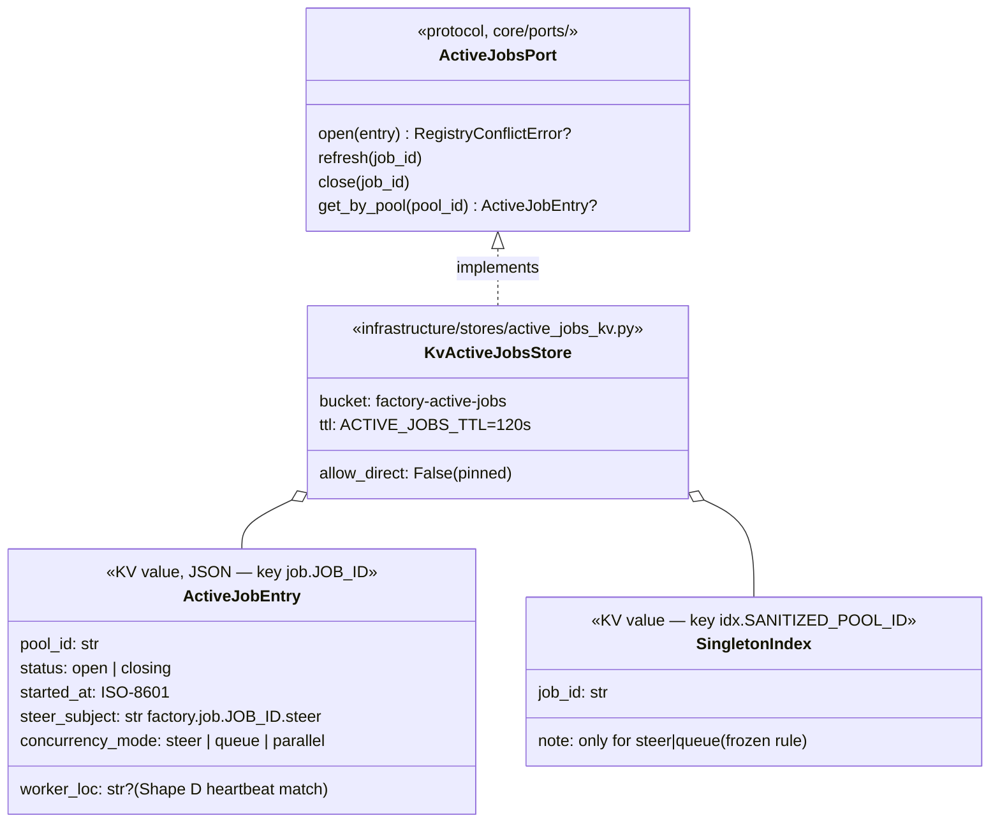
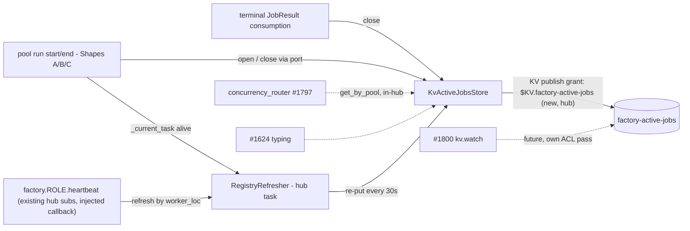

## Context

**Promoted from:** [frame](../frames/1796-active-jobs-registry-frame.mdx) (approved 2026-06-11, 3-lens validated)
**GitHub issue:** #1796 — foundation child of epic #1792 (Shape D); blocks #1797/#1798/#1799/#1800.
**SSoT:** `docs/architecture/job-model.md` §Active-jobs registry / §Concurrency / §Observability (schema, writer rule, liveness, mode partition — ratified, not re-decided here).

## Goal

Cross-process job state becomes queryable and live: every envelope-driven run is visible in `factory-active-jobs` (by `job_id` and by `pool_id`), entries die with their run (terminal `JobResult`) or by TTL reap, and #1797's `fresh | steer | queue` decision has a substrate that out-of-process jobs can't hide from.

## Users

- **Hub** — sole writer: open / refresh / close via a core port; provisions the bucket pre-ready.
- **#1797 concurrency_router** — first reader (in-hub, zero new ACL).
- **#1799 steer / #1624 typing / #1800 dashboard v1** — future readers (`steer_subject` resolution, typing state, `kv.watch`).
- **Ops (M₁)** — `nats kv get factory-active-jobs <key>` via hub seed for live debugging.

## Expected Behavior

1. **Boot:** hub create-or-opens the `factory-active-jobs` bucket before `announce_hub_ready()` (model: `factory-state` in `bootstrap/wiring/kv_watch_channels.py` — full race-safe sequence: try `js.key_value()` → `BucketNotFoundError` → `create_key_value()` → `BadRequestError` 10058 → re-`key_value()`; fail-fast on other errors). `KeyValueConfig`: FILE storage, **`ttl=ACTIVE_JOBS_TTL`** (named constant, 120s — nats-py param is `ttl=`, NOT `max_age=`; cf. `message_index_kv.py` precedent), **`allow_direct=False` pinned day-1** — rationale: out-of-hub readers ride the #1572 zero-ACL `$JS.API.STREAM.MSG.GET` path; `allow_direct=True` would open an unmodeled `$JS.DIRECT.>` ACL surface. Revisit at #1800 with its own regen pass.
2. **Open:** when a run starts, hub writes entry `job.<job_id>` = `{pool_id, status: "open", started_at, steer_subject, concurrency_mode, worker_loc?}`. For `concurrency_mode ∈ {steer, queue}` it also writes the singleton index `idx.<sanitized_pool_id>` → `job_id` with revision-guarded `kv.create()` / `kv.update(last_revision=…)` — the CAS conflict surfaces as `nats.js.errors.KeyWrongLastSequenceError`, re-raised as `RegistryConflictError` (router #1797 turns that into queue/steer; this issue only surfaces the conflict). `parallel` mode writes **no** index entry.
3. **Refresh (liveness):** a hub-side refresher re-puts open entries every `ACTIVE_JOBS_REFRESH` (30s) from two sources: (a) Shapes A/B/C — `pool._current_task` alive; (b) Shape D — role heartbeat messages the hub already consumes (`factory.<role>.heartbeat`, ADR-049 / `factory.clipool.heartbeat` precedent) matched to entries via `worker_loc`. **Tap-in rule (axial):** the heartbeat source hooks into the existing hub-side heartbeat consumption path (`transport/worker_pool_client.py` / `nats/worker_registry.py`) via an injected callback — it must NOT open a second `factory.<role>.heartbeat` subscription (single stage primitive, no duplicate subscriber). Refresh re-puts the entry AND its `idx.*` key (both expire by `max_age` otherwise). Workers never write KV (writer = hub only).
4. **Close:** the registry exposes `close(job_id)` (delete entry + index if owner); `status: "closing"` is written when a cancel/steer-stop is in flight. **Anchor (this issue):** the hub's existing in-process run-completion point (pool run end — Shapes A/B/C) calls `close()` directly. **Deferred hookup:** close driven by `factory.job.<id>.result` consumption requires the #1795 JobResult pub/sub channel, which is not built yet (verified: no hub-side `factory.job.*.result` subscription in src/) — that wiring lands with #1795/#1799 and only calls the same `close()`; Slice 2's integration test stubs the result-delivery trigger.
5. **Reap:** no refresh within the bucket `ttl` → the server expires the revision; stale crash entries vanish without operator action. (TTL is bucket-level; per-key refresh = re-put.)
6. **Keys:** every key — including `idx.<pool_id>` where `pool_id` carries colons (`telegram:lyra:…`) — goes through `infrastructure/stores/_kv_keys.py` (#1721 outage class). `job_id` is also routed through it for uniformity despite its safe charset (#1708).

## Data Model & Consumers

| Consumer | Consumes | When | Status |
|---|---|---|---|
| hub writer (pool + JobResult path) | open/close/refresh | per run | **this issue** |
| RegistryRefresher | pool task + role heartbeats → re-put | every 30s | **this issue** |
| #1797 router | `get_by_pool` (in-hub port call) | per inbound msg | future (port shipped here) |
| #1799 steer | `steer_subject` field | per steer | future |
| #1624 typing | entry presence per pool | typing window | future |
| #1800 dashboard v1 | `kv.watch` bucket | live | future (own ACL regen) |

## Breadboard

| ID | Affordance | Handler / Home | Data |
|---|---|---|---|
| P1 | `ActiveJobsPort` protocol + `RegistryConflictError` | `src/factory/core/ports/active_jobs.py` (new file, existing subdir) | entry dataclass/model |
| S1 | `KvActiveJobsStore` (CRUD + singleton index via `kv.create`/`kv.update(last_revision)`, `KeyWrongLastSequenceError` → `RegistryConflictError`, `_kv_keys` sanitization) | `src/factory/infrastructure/stores/active_jobs_kv.py` (14/15 files, no exemption) | bucket `factory-active-jobs` |
| S2 | Bucket ensure pre-`announce_hub_ready()`, race-safe create-or-open sequence, fail-fast; `allow_direct=False`, `ttl=ACTIVE_JOBS_TTL` | hub bootstrap wiring (model: `kv_watch_channels.py`) | KeyValueConfig |
| S3 | `RegistryRefresher` — pool-source + heartbeat-source (`worker_loc` match), re-put cadence `ACTIVE_JOBS_REFRESH`; heartbeat source = injected callback at the bootstrap wiring site where the hub's heartbeat handler (`WorkerPoolClient` path) is constructed (¬new subscription); re-puts cover `job.*` + `idx.*` keys | hub-side task, wired in bootstrap | named constants 120s/30s |
| S4 | Lifecycle wiring: run open → port.open; in-process run-completion (pool) → port.close (the #1795 NATS-result trigger is a later caller of the same method); cancel-in-flight → `status: closing` | injection into pool/run lifecycle via port (¬core→infrastructure import) | — |
| A1 | ACL: hub publish `$KV.factory-active-jobs.>` (covers put/delete/create/update — header-based ops on the same subject; bucket creation rides existing `$JS.API.>`) | `deploy/nats/acl-matrix.json`; regen via `make nats-regen-authconf` (`factory-acl genkeys` → auth.conf + 706 spec + v3-current) + `bash tools/check_architecture_snapshot.sh` (CURRENT.generated.md); `tests/scripts/fixtures/v3-pre-grant-group.json` = hand-mirror only (no script; CI-only equivalence gate) | grant |
| D1 | `messaging.md` planes-catalogue table: add a `factory-active-jobs` KV row (7 columns — model on the existing `factory-state` row; subject prefix `$KV.factory-active-jobs.>`, type KV/JetStream-backed, producer hub, consumers router/dashboard). `job-model.md` §Implementation status table: set the #1796 row Status → "Done (PR #NNNN)". `CURRENT.generated.md` regen = implementer step (architecture_snapshot gate, ¬doc-edit). doc_drift caveat: only backtick symbols that exist in src at doc-merge time (`KvActiveJobsStore`, `ActiveJobsPort`, `RegistryConflictError` land in this same PR — safe; verify `python3 tools/check_doc_drift.py`) | doc task + implementer gate run | — |
| T1 | Tests (anchor `tests/infrastructure/stores/test_message_index_kv.py`, AsyncMock): CRUD, colon-pool_id sanitization, singleton conflict, parallel-no-index, refresher both sources, close-on-JobResult, faked-TTL reap | `tests/infrastructure/stores/` + bootstrap tests | — |

**Wiring:** S2 ensures the bucket → S1 store operates → S4 feeds open/close, S3 keeps entries alive → A1 makes `kv.put` legal in prod (CI-only equivalence — local green ≠ CI green). P1 keeps `core/` clean of infrastructure imports (import-linter); PR will auto-carry `dev-core:axial-adr-review` label (core+infrastructure touch) — expected.

## Slices

| # | Slice | Demo | Contains |
|---|---|---|---|
| 1 | Store + port + provisioning | store CRUD/sanitization/singleton tests green; boot test asserts ensure-before-announce + config pin | P1, S1, S2, T1(store+boot) |
| 2 | Liveness + lifecycle | simulated run: open→refresh (both sources)→terminal JobResult→entry+index gone; faked-TTL reap test | S3, S4, T1(lifecycle) |
| 3 | ACL + docs | regen artifacts byte-identical; CI acl checks green; messaging/job-model rows updated | A1, D1 |

## Success Criteria

- [ ] `KvActiveJobsStore`: CRUD + colon-`pool_id` index keys via `_kv_keys` unit-tested (AsyncMock — a raw `telegram:x:1` pool_id must never reach `kv.put`).
- [ ] Bucket ensured before `announce_hub_ready()` (race-safe create-or-open), fail-fast on error; `allow_direct=False` and `ttl=ACTIVE_JOBS_TTL` asserted in the boot test.
- [ ] Singleton index: second `open()` on a busy pool in `steer`/`queue` raises `RegistryConflictError` (CAS via `kv.create`/`kv.update(last_revision)`, `KeyWrongLastSequenceError` mapped); `parallel` open writes no index entry — both unit-tested.
- [ ] Lifecycle: run open → entry exists; in-process run-completion → entry + index deleted (the #1795-driven NATS trigger is stubbed in tests and explicitly deferred); wired through `ActiveJobsPort` only (import-linter green — no `core/` → `infrastructure/` import).
- [ ] Refresher: pool-source and heartbeat-source both re-put; the heartbeat test asserts a fake `factory.<role>.heartbeat` message triggers re-put for the **matching `worker_loc` entry only**, covering **both `job.<job_id>` AND `idx.<sanitized_pool_id>` in the same cycle** for `steer`/`queue` (parallel: no `idx.*` re-put); `ACTIVE_JOBS_TTL=120s` / `ACTIVE_JOBS_REFRESH=30s` as named constants; faked-`ttl` reap test proves crash entries expire.
- [ ] `TypingPublisher._refcount` untouched — zero modifications to `transport/typing_publisher.py` in this PR; existing typing tests stay green (F4 coexistence decision stays open without regression risk).
- [ ] ACL: hub publish `$KV.factory-active-jobs.>` added; 4 generated artifacts regenerated; `v3-pre-grant-group.json` hand-mirrored.
- [ ] Docs: `messaging.md` planes-catalogue row + `job-model.md` status flip; `CURRENT.generated.md` regenerated via `tools/check_architecture_snapshot.sh` (implementer); `doc_drift` green; pre-push gates run manually (lead-worktree pushes skip them).
- [ ] Full repo `uv run pytest` green from the main repo venv (no `uv run` inside the worktree).

## Out of Scope (re-anchored from frame)

`fresh|steer|queue` routing logic (#1797 — consumes the port) · sub-jobs (#1798) · steer e2e (#1799) · dashboard + `kv.watch` ACL grants (#1800) · typing rewiring (#1624) · `TypingPublisher._refcount` replacement for `parallel` mode (open decision deliberately deferred — registry semantics here are mode-correct either way: no index entry for `parallel`) · JOBS dispatch stream (#1203, parallel track, zero file overlap) · per-worker heartbeat *producers* (exist already per role; only the hub-side consumption hook is wired here).
