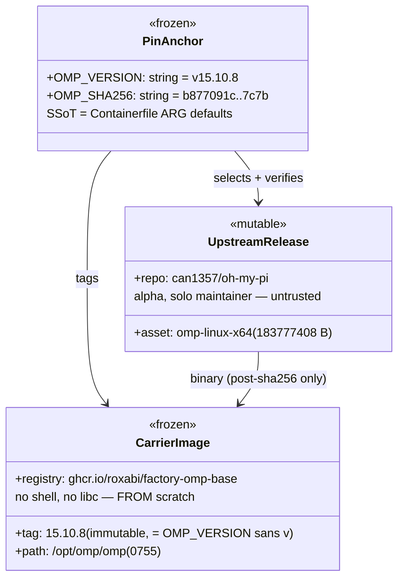
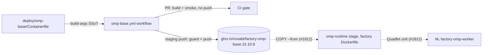

## Context

Promoted from [frame](../frames/1810-factory-omp-base-frame.mdx) (approved
2026-06-10). Spike #1807 proved the `omp_rpc` runtime end-to-end; #1811 landed
the LiteLLM provider override (`deploy/omp/models.yml`). This issue ships the
binary-carrier image that unblocks the OmpWorker (#1812).

Image home decision (frame): dedicated image in roxabi-factory, built **only on
pin bump**, never on the hot `:staging` publish path.

## Goal

Publish `ghcr.io/roxabi/factory-omp-base:<omp-version>` — an immutable,
digest-verified carrier of the pinned `omp-linux-x64` binary — with a
single-PR bump procedure gated by CI verification.

## Users

- **#1812 OmpWorker image build:** `COPY --from=ghcr.io/roxabi/factory-omp-base:15.10.8 /opt/omp/omp /usr/local/bin/omp`
  into its runtime stage (glibc-based, e.g. `base-svc` lineage).
- **Operator bumping the pin:** edits two ARG lines, opens a PR; CI proves the
  new binary downloads, matches its digest, and executes before merge.

## Expected Behavior

1. `deploy/omp-base/Containerfile` holds the pin as build-arg defaults
   (**single SSoT**):
   `ARG OMP_VERSION=v15.10.8` and
   `ARG OMP_SHA256=b877091c91ebdc8c8d907c4b62681895cd3ae049815858aea7b69ac1d53b7c7b`.
   Three named stages:
   - **download stage** (pinned `debian:12-slim` + ca-certificates/curl):
     fetch `https://github.com/can1357/oh-my-pi/releases/download/${OMP_VERSION}/omp-linux-x64`
     (asset verified live 2026-06-10: 183,777,408 B) with
     `curl -fL --retry 3 --retry-delay 5`, then
     `echo "${OMP_SHA256}  omp-linux-x64" | sha256sum -c -` — mismatch fails
     the build (guards upstream retag).
   - **`carrier` stage** (`FROM scratch`, the published target): `COPY` the
     verified binary to `/opt/omp/omp` (mode 0755). No shell, no build tools.
     The binary is glibc-linked (verified `ldd`: libc/libm/libpthread/libdl
     only) → it **cannot execute inside the carrier** (no `ld-linux`);
     consumers must be glibc-based. ADR-053 carve-out: no `USER` directive —
     a scratch carrier never executes, there is no user context.
   - **`smoke` stage** (`FROM debian:12-slim AS smoke`):
     `COPY --from=carrier /opt/omp/omp /usr/local/bin/omp` — intra-build
     stage reference, no daemon round-trip. CI runs this stage's image and
     asserts `omp --version` == `omp/${OMP_VERSION#v}` (live output verified:
     `omp/15.10.8`).
2. `.github/workflows/omp-base.yml` — standalone workflow (ml-base
   `build-base.yml` **structure** — standalone, version-pinned, not the
   reusable `publish-container.yml@v1` which derives tags from
   staging/release-please; action pinning follows `publish.yml` convention —
   full commit SHA + `# vX` comment). Two jobs:
   - **`build-smoke`** (PR + staging-push, `paths: deploy/omp-base/**`):
     parse pin from Containerfile ARG defaults with **strict validation**
     (`OMP_VERSION` must match `^v[0-9]+\.[0-9]+\.[0-9]+$`, `OMP_SHA256`
     must match `^[0-9a-f]{64}$`, else fail loud — kills the
     silent-empty-tag failure mode), buildx `--target smoke --load`, run
     smoke container, assert version. Pushes nothing. GHA layer cache
     (`type=gha`) so the 183 MB download layer is reused across runs.
   - **`publish`** (staging-push only, `needs: build-smoke`): re-build
     `--target carrier` (cheap — layers cached from build-smoke), then
     **immutability guard** — after GHCR login, `docker manifest inspect
     ghcr.io/roxabi/factory-omp-base:<ver>`; exit 0 (tag exists) →
     `::warning::` annotation + skip push + job exits 0 (a content change
     requires a version bump; identical re-runs stay green); exit 1 (absent)
     → push `:<ver>` (leading `v` stripped, matching factory tag
     convention). No `:latest`, no floating tags — consumers pin explicitly.
3. **Bump procedure** (`deploy/omp-base/README.md`): edit the two ARGs → PR →
   CI verifies download/digest/smoke → merge to staging publishes the new tag
   → #1812 bumps its `COPY --from` reference in a follow-up commit. Deep
   omp_rpc integration on bump (e2e SHA-pin guard) is **#1812 scope** — its CI
   tests exercise the runtime; this issue's gate is
   download-integrity + executes + version-match.
4. Nothing in `deploy/quadlet.toml`, `deploy/quadlet/`, or secrets changes —
   `secrets_drift`, `volumes_table`, `architecture_snapshot` gates are
   untouched by design (frame: out of scope, #1812).

## Data Model & Consumers

| Consumer | Consumes | When | Status |
|---|---|---|---|
| CI smoke test | `/opt/omp/omp` → `--version` | every PR touching `deploy/omp-base/**` | this issue |
| GHCR publish job | built image + pin tag | staging push on same paths | this issue |
| #1812 omp-runtime stage | `COPY --from=…:15.10.8 /opt/omp/omp` | factory image build | future (dashed) |
| #1812 e2e SHA-pin guard | pin ARGs + omp_rpc session | bump PRs | future (dashed) |

## Breadboard

| ID | Affordance | Handler / mechanism | Data |
|---|---|---|---|
| N1 | Containerfile download stage | `curl -fL --retry 3 --retry-delay 5` + `sha256sum -c` | OMP_VERSION, OMP_SHA256 args |
| N2 | Containerfile `carrier` + `smoke` stages | `FROM scratch` + `COPY --chmod=0755` · `debian:12-slim AS smoke` w/ `COPY --from=carrier` | `/opt/omp/omp` |
| N3 | Workflow `build-smoke` job | validated ARG parse → buildx `--target smoke --load` → run + version assert | exit 0 ⟺ digest+version match |
| N4 | Workflow `publish` job | `needs: build-smoke` → `--target carrier` → `docker manifest inspect` guard → push | tag `:<ver>` |
| N5 | README bump runbook | 2-ARG edit → PR → merge | pin lifecycle |
| N6 | deploy/CLAUDE.md scope line | registry update | doc network |

Wiring: N1→N2 (verified binary only) · N1/N2→N3 (PR gate) · N3→N4 (publish
only after same-workflow build succeeds) · N5 documents N1+N4 · N6 indexes N5.

## Slices

| # | Slice | Demo | Contains |
|---|---|---|---|
| 1 | Carrier image builds + verifies locally | `podman build deploy/omp-base` succeeds; corrupting OMP_SHA256 fails the build | N1, N2 |
| 2 | CI gate + publish + docs | PR run green (build+smoke, no push); staging merge publishes `:15.10.8` to GHCR; README + CLAUDE.md landed | N3, N4, N5, N6 |

## Success Criteria

- [ ] `podman build --target carrier deploy/omp-base` succeeds; the same build with a corrupted `OMP_SHA256` build-arg **fails** at the verify step
- [ ] `carrier` target is `FROM scratch` containing exactly `/opt/omp/omp` (mode 0755) — no shell, no package manager
- [ ] PR touching `deploy/omp-base/**` runs `build-smoke`: validated ARG parse + `--target smoke --load` + assert `omp --version` == `omp/<OMP_VERSION sans v>`; job pushes nothing
- [ ] Merge to staging runs `publish`: tag absent → push `ghcr.io/roxabi/factory-omp-base:15.10.8`; tag present → skip push, emit `::warning::` annotation, **exit 0** (immutability guard; identical re-runs stay green)
- [ ] Pin SSoT is the two Containerfile ARG defaults; workflow parse validates `^v[0-9]+\.[0-9]+\.[0-9]+$` / `^[0-9a-f]{64}$` and fails loud on mismatch; `grep -c 'b877091c' .github/workflows/omp-base.yml` == 0 (no literal pin copy in the workflow)
- [ ] `deploy/omp-base/README.md` documents the bump procedure + #1812 consumption pattern (`COPY --from`); `deploy/CLAUDE.md` scope line updated
- [ ] `git diff` touches no `deploy/quadlet*` path and no secrets surface — `secrets_drift` / `volumes_table` gates pass unchanged
