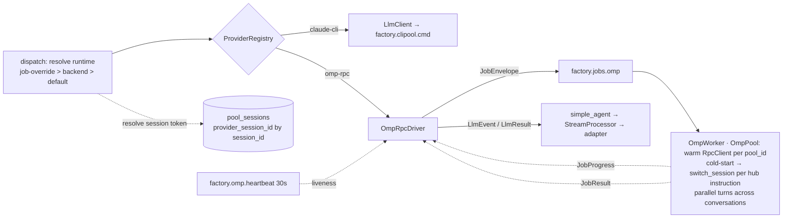

## Context

Source: [analysis](../analyses/1813-runtime-selection-analysis.mdx) (#1813), itself from the
#1807 spike (GREEN, ratified 2026-06-10) and #1812 (OmpWorker, CLOSED). The unification seam
already exists — `core/ports/llm.py:46` `LlmProvider` Protocol + `ModelConfig.backend`
(`omp-rpc` already a valid value, `llm_types.py:43`) + `ProviderRegistry` + the hub-side
`roxabi_nats.NatsDriverBase`. omp is implemented as a *worker* but nothing routes a live turn
to it. This spec wires omp in as a selectable runtime behind the existing seam.

Spike [#1813](../spikes/1813/RESULT.md) (2026-06-13, **4/4 PASS** on the live `factory-omp`
binary) settled the three open behaviours empirically: omp **continues** a session (same client),
**resumes** one from a fresh process via `switch_session(session_file)` (preserving `session_id`),
and runs **two `RpcClient`s in parallel** with no cross-session bleed — i.e. omp can mirror
CliPool's per-conversation pool. The omp session "token" is the `.jsonl` `session_file` path (the
omp analogue of clipool's `cli_session_id`).

## Goal

Make the agent runtime a **per-agent and per-job** choice between clipool (`claude -p`,
streaming) and omp (`omp_rpc`, NATS job) — coexisting, omp streaming + remembering across
turns, default gated by a parity check — by adding `OmpRpcDriver(NatsDriverBase)` behind the
`LlmProvider` Protocol. The omp worker hosts an **`OmpPool` of warm `RpcClient`s keyed by
conversation** (CliPool parity): distinct conversations execute in **parallel** (spike #1813 P3
confirmed); clipool unchanged.

## Users

- **Primary:** factory operators (mickael) — pin/flip an agent's runtime (`backend` in
  `config.db`) or override per-job, and have the hub route accordingly.
- **Secondary:** hub turn-execution path (provider selection), `adapters/omp` (session +
  payload), `roxabi-contracts` (payload schema).

## Expected Behavior

1. An agent is configured `backend="omp-rpc"` (or left default `claude-cli`). A turn arrives.
2. The **hub** resolves the runtime at **turn dispatch** — **per-job override > per-agent `backend`
   (config.db, hub-read) > system default (`claude-cli`)** — and picks the matching `LlmProvider`
   from `ProviderRegistry`. Selection is **100 % hub-side**: the worker never reads `config.db` nor
   branches on `backend` (dumb executor, parity with the clipool worker — confirmed: no `config.db`
   volume on `factory-omp`/`factory-clipool`). Today the provider is resolved once at agent bootstrap
   (`bootstrap/factory/agent_factory.py:156`); this spec **moves resolution to turn dispatch** so a
   per-job override can override the agent default.
3. For omp: the `OmpRpcDriver` **mints a `job_id`**, publishes a `JobEnvelope` (prompt +
   session-resume ref + `model_cfg` + `system_prompt`) to `factory.jobs.omp`, and subscribes to
   the deterministic per-job subjects `factory.job.<job_id>.{progress,result}`.
4. The omp worker (purely reactive — never mints jobs) hosts an **`OmpPool`**: a set of warm
   `RpcClient`s **keyed by conversation** (`pool_id`), one omp subprocess each — the CliPool mirror.
   It routes the job to that conversation's warm client; on a **cold start** (new conversation or
   evicted client) it `switch_session(session_file)` when the hub sent a resume token, else
   `new_session()`. The session the worker resumes is the one the **hub told it to**: the hub
   resolved the conversation's `provider_session_id` from `pool_sessions` keyed by the stable Lyra
   `session_id` — exactly as clipool resolves `cli_session_id`. The worker is **stateless w.r.t.
   which session** (routing is a hub decision, mirroring clipool's `resume_session_id`); a warm
   client keeps its session in-process, so steady-state turns skip resume entirely. Distinct
   conversations run their `prompt_and_wait` **in parallel** (spike P3). The client emits
   `JobProgress` … terminal `JobResult`.
5. The driver maps `JobProgress`→`LlmEvent` (streaming) and `JobResult`→`LlmResult`/terminal
   `ResultLlmEvent`, tears down the subscription, and returns through the same `simple_agent`
   path clipool uses — tokens render live.
6. Liveness is **heartbeat-based** (`factory.omp.heartbeat`, 30s) — a long turn is never cut on
   elapsed time; only a silent/dead worker yields `LlmUnavailableError`.
7. clipool agents (`backend="claude-cli"`) behave exactly as before.

## Data Model & Consumers

```mermaid
classDiagram
  class ModelConfig {
    +backend: str  // "claude-cli"|"nats"|"omp-rpc"  (hub-read runtime selector)
    +model: str
    +streaming: bool
    +effort: str|None
  }
  class JobEnvelope {
    +job_id: str  // HUB-minted
    +payload: dict  // prompt + pool_id (routing key) + provider_session_id (resume token) + model + system_prompt + streaming (optional, wire-compat); NOT backend — selection stays hub-side
    +reply_to: str|None  // unused by omp worker
  }
  class OmpPool {
    // worker-side, adapters/omp — CliPool mirror
    +clients: dict  // pool_id → warm RpcClient (one omp subprocess each)
    +acquire(pool_id, session_file) RpcClient  // warm hit, else cold-start + switch_session/new_session
    +evict(pool_id)  // LRU beyond cap
  }
  class JobProgress {
    +job_id: str
    +event_type: str
    +partial_text: str|None
    +tool_name: str|None
    +tool_id: str|None
  }
  class JobResult {
    +job_id: str
    +status: str  // success|error
    +data: dict|None  // {"result": ...}
    +error: WorkerError|None
  }
  class LlmProvider {
    <<Protocol>>
    +complete(pool_id, text, model_cfg, system_prompt, *, messages) LlmResult
    +is_alive(pool_id) bool
    +stream(pool_id, ...) AsyncIterator~LlmEvent~
  }
  class OmpRpcDriver {
    // extends NatsDriverBase, implements LlmProvider
    +complete(...) LlmResult
    +stream(...) AsyncIterator~LlmEvent~
  }
  LlmProvider <|.. OmpRpcDriver
  OmpRpcDriver ..> JobEnvelope : publishes
  OmpRpcDriver ..> JobProgress : consumes→LlmEvent
  OmpRpcDriver ..> JobResult : consumes→LlmResult
  JobEnvelope ..> OmpPool : routed by pool_id (worker-side)
  ModelConfig --> OmpRpcDriver : backend selects
```



| Consumer | Fields consumed | When | Status |
|----------|-----------------|------|--------|
| dispatch (core/hub) | `ModelConfig.backend` (config.db, hub-read) + per-job override | at turn dispatch | this issue |
| session resolve (core/hub) | `pool_sessions.provider_session_id` keyed by `session_id` (mirrors clipool `cli_session_id`) | per omp turn | this issue |
| `OmpRpcDriver` | `JobProgress.{partial_text,tool_name,tool_id}`, `JobResult.{status,data,error}` | per omp turn | this issue |
| `OmpPool` (worker, adapters/omp) | `JobEnvelope.payload.{pool_id, provider_session_id}` — route to warm client / cold-start resume | per omp turn | this issue |
| `OmpWorker`/`_rpc_bridge` | `JobEnvelope.payload.{prompt, pool_id, provider_session_id, model, system_prompt, streaming}` — **not** `backend` | per omp turn | this issue |
| liveness | `factory.omp.heartbeat` freshness | continuous | this issue |
| `JobProgress.thinking`/tool-delta/tool-result | — | — | future (no omp source) |

## Breadboard

| ID | Affordance | Handler | Data |
|----|-----------|---------|------|
| N1 | `OmpRpcDriver(NatsDriverBase)` `complete()` | mint job_id, publish `JobEnvelope`, await `JobResult`, → `LlmResult` | `JobEnvelope`, `JobResult` |
| N2 | `OmpRpcDriver.stream()` | subscribe `…progress`, map `JobProgress`→`LlmEvent`, terminate on `JobResult`→`ResultLlmEvent` | `JobProgress` |
| N3 | `ProviderRegistry.register("omp-rpc", …)` | bootstrap wiring | registry |
| N4 | `JobEnvelope.payload` schema enrichment | optional fields + default-mint on consumer; carries only what the worker needs (prompt, `pool_id` routing key, `provider_session_id` resume token, model, system_prompt, streaming) — **not** `backend` (selection stays hub-side) | contracts |
| N5 | native-session resume (**hub-driven, per-conversation**) | hub resolves omp `provider_session_id` (the `.jsonl` `session_file` path, spike-confirmed) from `pool_sessions` keyed by the stable `session_id` (mirrors clipool `cli_session_id`), sends it on the `JobEnvelope` (a `resume_session_id` analogue); on **cold-start** the worker calls `switch_session(session_file)` (resume) / `new_session()` **per the hub instruction**; a warm pool client keeps its session in-process — stateless worker, no cross-conversation bleed | `pool_sessions`/TurnStore + `provider_session_id` |
| N6 | per-job override resolution (**turn-dispatch**) | hub resolves provider **per turn** (move from bootstrap `agent_factory.py:156`): job-override > `backend` > default; worker never reads `config.db`/`backend` | turn metadata |
| N7 | heartbeat-liveness (no turn cap) | `NatsDriverBase` freshness; `LlmUnavailableError` on dead worker | `factory.omp.heartbeat` |
| N8 | parity runbook + flip gate | golden-prompt omp vs clipool; default stays claude-cli | `docs/` |
| N9 | hub NATS grants (result) | hub identity gains subscribe `factory.job.*.result` (+ regen 4 ACL artifacts + hand-mirror fixture) — **Slice 1**; the `factory.job.*.progress` grant is **deferred to Slice 4** with N2 (no progress consumer exists until `stream()` lands — granting earlier = ACL without a callsite) | `deploy/nats/acl-matrix.json` |
| N10 | `OmpPool` (worker, adapters/omp) — **CliPool mirror** | warm `RpcClient` per `pool_id` (one omp subprocess each); `acquire(pool_id, session_file)` → warm hit or cold-start (`switch_session`/`new_session`); LRU evict beyond cap; distinct conversations run `prompt_and_wait` in **parallel** (spike P3); replaces the current single shared `no_session=True` client in `_rpc_bridge.py` | `OmpPool`, `RpcClient` |

## Slices

| # | Slice | Affordances | Demo |
|---|-------|-------------|------|
| 1 | omp round-trip (non-streaming) + hub grants | N1, N3, N4, N7, N9 | `backend=omp-rpc` agent completes a turn via omp on M₁ (auth on); result rendered |
| 2 | `OmpPool` + native-session memory | N5, N10 | omp agent recalls a prior-turn fact via its warm pool client; a 2nd conversation (distinct `session_id`) does NOT see the 1st's history (per-`pool_id` isolation) |
| 3 | `OmpPool` concurrency (CliPool parity) | N10 | two conversations execute **in parallel** on one replica — both complete, no cross-session bleed, wall-clock < serialized sum |
| 4 | streaming bridge + hub `…progress` grant | N2 | omp turn streams tokens live (parity with clipool); hub gains `factory.job.*.progress` subscribe + ACL-artifact regen |
| 5 | per-job override | N6 | same agent: turn A→omp, turn B→clipool via per-job hint |
| 6 | parity runbook + flip gate | N8 | runbook runs golden prompts on both; documents flip procedure |

## Success Criteria

- [ ] An agent with `backend="omp-rpc"` has its turn executed by omp: a `JobEnvelope` lands on `factory.jobs.omp`, the `JobResult` is consumed, and the reply is rendered to the originating adapter.
- [ ] `ProviderRegistry` resolves `"omp-rpc"` → `OmpRpcDriver` (no `KeyError`); `claude-cli`/`nats` unchanged.
- [ ] `OmpRpcDriver` extends `roxabi_nats.NatsDriverBase` and satisfies the base `LlmProvider` (`complete`, `is_alive`); `stream` (`StreamingLlmProvider`) lands in Slice 4.
- [ ] `JobEnvelope.payload` carries `prompt` + session-ref + `model_cfg` + `system_prompt` as **optional** fields; an old `{"prompt": str}`-only envelope still validates (wire-compat).
- [ ] The `job_id` is **hub-minted**; the omp worker never publishes to `factory.jobs.omp` (only to `factory.job.<id>.{progress,result}`) — verified by test.
- [ ] An omp-backed agent **remembers context across turns** via a **hub-resolved** omp session token (`provider_session_id` = the `.jsonl` `session_file` path, the omp analogue of clipool `cli_session_id`), persisted in `pool_sessions` keyed by the conversation `session_id` — not hub-threaded `messages[]`. Cold-start resume is `switch_session(session_file)` (spike-confirmed to preserve `session_id`).
- [ ] **No cross-conversation bleed**: two conversations (distinct `session_id`) handled by the same omp worker replica do not see each other's history — verified by test. Mechanism: `OmpPool` keys a warm client per `pool_id`, and the **hub** sends each turn the correct conversation's session token; the worker resumes/routes exactly that (stateless), mirroring clipool's hub-driven `resume_session_id`.
- [ ] **`OmpPool` concurrency (CliPool parity)**: two conversations dispatched to one omp replica execute their `prompt_and_wait` **in parallel** (distinct warm `RpcClient`s / omp subprocesses) — both return correct results, no bleed, observed wall-clock < the serialized sum — verified by test (spike P3 proved the mechanism).
- [ ] **Worker stays a dumb executor**: the omp worker neither reads `config.db` nor branches on `ModelConfig.backend`; runtime + session are resolved **hub-side** and passed on the wire (parity with the clipool worker; no `config.db` volume mounted into `factory-omp`) — verified by test/inspection.
- [ ] omp turns **stream**: `JobProgress.partial_text`→`TextLlmEvent`, `tool_name`/`tool_id`→`ToolUseLlmEvent`, terminal `JobResult`→`ResultLlmEvent`; honors `model_cfg.streaming`.
- [ ] The `JobProgress`→`LlmEvent` mapping is documented; unmapped variants (`thinking`, tool-delta, tool-result) are dropped **with an explicit `log.warning` at the driver boundary** (not silently).
- [ ] **No fixed per-turn timeout**: a long omp turn emitting heartbeats/progress is not cut; a silent worker (heartbeat past TTL) yields `LlmUnavailableError`/error-`LlmResult`.
- [ ] **Per-job override** works: runtime is selectable per turn (resolved at **turn dispatch**, not agent bootstrap), overriding the agent default; precedence = job-override > agent `backend` > system default (`claude-cli`).
- [ ] **Observability**: each turn records which runtime executed it (`claude-cli` vs `omp-rpc`) in the turn log / structured turn metadata, visible to an operator without inspecting NATS internals.
- [ ] **Hub NATS grant — result (Slice 1)**: hub identity has a subscribe grant for `factory.job.*.result`; the 4 generated ACL artifacts are regenerated and the hand-maintained fixture mirrors the diff (`test_v4_render_set_equals_v3_render` green). The `factory.job.*.progress` grant is **deferred to Slice 4** (streaming, N2): V1's `complete()`-only path has no progress consumer, so granting it now would be an ACL without a callsite.
- [ ] Driver subscriptions are torn down on completion/error/timeout (no orphan subscriptions).
- [ ] clipool (`backend="claude-cli"`) streams unchanged — no regression (existing clipool tests green).
- [ ] **Parity runbook** (`docs/`) exists and passes: for each golden prompt, omp returns a **non-error `LlmResult` with non-empty `result`** (semantic equivalence NOT required); it is a **manual ops check** (not CI-gated — needs live proxy + binary); default stays `claude-cli`, flip is per-agent until the runbook passes.

## Known constraints (accepted)

- **Concurrency via `OmpPool` (CliPool parity).** One replica hosts N warm `RpcClient`
  subprocesses keyed by `pool_id`; distinct conversations execute in parallel (spike P3). Bounded
  by pool size × per-subprocess footprint (each omp process carries its own RAM/CPU) — LRU evict
  beyond the cap, cold-start resumes via `switch_session(session_file)`. **Within a single
  conversation** turns are still serial (one `prompt_and_wait` per warm client). Scale active
  conversations beyond the cap by adding replicas; the parity runbook (N8) sets SLA vs clipool.
  Pool cap is a config knob (mirror CliPool's sizing), not hardcoded.
- **Session model is per-backend (not yet a shared primitive).** Both backends now follow the same
  *shape* — a hub-resolved opaque token (`cli_session_id` / `provider_session_id`) persisted in
  `pool_sessions` keyed by `session_id` — but each resolves/applies it through its own driver. Below
  the axial three-strikes threshold for 2 backends — **file a follow-up to extract a `SessionBridge`
  primitive before a 3rd runtime backend lands** (axial-adr-review). Tracked, not built here.
- **Latent wire-coupling in clipool (not replicated).** clipool serializes the whole `ModelConfig`
  (incl. `backend`) into its `CliCmdPayload` as dead data the worker never reads. omp does **not**
  replicate this: the `JobEnvelope` payload carries only what the worker needs (prompt, session
  token, model, system_prompt, streaming). Hardening clipool's payload is out of scope here.

## [NEEDS CLARIFICATION]

1. **(plan-entry blocker, slice 5) Per-job override transport (N6):** does the per-turn runtime
   hint ride on **inbound message metadata** (resolved in a hub middleware) or the **turn
   envelope**? Proposed: message metadata → resolved in dispatch before provider selection.
   Determines whether the change touches the inbound stage or only hub dispatch (axial scope).
2. **(plan-entry blocker, slice 2) Session-file durability:** the `provider_session_id` token (the
   `.jsonl` `session_file` path) persists in `pool_sessions` (durable, TurnWriter), but omp can only
   *resume* it if omp's own session files (`PI_CODING_AGENT_DIR`/`session_dir`, currently ephemeral
   tmpfs) survive a worker restart — **spike-confirmed**: resume works within a run but the files
   vanish on restart, exactly as clipool's `--resume` relies on Claude CLI's session store persisting
   in the clipool container. Decide: (a) accept ephemeral (token present but un-resumable
   post-restart → document the regression), or (b) persist the omp `session_dir` on a named volume
   for clipool-parity. Proposed: (b). Confirm in /plan.
3. **`result_data` shape:** `_rpc_bridge.py:289` `getattr(event,"result",None)` may be
   `str | dict | None` (omp_rpc external API) — driver must handle all three to build
   `LlmResult.result: str`. Confirm shape against the pinned omp binary in /plan.

> **Resolved by spike #1813 (was χ#2):** omp resume-by-token API — the omp session "token" is the
> `.jsonl` `session_file` path; cold-start resume is `switch_session(session_file)`, which preserves
> `session_id` (verified, fresh process). Stored as `provider_session_id` in `pool_sessions` keyed by
> `session_id`. No longer a blocker.
