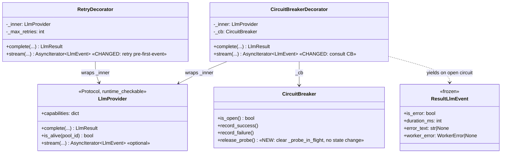
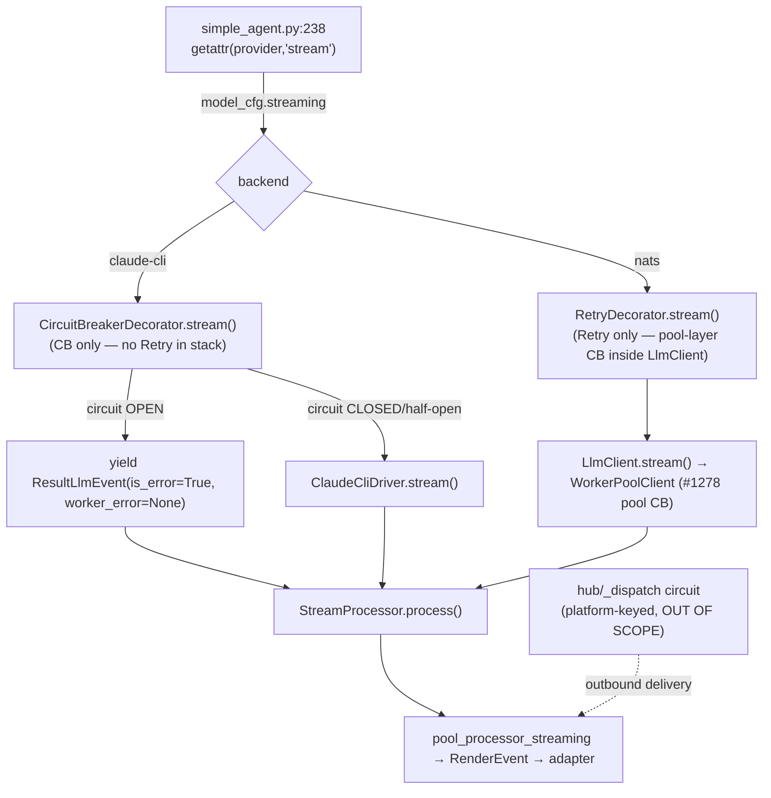

## Context

Source: `artifacts/frames/1819-stream-protocol-cb-retry-frame.mdx` (analysis skipped — F-lite).

The **LLM-provider** circuit breaker (`CircuitBreakerDecorator`, `llm/decorators.py`, keyed by
backend `"claude-cli"`) guards `complete()` but **deliberately passes through on `stream()`**
(`decorators.py:147-160` — `"circuit check applies to complete() only"`). `RetryDecorator.stream()`
likewise passes through (`decorators.py:83-96` — `"no retry — stream is live data"`).

Two premise corrections from recheck (verified against source):

1. `stream()` is **already in the `LlmProvider` Protocol** (`core/ports/llm.py:67-75`) — declared
   *optional*, consumed via `getattr(self._provider, "stream", None)` in `simple_agent.py:238`.
   The issue's "hors du Protocol" is stale. `llm/CLAUDE.md` still says *"do not add it to the
   Protocol until all drivers implement it"* — a contradiction to reconcile.
2. The gap is **not** "all streaming is unprotected." Two **independent** breakers exist:
   - **Hub/platform circuit** (`hub/outbound/_dispatch.py:133-141`, keyed by *platform*) — already
     records success/failure on streaming **outbound delivery** (adapter health). **Out of scope.**
   - **NATS pool circuit** (`WorkerPoolClient`, #1278) — the `nats` backend's `stream()` already
     gets pool-layer CB. **Out of scope.**
   The genuinely unprotected case is the **in-process `ClaudeCliDriver`** (and `cli_nats_driver`)
   streaming path: `CircuitBreakerDecorator(ClaudeCliDriver)` with `stream()` passing through →
   LLM-backend health never trips a breaker on streaming turns.

## Goal

Give the streaming path **LLM-provider** circuit-breaker parity with `complete()`, plus
connect-time retry, without breaking the live-stream contract (no mid-stream replay).

## Users

- **Primary:** end users on streaming turns when `ClaudeCliDriver` is unhealthy — today they get
  doomed CLI spawns / hangs instead of a fast "service unavailable".
- **Secondary:** operators (gain a circuit-open signal on the streaming path); #1814 HITL→auto
  flip, which is gated on this resilience parity.

## Expected Behavior

`CircuitBreakerDecorator.stream(...)` (async generator):

1. **Open circuit** (`cb.is_open()` is `True`) → do **not** call inner. Yield a single terminal
   `ResultLlmEvent(is_error=True, duration_ms=0, error_text="Circuit '<name>' is open. Retry in Ns.",
   worker_error=None)` and return. `worker_error=None` is a **deliberate exception** to
   `ResultLlmEvent`'s "always co-populated on failure" docstring — a CB-synthesized event has no
   backend worker context; `StreamProcessor` handles `worker_error=None` by sanitizing `error_text`
   (`stream_processor.py:237-238`). Mirrors `complete()`'s `LlmResult(error=…, retryable=False, user_message=…)`.
2. **Closed/half-open** → iterate `inner.stream(...)`, forwarding every event:
   - Terminal `ResultLlmEvent` with `is_error=False` → `cb.record_success()` after the stream ends.
   - Terminal `ResultLlmEvent` with `is_error=True` → `cb.record_failure()`.
   - Exception (other than cancellation, below) raised mid-iteration → `cb.record_failure()` then
     re-raise (so upstream still sees it).
   - Stream ends with **no** terminal `ResultLlmEvent` (truncation) → treat as failure
     (`cb.record_failure()`), consistent with `stream_processor.py:270` "ended without ResultLlmEvent".
   - **`GeneratorExit` / `asyncio.CancelledError`** (consumer aborts, e.g. `aclose()` or task cancel)
     → **not** a backend failure: do **not** call `record_failure()`. BUT if this turn claimed the
     half-open probe slot, the slot must be released, else `_probe_in_flight` stays `True` forever and
     the circuit is permanently stuck in pseudo-OPEN (HALF_OPEN never re-probes — there is no timer
     re-check in HALF_OPEN). Release via a new `cb.release_probe()` (clears `_probe_in_flight`, no
     state change, idempotent — no-op when CLOSED) called in a `finally`/cancellation path when no
     terminal outcome was recorded; then re-raise.

`RetryDecorator.stream(...)` (async generator) — **`nats` backend only** (`claude-cli` is wrapped by
CB only, no Retry; see `providers.py:43-66`):

3. **Retry only before the first event is yielded** (connect/first-token failure). If starting the
   inner stream raises, or it yields a terminal error event *before any non-terminal event*, retry
   up to `max_retries` with `backoff_base * 2^k`. **Once any non-terminal event has been forwarded,
   never retry** — the stream is live data and cannot be replayed. `ResultLlmEvent` has **no
   `retryable` field** (unlike `LlmResult`), so every pre-first-event terminal error is treated as
   retryable up to `max_retries` — no early non-retryable abort to implement.

Doc reconciliation: update **`llm/CLAUDE.md` only** — remove the stale line *"Do not add it to the
Protocol until all drivers implement it."* and state stream() is an **optional** Protocol member
(gated by `getattr`). The `core/ports/llm.py:61-66` comment **already** describes the optional/
duck-typed nature correctly — verify, **no change expected** there (avoid a spurious diff).

## Data Model & Consumers

> The two decorators are **never stacked** on one call: `providers.py:43-66` wires
> `claude-cli` = `CircuitBreakerDecorator(ClaudeCliDriver)` (CB only) and `nats` =
> `RetryDecorator(LlmClient)` (Retry only; CB lives in the pool layer). Slice 1 changes the
> `claude-cli` path; Slice 2 changes the `nats` path.

| Consumer | Fields consumed | When | Status |
|---|---|---|---|
| `StreamProcessor.process()` | `ResultLlmEvent.is_error / error_text / worker_error` | end of every stream | this issue (error contract) |
| `CircuitBreaker` (backend `claude-cli`) | success/failure signal | per streaming turn | this issue |
| Hub/platform `CircuitBreaker` | outbound-delivery success/failure | per streaming turn | already done (#SC-08/09/10) — out of scope |
| `WorkerPoolClient` pool CB (`nats`) | request routing health | per request | already done (#1278) — out of scope |

## Breadboard

| ID | Affordance (place) | Handler | Data |
|----|--------------------|---------|------|
| N1 | `CircuitBreakerDecorator.stream()` open-circuit branch | new `is_open()` guard | yields `ResultLlmEvent(is_error=True, error_text, worker_error=None)` |
| N2 | `CircuitBreakerDecorator.stream()` success/failure recording | wrap `async for` + terminal inspection + cancellation path | `cb.record_success()` / `cb.record_failure()` / `cb.release_probe()` on cancel |
| N2b | `CircuitBreaker.release_probe()` | new method in `circuit_breaker.py` | clears `_probe_in_flight`, no state change, idempotent |
| N3 | `RetryDecorator.stream()` pre-first-event retry (**nats backend only**) | attempt loop guarding the first yield | `max_retries`, `backoff_base`; abort retry after first event |
| N4 | `llm/CLAUDE.md` (only) | doc edit | remove "do not add to the Protocol" line; state stream() = optional Protocol member. `core/ports/llm.py:61-66` = verify-only, no change |
| N5 | `tests/llm/test_decorators.py` | new async tests | open-circuit, record-failure, record-success, no-failure-on-cancel + probe-release, no-mid-stream-retry, retry-pre-first-event |

Wiring: N1+N2+N2b are the core CB-on-stream change (claude-cli path); N3 is retry-on-stream (nats
path); N4 reconciles docs; N5 proves all of it. No change to `providers.py` wiring (decorators
already wrap `stream()` — only their bodies + one new CB method change). No change to
`simple_agent.py` (getattr gate unchanged).

## Slices

| # | Slice | Affordances | Independently demo-able |
|---|-------|-------------|-------------------------|
| 1 | **CB on stream** — open-circuit fast-fail + record success/failure + probe-release on cancel | N1, N2, N2b, N5 (CB tests) | Yes — unit test: open circuit → terminal error event, no inner call; clean stream → record_success; error/exception → record_failure; cancel mid-probe → no record_failure + probe released |
| 2 | **Connect-time retry on stream** (nats) — retry before first event only | N3, N5 (retry tests) | Yes — unit test: pre-first-event failure retries; post-first-event failure does not |
| 3 | **Doc reconciliation** — stream() optional-Protocol status | N4 | Yes — `llm/CLAUDE.md` stale line removed; `check_doc_drift.py` green |

## Success Criteria

- [ ] `CircuitBreakerDecorator.stream()` yields a single terminal `ResultLlmEvent(is_error=True, worker_error=None)` with the circuit name/retry-after when `cb.is_open()` is `True`, and does **not** call `inner.stream()`.
- [ ] `CircuitBreakerDecorator.stream()` calls `cb.record_success()` exactly once when the inner stream completes with a terminal `ResultLlmEvent(is_error=False)`.
- [ ] `CircuitBreakerDecorator.stream()` calls `cb.record_failure()` when the inner stream yields a terminal `ResultLlmEvent(is_error=True)`, raises a non-cancellation exception mid-stream, or ends with no terminal event.
- [ ] A non-cancellation exception raised by `inner.stream()` is re-raised after `record_failure()` (not swallowed).
- [ ] On `GeneratorExit` / `asyncio.CancelledError`, `CircuitBreakerDecorator.stream()` does **not** call `cb.record_failure()`, calls `cb.release_probe()` (when no terminal outcome was recorded), and propagates the exception.
- [ ] `CircuitBreaker.release_probe()` clears `_probe_in_flight` with no state-machine transition and is a no-op when CLOSED (idempotent); a cancelled half-open probe leaves the circuit able to accept a new probe (not stuck in pseudo-OPEN).
- [ ] `RetryDecorator.stream()` retries (up to `max_retries`, exponential backoff) when the inner stream fails **before** yielding any non-terminal event.
- [ ] `RetryDecorator.stream()` does **not** retry once any non-terminal event has been forwarded (live-stream contract); all events are forwarded in order.
- [ ] `llm/CLAUDE.md` no longer contains the string "do not add it to the Protocol until all drivers implement it" and states stream() is an optional Protocol member; `core/ports/llm.py:61-66` is unchanged.
- [ ] New tests in `tests/llm/test_decorators.py` cover every criterion above and pass.
- [ ] `uv run ruff check .`, `uv run pyright`, and `uv run pytest tests/llm/test_decorators.py tests/core/test_circuit_breaker.py` are green; `tools/check_doc_drift.py` passes.
- [ ] No change to the `nats` pool-layer CB or the hub/platform circuit (out of scope confirmed by diff).

## Edge Cases

| Edge | Handling |
|------|----------|
| Circuit open on a NATS backend (`nats`) | Unaffected — `nats` uses `RetryDecorator` only; pool-layer CB already guards it. CB-decorator change touches only `claude-cli` wiring. |
| Half-open probe via streaming turn | `is_open()` grants the probe slot (existing semantics); clean stream → `record_success()` closes circuit; failure → `record_failure()` re-opens. Same as `complete()`. |
| Stream raises `GeneratorExit` / `asyncio.CancelledError` (consumer aborts) | Not a backend failure → do **not** `record_failure()`. If this turn claimed the half-open probe slot, call `cb.release_probe()` so `_probe_in_flight` doesn't stay `True` and stick the circuit in pseudo-OPEN (HALF_OPEN has no timer re-check). Then propagate. Covered by SC + a dedicated test (N5). |
| Inner provider has no `stream()` | Not reachable through decorators (decorators define `stream()`); the `getattr` gate in `simple_agent.py` handles provider-level absence. |
| Double-CB on `cli_nats_driver` path | Pre-existing behavior for `complete()` (CB decorator wraps an LlmClient that also has pool CB); `stream()` mirrors `complete()` — not introduced or changed here. |
