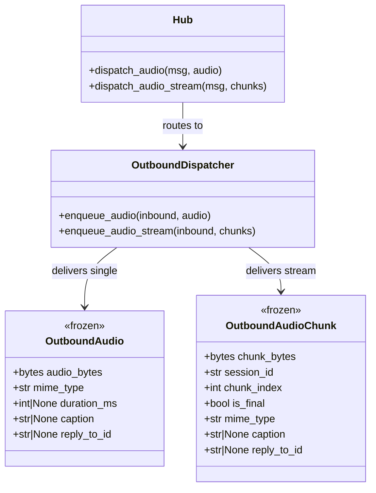
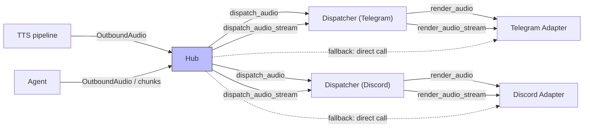

## Context

Promoted from [frame #182](../frames/182-outbound-audio-bus-frame.mdx). Audio outbound has no Hub-level dispatch. `render_audio()` and `render_audio_stream()` exist on adapters, and `enqueue_audio()` was added to OutboundDispatcher in #175, but the Hub has no typed `dispatch_audio()` or `dispatch_audio_stream()`. Streaming audio bypasses the dispatcher entirely — no circuit breaker, no queue, no observability.

**Scope clarification:** This issue covers **voice notes** only (`OutboundAudio` / `OutboundAudioChunk`). Audio-as-file-attachment already works through `dispatch_attachment()` → `render_attachment()`.

**Protocol addition:** `render_audio_stream` is being added to the `ChannelAdapter` protocol. Both adapters already implement it — this formalizes the existing contract. Distinct from the frame's "no signature changes" note which referred to `render_audio()` only.

Cherry-picks audio-related items from #186: `_AUDIO_EXTS` move to `_shared.py`.

## Goal

Agents and the TTS pipeline can dispatch single and streaming voice notes through typed Hub methods with full circuit breaker ownership — symmetric with text (`dispatch_response`), streaming (`dispatch_streaming`), and attachments (`dispatch_attachment`).

## Users

- **Primary:** Lyra engine — unified outbound path for all message kinds
- **Secondary:** Operators — consistent CB behavior and failure observability across all outbound kinds

## Expected Behavior

1. Agent or TTS pipeline produces `OutboundAudio` or an `AsyncIterator[OutboundAudioChunk]`.
2. Caller invokes `Hub.dispatch_audio(msg, audio)` or `Hub.dispatch_audio_stream(msg, chunks)`.
3. Hub looks up `self.outbound_dispatchers[(platform, bot_id)]` — same routing dict used by all dispatch methods.
4. Dispatcher enqueues the item. Worker loop drains, checks CB, calls adapter method, records success/failure.
5. For streaming: `enqueue_audio_stream()` enqueues `("audio_stream", inbound, chunks)`. Worker calls `adapter.render_audio_stream(chunks, inbound)`. Adapter owns chunk buffering via `buffer_audio_chunks()`.
6. Fallback (no dispatcher registered): Hub calls `adapter.render_audio(audio, msg)` directly for single audio. For streaming, Hub calls `adapter.render_audio_stream(chunks, msg)` — method is now on the `ChannelAdapter` protocol. Same pattern as `dispatch_attachment()`.

## Data Model & Consumers

### Data structure diagram

### Consumer map

### Consumer summary

| Consumer | Fields consumed | When | Status |
|----------|----------------|------|--------|
| `Hub.dispatch_audio()` | `OutboundAudio` (whole envelope), `msg.platform`, `msg.bot_id` | Agent/TTS produces single audio | This issue |
| `Hub.dispatch_audio_stream()` | `AsyncIterator[OutboundAudioChunk]`, `msg.platform`, `msg.bot_id` | TTS streams chunks | This issue |
| `OutboundDispatcher.enqueue_audio()` | `InboundMessage`, `OutboundAudio` | Single audio queued for delivery | Exists (#175) |
| `OutboundDispatcher.enqueue_audio_stream()` | `InboundMessage`, `AsyncIterator[OutboundAudioChunk]` | Streaming audio queued for delivery | This issue |
| Worker loop `("audio_stream", ...)` | `inbound`, `chunks` | Queue drained by worker | This issue |
| Adapters `render_audio_stream()` | `chunks: AsyncIterator[OutboundAudioChunk]`, `inbound: InboundMessage` | Worker delivers streaming audio | Exists (adding to protocol) |

## Breadboard

### Affordances

| ID | Element | Location |
|----|---------|----------|
| U1 | `dispatch_audio(msg: InboundMessage, audio: OutboundAudio)` | Hub |
| U2 | `dispatch_audio_stream(msg: InboundMessage, chunks: AsyncIterator[OutboundAudioChunk])` | Hub |
| U3 | `enqueue_audio_stream(inbound: InboundMessage, chunks: AsyncIterator[OutboundAudioChunk])` | OutboundDispatcher |
| U4 | `render_audio_stream(self, chunks: AsyncIterator[OutboundAudioChunk], inbound: InboundMessage) -> None` | ChannelAdapter protocol |
| U5 | `_AUDIO_EXTS` in `_shared.py` | Shared adapter helpers |

### Wiring

| From | Handler | To |
|------|---------|-----|
| Agent/TTS | Produces `OutboundAudio` | U1 |
| Agent/TTS | Produces `AsyncIterator[OutboundAudioChunk]` | U2 |
| U1 | Hub looks up dispatcher → `enqueue_audio()` (exists) | Dispatcher worker loop |
| U1 (fallback) | No dispatcher → `adapter.render_audio(audio, msg)` directly | Platform API |
| U2 | Hub looks up dispatcher → U3 | U3 |
| U2 (fallback) | No dispatcher → `adapter.render_audio_stream(chunks, msg)` directly | Platform API |
| U3 | Worker loop drains → CB check → U4 | U4 |
| U4 | Adapter calls `buffer_audio_chunks()` → `render_audio()` | Platform API |

## Slices

| # | Slice | Affordances | Depends on | Demo |
|---|-------|-------------|-----------|------|
| 1 | Dispatcher + protocol foundation | U3, U4, U5 | — | `enqueue_audio_stream()` delivers streaming audio through worker loop with CB ownership; `render_audio_stream` added to ChannelAdapter protocol; `_AUDIO_EXTS` moved to `_shared.py` |
| 2 | Hub dispatch methods | U1, U2 | Slice 1 | `Hub.dispatch_audio()` and `dispatch_audio_stream()` route to correct dispatcher with fallback to direct adapter call |

## Success Criteria

- [ ] `Hub.dispatch_audio(msg, audio)` routes `OutboundAudio` through `OutboundDispatcher.enqueue_audio()` → worker loop → adapter `render_audio()`
- [ ] `Hub.dispatch_audio_stream(msg, chunks)` routes `AsyncIterator[OutboundAudioChunk]` through `OutboundDispatcher.enqueue_audio_stream()` → worker loop → adapter `render_audio_stream()`
- [ ] `OutboundDispatcher.enqueue_audio_stream()` queues streaming audio and worker loop calls `adapter.render_audio_stream(chunks, inbound)`
- [ ] When CB is open, streaming audio iterator is fully drained and no chunks are delivered to the adapter
- [ ] `ChannelAdapter` protocol includes `render_audio_stream(self, chunks: AsyncIterator[OutboundAudioChunk], inbound: InboundMessage) -> None`
- [ ] When no dispatcher registered, `dispatch_audio()` calls `adapter.render_audio()` directly; `dispatch_audio_stream()` calls `adapter.render_audio_stream()` directly
- [ ] `_AUDIO_EXTS` moved from `discord.py` to `_shared.py`; Discord adapter imports from `_shared`
- [ ] Unit test: `enqueue_audio_stream()` delivers streaming audio through dispatcher worker loop
- [ ] Unit test: CB open drains streaming audio iterator without delivering to adapter
- [ ] Unit test: `Hub.dispatch_audio()` routes to correct dispatcher by (platform, bot_id)
- [ ] Unit test: `Hub.dispatch_audio_stream()` falls back to direct adapter call when no dispatcher
