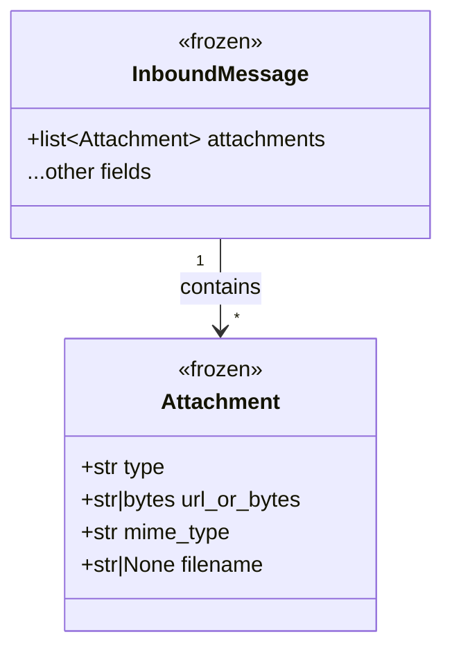
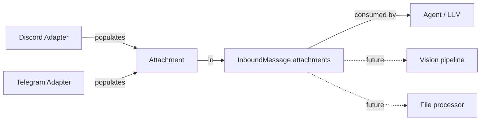

## Context

Promoted from [frame #183](../frames/183-inbound-attachment-handling-frame.mdx). Part of epic #139 (Message & Media Normalization).

The `Attachment` dataclass and `InboundMessage.attachments` field already exist in `core/message.py`. Neither Discord nor Telegram adapters populate this field for non-audio attachments — images, documents, and files are silently dropped.

## Goal

When a user sends a message with non-audio attachments (images, documents, files) via Discord or Telegram, the resulting `InboundMessage.attachments` list contains one `Attachment` per file with type, URL/file_id, MIME type, and filename — ready for downstream consumers.

## Users

- **Primary:** Lyra users sending images/documents/files via Discord or Telegram
- **Secondary:** Agent consumers that inspect `InboundMessage.attachments` (e.g. vision LLMs, file processors)

## Expected Behavior

1. User sends a message with one or more attachments (image, document, video, file) on Discord or Telegram.
2. The adapter's `normalize()` method extracts attachment metadata from the platform-specific message object.
3. Each attachment becomes an `Attachment(type, url_or_bytes, mime_type, filename)` in `InboundMessage.attachments`.
4. The `InboundMessage` flows through the bus as usual — consumers can inspect `attachments` to decide what to process.
5. Text-only messages are unaffected (empty `attachments` list, same as today).
6. Audio attachments continue following their existing path (unchanged).

**Lazy approach:** `url_or_bytes` stores a URL string (Discord CDN URL, or Telegram `file_id` prefixed with `tg:file_id:`), not downloaded bytes. Consumers fetch bytes on demand.

**Captions:** Telegram photos/documents may have captions. The caption goes in `InboundMessage.text` (and `text_raw`), not in `Attachment` fields. Discord attachments don't have captions — the message text is already in `text`.

**No size filtering:** Adapters pass through all attachments regardless of size. Consumers decide what to handle.

**`tg:file_id:` prefix contract:** The `Attachment` docstring must document that Telegram stores `"tg:file_id:{id}"` (not a URL). Consumers detect via `url_or_bytes.startswith("tg:file_id:")` and use the Telegram Bot API `getFile` to resolve. Follows the existing `tg:user:` / `dc:user:` prefix convention.

## Data Model & Consumers

### Data structure (existing — no changes needed)

### Consumer map

| Consumer | Fields consumed | When | Status |
|----------|----------------|------|--------|
| Agent (LLM) | type, url_or_bytes, mime_type | On message processing | This issue |
| Vision pipeline | url_or_bytes, mime_type | Future (#139 follow-on) | Future |
| File processor | url_or_bytes, filename, mime_type | Future | Future |

## Breadboard

### Discord adapter — attachment extraction

| Affordance | Handler | Data |
|------------|---------|------|
| D1: Discord message has `.attachments` list | `normalize()` | `raw.attachments` |
| D2: Filter out audio MIME types (already handled separately) | `_extract_attachments()` | `_AUDIO_MIME_TYPES` |
| D3: Map each attachment → `Attachment(type, url, content_type, filename)` | `_extract_attachments()` | `Attachment` dataclass |
| D4: Attach list to `InboundMessage` | `normalize()` return | `attachments=` kwarg |

### Telegram adapter — attachment extraction

| Affordance | Handler | Data |
|------------|---------|------|
| T1: Telegram message has `.photo`, `.document`, `.video`, `.animation`, `.sticker` | `normalize()` | aiogram Message attrs |
| T2: Extract file_id + metadata per type | `_extract_attachments()` | platform-specific attrs |
| T3: Map each → `Attachment(type, "tg:file_id:{id}", mime_type, filename)` | `_extract_attachments()` | `Attachment` dataclass |
| T4: Attach list to `InboundMessage` | `normalize()` return | `attachments=` kwarg |

### Type mapping

| Platform source | `Attachment.type` | MIME type source |
|----------------|-------------------|-----------------|
| Discord: `a.content_type` starts with `image/` | `"image"` | `a.content_type` |
| Discord: `a.content_type` starts with `video/` | `"video"` | `a.content_type` |
| Discord: everything else (non-audio) | `"file"` | `a.content_type` or `"application/octet-stream"` |
| Telegram: `.photo` | `"image"` | `"image/jpeg"` (Telegram always JPEG) |
| Telegram: `.document` | `"file"` | `.document.mime_type` or `"application/octet-stream"` |
| Telegram: `.video` | `"video"` | `.video.mime_type` or `"video/mp4"` |
| Telegram: `.animation` (GIF) | `"image"` | `"image/gif"` |
| Telegram: `.sticker` (static WebP only) | `"image"` | `"image/webp"` |

**Note:** Animated stickers (`.tgs`, `.webm`) are skipped — not useful as image attachments. Only static WebP stickers are normalized.

## Slices

| # | Slice | Scope | Demo |
|---|-------|-------|------|
| 1 | Discord attachment extraction | `discord.py` + tests | Send image on Discord → `attachments` populated in `InboundMessage` |
| 2 | Telegram attachment extraction | `telegram.py` + tests | Send photo on Telegram → `attachments` populated in `InboundMessage` |

## Success Criteria

- [ ] Discord: message with image attachment → `attachments` has 1 `Attachment` with `type="image"`, `url_or_bytes` = CDN URL, `mime_type` from `content_type`
- [ ] Discord: message with document attachment → `Attachment` with `type="file"`, correct `filename`
- [ ] Discord: message with multiple non-audio attachments → all present in `attachments` list
- [ ] Discord: audio attachment → NOT in `attachments` list (existing early-return audio path unchanged)
- [ ] Discord: text-only message → `attachments` is empty list
- [ ] Discord: message with text AND image → both `text` and `attachments` populated
- [ ] Telegram: photo → `Attachment` with `type="image"`, `url_or_bytes="tg:file_id:{id}"`, `mime_type="image/jpeg"`
- [ ] Telegram: photo with caption → caption in `InboundMessage.text`, photo in `attachments`
- [ ] Telegram: document → `Attachment` with `type="file"`, `mime_type` from `.document.mime_type`, `filename` from `.document.file_name`
- [ ] Telegram: video → `Attachment` with `type="video"`
- [ ] Telegram: animated sticker (`.tgs`/`.webm`) → skipped, NOT in `attachments`
- [ ] Telegram: static sticker → `Attachment` with `type="image"`, `mime_type="image/webp"`
- [ ] Telegram: voice/audio/video_note → NOT in `attachments` (existing `_on_voice_message` handler unchanged)
- [ ] Telegram: text-only message → `attachments` is empty list
- [ ] `Attachment` docstring updated to document `tg:file_id:` prefix contract
- [ ] All existing tests pass (no regressions)
- [ ] New unit tests for both adapters covering each attachment type
