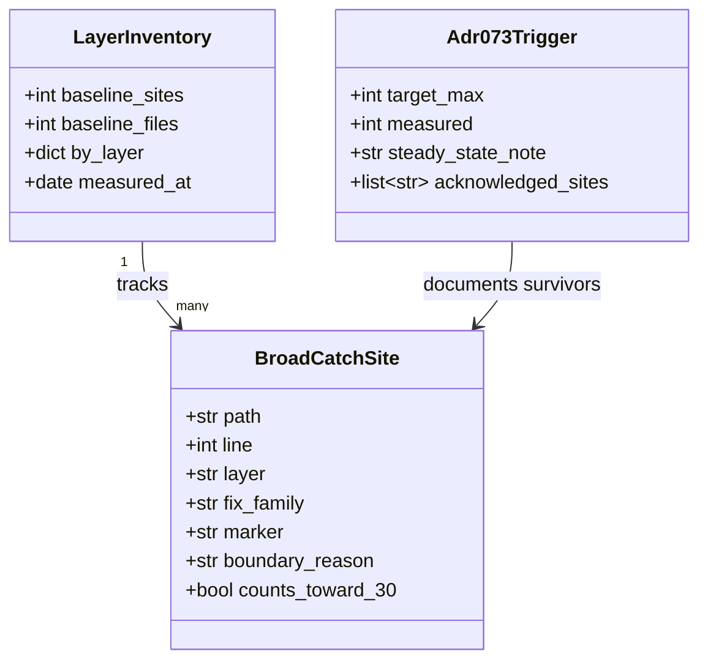
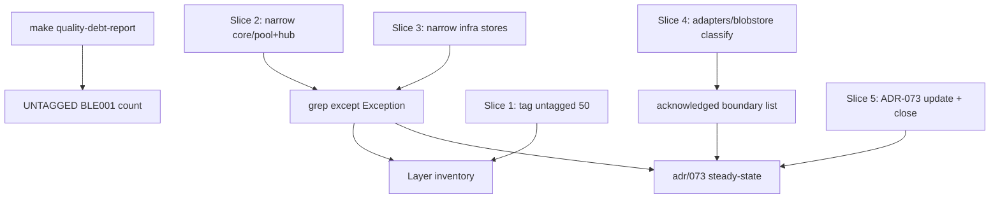

## Context

Promoted from
[`1832-boundary-broad-catch-burn-down-analysis.mdx`](../analyses/1832-boundary-broad-catch-burn-down-analysis.mdx)
(Shape 3 approved). Frame:
[`1832-boundary-broad-catch-burn-down-frame.mdx`](../frames/1832-boundary-broad-catch-burn-down-frame.mdx).

ADR-073 revisit trigger `boundary-broad-catch ≤ 30` is active post-Phase 7 (#1284). Mickael
validated 2026-06-11: **burn down, not re-baseline**. Baseline at filing: 150 sites / 91 files.
Re-measured 2026-06-24: **168 sites / 102 files** (+12 %). Decision: Shape 3 hybrid — tag-first
inventory, then narrow `core/pool` + `core/hub`, then infrastructure stores, then boundary
classification for adapters/blobstore, then ADR steady-state doc.

**Grammar note:** `POLICY:` markers were dismantled in #1175. Acknowledged boundary sites that
remain within the ≤30 budget use inline `# boundary: <reason>` on the same line as the
suppression (alongside `DEBT:` where still debt, or alone once drained). Untagged BLE001 in
`src/factory/` must reach **0** before close.

## Goal

Reduce `except Exception` sites in `src/factory/` from **168 to ≤ 30**, with every remaining site
carrying an inline boundary justification; zero untagged BLE001; ADR-073 revisit-trigger baseline
updated; measurement command documented in the closing PR.

## Users

- **Primary:** roxabi-factory maintainers — axial health restored; new features stop adding
  invisible broad catches.
- **Secondary:** `dev-core:axial-adr-review` + `dev-core:security-auditor` reviewers on each PR
  touching `except Exception` — per-site judgment, not bulk mechanical edits.
- **Tertiary:** contributors before ADR-073 6-monthly review (2026-11-01) — steady-state
  documented.

## Expected Behavior

### Measurement (canonical)

```sh
grep -r 'except Exception' src/factory/ --include='*.py' | wc -l
grep -rl 'except Exception' src/factory/ --include='*.py' | wc -l
make quality-debt-report
cat artifacts/quality-debt-report.json | jq '[.rows[] | select(.rule=="BLE001" and (.path|startswith("src/factory/")) and .bucket=="UNTAGGED")] | length'
```

### Per-site resolution playbook

| Family | Action | When |
|---|---|---|
| **Narrow** | Replace `Exception` with concrete types (`OSError`, `sqlite3.Error`, `ValueError`, `aiohttp.ClientError`, …) | Type is known at boundary |
| **Re-raise** | Remove catch or let propagate after logging | Catch masks stage-boundary violation |
| **Resilient** | Keep broad catch + `DEBT:boundary-broad-catch` + `# boundary: <reason>` | Non-fatal by design (logging filter, plugin skip) |
| **Acknowledged I/O** | Keep catch + `# boundary: <reason>`; remove `DEBT:` when no drain planned | HTTP/NATS/adapter I/O per ADR-067/082 |
| **Drain** | After elimination, remove marker; update `artifacts/debt/boundary-broad-catch.md` site count | Slice complete |

**PII invariant:** no regression on `tools/check_str_exc_bus_bound.sh` — `SanitizedError.message`
never carries `str(exc)`.

**Out of scope for narrowing:** `core/cli/` subprocess catches tied to runtime-pluggable (#1812) —
tag and defer; narrow only non-subprocess catches in this epic.

### End state

Closing PR reports final grep counts, lists remaining sites in ADR-073 appendix, and closes #1832.
Remaining ≤30 sites each have `# boundary: <reason>` visible on the suppression line.

## Data Model & Consumers





| Consumer | Fields | When | Status |
|---|---|---|---|
| `grep` count (issue acceptance) | all `except Exception` lines | each slice PR + close | this issue |
| `artifacts/quality-debt-report.json` | BLE001 bucket/slug per site | after Slice 1+ | this issue |
| `artifacts/debt/boundary-broad-catch.md` | site count, drain notes | slices 2–4 | this issue |
| `docs/architecture/adr/073-*.mdx` | steady-state count + acknowledged list | Slice 5 | this issue |
| `dev-core:axial-adr-review` | per-PR diff in `except Exception` | each PR | this issue |
| `tools/check_str_exc_bus_bound.sh` | PII paths | each PR | guard (no regression) |

## Breadboard

### Affordances

| ID | Affordance | Handler | Data |
|---|---|---|---|
| M1 | `grep -r 'except Exception' src/factory/` | baseline + slice delta | site count |
| M2 | `make quality-debt-report` | audit untagged BLE001 | `quality-debt-report.json` |
| C1 | `src/factory/core/pool/*.py` | narrow / re-raise / justify | 15 sites |
| C2 | `src/factory/core/hub/**/*.py` | narrow / re-raise / justify | 9 sites |
| C3 | `src/factory/core/{agent,commands,lifecycle,processors,memory,trace,tts}/*.py` | per-site judgment | ~18 sites |
| C4 | `src/factory/inbound/attachment_ingest.py` | narrow | 3 sites |
| I1 | `src/factory/infrastructure/stores/**/*.py` | narrow to store errors | ~12 sites |
| I2 | `src/factory/infrastructure/{turn_writer,jobs}/**` | per-site | ~9 sites |
| A1 | `src/factory/adapters/**` | classify: narrow or acknowledged | 34 sites |
| B1 | `src/factory/blobstore/**` | HTTP 500 mapping boundaries | 9 sites |
| D1 | `docs/architecture/adr/073-*.mdx` | revisit-trigger steady-state | ADR text |
| R1 | `artifacts/debt/boundary-broad-catch.md` | registry drain bookkeeping | debt registry |
| X1 | `core/cli/cli_pool_*.py` subprocess catches | tag + defer (#1812) | out of narrow scope |

### Wiring

- M1 + M2 run at start of each slice PR description (before/after table).
- Slices 2–4 edit C1–B1; each PR ≤ ~20 site changes for reviewability.
- Slice 1 tags all UNTAGGED BLE001 in `src/factory/` (50 sites) — no narrowing required.
- Slice 5 updates D1 + closes #1832; R1 `status` may flip `drained` if slug empty.
- X1 sites: add `DEBT:boundary-broad-catch` + `# boundary: deferred — runtime-pluggable #1812` if untagged; no narrowing.

## Slices

| # | Slice | Demo | Scope | Target delta |
|---|---|---|---|---|
| 1 | **Tag-first inventory** | `quality-debt-report` shows **0 UNTAGGED** BLE001 under `src/factory/` | All 50 untagged sites: append `DEBT:boundary-broad-catch` or `# boundary:` for true I/O boundaries | 0 untagged |
| 2 | **core/pool + core/hub** | grep drops by ≥15; pool_observer 5 sites resolved | C1 + C2 files per analysis | 168 → ~145 |
| 3 | **core remainder + inbound** | core/ total ≤ 20 sites | C3 + C4; exclude X1 subprocess deferrals | ~145 → ~125 |
| 4 | **infrastructure stores + classify adapters/blobstore** | infra stores narrowed; adapter/blobstore survivors documented | I1 + I2 + selective A1 + B1 narrow; remainder → acknowledged list | ~125 → ≤30 |
| 5 | **ADR steady-state + close** | ADR-073 documents count ≤30 + site list; #1832 closed | D1 update, closing PR measurement, R1 bookkeeping | final ≤30 |

**Dependencies:** 1 → 2 → 3 → 4 → 5 (linear). Each slice is independently demo-able via grep + audit counts.

**PR sizing:** one PR per slice (5 PRs). Slice 4 may split into 4a (infra) + 4b (adapters/blobstore) if review load exceeds ~20 sites.

## Edge Cases

| Case | Handling |
|---|---|
| `stream_processor.py` catch re-raises after `RunErrorRenderEvent` | Verify counts as intentional boundary; keep with `# boundary: render-then-reraise` or narrow |
| New `except Exception` added mid-epic | PR author must tag immediately; slice owner re-runs M1 before merge |
| Site count 31–35 after Slice 4 | One more narrow pass on highest-risk residual (core/cli non-subprocess) before ADR update |
| `pool_observer` store failures | Narrow to `sqlite3.Error` / store-specific errors, not blanket `Exception` |
| Adapter retry boundaries (`_shared.py`) | Acknowledged if type-sanitized; document in ADR appendix |

## Success Criteria

- [ ] `grep -r 'except Exception' src/factory/ --include='*.py' | wc -l` returns **≤ 30**
- [ ] Every remaining `except Exception` line in `src/factory/` includes `# boundary: <reason>` inline justification
- [ ] `artifacts/quality-debt-report.json` reports **0** rows where `rule == "BLE001"` AND `bucket == "UNTAGGED"` AND `path` starts with `src/factory/`
- [ ] `core/pool/pool_observer.py` has **0** untagged broad catches (all 5 original sites narrowed or justified)
- [ ] `core/pool/` site count ≤ **5** (down from 15)
- [ ] `core/hub/` site count ≤ **4** (down from 9)
- [ ] `infrastructure/stores/` broad catches narrowed to store-specific exception types where types are known
- [ ] `tools/check_str_exc_bus_bound.sh` passes on every slice PR (no PII regression)
- [ ] `docs/architecture/adr/073-axial-stage-of-pipeline-decomposition.mdx` revisit-trigger section documents steady-state count, measurement command, and acknowledged-boundary site list
- [ ] Closing PR body includes before/after grep counts and the exact measurement commands used
- [ ] `artifacts/debt/boundary-broad-catch.md` updated (site count + drain status) to reflect post-burn state
- [ ] No ADR-073 target re-baseline above 30 (burn-down path only)

## Out of Scope

- Re-baselining ADR-073 target above 30
- `core/cli/` subprocess extraction (runtime-pluggable #1812) — defer only
- Quality-debt infrastructure changes (#1162 grammar, audit tooling)
- `except Exception` outside `src/factory/` (tests, spikes, tools scripts)
- SanitizedError site consolidation (finding F-5) — separate track