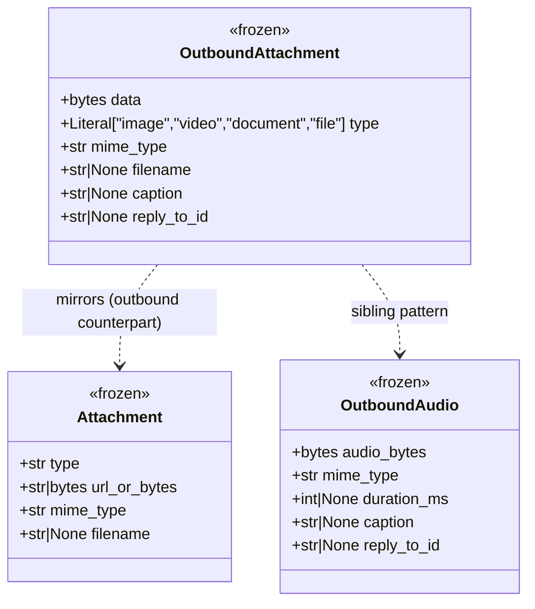
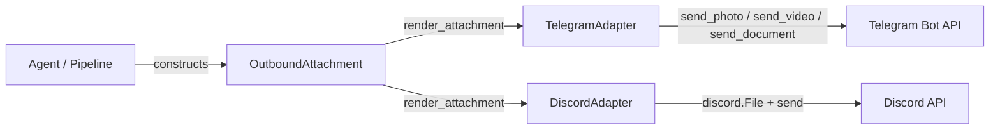

## Context

Promoted from [frame #184](../frames/184-outbound-attachment-frame.mdx). Part of the Message & Media Normalization epic (#139).

Lyra has typed envelopes for inbound attachments (`Attachment`) and outbound audio (`OutboundAudio`), but no channel-agnostic envelope for outbound files, images, documents, or video. Agents that produce media have no way to send it through the hub-and-spoke pattern without ad-hoc adapter-specific logic.

## Goal

Provide a typed, frozen, channel-agnostic `OutboundAttachment` dataclass and per-adapter `render_attachment()` methods so agents can send files, images, documents, and video through the standard adapter interface.

## Users

- **Primary:** Lyra agents producing files/images/documents/video as responses.
- **Secondary:** Adapter maintainers implementing rendering for new platforms.

## Expected Behavior

1. An agent (or hub pipeline) constructs an `OutboundAttachment` with raw bytes, a MIME type, a media category (`image | video | document | file`), and optional caption/filename.
2. The caller invokes `adapter.render_attachment(attachment, inbound)` — same pattern as `render_audio()`.
3. **Telegram adapter** inspects `attachment.type`:
   - `image` → `bot.send_photo(photo=BytesIO(data), ...)`
   - `video` → `bot.send_video(video=BytesIO(data), ...)`
   - `document` / `file` → `bot.send_document(document=BytesIO(data), ...)`
   - Caption, reply-to, and topic threading forwarded via kwargs (mirrors `render_audio`).
4. **Discord adapter** wraps bytes in `discord.File(fp=BytesIO(data), filename=...)` and sends via `messageable.send(file=attachment)` or `msg.reply(file=attachment)` — same reply logic as `render_audio`.
5. Platform guard: wrong-platform inbound → log error, return (no crash).
6. Missing `chat_id` / `channel_id` → log error, return.

## Data Model & Consumers

| Consumer | Fields consumed | When | Status |
|----------|----------------|------|--------|
| TelegramAdapter.render_attachment | data, type, mime_type, filename, caption, reply_to_id | outbound send | this issue |
| DiscordAdapter.render_attachment | data, mime_type, filename, caption, reply_to_id | outbound send | this issue |
| OutboundDispatcher (future) | all | queued dispatch | future (#139 follow-on, per ADR-015) |

## Breadboard

| ID | Affordance | Handler | Data |
|----|-----------|---------|------|
| N1 | OutboundAttachment dataclass | — (data structure) | data, type, mime_type, filename, caption, reply_to_id |
| N2 | TG render_attachment | TelegramAdapter.render_attachment() | OutboundAttachment + InboundMessage → Telegram API call |
| N3 | DC render_attachment | DiscordAdapter.render_attachment() | OutboundAttachment + InboundMessage → Discord API call |
| N4 | ChannelAdapter protocol | render_attachment method signature | Protocol update for type checking |

## Slices

| # | Slice | Affordances | Demo |
|---|-------|-------------|------|
| 1 | OutboundAttachment dataclass + type field | N1 | Construct instance, verify frozen, assert fields |
| 2 | Telegram render_attachment | N2 | Send image/document/video via Telegram bot in test |
| 3 | Discord render_attachment | N3 | Send file via Discord bot in test |
| 4 | ChannelAdapter protocol update | N4 | Pyright passes with render_attachment in protocol |

## Success Criteria

- [ ] `OutboundAttachment` is a frozen dataclass in `src/lyra/core/message.py` with fields: `data` (bytes), `type` (Literal["image", "video", "document", "file"]), `mime_type` (str), `filename` (str | None), `caption` (str | None), `reply_to_id` (str | None)
- [ ] `TelegramAdapter.render_attachment()` dispatches to `send_photo` / `send_video` / `send_document` based on `type` field
- [ ] `DiscordAdapter.render_attachment()` sends as `discord.File` with correct filename derived from mime_type + filename
- [ ] Both adapters: platform guard (wrong platform → log + return), missing routing key guard (no chat_id/channel_id → log + return)
- [ ] Both adapters: caption forwarded, reply_to_id honored with fallback to inbound message_id, topic/thread threading supported
- [ ] `ChannelAdapter` Protocol in `hub.py` includes `render_attachment` method signature
- [ ] `OutboundAttachment` exported from `core/message.py` and importable by adapters
- [ ] Tests cover: each Telegram send method (photo/video/document), Discord send, platform guard, missing routing key, caption, reply_to_id override, topic threading
