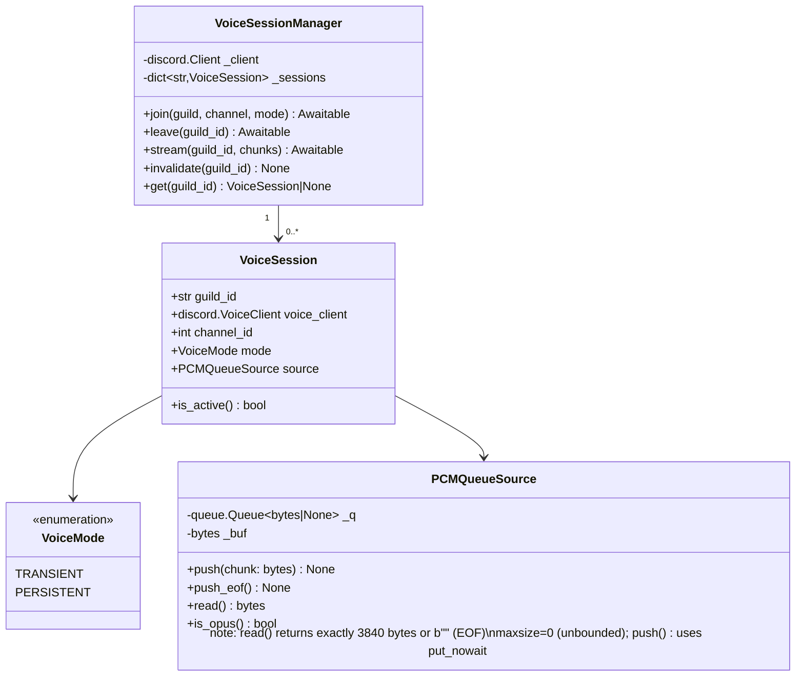
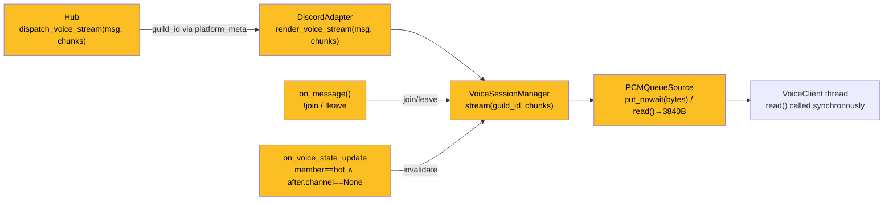

## Context

Sub-epic child of #139 (Message & Media Normalization). Both blockers closed: #171 (InboundAudioBus), #182 (OutboundAudio bus). Promoted from [analysis](../analyses/185-live-audio-streaming-analysis.mdx) — Shape A selected: `VoiceSessionManager` inside `DiscordAdapter`, new `dispatch_voice_stream()` on Hub. Telegram voice chat deferred.

## Goal

A user in a Discord voice channel can command Lyra to join, receive a live-streamed TTS response, and optionally keep Lyra present — without breaking the existing file-based audio pipeline.

## Users

- **Primary:** Discord users in voice channels who interact with Lyra by voice (or text commands)
- **Secondary:** Plugin/agent authors producing audio output that should be delivered live

## Out of Scope

- Telegram voice chat (deferred — MTProto/pytgcalls decision not yet made)
- Inbound audio capture from voice channels (always-on STT / listen mode) — deferred to a future issue
- Multi-user audio mixing or simultaneous speaker handling
- Voice channel auto-join on user presence

## Expected Behavior

### Join flow
1. User types `!join` (or `/join`) in a text channel or voice channel's linked chat.
2. `CommandParser` detects the command → `DiscordAdapter._handle_voice_command(msg)`.
3. `VoiceSessionManager.join(guild, channel, mode)` is called.
   - `!join` alone → `TRANSIENT` mode: Lyra joins, streams one response, then leaves.
   - `!join stay` → `PERSISTENT` mode: Lyra joins and stays until `!leave`.
4. If a session already exists for this guild → reply "Already in a voice channel."
5. If the user is not in a voice channel → reply "Join a voice channel first."
6. Lyra joins. No audio plays until a stream arrives.

### Streaming flow
1. A plugin or agent produces `OutboundAudioChunk` objects (PCM or ogg/opus).
2. Hub calls `hub.dispatch_voice_stream(msg, chunks)` where `msg.platform_meta["guild_id"]` carries the target guild.
3. `DiscordAdapter.render_voice_stream(msg, chunks)` is called.
4. `guild_id = msg.platform_meta["guild_id"]`; `VSM.stream(guild_id, chunks)` drains chunks into `PCMQueueSource`.
5. `PCMQueueSource` is a `discord.AudioSource` subclass backed by `queue.Queue[bytes | None]` (stdlib, thread-safe — **not** `asyncio.Queue`; `queue.Queue` is used because `PCMQueueSource.read()` is called from a non-async `threading.Thread` by the VoiceClient, while the async side pushes via `put_nowait`; the queue's internal lock provides the required thread-safety with no additional locking needed).
6. `PCMQueueSource.read()` must return exactly **3840 bytes** (20 ms of 48 kHz stereo 16-bit PCM) per frame, or `b""` to signal EOF (the discord.py contract). Because TTS chunks are not guaranteed to be 3840-byte-aligned, `PCMQueueSource` maintains an internal byte buffer and re-frames before returning. `maxsize=0` (unbounded) to prevent `put_nowait` from ever raising `queue.Full` on the async side.
7. When `is_final=True` chunk arrives, a `None` sentinel is pushed → `read()` returns `b""` → VoiceClient stops.
8. If mode is `TRANSIENT` → `VoiceSessionManager.leave(guild_id)` called automatically after stream ends.

### Leave flow
1. User types `!leave` → `VoiceSessionManager.leave(guild_id)`.
2. Any active stream is stopped (sentinel pushed). VoiceClient disconnects. Session removed.

### Forced disconnect
1. Bot is kicked or moves out of a voice channel → `on_voice_state_update` fires.
2. Filter: `member.id == self.user.id and after.channel is None` (fires only for the bot, only on disconnect — not on other members' state changes).
3. `VoiceSessionManager.invalidate(guild_id)` removes the session entry. No error propagated.

### No active session guard
`dispatch_voice_stream()` called with no active session for `guild_id` → log warning at WARNING level, return immediately. Hub/plugins are responsible for not calling this path without an active session.

## Data Model & Consumers

```python
# Hub interface — follows existing dispatch pattern (InboundMessage as routing carrier)
async def dispatch_voice_stream(
    self,
    msg: InboundMessage,           # routing carrier — platform_meta["guild_id"] required
    chunks: AsyncIterator[OutboundAudioChunk],
) -> None: ...
```





| Consumer | Fields consumed | When | Status |
|----------|----------------|------|--------|
| `VoiceSessionManager.stream()` | `guild_id` (via `platform_meta`) | Per stream dispatch | This issue |
| `PCMQueueSource.read()` | `chunk_bytes`, `is_final` | VoiceClient thread tick (every 20 ms) | This issue |
| `on_voice_state_update` | `member.id`, `after.channel` | On bot disconnect event | This issue |

## Breadboard

### U1 — User commands

| Affordance | Handler | Data |
|------------|---------|------|
| `!join` in text channel | `_handle_voice_command(msg)` → `VSM.join(guild, channel, TRANSIENT)` | guild_id, channel_id |
| `!join stay` | `_handle_voice_command(msg)` → `VSM.join(guild, channel, PERSISTENT)` | guild_id, channel_id, mode |
| `!leave` | `_handle_voice_command(msg)` → `VSM.leave(guild_id)` | guild_id |
| Already joined | Reply: "Already in a voice channel." | — |
| Not in channel | Reply: "Join a voice channel first." | — |

### N1 — Streaming dispatch

| Affordance | Handler | Data |
|------------|---------|------|
| `hub.dispatch_voice_stream(msg, chunks)` | `DiscordAdapter.render_voice_stream(msg, chunks)` | `msg.platform_meta["guild_id"]`, chunks |
| `render_voice_stream` — session active | `VSM.stream(guild_id, chunks)` → drain into PCMQueueSource | chunks |
| `render_voice_stream` — no session | log WARNING, return | — |
| `PCMQueueSource.push(chunk)` | `_buf += chunk`; while `len(_buf) >= 3840`: `_q.put_nowait(_buf[:3840])`; `_buf = _buf[3840:]` | 3840-byte re-framing |
| `PCMQueueSource.read()` | `item = _q.get(timeout=...)`: bytes → return; None → return `b""` | blocking in VoiceClient thread |
| `PCMQueueSource.push_eof()` | `_q.put_nowait(None)` | sentinel |
| Stream ends (`is_final=True`) | flush `_buf` + pad to 3840 if needed, then `push_eof()` | — |
| Transient mode, stream done | `VSM.leave(guild_id)` | guild_id |

### N2 — Session lifecycle

| Affordance | Handler | Data |
|------------|---------|------|
| `VSM.join()` — no existing session | `await VoiceChannel.connect()` → store `VoiceSession` | guild_id, VoiceClient |
| `VSM.leave()` — session active | `source.push_eof()`, `await VoiceClient.disconnect()`, remove session | guild_id |
| `on_voice_state_update` — bot disconnected | filter: `member.id == self.user.id and after.channel is None` → `VSM.invalidate(guild_id)` | guild_id |

### S1 — Startup checks (Slice A)

| Affordance | Handler | Data |
|------------|---------|------|
| `libopus` missing | `discord.opus.load_opus()` fails → raise `VoiceDependencyError("libopus not found — install libopus-dev")` | binary path |
| `ffmpeg` missing | `shutil.which("ffmpeg") is None` → raise `VoiceDependencyError("ffmpeg not found — install ffmpeg")` | — |
| `discord.py[voice]` not installed | `ImportError` on `import discord.voice_client` → wrap in `VoiceDependencyError` | — |

## Slices

| Slice | Title | Tier | Depends on | Demo |
|-------|-------|------|-----------|------|
| A | `VoiceSessionManager` — guild lifecycle, `PCMQueueSource`, startup checks, `on_voice_state_update` | F-lite | — | `pytest`: join() stores session; leave() removes it; missing libopus raises `VoiceDependencyError` with message |
| B | `render_voice_stream()` + `dispatch_voice_stream()` + full `PCMQueueSource` re-framing | F-lite | Slice A | `pytest`: `dispatch_voice_stream()` with mock chunks → `VoiceClient.play()` called; `PCMQueueSource.read()` returns 3840-byte frames |
| C | `!join` / `!join stay` / `!leave` command handling + transient auto-leave | S | Slice A | Manual: type `!join stay` in Discord → bot appears in voice channel; type `!leave` → bot leaves |

**Note — transient pyright gap:** `DiscordAdapter.render_voice_stream()` is added in Slice B, not Slice A. Between Slice A and B merges, pyright will report a missing method on `DiscordAdapter` relative to the Hub call site. This is a known transient state; Slices A and B should land in the same release cycle.

## Success Criteria

- [ ] `!join` causes Lyra to connect to the user's current voice channel in transient mode
- [ ] `!join stay` causes Lyra to connect in persistent mode and remain after a stream ends
- [ ] `!leave` disconnects Lyra from the voice channel and clears the session map entry
- [ ] `PCMQueueSource.read()` returns exactly 3840 bytes per frame (verified by unit test asserting frame count × 3840 == total bytes pushed)
- [ ] `VoiceClient.play()` is invoked when `dispatch_voice_stream()` is called with an active session (verified by mock assertion)
- [ ] After a transient-mode stream ends (`is_final=True` received), Lyra disconnects automatically
- [ ] If Lyra is forcibly disconnected, `VoiceSessionManager.invalidate()` is called and no exception propagates
- [ ] `dispatch_voice_stream()` with no active session logs a WARNING and returns without raising
- [ ] Startup raises `VoiceDependencyError` with an actionable message string if `libopus` or `ffmpeg` is missing
- [ ] `discord.py[voice]` is added to `pyproject.toml` dependencies
- [ ] All existing `render_audio_stream()` / `render_audio()` tests pass unmodified
