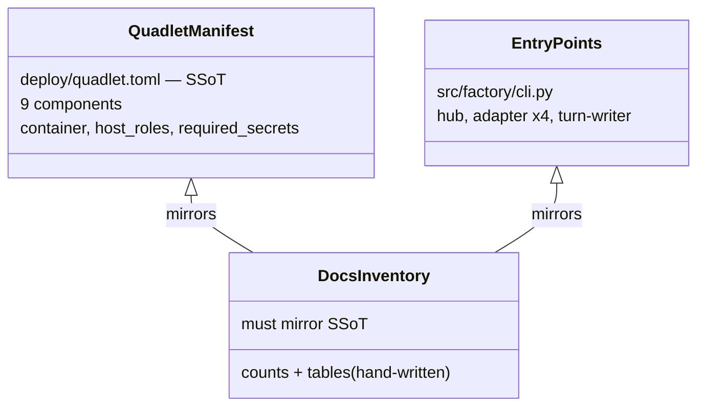
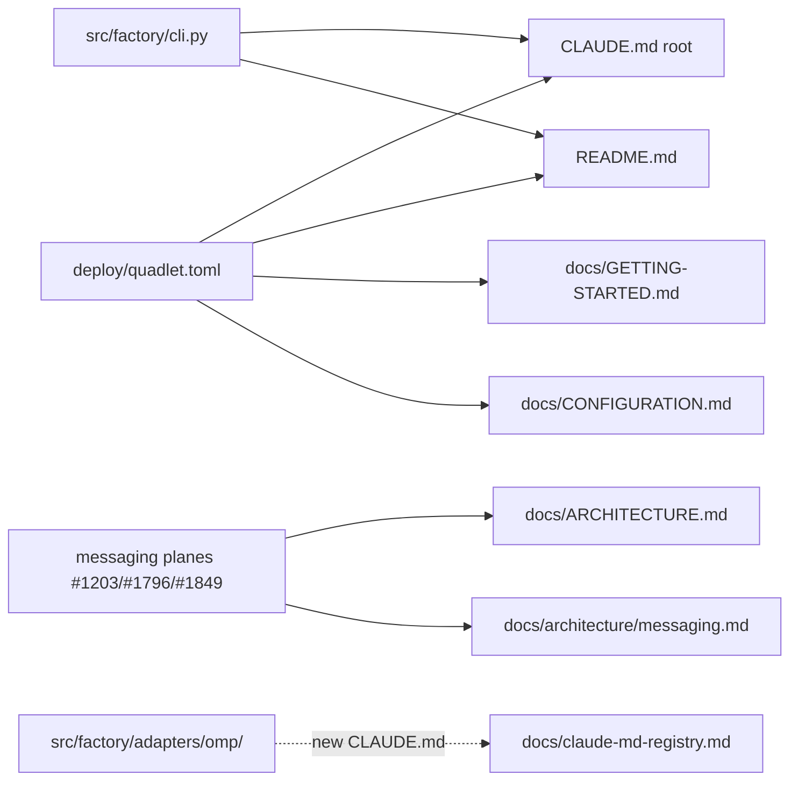

## Context

Promoted from [1868 frame](../frames/1868-docs-sweep-48h-frame.mdx). Ground truth
established by the 2026-06-12 M₁ audit + #1869: production = **9 containers**
(`deploy/quadlet.toml` is the manifest SSoT), **6 production entry points**
(`hub`, `adapter telegram|discord|clipool|omp`, `turn-writer`). Baseline branch
state includes #1869 (omp runnable + wired; `deploy/CLAUDE.md` step 7 already fixed).

## Goal

Every entry-point doc states the post-#1869 reality (9 containers, 6 entry
points, omp/jobs/active-jobs/WorkEnvelope features), with `doc_drift` green.

## Users

Claude sessions seeded by root CLAUDE.md; operators following
GETTING-STARTED/CONFIGURATION runbooks; contributors onboarding via
README/ARCHITECTURE.

## Expected Behavior

A fresh reader of README sees a hub-spoke diagram and prose matching the nine
deployed containers and finds `factory adapter omp` in the CLI table. A Claude
session quoting root CLAUDE.md reports nine containers and six entry points,
and finds `src/factory/adapters/omp/` in the CLAUDE.md registry. An operator
following GETTING-STARTED starts nine units and installs the full secret set
including `factory-nats-omp` + `factory-litellm-key`. ARCHITECTURE.md routes
messaging detail to the messaging domain page instead of asserting stale
process counts.

## Stale-Claims Inventory (audit 2026-06-12 — fix list)

| File | Stale claim | Reality |
|---|---|---|
| `CLAUDE.md:~87` | "Eight containers: …" (no omp) | Nine; add `factory-omp` |
| `CLAUDE.md:~71` | "Production entry points (NATS 5-process)" table, 5 rows | 6 rows; add `adapter omp` / `factory adapter omp` / `_bootstrap_omp_standalone` (verify name in `src/factory/cli.py:143-150`) |
| `CLAUDE.md:~67` | registry count "29 : root + 28 sub" | recount with `find` AFTER adding omp CLAUDE.md (expected 31 : root + 30 sub — verify, don't trust) |
| `README.md:45` | "Four independent processes" | nine containers; rewrite prose |
| `README.md:29-43` | 3-box ASCII diagram | extend to current topology (hub, nats, 2 chat adapters, clipool, omp, gh-helper, turn-writer, blobstore) |
| `README.md:106-112` | CLI Server table lacks omp | add `factory adapter omp` row |
| `docs/GETTING-STARTED.md:~335` | start commands, 5 services | 9 services incl. factory-omp |
| `docs/GETTING-STARTED.md:~372` | "all eight units active" | nine |
| `docs/GETTING-STARTED.md:~446` | "Final state" Podman-secrets row lists only 5 nats seeds (pre-dates gh-helper/turn-writer/blobstore too) | replace the entire inline list with the full `required_secrets` union from `deploy/quadlet.toml` (10 distinct secrets incl. `factory-nats-omp`, `factory-litellm-key`) |
| `docs/ARCHITECTURE.md:58` | "All four processes run on Machine 1" | nine containers on M₁ |
| `docs/ARCHITECTURE.md` | no OmpWorker / FACTORY_JOBS / DLQ / active-jobs / WorkEnvelope / `factory.job.<id>.*` | add concise section(s) + pointers to `docs/architecture/messaging.md` (no duplication) |
| `docs/CONFIGURATION.md:665-666` | quadlet-install-verify restarts 5 containers | mirror the 9-entry UNITS array of `deploy/quadlet-install-verify.sh` |
| `docs/architecture/messaging.md:9` | "Last updated: 2026-05-26" | bump to current date |
| `docs/architecture/messaging.md:140-158` | subject table lacks the per-job lifecycle subjects | **two distinct hierarchies — don't conflate:** (a) `factory.jobs.<domain>.<verb>` = JetStream WorkQueue dispatch plane, already documented (line ~157), leave as-is; (b) `factory.job.<job_id>.steer/.progress/.result` = per-job lifecycle bus (published by `omp/_rpc_bridge.py`) — add table entries. The #1793/#1849 note: earlier design had top-level `results/progress` siblings, retired into `factory.job.<id>.*` |
| `docs/claude-md-registry.md` | no row for `src/factory/adapters/omp/CLAUDE.md` | add row (path + scope) + update the header count |
| — (missing) | no `src/factory/adapters/omp/CLAUDE.md` | create (invariants: `/opt/omp/omp` digest gate `_PINNED_SHA256`, `tool_input` never bus-published, `_result_sent` double-publish guard, ADR-073 SanitizedError discipline, `PI_CODING_AGENT_DIR` → `deploy/omp/` models.yml, image = `factory:staging` w/ baked binary #1867) + register in `docs/claude-md-registry.md` |

## Data Model & Consumers

| Consumer | Fields consumed | When | Status |
|---|---|---|---|
| Claude sessions | CLAUDE.md counts, entry-point table, registry | every session | this issue |
| Operators | GETTING-STARTED units + secrets, CONFIGURATION restart list | deploy/diagnostic | this issue |
| Contributors | README diagram/CLI, ARCHITECTURE overview | onboarding | this issue |
| Future gate (generated inventory) | same counts | if counts re-drift (frame failure mode) | future |

## Breadboard

| ID | Affordance | Wiring |
|---|---|---|
| U1 | CLAUDE.md container list + entry-point table + registry count | mirrors `deploy/quadlet.toml` + `cli.py` + `find` count |
| U2 | omp CLAUDE.md + registry row | new file `src/factory/adapters/omp/CLAUDE.md` → row in `docs/claude-md-registry.md` |
| U3 | GETTING-STARTED units/secrets | mirrors `quadlet-install-verify.sh` UNITS + `quadlet.toml` required_secrets |
| U4 | CONFIGURATION restart list | mirrors UNITS array |
| U5 | README prose/diagram/CLI table | mirrors manifest + cli.py |
| U6 | ARCHITECTURE sections + pointers | links `docs/architecture/messaging.md`, ADR-084/088 refs as applicable |
| U7 | messaging.md taxonomy note + date | #1793/#1849 retirement note |

## Slices

| Slice | Contents | Demo |
|---|---|---|
| 1 — agent-facing SSoT | U1, U2 | root CLAUDE.md + registry + omp CLAUDE.md consistent; counts verified by `find` |
| 2 — operator runbooks | U3, U4 | GETTING-STARTED + CONFIGURATION match deploy scripts |
| 3 — onboarding + architecture | U5, U6, U7 | README/ARCHITECTURE/messaging current; doc_drift green |

## Success Criteria

- [ ] SC1: root `CLAUDE.md` names nine containers incl. `factory-omp`, and the entry-points table has six rows incl. `adapter omp` with the bootstrap symbol verified against `src/factory/cli.py`
- [ ] SC2: `src/factory/adapters/omp/CLAUDE.md` exists with the five invariants above; `docs/claude-md-registry.md` has its row; root CLAUDE.md registry count equals `find . -name CLAUDE.md -not -path '*/node_modules/*' -not -path '*/.claude/*'` count
- [ ] SC3: `docs/GETTING-STARTED.md` start commands + unit list show nine units; secrets table includes `factory-nats-omp` and `factory-litellm-key`
- [ ] SC4: `docs/CONFIGURATION.md` quadlet-install-verify paragraph lists the same nine units as `deploy/quadlet-install-verify.sh`
- [ ] SC5: `README.md` has no "Four independent processes" claim; diagram + CLI table include omp
- [ ] SC6: `docs/ARCHITECTURE.md` has no "four processes" claim and covers OmpWorker, FACTORY_JOBS+DLQ, active-jobs KV, WorkEnvelope, `factory.job.<id>.*` **pointer-only to messaging.md / ADRs — no inline prose duplication** (doc_drift safety)
- [ ] SC7: `docs/architecture/messaging.md` documents the per-job lifecycle subjects + retired-siblings note, header date bumped, file ≤350 lines by `wc -l` (**baseline is 368 — net compression of ≥18 lines is mandatory, not optional**)
- [ ] SC8: `python3 tools/check_doc_drift.py` exits 0 and grep finds no "Eight containers"/"eight units"/"Four independent"/"All four processes"/"5-process"/"5 containers"/the exact pre-edit CONFIGURATION.md restart phrase in the touched docs

## Edge Cases

| Case | Handling |
|---|---|
| doc_drift fails on a new backticked symbol with 0 src hits | un-backtick or rephrase (graduation rule — feedback memory) |
| messaging.md exceeds 350 lines after additions | compress the taxonomy note; domain-page invariant wins |
| registry/file counts disagree with spec's predicted numbers | empirical `find` count wins; update both CLAUDE.md:67 and registry header |
| README diagram becomes unreadable with 9 boxes | group satellites (adapters / workers / infra) rather than 9 literal boxes |
