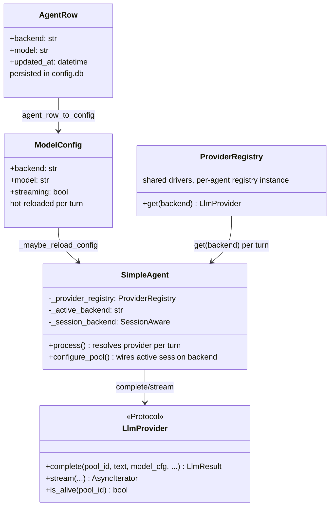
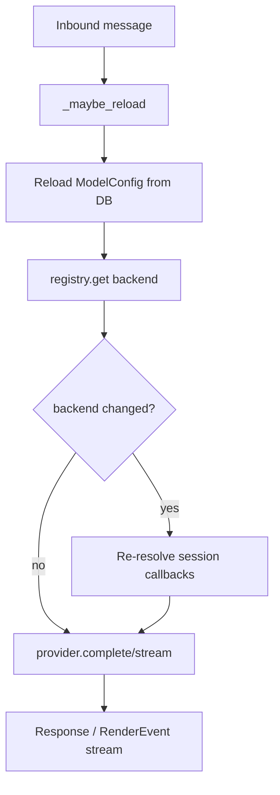

## Context

Promoted from [frame](../frames/1914-feat-hub-per-turn-llm-backend-resolution-frame.mdx)
(approved 2026-06-21). Parent epic [#1813](1813-runtime-selection-spec.mdx) (runtime
selection) specifies turn-dispatch provider resolution; slice N6 covers backend hot-swap.

**Current state:** `_resolve_agents()` → `_create_agent()` reads
`config.llm_config.backend` once at bootstrap and injects a single `LlmProvider` into
`SimpleAgent` (`self._provider`). `_maybe_reload_config()` (#343) hot-reloads model,
persona, plugins, etc. but never swaps the provider. Catalogue/model paths are done
(#1923, #1924, #1954).

**Trigger:** Aryl → OMP cutover (2026-06-17) required SQL patch **and** `factory-hub`
restart — the only working path.

## Goal

Eliminate `factory-hub` restart when flipping an existing agent's LLM backend
(`claude-cli` ↔ `omp-rpc` ↔ `nats`). The next inbound message uses the driver
matching the reloaded `config.db` value.

## Users

- **Operators:** patch `agents.backend` via SQL or `factory agent patch` / `edit`.
- **Hub maintainers:** #1813 sibling slices (#1915–#1917) depend on per-turn resolution
  infrastructure.

## Expected Behavior

1. Operator updates `agents.backend` in `config.db` (or via `factory agent patch`).
2. Next inbound message for that agent calls `SimpleAgent._maybe_reload()` → detects
   `updated_at` change → reloads config including `llm_config.backend`.
3. `SimpleAgent.process()` resolves `provider = registry.get(config.llm_config.backend)`
   **after** reload — not the bootstrap `self._provider`.
4. If backend changed since last turn:
   - log transition (`claude-cli` → `omp-rpc`, etc.)
   - re-resolve session backend for callbacks (`reset`, `link_lyra_session`,
     `queue_resume`) from the active provider's capability surface
   - call `reset_backend` on the prior backend's pool if session semantics differ
5. `lyra_default` (claude-cli) and `aryl_default` (omp-rpc) coexist; flipping one
   agent's backend does not affect the other.
6. `factory agent patch` accepts `backend` — added to `REFINABLE_FIELDS`.

**Precedence (document only — #1916 implements per-job override):**
`per-job override > agent ModelConfig.backend > system default (claude-cli)`.

## Data Model & Consumers





| Consumer | Fields | When | Status |
|----------|--------|------|--------|
| `SimpleAgent.process()` | `llm_config.backend`, registry | every turn | this issue |
| `SimpleAgent.configure_pool()` | active session backend | pool wiring | this issue |
| `AgentRefiner` / `patch` | `backend` | CLI edit | this issue |
| Per-job override (#1916) | `JobEnvelope.runtime` | turn dispatch | future |

## Breadboard

### Affordances

| ID | Affordance | Handler | Data |
|----|------------|---------|------|
| A1 | DB `agents.backend` column | `_maybe_reload_config` | `AgentRow.backend` |
| A2 | `factory agent patch backend=…` | `AgentRefiner` | `REFINABLE_FIELDS` |
| A3 | Inbound message turn | `SimpleAgent.process()` | `ModelConfig.backend` |
| A4 | Pool session reset/resume | `configure_pool` / `_maybe_register_*` | active `SessionAware` |
| N1 | `ProviderRegistry.get()` | `SimpleAgent._resolve_provider()` | backend string |
| N2 | Backend transition log | `_maybe_reload_config` | old/new backend |
| S1 | Mock registry assertion test | `test_simple_agent.py` | provider swap without restart |

### Wiring

```
A1 → _maybe_reload_config → config.llm_config.backend
A2 → AgentStore.update → A1
A3 → _resolve_provider → N1 → provider.complete/stream
A3 → (backend change) → N2 + A4 re-wire
S1 → patch DB backend → process() → assert mock provider B called
```

## Slices

| Slice | Delivers | Demo |
|-------|----------|------|
| 1 | Pass `ProviderRegistry` into `SimpleAgent`; per-turn `get(backend)` in `process()` | Unit test: bootstrap `claude-cli`, patch backend to `omp-rpc`, next `process()` hits omp mock |
| 2 | Backend transition logging in `_maybe_reload_config` | Log line contains `backend: claude-cli -> omp-rpc` |
| 3 | Session callback re-resolution on backend flip | `configure_pool` / `reset_backend` target active provider after flip |
| 4 | Add `backend` to `REFINABLE_FIELDS` | `factory agent patch` accepts backend field |

## Success Criteria

- [ ] SC1: Changing `agents.backend` in `config.db` takes effect on the **next message** for that agent — no hub restart.
- [ ] SC2: `factory agent patch` (or `edit`) can set `backend` — `backend` ∈ `REFINABLE_FIELDS`.
- [ ] SC3: `SimpleAgent.process()` resolves provider from `ProviderRegistry.get(config.llm_config.backend)` each turn (cache last backend + re-resolve on change acceptable).
- [ ] SC4: Session callbacks (`configure_pool`, `link_lyra_session`, `queue_resume`, `reset_backend`) use the **active** provider for the resolved backend.
- [ ] SC5: Regression: `lyra_default` (claude-cli) and `aryl_default` (omp-rpc) coexist after a backend flip on one agent without restart.
- [ ] SC6: Test: patch backend in DB (or mock store) → next `process()` call uses the new driver (mock registry assertion).

## Out of Scope

See frame — new agent registration, bot assign, trust/circuit breaker bootstrap,
per-job override (#1916), OMP streaming bridge (#1915), worker-side config reads.