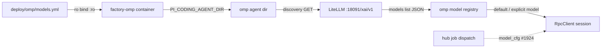

## Context

Promoted from [frame](../frames/1923-omp-dynamic-model-discovery-frame.mdx)
(approved 2026-06-17). Parent epic #1490 (pluggable harness runtime). #1811
(closed) landed the static `models:` list as Option D to dodge omp's discovery
chicken-and-egg. #1812 shipped `factory-omp` with `PI_CODING_AGENT_DIR` +
repo-mounted `deploy/omp/models.yml`. #1910 fixed default-model selection when
hub omits `model`. This issue reverses the #1811 trade-off now that
Roxabi/llmCLI#129 (`pass_through /xai`) provides a stable Grok catalogue
endpoint.

**External dependency (interim):** Roxabi/llmCLI#129 must be deployed on M₁
before live discovery works. Target-phase switch to `:18091/v1` waits on
llmCLI#130 — out of scope unless it lands during implementation.

## Goal

`deploy/omp/models.yml` uses omp's built-in `openai-models-list` discovery
against the factory LiteLLM xAI pass-through (`:18091/xai/v1`), eliminating
manual Grok id maintenance while preserving the #1811 provider-override pattern.

## Users

- **Operators on M₁:** restart `factory-omp` after a proxy catalogue change —
  no `models.yml` edit, no image rebuild.
- **#1924 (hub model apply):** discovered catalogue is prerequisite for
  per-job `model_cfg` to select a non-default Grok variant.

## Expected Behavior

1. `deploy/omp/models.yml` keeps the `litellm` provider override shape from
   #1811 (`api: openai-completions`, `apiKey: LITELLM_API_KEY`) but:
   - sets `baseUrl: http://roxabituwer.goose-logarithm.ts.net:18091/xai/v1`
     (interim — xAI pass-through path per issue phases table)
   - adds `discovery: {type: openai-models-list}`
   - **removes** the explicit `models:` list (no static Grok ids)
2. On `factory-omp` boot, omp fetches the gateway catalogue from
   `{baseUrl}/models` (OpenAI-compatible list) and registers discovered Grok
   models. A proxy-new id (e.g. `grok-4.3`) becomes selectable after container
   restart without repo changes.
3. If discovery fails (gateway unreachable, auth failure, empty catalogue):
   worker startup logs the error clearly; behaviour matches omp upstream
   (session init fails or falls back per omp defaults — document in README,
   do not invent custom retry logic in this slice).
4. `deploy/omp/README.md` documents:
   - reversal of #1811 static-list trade-off and why discovery is safe now
   - interim (`/xai/v1`) vs target (`/v1`) phases and llmCLI blockers
   - operator restart procedure when proxy catalogue changes
   - relationship to #1924 (hub model apply) and #1910 (default model)
5. CI gains a deterministic test proving discovery wiring without requiring
   live M₁ network (mock gateway); optional live marker for manual/M₁ smoke.

## Data Model & Consumers

```mermaid
classDiagram
  class ModelsYml {
    <<frozen, repo SSoT>>
    +providers.litellm.baseUrl: string
    +providers.litellm.api: openai-completions
    +providers.litellm.apiKey: LITELLM_API_KEY
    +providers.litellm.discovery.type: openai-models-list
    -models: list REMOVED
  }
  class GatewayCatalogue {
    <<mutable, external>>
    +GET /xai/v1/models
    +data[]: {id, object, created, owned_by}
    source = LiteLLM pass-through (#129)
  }
  class OmpModelRegistry {
    <<mutable, runtime>>
    +discovered_models: ModelRef[]
    persisted in models.db (factory-omp-sessions volume)
  }
  class RpcClient {
    <<runtime>>
    +model: string | null
    default = first discovered model (#1910)
  }
  ModelsYml --> GatewayCatalogue : discovery fetch at boot
  GatewayCatalogue --> OmpModelRegistry : register ids
  OmpModelRegistry --> RpcClient : model selection
```



| Consumer | Fields consumed | When | Status |
|---|---|---|---|
| `factory-omp` Quadlet unit | full `models.yml` via bind mount | container start | existing (#1812) |
| omp discovery subsystem | `baseUrl`, `discovery.type`, `apiKey` | agent dir init | this issue |
| omp `RpcClient` | discovered model ids | session `new_session()` | existing; #1924 adds hub override |
| operators | README phase table + restart runbook | catalogue changes | this issue |
| CI mock-gateway test | `discovery` block + resolved catalogue | PR gate | this issue |

## Breadboard

| ID | Affordance | Handler / mechanism | Data |
|---|---|---|---|
| C1 | `deploy/omp/models.yml` | omp provider override YAML | `baseUrl`, `discovery`, no `models:` |
| C2 | Quadlet bind mount | `factory-omp.container` Volume line (unchanged) | repo SSoT → `/home/factory/.config/omp-pi/models.yml` |
| C3 | Gateway catalogue | LiteLLM `GET /xai/v1/models` (llmCLI#129) | OpenAI models-list JSON |
| C4 | omp discovery | oh-my-pi `openai-models-list` fetcher | registered model refs |
| C5 | `deploy/omp/README.md` | operator docs | phase table, trade-off reversal |
| T1 | Static YAML gate | pytest asserts schema invariants on `models.yml` | no `models:` key, `discovery.type` present |
| T2 | Mock discovery smoke | pytest + local HTTP stub serving `{"data":[{"id":"grok-4-fast"}]}` | omp discovers ≥1 id without live tailnet |

Wiring: C1→C2 (mount) · C1+C3→C4 (discovery) · C4→RpcClient (existing) ·
C5 documents C1+C3 · T1 guards C1 · T2 proves C1+C4 end-to-end offline.

## Slices

| # | Slice | Demo | Contains |
|---|---|---|---|
| 1 | Discovery config + docs | `models.yml` has `discovery` block, no static list; README explains interim/target phases | C1, C5 |
| 2 | CI discovery smoke | `pytest tests/deploy/test_omp_models_discovery.py` green in PR CI without M₁ network | T1, T2 |

## Success Criteria

### Interim (this PR — after llmCLI#129 deployed on M₁ for live validation)

- [ ] `deploy/omp/models.yml` sets `baseUrl` to `http://roxabituwer.goose-logarithm.ts.net:18091/xai/v1` and includes `discovery: {type: openai-models-list}` with **no** `models:` key
- [ ] `deploy/omp/README.md` documents discovery mode, #1811 trade-off reversal, interim vs target `baseUrl`, operator restart procedure, and pointers to #1924 / llmCLI#129 / llmCLI#130
- [ ] `tests/deploy/test_omp_models_discovery.py` passes in CI: (a) static YAML invariants, (b) mock-gateway test proving omp discovers ≥1 model id from a local stub catalogue
- [ ] `git diff` touches no `deploy/quadlet*` files, no `deploy/quadlet.toml` changes, no secrets surface — existing `secrets_drift` / `volumes_table` gates pass unchanged
- [ ] Live smoke (manual or `@pytest.mark.gateway`): with `LITELLM_API_KEY` set and llmCLI#129 deployed, `factory-omp` restart discovers ≥1 Grok model from the real `:18091/xai/v1` catalogue — recorded in PR description or runbook note

### Target (deferred — llmCLI#130)

- [ ] `baseUrl` switched to `:18091/v1` — tracked as follow-up issue or phase-2 PR, not this slice
- [ ] `grok-4.3` (or successor) discovered on boot without image rebuild — validated when #130 lands