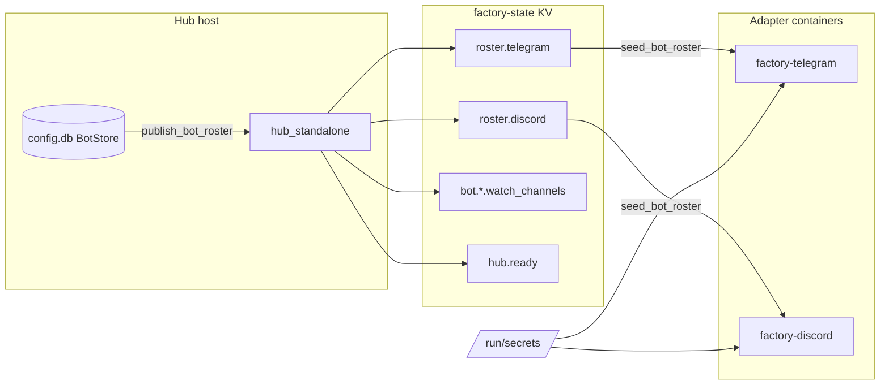

## Context

**Residual from #1060.** Issue #1060 moved `watch_channels` from `config.db` to `factory-state` KV
(`bot.<platform>.<bot_id>.watch_channels`). The **bot roster** (`bot_id`, `agent`, Discord
`auto_thread` / `thread_hot_hours`) still reaches standalone adapters via SQLite:

- Transitional path on `staging` (2026-06-19): `_standalone_bot_store.py` +
  `BotStore.connect_readonly()` + Quadlet bind-mounts of `config.db`, `config.db-wal`,
  `config.db-shm` at `/app/config.db`.
- This contradicts #1414 / `deployment.md` (adapters must not open `config.db`), creates SQLite WAL
  pain on `ReadOnly=true` containers, and duplicates the hub SSoT (`multibot_config_from_store`).

**Panel consensus (architect + axial drift):** mirror roster into `factory-state` KV using the same
hub-publish / adapter-read pattern as #1060; **zero ACL change**; BotStore remains write SSoT on the
hub host.

## Goal

Publish a **minimal adapter-facing bot roster** into JetStream KV before `announce_hub_ready`. Standalone
Telegram and Discord adapters load their platform roster **after** `wait_for_hub` and **never** open
`config.db`. Remove all `config.db` bind-mounts from adapter Quadlet templates.

## Users

- **Primary:** Operator — bot add/remove via `factory bot init` / future CLI verbs without adapter
  SQLite mounts or WAL sibling files.
- **Secondary:** Axial reviewers — adapters consume NATS wire contract only; hub owns `config.db`.

## Design Decisions

**D1 — Bucket: reuse `factory-state`.** Adapters already hold `$KV.factory-state.>` subscribe +
`$JS.API.STREAM.MSG.GET.KV_factory-state` (#1572). Hub already publishes pre-ready. → **no
acl-matrix.json / auth.conf regen**.

**D2 — Key schema: platform roster index (not per-bot roster keys).**

```
roster.telegram  →  JSON platform roster document
roster.discord   →  JSON platform roster document
```

Per-bot keys (`bot.<platform>.<bot_id>.config`) are **rejected**: adapters need the bot list
*before* they can fetch per-bot keys (circular dependency). One `kv.get` per adapter process
(telegram-only / discord-only).

**D3 — Payload: adapter projection only (never full `BotRow` / auth fields).**

```json
{
  "schema_version": 1,
  "updated_at": "2026-06-19T12:00:00Z",
  "bots": [
    {
      "bot_id": "lyra",
      "agent": "lyra_default",
      "auto_thread": true,
      "thread_hot_hours": 36,
      "webhook_enabled": false
    }
  ]
}
```

| Field | Telegram | Discord | Notes |
|-------|----------|---------|-------|
| `bot_id` | required | required | Drives `/run/secrets/bot_token-<id>` lookup |
| `agent` | optional | optional | Hub uses BotStore; include for debug / forward compat |
| `auto_thread` | omit | optional | Default from `DiscordBotConfig` if absent |
| `thread_hot_hours` | omit | optional | Default from `DiscordBotConfig` if absent |
| `webhook_enabled` | optional | omit | Observability only; quadlet still uses BotStore |
| `owner_users`, `trusted_*`, `default_trust` | **FORBIDDEN** | **FORBIDDEN** | Hub-only auth — publishing these to `$KV.factory-state.>` is a security regression |

**D4 — Write SSoT: BotStore (`config.db`) on hub host.** KV is a **read replica** for adapters.
`render_quadlet.py` and `factory bot init` continue to use BotStore on the install host.

**D5 — Publish lifecycle (hub boot).** In `hub_standalone.py`, after existing
`publish_watch_channels` and **before** `announce_hub_ready`:

```
publish_bot_roster(js, bot_store)  # NEW
```

Uses `_open_or_create_kv` pattern from `kv_watch_channels.py` (hub-only provisioner).

**D6 — Read lifecycle (adapter boot).** New module `bootstrap/wiring/kv_bot_roster.py`:

- `publish_bot_roster(js, bot_store) -> None` (hub / CLI)
- `seed_bot_roster(js, platform: str) -> TelegramMultiConfig | DiscordMultiConfig` (adapters)

Read via `kv.get("roster.<platform>")` + `$JS.API.STREAM.MSG.GET` (same transport as
`seed_watch_channels` post-#1572). **Do not** use `kv.watch` in v1.

**Boot order (mandatory reorder):**

```
wait_for_hub(nc)
seed_bot_roster(js, platform)   # NEW — replaces _standalone_bot_store
load credentials (/run/secrets)
per-bot: seed_watch_channels (Discord)
wire adapters
```

Today `standalone_telegram.py` loads roster **before** `wait_for_hub` — **fix in this issue**.

**D7 — Error handling.** Unlike `watch_channels` (degrades to empty `frozenset()`), roster
failures are **fatal**:

- missing key / tombstone / malformed JSON / timeout → `sys.exit` with message referencing
  `factory bot init` + hub restart
- empty `bots` array → same

**D8 — CLI dual-write (v1 minimum).** `factory bot init` publishes `roster.*` when NATS is
reachable (best-effort log on failure). Hub boot always republishes full snapshot (idempotent).
Future `factory bot add/edit/delete` must dual-write SQLite + KV (tracked as follow-up hook points).

**D9 — Quadlet.** Remove from `factory-{telegram,discord}.container.tmpl`:

```
Volume=%h/.roxabi/factory/config.db:...
Volume=%h/.roxabi/factory/config.db-wal:...
Volume=%h/.roxabi/factory/config.db-shm:...
Environment=ROXABI_FACTORY_DIR=/app
```

Keep: `config.toml` ro (`[tool_display]`), Podman `Secret=` tokens, `factory-discord-data.volume`.

**D10 — Wire contract (ADR-049).** Add typed schema in `packages/roxabi-contracts` —
`roxabi_contracts.state.bot_roster` (key constants + Pydantic models). Factory imports from contracts;
do not duplicate JSON shape in prose only.

**D11 — ACL: unchanged.** Reuse existing `factory-state` grants. No `kv.watch` until live-update
follow-up (#1720 class).

**D12 — Delete transitional code.** Remove adapter usage of `_standalone_bot_store.py` and
`BotStore.connect_readonly()` from the adapter boot path. Hub may keep `BotStore.connect()` unchanged.

## Expected Behavior

1. **Hub boot:** after `publish_watch_channels`, hub reads `bot_store.get_all()`, builds platform
   rosters, `kv.put("roster.telegram", …)` and `kv.put("roster.discord", …)`, then
   `announce_hub_ready`.
2. **Adapter boot:** after `wait_for_hub`, adapter calls `seed_bot_roster(js, "telegram"|"discord")`,
   obtains `TelegramMultiConfig` / `DiscordMultiConfig`, loads tokens from `/run/secrets`, wires bots.
   **No `config.db` open.**
3. **Operator:** `factory bot init` updates BotStore and (when NATS up) KV; `make quadlet-install`
   still renders `Secret=` from BotStore; adapter restart picks up new roster after hub publish or
   CLI dual-write.
4. **Deploy order:** hub image first (publisher), then adapters (consumers). Adapters without KV
   keys fail loudly at boot.

## Data Model & Consumers



| Consumer | Fields | When | Status |
|----------|--------|------|--------|
| Hub `publish_bot_roster` | adapter projection per platform | boot, pre-`announce_hub_ready` | this issue |
| Adapter `seed_bot_roster` | `bots[]` for one platform | post-`wait_for_hub` | this issue |
| `render_quadlet.py` | full BotRow incl. webhook | `make quadlet-install` | unchanged (BotStore) |
| `seed_grants_from_bots` | auth fields | hub boot | unchanged (BotStore) |
| CLI `factory bot init` | BotStore + KV mirror | operator init | this issue (dual-write) |

## Breadboard

| ID | Affordance | Handler | Data |
|----|-----------|---------|------|
| C1 | Pydantic `PlatformRosterDocument` + key helpers | `roxabi_contracts.state.bot_roster` | schema_version, bots[] |
| N1 | KV keys `roster.telegram`, `roster.discord` | `factory-state` bucket | JSON document |
| N2 | `publish_bot_roster(js, bot_store)` | `kv_bot_roster.py` | BotStore → projection → `kv.put` |
| N3 | `seed_bot_roster(js, platform)` | `kv_bot_roster.py` | `kv.get` → `TelegramMultiConfig` / `DiscordMultiConfig` |
| N4 | Hub wire | `hub_standalone.py` | call N2 after `publish_watch_channels`, before `announce_hub_ready` |
| N5 | Telegram wire | `standalone_telegram.py` | `wait_for_hub` → N3; delete `_standalone_bot_store` import |
| N6 | Discord wire | `standalone_discord.py` | same as N5 |
| N7 | CLI dual-write | `factory bot init` | BotStore upsert + N2 when NATS reachable |
| D1 | Quadlet cleanup | `factory-{telegram,discord}.container.tmpl` | remove config.db* mounts |
| D2 | Falsification lint | test or `tools/check_*.sh` | `grep BotStore\|config\.db` in standalone adapter wiring = 0 |
| D3 | Doc sync | `bot-management.md`, `deployment.md`, `messaging.md` | factory-state key catalogue |

Wiring: C1 → N2/N3 → N4 hub publish → N5/N6 adapter consume → D1/D2 enforce → D3 document.

## Slices (PR plan)

| # | Slice | Scope | Demo |
|---|-------|-------|------|
| **S1** | Wire contract | `roxabi_contracts.state.bot_roster` + unit tests | Round-trip JSON validation; forbidden auth fields rejected at publish |
| **S2** | KV module | `kv_bot_roster.py`: `publish_bot_roster`, `seed_bot_roster` | Unit tests: valid payload → configs; missing key → fatal error; auth fields stripped |
| **S3** | Hub publish | `hub_standalone.py` wire N2 | Integration test: hub ready ⇒ `roster.telegram` / `roster.discord` populated |
| **S4** | Adapter consume | `standalone_{telegram,discord}.py`: reorder boot, N3, remove `_standalone_bot_store` | `test_discord_kv_wiring` pattern; no `BotStore` in adapter source |
| **S5** | Quadlet + lint | Remove config.db mounts; D2 falsification gate | `grep config.db deploy/quadlet/factory-telegram*` = 0 |
| **S6** | CLI + cleanup | `factory bot init` dual-write; delete dead `connect_readonly` adapter path; doc sync | Init on host with NATS ⇒ KV keys match BotStore |

**Deploy note:** S3 (hub) must reach production before or with S4 (adapters). Rolling adapter-only
deploy without hub publish ⇒ adapters fail boot (intentional).

**Suggested stack order:** S1 → S2 → S3 → S4 + S5 (parallel) → S6.

## Success Criteria

- [ ] `grep -rn 'BotStore\|config\.db\|_standalone_bot_store' src/factory/bootstrap/wiring/standalone_telegram.py src/factory/bootstrap/wiring/standalone_discord.py` → **0 matches**.
- [ ] `grep -n 'config\.db' deploy/quadlet/factory-telegram.container.tmpl deploy/quadlet/factory-discord.container.tmpl` → **0 matches**.
- [ ] Hub calls `publish_bot_roster` after `publish_watch_channels` and before `announce_hub_ready` (ordering test).
- [ ] `seed_bot_roster(js, "discord")` returns two bots when KV holds lyra+aryl (unit test with mock KV).
- [ ] Publish path never includes `owner_users` / `trusted_users` / `default_trust` (contract test).
- [ ] `deploy/nats/acl-matrix.json` unchanged (`git diff` empty for that file).
- [ ] `packages/roxabi-contracts` exports roster schema; factory imports it (no duplicate ad-hoc dicts).
- [ ] M1/staging: telegram + discord adapters boot with **no** config.db mounts; logs show
      `Loaded N telegram/discord bot(s) from KV` (or equivalent).
- [ ] `factory bot init` republishes KV when `NATS_URL` reachable (integration or CLI test).

## Deferred Follow-ups

1. **Live roster update (#1720 class)** — `factory bot add/delete` + `kv.put` without adapter restart;
   optional `kv.watch` on adapters. Blocked on explicit ACL review for long-lived watches.
2. **`tool_display` in KV** — low value; stays in `config.toml` until a cross-container need appears.
3. **`factory-turns-meta` (#1721)** — `last_session` KV; separate bucket/TTL semantics.
4. **Fold `watch_channels` into roster document** — only if `watch_channels` moves into BotStore;
   today it lives in AgentStore bot settings (keep separate).

## Out of Scope

- Dropping `factory-data.volume` from the **hub** (unchanged).
- Moving tokens, auth grants, or full agent definitions to KV.
- New NATS bucket or ACL matrix regeneration.
- `kv.watch` live roster updates in v1.
- Removing `config.toml` mount (`[tool_display]` still read locally).

## Risks

| Risk | Mitigation |
|------|------------|
| Stale KV after CLI write without hub restart | Dual-write in `factory bot init`; hub boot full refresh |
| Auth field leakage into KV | Pydantic projection + publish-time strip + review gate |
| Hub-before-adapter deploy ordering | Document deploy sequence; fail-loud adapter boot |
| `factory-state` key proliferation | Document key catalogue in `messaging.md`; revisit split only if churn diverges |

## References

- #1060 — `watch_channels` KV pattern (`kv_watch_channels.py`)
- #1420 — deprecate runtime TOML bots; BotStore SSoT
- #1414 — adapters receive config via NATS, not `config.db`
- `deploy/nats/acl-matrix.json` — `factory-state` grants
- Panel review 2026-06-19 — architect + axial drift consensus