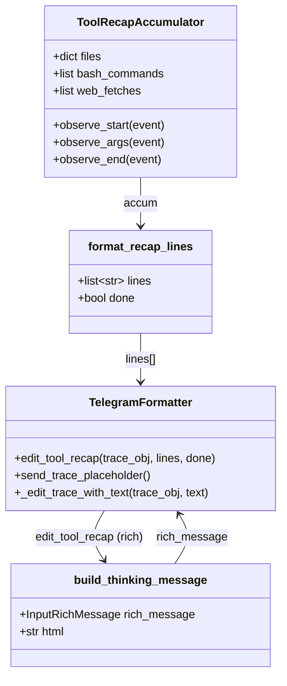
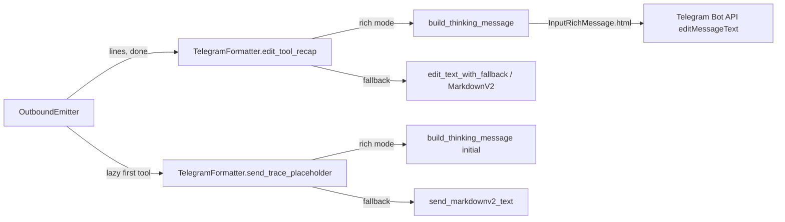

## Context

Source: `artifacts/frames/1952-telegram-tool-recap-tg-thinking-frame.mdx` (approved
2026-06-24).

#1214 rebuilt the tool recap card on v2 events; content formatting lives in
`factory.outbound._tool_recap.format_recap_lines`. Telegram delivery still uses
plain MarkdownV2 via `edit_text_with_fallback` in `edit_tool_recap`, while
reasoning trace already routes through `build_thinking_message()` → collapsible
`<tg-thinking>` HTML (#1951). Dependencies #1950 (backtick audit) and #1951
(thinking-block streaming) are closed.

**Phase 1 (this spec):** move recap delivery into `<tg-thinking>` in rich mode.
**Phase 2 (follow-up):** section headers, per-file operation counts, hyperlink
URLs — out of scope here.

## Goal

In Telegram rich mode, the per-turn tool recap renders inside a collapsible
`<tg-thinking>` block so secondary tool activity is hidden by default while
preserving the exact recap line content from `format_recap_lines`.

## Users

- **Primary:** Telegram users in private/group chats running multi-tool agent
  turns — cleaner chat layout with expandable tool breakdown.
- **Secondary:** Developers inspecting agent activity by expanding the thinking
  block during debugging.

## Expected Behavior

### Rich mode (`FACTORY_TELEGRAM_RICH_MESSAGES=1`)

1. On first tool event, `send_trace_placeholder` creates a trace message whose
   body is wrapped in `<tg-thinking>` (initial content: `🔧 …`).
2. Each `edit_tool_recap` call edits that message with
   `rich_message=build_thinking_message(joined_lines)` — same escape/HTML path
   as `edit_reasoning`.
3. Recap text inside the block preserves `format_recap_lines` output verbatim
   (emoji headers, backtick-wrapped paths/commands, silent counts). No markdown
   italic wrapper (`*…*`) is applied.
4. Final state shows `🔧 Done ✅` header inside the collapsed block.
5. Intermediate state shows `🔧 Working…` header inside the collapsed block.
6. Reasoning + tool recap continue sharing the single `StreamingSession._trace_obj`
   slot (last writer during stream; recap wins on `done=True` — unchanged #1214
   invariant).

### Fallback mode (`FACTORY_TELEGRAM_RICH_MESSAGES=0`)

Behavior unchanged: `send_trace_placeholder` and `edit_tool_recap` use existing
MarkdownV2 paths (`send_markdownv2_text` / `edit_text_with_fallback`).

### Edge cases

| Case | Handling |
|------|----------|
| Empty `lines` in `edit_tool_recap` | No-op (unchanged) |
| `trace_obj is None` | Emitter skips edit (unchanged) |
| Telegram API edit failure | Log at `debug`, non-fatal (same as reasoning) |
| LLM-derived content with `<`, `>`, `&` | `html.escape` via `build_thinking_message` |
| Backticks in paths/commands | Preserved as literal text inside escaped HTML |
| Web URLs in recap | Remain backtick-neutralised (no hyperlinks) in Phase 1 |

## Data Model & Consumers

### Data structure diagram



### Consumer map



### Consumer summary

| Consumer | Fields / output | When | Status |
|----------|-----------------|------|--------|
| `edit_tool_recap` | `lines: list[str]`, `done: bool` | Each debounced tool-recap edit + final | **This issue** |
| `send_trace_placeholder` | initial `🔧 …` text | First tool/reasoning trace per turn | **This issue** (rich wrap) |
| `format_recap_lines` | recap line strings | Upstream in emitter | Unchanged (#1214) |
| Discord `edit_tool_recap` | embed lines | Multi-tool turns | Future / out of scope |

## Breadboard

### UI affordances

| ID | Affordance | Handler | Data |
|----|------------|---------|------|
| U1 | Collapsible tool recap block | `edit_tool_recap` | `lines[]` from `format_recap_lines` |
| U2 | Trace placeholder seed message | `send_trace_placeholder` | `"🔧 …"` initial text |

### Nodes

| ID | Node | Input | Output |
|----|------|-------|--------|
| N1 | `TelegramFormatter.edit_tool_recap` | `trace_obj`, `lines`, `done` | `edit_message_text(rich_message=…)` |
| N2 | `TelegramFormatter._edit_trace_with_text` | `trace_obj`, `text` | shared rich/fallback edit path |
| N3 | `build_thinking_message` | plain text | `InputRichMessage` with `<tg-thinking>` HTML |
| N4 | `TelegramFormatter.send_trace_placeholder` | — | new trace `Message` |
| N5 | `format_recap_lines` | `ToolRecapAccumulator`, `done` | ordered `list[str]` |

### Wiring

```
ToolCall* events → OutboundEmitter._tool_recap → format_recap_lines
  → N1.edit_tool_recap → (rich?) N3.build_thinking_message → Telegram API
First tool event → N4.send_trace_placeholder → (rich?) N3("🔧 …") → Telegram API
Reasoning events → N2._edit_trace_with_text → N3 → same trace_obj slot as U1
```

## Slices

| Slice | Scope | Files (expected) | Demo |
|-------|-------|------------------|------|
| SL1 | Rich `edit_tool_recap` via `_edit_trace_with_text` / `build_thinking_message`; fallback unchanged | `telegram_formatter.py` | Unit test: edit call carries `<tg-thinking>` HTML with recap lines |
| SL2 | Rich `send_trace_placeholder` initial message wrapped in `<tg-thinking>` | `telegram_formatter.py` | Unit test: first send uses thinking block HTML |
| SL3 | Regression tests: content parity, HTML escape, no `*` wrapper, fallback path | `tests/adapters/test_telegram_tool_recap_rich.py` (new) or extend existing telegram adapter tests | `uv run pytest` green |

## Success Criteria

- [ ] Rich mode `edit_tool_recap` calls `edit_message_text` with `rich_message` whose `html` contains `<tg-thinking>` and the joined recap lines (SC1)
- [ ] Rich mode `edit_tool_recap` does NOT wrap recap text in markdown italic `*` characters (SC2)
- [ ] Rich mode `send_trace_placeholder` sends initial trace content inside `<tg-thinking>` (SC3)
- [ ] Fallback mode (`FACTORY_TELEGRAM_RICH_MESSAGES=0`) behavior is unchanged for both methods (SC4)
- [ ] HTML metacharacters in tool paths/commands are escaped and do not break the thinking block (SC5)
- [ ] `format_recap_lines` output order and content are unchanged — adapter-only delivery change (SC6)
- [ ] New/updated tests cover SC1–SC5; full pytest suite passes (SC7)
- [ ] Phase 2 formatting (section headers, per-file counts, hyperlinks) is NOT implemented in this issue (SC8)