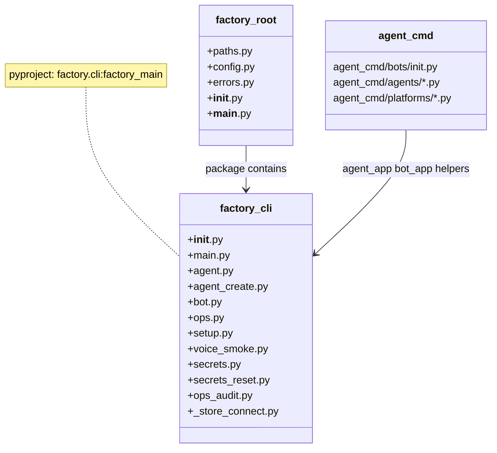
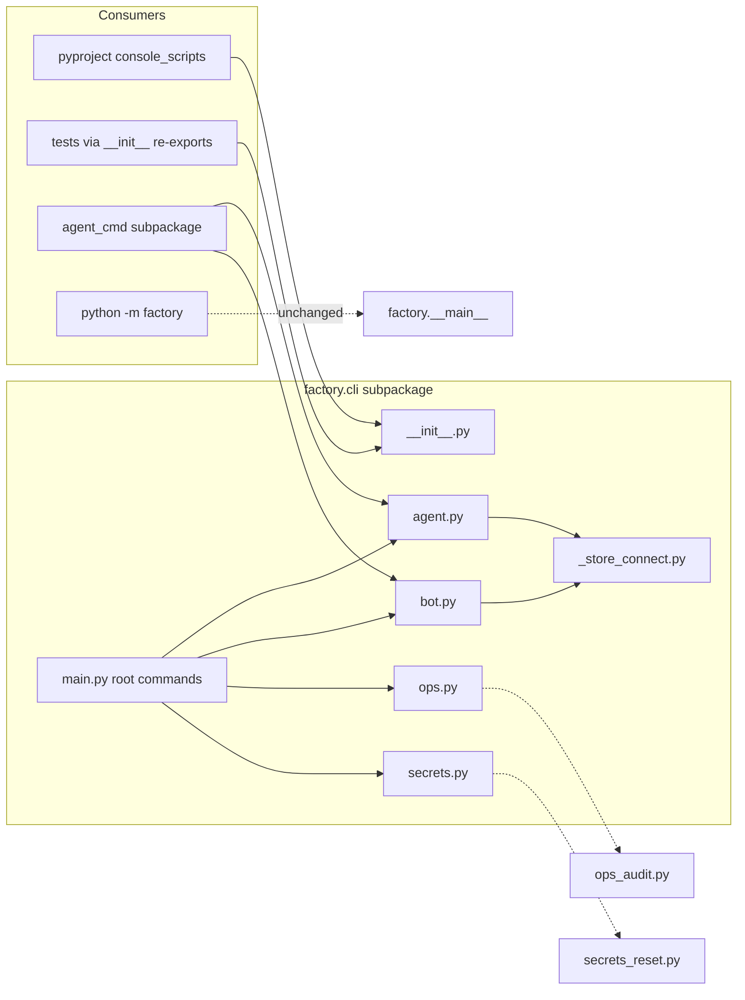

## Context

Promoted from [frame #1959](../frames/1959-factory-cli-subpackage-refactor-frame.mdx).

Parent epic: #1956 (factory package hygiene). This slice decomposes CLI modules only — no behavior changes.

**Correction vs issue table:** `__main__.py` is the `python -m factory` server bootstrap (hub + adapters), not a CLI module. It **stays at root** alongside `paths.py`, `config.py`, `errors.py`, `__init__.py`.

**Migration constraint:** Today `factory.cli` resolves to the **file** `src/factory/cli.py`. Creating `src/factory/cli/` (package) requires an **atomic** change: delete `cli.py` and add `cli/main.py` + `cli/__init__.py` in the same commit. `pyproject.toml` entry points are already `factory.cli:factory_main` / `factory.cli:agent_main` — no script-path change, only backing layout.

**File budget:** Post-move `factory/cli/` lands at exactly 12 files (at cap). Next CLI addition will need a follow-up split — out of scope here.

## Out of Scope

- Functional changes to any CLI command or server bootstrap
- Moving non-CLI modules (`core/`, `bootstrap/`, `agent_cmd/`, etc.)
- New CLI features or commands
- Optional nested subpackages (`factory/cli/secrets/`, `factory/cli/ops/`) — flat `factory/cli/` is sufficient
- ADR or architecture doc rewrites

## Goal

Move 10 CLI-related modules from `src/factory/` root into `src/factory/cli/`, leaving root at exactly 5 `.py` files, remove the `src/factory` folder exemption, and keep all entry points + tests green.

## Users

- **Primary:** Developers adding or maintaining factory CLI commands — so new CLI modules land under `factory/cli/` without exemptions
- **Secondary:** CI / pre-push hooks (`check_folder_size.sh`, pytest)

## Expected Behavior

1. Create `src/factory/cli/` subpackage with `__init__.py` re-exporting public CLI surface (`factory_main`, `agent_main`, `factory_app`, `agent_app`, `main` backward-compat alias) so `pyproject.toml` entry points remain unchanged.

2. **Atomically** replace `src/factory/cli.py` with the package:
   - Delete `src/factory/cli.py`
   - Create `src/factory/cli/main.py` (former `cli.py` content)
   - Create `src/factory/cli/__init__.py` (re-exports)

3. Move remaining modules from `src/factory/` → `src/factory/cli/`:

   | Source (root) | Target (`factory/cli/`) |
   |---|---|
   | `cli_agent.py` | `agent.py` |
   | `cli_agent_create.py` | `agent_create.py` |
   | `cli_bot.py` | `bot.py` |
   | `cli_ops.py` | `ops.py` |
   | `cli_setup.py` | `setup.py` |
   | `cli_voice_smoke.py` | `voice_smoke.py` |
   | `cli_secrets.py` | `secrets.py` |
   | `secrets_reset.py` | `secrets_reset.py` |
   | `ops_audit.py` | `ops_audit.py` |

4. Extract shared store-connect helpers into `factory/cli/_store_connect.py`:
   - `_get_db_path()` (deduplicated implementation)
   - `agent.py` / `bot.py` import from `_store_connect` but **keep exported names** `_connect_store`, `_connect_bot_store`, `_AGENTS_DIR_OPT`, `_maybe_publish_roster` at module boundaries — `agent_cmd/` updates import **paths only**, not symbol names

5. Fix intra-cli imports in Slice 1:
   - `cli/secrets.py`: `factory.secrets_reset` → `factory.cli.secrets_reset`
   - `cli/ops.py`: `factory.ops_audit` → `factory.cli.ops_audit`
   - `cli/main.py`: all `factory.cli_*` → `factory.cli.*`; `importlib.import_module("factory.cli.agent_create")`

6. Update consumer import paths (Slice 2):
   - `src/factory/agent_cmd/**/*.py`
   - All test files + **mock patch target strings** (see table below)
   - `scripts/`: verified no `factory.cli_*` references today — re-grep before merge

7. Remove `src/factory` line from `tools/folder_exemptions.txt`.

8. `uv run pytest` and `tools/check_folder_size.sh` pass.

## Data Model & Consumers

| Consumer | Modules / symbols consumed | Status |
|----------|---------------------------|--------|
| `pyproject.toml` scripts | `factory_main`, `agent_main` via `factory.cli` | this issue — `__init__.py` re-export; paths unchanged |
| `tests/cli/*`, `tests/test_cli_*` | `factory_app`, `agent_app` via `from factory.cli import …` | this issue — import path update |
| `src/factory/agent_cmd/**` | `agent_app`, `bot_app`, `_connect_store`, `_connect_bot_store`, `_AGENTS_DIR_OPT`, `_list_from_dir`, `_parse_tools`, `_maybe_publish_roster` | this issue — path update to `factory.cli.agent` / `factory.cli.bot`; symbol names unchanged |
| `python -m factory` | `factory.__main__` | unchanged — stays at root |
| `factory.cli.secrets` | `factory.cli.secrets_reset` | this issue — subpackage import |

**Test import & patch paths requiring updates:**

| Test file | Current path / patch target | New path |
|-----------|----------------------------|----------|
| `tests/nats/test_ops_verify_matrix_drift.py` | `factory.cli_ops`, `factory.ops_audit` | `factory.cli.ops`, `factory.cli.ops_audit` |
| `tests/cli/test_cli_secrets_reset.py` | `factory.secrets_reset` (+ 6 patch strings) | `factory.cli.secrets_reset` |
| `tests/cli/test_ops_verify.py` | `factory.cli_ops` (+ 7× `patch("factory.cli_ops.…")`) | `factory.cli.ops` |
| `tests/cli/test_voice_smoke.py` | 5× `patch("factory.cli_voice_smoke.…")` | `factory.cli.voice_smoke` |
| `tests/cli/test_cli_setup.py` | `factory.cli_setup` (+ 5× patch strings) | `factory.cli.setup` |
| `tests/test_cli_wizard_create.py` | `factory.cli_agent_create` | `factory.cli.agent_create` |
| `tests/core/test_agent_refiner_cli.py` | 8× `factory.cli_agent` | `factory.cli.agent` |

## Breadboard

| Affordance | Handler module | Data / deps |
|------------|---------------|-------------|
| `factory` / `factory start` | `cli/main.py` → `_bootstrap_unified` | `config.toml`, NATS |
| `factory config show\|validate` | `cli/main.py` | `config.toml` |
| `factory hub` | `cli/main.py` | hub wiring |
| `factory adapter telegram\|discord\|clipool\|omp` | `cli/main.py` | adapter subprocesses |
| `factory blobstore` | `cli/main.py` → `factory.blobstore.cli` | blob mount |
| `factory turn-writer` | `cli/main.py` | NATS turn writer |
| `factory-agent` (backward compat) | `cli/main.py` → `agent_main` | agent sub-app |
| `factory agent *` | `cli/agent.py`, `cli/agent_create.py`, `agent_cmd/agents/*` | `AgentStore`, TOML agents dir |
| `factory bot *` | `cli/bot.py`, `agent_cmd/bots/*` | `BotStore`, Podman secrets |
| `factory ops *` | `cli/ops.py` | NATS ACL matrix |
| `factory ops verify` drift report | `cli/ops.py` → `cli/ops_audit.py` | ACL matrix JSON |
| `factory setup *` | `cli/setup.py` | bot registration |
| `factory secrets *` | `cli/secrets.py` → `cli/secrets_reset.py` | vault, keyring |
| `factory voice-smoke` | `cli/voice_smoke.py` | NATS voice subjects |
| Store connect (shared) | `cli/_store_connect.py` (impl); `agent.py`/`bot.py` re-export | `factory_data_dir()` → `config.db` |

## Slices

| # | Slice | Files | Demo |
|---|-------|-------|------|
| 1 | Scaffold + move + dedup | Atomically replace `cli.py` with package; move 9 modules; create `_store_connect.py`; fix intra-cli imports; add `__init__.py` re-exports. Repo intentionally red until Slice 2 (`agent_cmd` still on old paths). | `python -c "from factory.cli import factory_main, agent_main, factory_app, agent_app"` succeeds |
| 2 | Wire consumers | Update `agent_cmd/` import paths; update all test imports **and** `unittest.mock.patch` target strings (see table); re-grep `scripts/` | `uv run pytest tests/cli/ tests/test_cli_* tests/core/test_agent_refiner_cli.py tests/nats/test_ops_verify_matrix_drift.py -q` green |
| 3 | Gate | Delete `src/factory` exemption; run full pytest + folder-size | `tools/check_folder_size.sh` exit 0, `uv run pytest` green |

## Pre-check

| Check | Result |
|-------|--------|
| Testable criteria | ✓ — all `- [ ]` items binary (post-review: goal/SC aligned, patch paths added) |
| No dangling refs | ✓ — breadboard affordances covered by slices |
| Ambiguity budget | ✓ — 0 `[NEEDS CLARIFICATION]` items |
| Slice coverage | ✓ — scaffold → consumers → gate |
| Edge completeness | ✓ — module→package collision, patch strings, `_store_connect` rename policy documented |

Expert review (architect, doc-writer, product-lead): **needs improvement → addressed** in this revision.

## Success Criteria

- [ ] `src/factory/cli.py` no longer exists; `factory.cli` resolves to the package
- [ ] `src/factory/` root has exactly 5 `.py` files: `paths.py`, `config.py`, `errors.py`, `__init__.py`, `__main__.py`
- [ ] `src/factory/cli/` has exactly 12 `.py` files (10 moved + `__init__.py` + `_store_connect.py`)
- [ ] `from factory.cli import factory_main, agent_main, factory_app, agent_app` succeeds
- [ ] `tools/folder_exemptions.txt` no longer contains a `src/factory` entry
- [ ] `tools/check_folder_size.sh` passes for `src/factory/` and `src/factory/cli/`
- [ ] `factory` console script launches and prints `--help` without import error
- [ ] `factory-agent` console script launches and prints `--help` without import error
- [ ] `python -m factory` import path unchanged (`factory.__main__` resolves)
- [ ] `uv run pytest` passes with zero failures
- [ ] `rg 'factory\.cli[_\.]|factory\.secrets_reset|factory\.ops_audit' src/ tests/` returns zero matches at old top-level paths
- [ ] `_get_db_path` implementation exists in exactly one module (`factory/cli/_store_connect.py`)