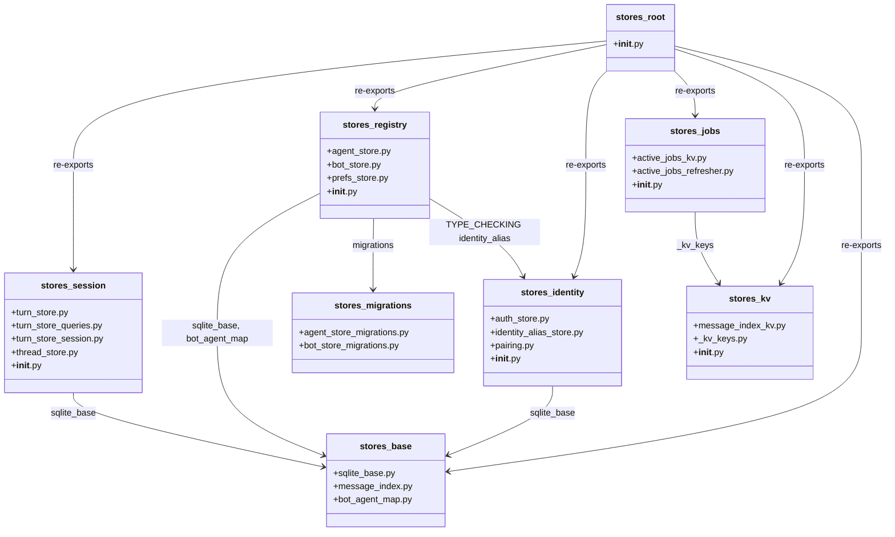
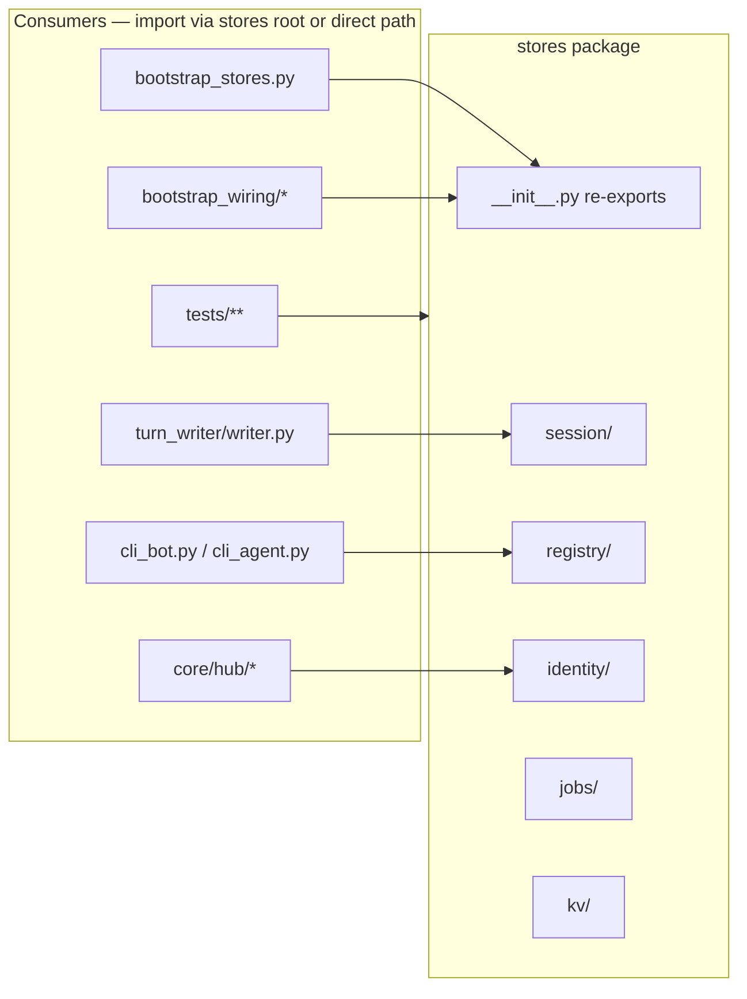

## Context

Promoted from [frame #1960](../frames/1960-refactor-stores-domain-subpackages-frame.mdx). Parent epic: #1956. Precedent: #1595 (lyra stores reorg). `base/` and `migrations/` subpackages already exist; this issue splits the 14 remaining root-level modules.

## Out of Scope

- No behavioral changes — only moves, import paths, and docstring path references
- No new abstractions, protocols, or schema changes
- No renaming of classes or functions
- `migration_runner.py` DRY across agent/bot migrations (optional follow-up in issue body)
- NATS or other folder reorgs
- Generated docs (`docs/architecture/CURRENT.generated.md`) — updated only if CI regen requires it

## Goal

Split `src/factory/infrastructure/stores/` root (15/15 `.py` files at `QG_FOLDER_MAX=15`) into five domain subpackages so every `stores/**` folder stays under the cap and developers can add new store files under e.g. `stores/session/` without hitting the root ceiling.

## Users

- **Primary:** Developers maintaining store implementations and bootstrap wiring
- **Secondary:** CI quality gates (`check_folder_size`, `.importlinter`, pytest)

**Outcome:** As a store maintainer, I can add a new module under a domain subpackage without touching `stores/` root or folder exemptions.

## Expected Behavior

1. Create five new subpackages under `stores/`:

   | Subpackage | Files moved | Post-move `.py` count |
   |---|---|---|
   | `stores/session/` | `turn_store.py`, `turn_store_queries.py`, `turn_store_session.py`, `thread_store.py` | 5 (incl. `__init__.py`) |
   | `stores/registry/` | `agent_store.py`, `bot_store.py`, `prefs_store.py` | 4 (incl. `__init__.py`) |
   | `stores/identity/` | `auth_store.py`, `identity_alias_store.py`, `pairing.py` | 4 (incl. `__init__.py`) |
   | `stores/jobs/` | `active_jobs_kv.py`, `active_jobs_refresher.py` | 3 (incl. `__init__.py`) |
   | `stores/kv/` | `message_index_kv.py`, `_kv_keys.py` | 3 (incl. `__init__.py`) |

2. Keep `stores/base/` and `stores/migrations/` unchanged.

3. Add `__init__.py` to each new subpackage.

4. Update `stores/__init__.py` to import from new subpackage paths; preserve current `__all__` exports exactly.

5. Each slice updates all direct submodule imports (`factory.infrastructure.stores.<module>`) for modules moved in that slice across `src/`, `tests/`, `tools/`, and matching `.importlinter` lines.

6. `tools/check_folder_size.sh` passes; no new folder exemptions required.

## Data Model & Consumers

**Consumer summary:**

| Consumer | Modules consumed | Status |
|----------|-----------------|--------|
| `bootstrap/bootstrap_stores.py` | AgentStore, AuthStore, BotStore, etc. | this issue — direct paths updated per slice |
| `bootstrap/wiring/auth.py` | AuthStore, IdentityAliasStore | this issue — direct paths updated in slice 2 |
| `bootstrap/factory/*`, `bootstrap/standalone/*` | AgentStore, PairingManager, ThreadStore, TurnStore | this issue — direct paths updated per slice |
| `infrastructure/turn_writer/` | TurnStore | this issue — slice 1 |
| `core/hub/hub.py` (TYPE_CHECKING) | identity_alias_store, pairing, prefs_store | this issue — `.importlinter` ignore paths updated |
| `tools/render_quadlet.py` | BotStore | this issue — slice 2 |
| `tests/**` (~40 files) | mixed root + direct imports | this issue — grep-driven updates per slice |

**Completeness check:** `rg 'factory\.infrastructure\.stores\.(turn_store|thread_store|turn_store_queries|turn_store_session|agent_store|bot_store|auth_store|identity_alias_store|pairing|prefs_store|active_jobs_kv|active_jobs_refresher|message_index_kv|_kv_keys)' src/ tests/ tools/ .importlinter` returns 0 matches after slice 3.

## Breadboard

| Old module path | New module path | Internal import updates |
|---|---|---|
| `stores.turn_store` | `stores.session.turn_store` | `turn_store_session` mixin; `base.sqlite_base` → `..base.sqlite_base` |
| `stores.turn_store_queries` | `stores.session.turn_store_queries` | — |
| `stores.turn_store_session` | `stores.session.turn_store_session` | `turn_store_queries` |
| `stores.thread_store` | `stores.session.thread_store` | `base.sqlite_base` → `..base.sqlite_base` |
| `stores.agent_store` | `stores.registry.agent_store` | `.base.*` → `..base.*`; `migrations.*` → `..migrations.*` |
| `stores.bot_store` | `stores.registry.bot_store` | `migrations.*` → `..migrations.*` |
| `stores.prefs_store` | `stores.registry.prefs_store` | `base.sqlite_base` → `..base.sqlite_base`; TYPE_CHECKING `identity_alias_store` → `..identity.identity_alias_store` |
| `stores.auth_store` | `stores.identity.auth_store` | `base.sqlite_base` → `..base.sqlite_base` |
| `stores.identity_alias_store` | `stores.identity.identity_alias_store` | `base.sqlite_base` → `..base.sqlite_base` |
| `stores.pairing` | `stores.identity.pairing` | `base.sqlite_base` → `..base.sqlite_base`; TYPE_CHECKING `auth_store` → `.auth_store` |
| `stores.active_jobs_kv` | `stores.jobs.active_jobs_kv` | `_kv_keys` → `..kv._kv_keys` |
| `stores.active_jobs_refresher` | `stores.jobs.active_jobs_refresher` | `active_jobs_kv` → `.active_jobs_kv` |
| `stores.message_index_kv` | `stores.kv.message_index_kv` | `_kv_keys` → `._kv_keys` |
| `stores._kv_keys` | `stores.kv._kv_keys` | — |
| `stores/__init__.py` | (stays at root) | Update all 12 submodule import lines to new paths; preserve `__all__` |

**`.importlinter` — 9 lines across 5 module targets:**

| Contract | Old path | New path |
|---|---|---|
| clean-architecture-layers | `stores.agent_store` (×3: agent_refiner, agent, simple_agent) | `stores.registry.agent_store` |
| clean-architecture-layers | `stores.identity_alias_store` (×3: memory, hub, hub_registration) | `stores.identity.identity_alias_store` |
| clean-architecture-layers | `stores.pairing` | `stores.identity.pairing` |
| clean-architecture-layers | `stores.prefs_store` | `stores.registry.prefs_store` |
| agents-no-bootstrap | `stores.agent_store` | `stores.registry.agent_store` |
| adapters-no-bot-store (forbidden) | `stores.bot_store` | `stores.registry.bot_store` |

**Test / mock string paths requiring update:**

| File | Old string path | New path | Slice |
|---|---|---|---|
| `tests/helpers/hub_standalone_bootstrap.py` | `stores.active_jobs_kv` / `active_jobs_refresher` | `stores.jobs.*` | 3 |
| `tests/test_bootstrap_credential_resolution.py` | `stores.thread_store`, `stores.turn_store` | `stores.session.*` | 1 |
| `tests/bootstrap/test_tool_display_wiring.py` | `stores.thread_store`, `stores.turn_store` | `stores.session.*` | 1 |
| `tests/bootstrap/test_agent_store_factory.py` | `stores.agent_store.AgentStore` | `stores.registry.agent_store.AgentStore` | 2 |
| `tests/core/test_bot_store_crud.py` | `stores.bot_store._utc_now_iso` | `stores.registry.bot_store._utc_now_iso` | 2 |
| `tests/core/test_turn_store.py` | `stores.turn_store_queries.backfill_sessions` | `stores.session.turn_store_queries.backfill_sessions` | 1 |

## Slices

Each slice is independently mergeable: moves + internal imports + root `__init__.py` + all external consumers + matching `.importlinter` lines for modules moved in that slice. `pytest` must pass after each slice.

| # | Slice | Scope | Breadboard covered | Demo |
|---|---|---|---|---|
| 1 | Session | Move 4 files → `session/`; fix internal + `..base` imports; update root `__init__.py` session lines; update all `turn_store`/`thread_store`/`turn_store_queries`/`turn_store_session` consumers in `src/`, `tests/`, `tools/` | session rows + `__init__.py` session lines + test string mocks (slice 1 table) | `uv run pytest` green; `python -c "from factory.infrastructure.stores import TurnStore, ThreadStore"` succeeds |
| 2 | Registry + identity | Move 6 files → `registry/` + `identity/`; fix `.base`→`..base`, TYPE_CHECKING cross-import; update root `__init__.py`; update all registry/identity consumers + 6 `.importlinter` lines | registry + identity rows + importlinter (agent, identity_alias, pairing, prefs, bot forbidden) + test string mocks (slice 2 table) | `uv run pytest` green; `python -c "from factory.infrastructure.stores import AgentStore, BotStore, AuthStore, PairingManager, PrefsStore"` succeeds |
| 3 | Jobs + kv + gate | Move `kv/` first, then `jobs/` (runtime dep: `active_jobs_kv` → `_kv_keys`); update root `__init__.py`; remaining consumers; `tools/render_quadlet.py` | jobs + kv rows + remaining consumers | `check_folder_size.sh` passes; `lint-imports` passes; `pytest` green; stale-path `rg` returns 0 |

## Pre-check

| Check | Result |
|---|---|
| Testable criteria | Pass — all checkboxes binary; `__all__` enumerated below |
| No dangling breadboard refs | Pass — every breadboard row mapped to a slice |
| Ambiguity budget | Pass — 0 `[NEEDS CLARIFICATION]` items |
| Slice coverage | Pass — all 14 moves + `__init__.py` + importlinter + string mocks assigned |
| Edge completeness | Pass — per-slice mergeability documented; `kv/` before `jobs/` ordering specified |

## Success Criteria

- [ ] `src/factory/infrastructure/stores/` root has exactly 1 `.py` file (`__init__.py`)
- [ ] Post-move counts: `session/` 5, `registry/` 4, `identity/` 4, `jobs/` 3, `kv/` 3 (each ≤ `QG_FOLDER_MAX=15`)
- [ ] `stores/base/` and `stores/migrations/` remain unchanged (no file moves)
- [ ] `from factory.infrastructure.stores import` succeeds for all 15 `__all__` symbols: `AgentStore`, `AuthStore`, `BotAgentMapStore`, `BotStore`, `IdentityAliasStore`, `MessageIndex`, `MessageIndexKvStore`, `PairingManager`, `PrefsStore`, `SqliteStore`, `ThreadStore`, `TurnStore`, `UserPrefs`, `get_pairing_manager`, `set_pairing_manager`
- [ ] Stale-path grep returns 0 matches: `rg 'factory\.infrastructure\.stores\.(turn_store|thread_store|turn_store_queries|turn_store_session|agent_store|bot_store|auth_store|identity_alias_store|pairing|prefs_store|active_jobs_kv|active_jobs_refresher|message_index_kv|_kv_keys)' src/ tests/ tools/ .importlinter`
- [ ] `tools/check_folder_size.sh` exits 0 with no `stores/**` violations
- [ ] `uv run lint-imports` exits 0
- [ ] `uv run pytest` exits 0 with no regressions
- [ ] Adding a new `.py` file under `stores/session/` does not increase `stores/` root file count (structural outcome — verified by folder layout post-merge)