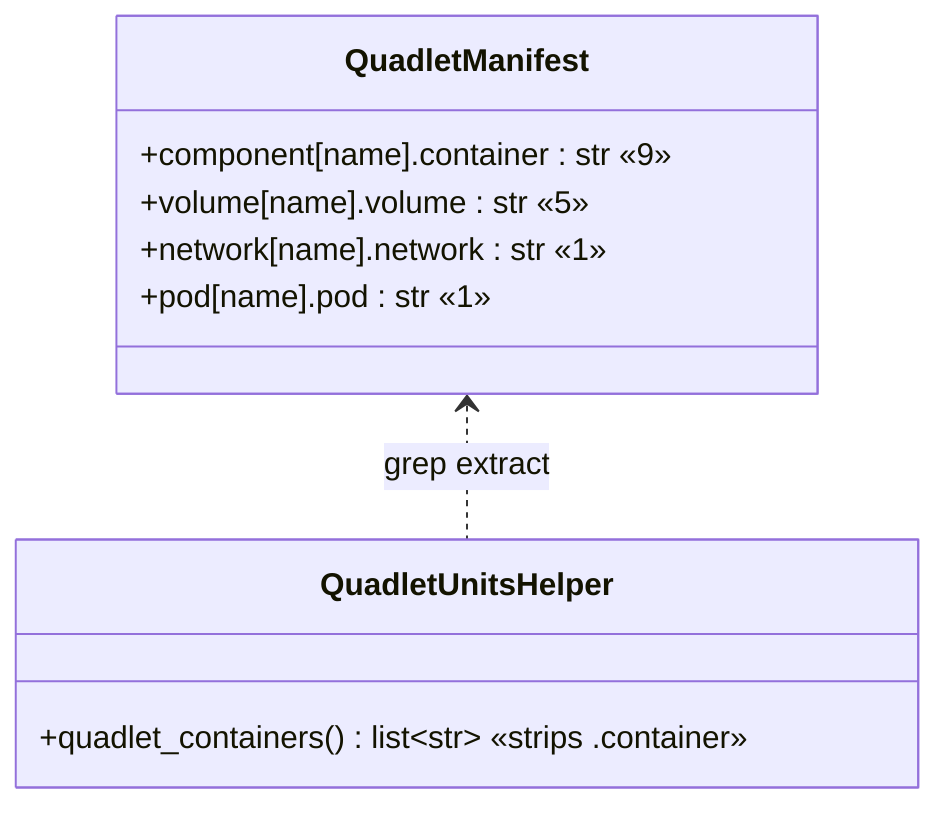
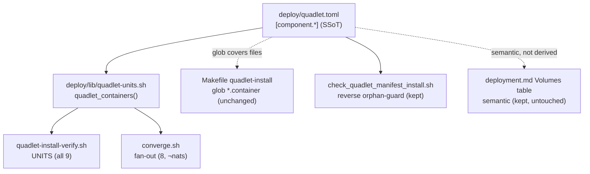

## Context

Source: `artifacts/frames/1979-quadlet-toml-ssot-codegen-frame.mdx` (approved).

**The frame's scope was corrected by reading the code.** Two frame assumptions did not survive:

1. **The Makefile does not enumerate units.** `quadlet-install` (Makefile:149) *globs* `deploy/quadlet/*.{network,volume,pod,container}` and copies all of them. There is no "Makefile UNITS array" to generate. Install-by-glob is already SSoT-free.
2. **The docs Volumes table is semantic, not derivable.** `docs/architecture/deployment.md` `## Volumes` has columns `Volume | File | Container(s) | Access | Contents` — the File/Access/Contents cells are hand-authored knowledge (what each volume holds), not a projection of `quadlet.toml`. It cannot be codegen'd from the manifest.

The **actual** hand-maintained duplication of the container list is exactly two places, both shell:

| Source | Lines | Holds |
|---|---|---|
| `deploy/quadlet-install-verify.sh` | 17–27 | `UNITS=(…)` — **9** containers incl. `factory-nats` |
| `deploy/converge.sh` | ~98 | `for svc in …` structural restart fan-out — **8** containers, **excludes** `factory-nats` (own `_restart_nats` path) |

Their orderings even differ from each other and from `quadlet.toml`, confirming they drifted independently. `deploy/quadlet.toml` `[component.*]` (9 entries) is the natural source of truth.

## Goal

`deploy/quadlet.toml` becomes the **only** hand-edited place the container list lives; `verify.sh` and `converge.sh` derive their lists from it, so adding/renaming a container no longer touches them.

## Users

- **Primary:** maintainer editing `deploy/` to add/rename/remove a factory container.
- **Secondary:** the M₁ converge path (`make converge`, `factory-quadlet-sync.timer`) that runs `verify.sh` + `converge.sh`; CI running the pre-push gates.

## Expected Behavior

**Adding a container — before:** edit `quadlet.toml` + create the `.container` file + add to `verify.sh` UNITS + add to `converge.sh` fan-out (remembering nats is exempt) → if you miss one, `check_quadlet_manifest_install.sh` fails the push (or, pre-#1867, it shipped broken — #1858).

**Adding a container — after:** edit `quadlet.toml` + create the `.container` file. `verify.sh` and `converge.sh` read the list from `quadlet.toml` at run time. Nothing else to touch; the forward-drift gate arms become unfalsifiable by construction.

### Core design decision (surfaced for the gate)

> ── Decision: how does the list get from quadlet.toml into the two scripts ──
>
> **Option A — Codegen + commit.** A `make generate` writes the `UNITS=()` block and the `for svc in` line into the scripts as generated-but-committed content; a new drift-check gate re-runs the generator and diffs. Matches the repo's existing `qg.conf` generated-but-committed pattern (auditable in-file), but adds a generator *and* a drift gate (more machinery, the opposite of the goal).
>
> **Option B — Runtime derivation.** A ~10-line shared helper `deploy/lib/quadlet-units.sh` extracts the container list from `quadlet.toml` (grep, the same `grep -oE '^container = "[^"]+"'` the gate already uses — no python dep). `verify.sh` and `converge.sh` source it and `mapfile` the list live. No generated files, no codegen step, no drift gate. The forward arms of `check_quadlet_manifest_install.sh` become structurally impossible to violate.   ← **recommended**
>
> Recommended: **Option B** — the issue says "codegen", but runtime-derivation is strictly less machinery and better serves the goal (reduce scripts). It eliminates the lists *and* a gate instead of trading two hand-lists for a generator + a drift gate.

The spec below assumes **Option B**. (Option A is a drop-in alternative for slices S2–S3 if the gate prefers committed/auditable artifacts.)

## Data Model & Consumers





| Consumer | Reads from quadlet.toml | When | Status (this issue) |
|---|---|---|---|
| `quadlet-install-verify.sh` UNITS | all `[component.*]` containers | every `make quadlet-install` | **this issue** — derive via helper |
| `converge.sh` fan-out | `[component.*]` minus `factory-nats` | structural-drift converge | **this issue** — derive via helper |
| Makefile `quadlet-install` | glob of `deploy/quadlet/*` | install | unchanged (already glob) |
| `check_quadlet_manifest_install.sh` | toml ↔ on-disk + verify/converge | pre-push + CI | **this issue** — drop forward verify/converge arms, keep reverse orphan-guard + makefile arm |
| `check_volumes_table.sh` | Volume= ↔ docs table | pre-push + CI | unchanged (semantic) |
| `deployment.md` Volumes table | — | docs | unchanged (semantic) |

## Breadboard

| Affordance | Handler | Data |
|---|---|---|
| N1 `quadlet_containers()` | new `deploy/lib/quadlet-units.sh` | see hardened contract below |
| N2 verify UNITS | `quadlet-install-verify.sh` sources N1, `mapfile -t UNITS < <(quadlet_containers)` + **floor guard** `[[ ${#UNITS[@]} -ge 9 ]] \|\| exit 1` | replaces lines 17–27 |
| N3 converge fan-out | `converge.sh` sources N1, **array form** (¬`$(...)` in `for`): `mapfile -t _all < <(quadlet_containers)`; floor guard `≥9`; `mapfile -t _clients < <(printf '%s\n' "${_all[@]}" \| grep -v '^factory-nats$' \|\| true)`; `for svc in "${_clients[@]}"` | replaces the literal `for svc in …` |
| N4 slim gate | `check_quadlet_manifest_install.sh` drops **only the two grep `if` arms** (lines 55–58 verify-array + 60–65 converge-fan-out); keeps the `while` loop + `count`, Makefile arm, volume/network/pod arms, reverse orphan-guard, zero-guard. Also update the stale header comment (7–24) + footer message (196–200), and patch the line-66 feed regex to the whitespace-tolerant form for consistency | net ~−15L, gate still guards orphans + #1858 |
| N5 stack.yml | update `quadlet_manifest_install` description to drop the "verify UNITS + converge fan-out" forward claim | doc accuracy |

### N1 — hardened helper contract (from expert review — blocking)

```bash
# deploy/lib/quadlet-units.sh  — sourced, never executed
quadlet_containers() {
    local toml
    toml="$(dirname "${BASH_SOURCE[0]}")/../quadlet.toml"   # cwd-independent (¬$0)
    [[ -f "${toml}" ]] || { echo "ERROR: quadlet.toml not found at ${toml}" >&2; return 1; }
    local -a out
    mapfile -t out < <(grep -oE '^container[[:space:]]*=[[:space:]]*"[^"]+"' "${toml}" \
        | cut -d'"' -f2 | sed 's/\.container$//' | tr -d '[:space:]')
    [[ ${#out[@]} -gt 0 ]] || { echo "ERROR: quadlet_containers parsed 0 containers from ${toml}" >&2; return 1; }
    printf '%s\n' "${out[@]}"
}
```

Requirements baked in: **(a)** `${BASH_SOURCE[0]}`-relative path (works from any cwd, sourced by `deploy/converge.sh` *and* `deploy/quadlet-install-verify.sh`); **(b)** file-existence guard; **(c)** whitespace-tolerant regex (`container=` / extra spaces both legal TOML); **(d)** `.container` suffix stripped + trailing-whitespace stripped (a leaked suffix would make N3's `grep -v '^factory-nats$'` miss → NATS restarted twice mid-converge); **(e)** hard-fail `return 1` on empty parse — never emit an empty list silently.

### Confirmed safe by review (no action)

- **Declaration order** is a safe canonical restart order: verify.sh, converge.sh, and quadlet.toml already have three *different* orderings, and every client unit declares `After=/Requires=factory-nats.service` so systemd enforces nats-first — no cross-client ordering dependency exists to lose.
- **Gate slim is safe**: #1858 (declared-but-not-installed) stays caught by the Makefile arm; #1813 (volume not installed) by the volume arm; #1901 (orphan on-disk file) by the reverse guard; the zero-guard survives (only the two grep `if` blocks drop, not the `while` loop). The forward verify/converge arms *must* go — after derivation the names are no longer literal in those scripts, so the arms would false-positive on every container.
- **`deploy/lib/` placement** matches `deploy-common.sh` / `env.sh`.

## Slices

| # | Slice | Demo |
|---|---|---|
| S1 | Add `deploy/lib/quadlet-units.sh` `quadlet_containers()` + a unit test asserting it emits the exact 9 current containers in declaration order | `bash -c 'source deploy/lib/quadlet-units.sh; quadlet_containers'` prints the 9 |
| S2 | Rewire `quadlet-install-verify.sh` (N2) + `converge.sh` (N3) to source the helper; `factory-nats` exclusion preserved | `grep -c 'factory-' …` shows lists now derived; `make converge` dry-run (`NO_RESTART`/already-converged) unchanged |
| S3 | Slim `check_quadlet_manifest_install.sh` (N4) + update `.claude/stack.yml` description (N5); gate still red on an orphan on-disk unit + on a toml entry whose `.container` file is missing | add a fake `[component.x]` with no file → gate FAILs; remove → passes |
| S4 | Verify the existing manifest is unchanged end-to-end: derived verify UNITS == old 9, derived converge fan-out == old 8; run all pre-push gates | `tools/check_quadlet_manifest_install.sh` passes; lists match pre-change behavior |

## Success Criteria

- [ ] `deploy/lib/quadlet-units.sh::quadlet_containers()` emits exactly the 9 current containers, in `quadlet.toml` declaration order, with `.container` stripped.
- [ ] `quadlet-install-verify.sh` no longer contains a hand-written `UNITS=(…)` literal; its list is sourced from the helper and equals the prior 9.
- [ ] `converge.sh` no longer contains a hand-written `for svc in factory-…` literal; its list is sourced from the helper, equals the prior 8, and still excludes `factory-nats`.
- [ ] Adding a 10th `[component.*]` to `quadlet.toml` (+ its `.container` file) makes it appear in both verify and converge with **zero** edits to those scripts (proven by test/dry-run).
- [ ] `check_quadlet_manifest_install.sh` still FAILs on (a) an on-disk unit file absent from `quadlet.toml` (reverse orphan-guard) and (b) a `[component.*]` not installed by the Makefile arm; it no longer contains the verify-UNITS / converge-fan-out grep arms; its header comment + footer message no longer reference them.
- [ ] `.claude/stack.yml` `quadlet_manifest_install` description no longer claims it checks "verify UNITS + converge fan-out".
- [ ] **Fail-closed:** `quadlet_containers()` returns non-zero (¬empty list) when `quadlet.toml` is missing/unreadable; both `verify.sh` and `converge.sh` assert `[[ ${#…[@]} -ge 9 ]]` after populating their arrays and `exit 1` below the floor (no false-green install, no silent no-op converge).
- [ ] **pipefail-safe:** `converge.sh` uses the array form (no `$(…)` in `for`), and the `grep -v factory-nats` stage cannot abort the script (`|| true`); `factory-nats` is still never in the client fan-out.
- [ ] All pre-push gates pass; `make converge` on an already-converged tree is a no-op (no spurious restart).
- [ ] Net deploy-tooling line count drops (lists + gate arms removed > helper added).

## Scope correction vs frame (explicit)

- `check_volumes_table.sh` (162L) is **NOT deleted** — the Volumes table is semantic. Frame's "-365L / delete 2 gates" is revised: we slim one gate (~−25L) and remove ~20L of hand-lists, add ~12L helper. Net is a **smaller line win** than the frame estimated, but the *structural* win (container-add = no script edits + a forward-drift class made impossible) stands.
- If the gate panel wants the bigger line reduction, S4 can additionally fold the volume-list half of `check_volumes_table.sh` onto the helper — deferred as out-of-scope here to avoid touching semantic doc prose.
