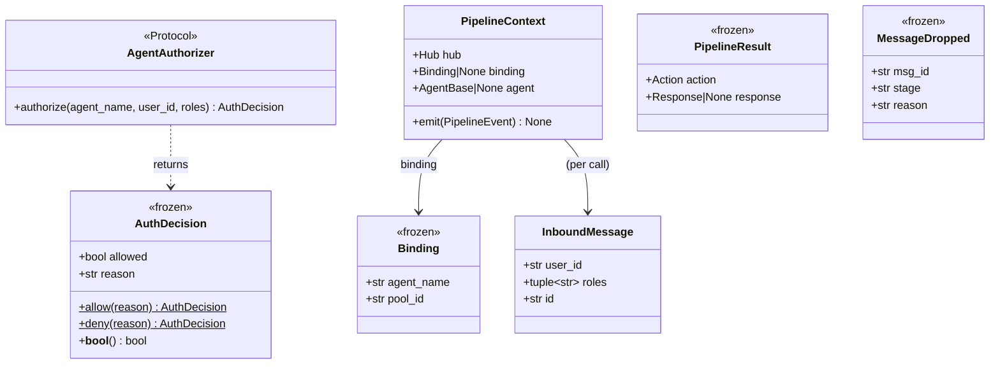
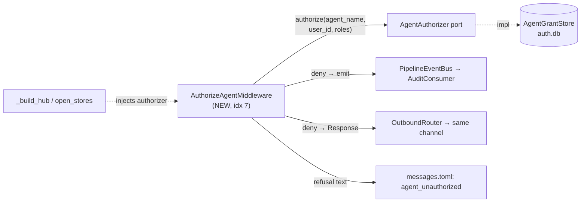

## Context

Source: [frame](../frames/1982-authorize-agent-middleware-frame.mdx) (analyze skipped — F-lite).
Slice of ADR-090 §5. Foundation slice #1981 (PR #2000) shipped the `AgentAuthorizer`
read port (`core/auth/agent_grants.py`) and the SQLite `AgentGrantStore`
(`infrastructure/stores/identity/agent_grant_store.py`) — but no callsite invokes
`authorize`, so the authorization matrix is inert. This slice wires enforcement
into the hub inbound pipeline.

## Goal

A new hub middleware stage, run after binding resolution, refuses (by inline pull
reply + audit event) any inbound principal that lacks a `USE` grant on the bound
agent, and lets authorized principals pass through unchanged.

## Users

- **Primary:** operators of multi-tenant agents — grants they write now gate live traffic.
- **Secondary:** end users (Telegram/Discord/CLI) — unauthorized users get a clear
  inline refusal instead of silent loss; authorized users see no change.

## Expected Behavior

Inbound message flows through the 11-stage hub pipeline. At the new stage (index 7,
immediately after `ResolveBindingMiddleware` set `ctx.binding`/`ctx.agent`, before
`MessagePrepMiddleware`):

1. **Defensive pass-through** — `ctx.binding is None` or `ctx.agent is None`:
   `await next(...)`. (ResolveBinding already `DROP`ped such messages; this is a
   guard only — deny-safe per ADR-090 §5.)
2. **Fail-open when unwired** — `self._authorizer is None`: `await next(...)`. Keeps
   tests and any not-yet-wired bootstrap path working; production wires it for real
   (Slice 2) so `None` never occurs in prod.
3. **Authorize** — `decision = authorizer.authorize(agent_name=ctx.binding.agent_name,
   user_id=msg.user_id, roles=msg.roles)` (synchronous; `msg.user_id` is already the
   platform-prefixed principal key `tg:user:…`/`dc:user:…`; `msg.roles` is the
   message's role tuple, matched against `ROLE` grants).
   - `decision.allowed` → `await next(...)`.
   - else → **deny**: emit `MessageDropped(msg_id=msg.id, stage=type(self).__name__,
     reason="agent_unauthorized")`, then `return PipelineResult(action=COMMAND_HANDLED,
     response=Response(content=<refusal text>))`. `next()` is **not** called → no pool
     submission, agent never reached.

The `COMMAND_HANDLED` result flows to `Hub._dispatch_pipeline_result` →
`OutboundRouter` → reply on the **originating** channel (same platform/bot/scope) — no
DM channel opened ("pull", not "push"). `MessageDropped` is drained by the existing
`AuditConsumer`.

**Refusal text** resolves via `ctx.hub.get_message("agent_unauthorized")` (the
`MessageManager`/`messages.toml` path used by `generic`/`rate_limit`); a module-level
constant is the fallback when `msg_manager is None`. Text points to the public bot /
`factory.roxabi.dev` (no per-platform `@handle` — deferred, see Out of Scope in frame).

**Exception policy:** the port contract guarantees `authorize` is a pure non-raising
cache read (`AuthDecision` is fail-safe by construction → deny default). The stage does
**not** wrap it in a broad `except` (avoids an unjustified `except Exception` +
needless security-auditor churn); if the contract is ever violated and it raises, the
existing `Hub.run()` top-level `except Exception` (hub.py:219) logs and drops the
message — fail-closed by emergence, no special-casing.

**Action naming nuance:** `Action.COMMAND_HANDLED` is reused (not a new enum member) —
it is the pipeline's generic "terminal: a reply was produced, do not submit to pool"
signal, already used by `CommandMiddleware`'s error path for non-command replies.

## Data Model & Consumers

### Data structures (existing — consumed, not created)

### Consumer map

### Consumer summary

| Consumer | Fields/API used | When | Status |
|---|---|---|---|
| `AuthorizeAgentMiddleware` | `authorize(agent_name, user_id, roles)` | every inbound msg post-binding | this issue |
| `AuditConsumer` | `MessageDropped(reason="agent_unauthorized")` | on deny | this issue (existing consumer) |
| `OutboundRouter` | `PipelineResult(COMMAND_HANDLED, response)` | on deny | this issue (existing path) |
| `MessageManager` | key `agent_unauthorized` | on deny, building reply | this issue |
| operator grant CLI | `AgentGrantStore.grant/revoke` | out of band | future (#1983/#1984) |

## Breadboard

| ID | Affordance | Handler | Data |
|----|-----------|---------|------|
| N1 | `AuthorizeAgentMiddleware.__call__(msg, ctx, next)` | the stage logic above | reads `ctx.binding`, `ctx.agent`, `msg.user_id`, `msg.roles` |
| N2 | `AuthorizeAgentMiddleware.__init__(authorizer=None)` | stores `self._authorizer: AgentAuthorizer \| None` | port ref |
| N3 | refusal-text resolver | `ctx.hub.get_message("agent_unauthorized")` → fallback constant | `messages.toml` |
| N4 | `build_default_pipeline(..., authorizer=None)` | insert `AuthorizeAgentMiddleware(authorizer)` at index 7 | pipeline list |
| N5 | `Hub.__init__(..., authorizer=None)` + `Hub.run()` | store `self._authorizer`; pass to `build_default_pipeline` | hub instance |
| N6 | `StoreBundle.grant` + `open_stores` | `AgentGrantStore(auth.db)` connect/close | `auth.db` |
| N7 | `_build_hub` | `Hub(authorizer=deps.stores.grant)` | wiring |
| N8 | re-exports | `middleware_stages.py` + `middleware/__init__.py` `__all__` | module surface |

Wiring: `N6 → N7 → N5 → N4 → N1` (authorizer injection chain) · `N1 → N3` (refusal) ·
`N1 → AuditConsumer` (emit) · `N1 → OutboundRouter` (Response).

## Slices

| # | Slice | Affordances | Demo / proof | Independently shippable |
|---|-------|-------------|--------------|------------------------|
| S1 | **Authorization stage + refusal text + unit tests + stage-renumber docstrings** | N1, N2, N3, N4, N8 | `pytest tests/core/test_authorize_agent_middleware.py` green (allow/deny/pass-through/none/roles); pipeline-composition test asserts idx 7 + len 11 | yes (authorizer injected directly in tests; `build_default_pipeline` accepts kwarg but prod still passes `None` → no behavior change until S2) |
| S2 | **Live wiring** | N5, N6, N7 | `StoreBundle.grant` opened; `_build_hub` threads `authorizer`; prod hub now enforces | yes (no-op without S1's stage) |
| S3 | **Snapshot + ADR status** | — | `architecture_snapshot` regen committed; ADR-090 §5 marked implemented; `doc_drift`/`validate` green | yes |

All three land in one F-lite PR (the slices are review-ordering, not separate PRs — S1 alone would be dead code in prod, S2 alone has no stage).

## Success Criteria

- [ ] `src/factory/core/hub/middleware/middleware_authz.py` defines `AuthorizeAgentMiddleware` satisfying the `PipelineMiddleware` Protocol; imports only `AgentAuthorizer`/`AuthDecision` from `factory.core.auth.agent_grants` (+ intra-core) — **no `factory.infrastructure`/`factory.adapters` import**; `import_layers` gate green.
- [ ] **Allow:** a principal holding a `USE` grant on the bound agent → `authorize` returns `allowed` → stage awaits `next` (message proceeds to `MessagePrep`); no `MessageDropped` emitted. (unit test)
- [ ] **Deny:** a principal with no matching grant → stage emits exactly one `MessageDropped(stage="AuthorizeAgentMiddleware", reason="agent_unauthorized", msg_id=msg.id)` **and** returns `PipelineResult(action=Action.COMMAND_HANDLED, response=Response(content=…))`; `next` is **not** awaited. (unit test)
- [ ] **Refusal text:** resolved via `ctx.hub.get_message("agent_unauthorized")`, with a module-constant fallback when `msg_manager is None`; `messages.toml` has `agent_unauthorized` under `[errors.en]` **and** `[errors.fr]`, each referencing `factory.roxabi.dev`. (unit test asserts content on both paths)
- [ ] **Deny-safe:** `ctx.binding is None` **or** `ctx.agent is None` → stage awaits `next`, performs no `authorize` call, emits no event. (unit test)
- [ ] **Fail-open unwired:** `authorizer is None` → stage awaits `next`, no `authorize` call. (unit test)
- [ ] **Args forwarded:** stage calls `authorize(agent_name=ctx.binding.agent_name, user_id=msg.user_id, roles=msg.roles)` — verified e.g. by a `ROLE` grant + matching `msg.roles` → allow. (unit test)
- [ ] **Composition:** `build_default_pipeline` accepts `authorizer` kwarg and inserts the stage at **index 7** (between `ResolveBindingMiddleware` and `MessagePrepMiddleware`); pipeline length is **11**. (unit test); `AuthorizeAgentMiddleware` re-exported from `middleware_stages` + `middleware/__init__` `__all__`.
- [ ] **Live wiring:** `StoreBundle` gains `grant: AgentGrantStore` (on `auth.db`, connected/closed in `open_stores`); `_build_hub` passes `authorizer=deps.stores.grant` to `Hub(...)`; `Hub.__init__` stores `self._authorizer` and `Hub.run()` forwards it to `build_default_pipeline`. (wiring inspected + smoke: a hub built via `_build_hub` has a pipeline of length 11)
- [ ] **Stage renumber:** insertion-induced docstring skew fixed — `middleware_pool.py` header `(6–8)`→`(6–9)`, `MessagePrepMiddleware` `Stage 7`→`Stage 8`, `CommandMiddleware` `Stage 8`→`Stage 9` (`ResolveBindingMiddleware` stays `Stage 6`).
- [ ] **Gates:** `architecture_snapshot` regenerated + committed; `validate` (ruff/pyright/pytest) + `file_length` (≤300 sloc) + `folder_size` (middleware/ ≤15 files) all green; ADR-090 §5 status note updated.

## Edge Cases

| Edge | Handling |
|------|----------|
| `msg_manager is None` (Hub built without it) | refusal uses module-constant fallback (mirrors STT fallback pattern) |
| `authorize` raises (contract violation) | not caught in stage; `Hub.run()` top-level `except` drops msg → fail-closed |
| `msg.roles == ()` (no platform roles) | only `USER`-principal grants can match; expected for Telegram/CLI |
| binding resolves but agent has zero grants | `authorize` returns deny (`no grants for agent`) → refusal (correct: empty matrix = closed) |
| `agent_unauthorized` key missing from messages.toml | `MessageManager.get` behavior for missing key — covered by adding the key (criterion) + fallback constant |

## Expert Review Notes & Follow-ups

Panel (architect · product-lead · doc-writer · devops · axial-adr-review): **5/5 GOOD, no blockers.**
Axial: clean — stage-axis respected (one module `middleware_authz.py` at one index, auto-applied to all platforms), guard axis and authz axis orthogonal, port injected at composition root (no layer crossing). No N×M / target-axis-trap.

**Implementation notes (from review):**
- `open_stores` requires **4 edit sites** (declare `grant_store=None` before `try` → `connect()` inside `try` → add to `all_stores` close tuple in `finally` → `grant=grant_store` in the `StoreBundle(...)` yield) + the `StoreBundle` dataclass field. Missing the `finally` entry = connection leak.
- No migration guard needed — `CREATE TABLE IF NOT EXISTS agent_grants` is idempotent; auth.db pre-exists (AuthStore opens first). Cache is warm before first message (all `connect()` awaited before `yield`); `authorize` is a pure sync cache read.
- A third aiosqlite connection on `auth.db` (alongside `AuthStore` + `IdentityAliasStore`) is WAL-safe; add a one-line comment on `AgentGrantStore` noting the best-effort checkpoint contention (3 tasks) is expected.
- `Hub.__init__` already carries `# noqa: PLR0913 — DEBT:wiring-bootstrap-deps`; adding `authorizer` deepens that known debt (acceptable for F-lite, consistent with the existing approach).
- No deploy/quadlet/secrets change — `auth.db` already mounted in `factory-hub`; `quadlet_manifest_install`/`secrets_drift` gates won't fire.

**Follow-ups to file (deferred — out of this slice):**
- **`@bot_public` per-platform handle** — refusal text currently points only to `factory.roxabi.dev`. Resolving a real `@handle` needs a `BotRow` field / config; ADR-090 §5 names it but the issue accepts `factory.roxabi.dev` as a valid fallback. Track before close.
- **STT-before-authz waste** — `SttMiddleware` (idx 5) transcribes audio *before* authz (idx 7), so an unauthorized principal's voice note is still transcribed before refusal. Accepted (placement is a hard ADR constraint); file a waste-reduction follow-up (e.g. cheap pre-authz short-circuit for audio).
