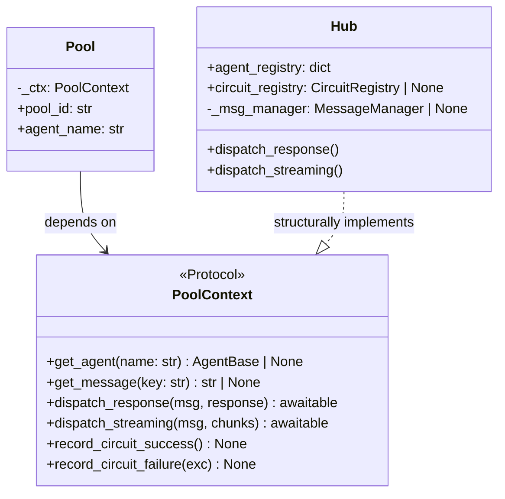
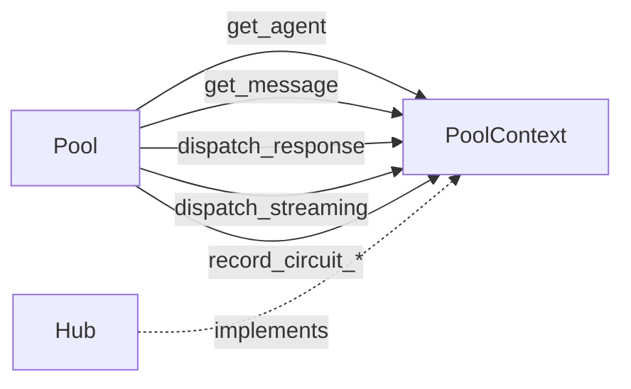

## Context

Promoted from [frame #204](../frames/204-pool-context-protocol-frame.mdx).
Parent: #198 (Codebase Audit — Top 10, item #2). ADR-017 Hotspot 1.

## Goal

Pool depends on a narrow `PoolContext` protocol instead of the full Hub, enabling isolated testing and reducing coupling.

## Users

- **Primary:** Maintainers — can change Hub internals without breaking Pool.
- **Secondary:** Test authors — can supply a lightweight fake instead of a full Hub.

## Expected Behavior

1. A `PoolContext` protocol class is defined (in `pool.py` or a dedicated `protocols.py`).
2. It exposes exactly the 5 surface points Pool needs: `get_agent`, `get_message`, `dispatch_response`, `dispatch_streaming`, `record_circuit_success`, `record_circuit_failure`.
3. Pool's `__init__` accepts `ctx: PoolContext` instead of `hub: Hub`.
4. Pool uses `self._ctx` for all Hub interactions — no direct Hub import at runtime.
5. Hub implements `PoolContext` structurally (no explicit inheritance needed — Python duck typing).
6. Hub passes `self` (or a thin wrapper) as `PoolContext` when creating Pool instances.
7. All existing tests pass without behavioral changes.

## Data Model & Consumers

| Consumer | Fields / Methods | When | Status |
|----------|-----------------|------|--------|
| Pool._process_loop | get_agent, get_message, record_circuit_failure | Every message turn | This issue |
| Pool._process_one | dispatch_response, dispatch_streaming, record_circuit_* | After agent.process | This issue |
| Pool._safe_dispatch | dispatch_response | Error fallback | This issue |

## Breadboard

| ID | Affordance | Handler | Data |
|----|-----------|---------|------|
| S1 | PoolContext protocol definition | N/A (type) | 6 methods |
| S2 | Pool.__init__ accepts PoolContext | Pool.__init__ | ctx param replaces hub |
| S3 | Pool methods use self._ctx | _process_loop, _process_one, _msg, _record_cb_*, _safe_dispatch | Delegate to protocol |
| S4 | Hub satisfies PoolContext | Hub methods + thin wrappers | get_agent, get_message wrap registry lookups |
| S5 | Hub passes self as PoolContext to Pool() | Hub._get_or_create_pool | self as ctx |

## Slices

| # | Slice | Demonstrates | Files |
|---|-------|-------------|-------|
| 1 | Define PoolContext + update Pool | Pool uses protocol, tests pass with fake | pool.py, tests |
| 2 | Hub implements PoolContext + wires it | Full integration, all tests green | hub.py |

## Success Criteria

- [ ] `PoolContext` protocol exists with 6 methods matching Pool's usage
- [ ] Pool constructor accepts `PoolContext` (not `Hub`)
- [ ] Pool has zero runtime imports from `hub` module
- [ ] Hub structurally satisfies `PoolContext` (pyright passes)
- [ ] All existing tests pass unchanged
- [ ] No behavioral changes — pure refactor
