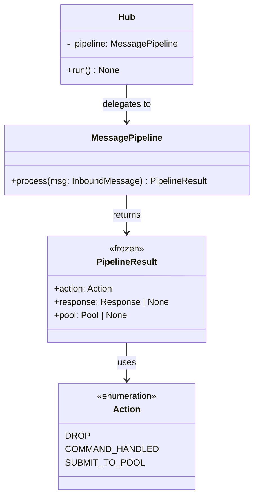
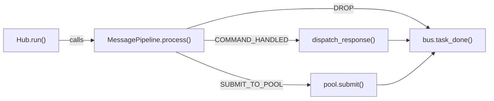

## Context

Promoted from [frame #208](../frames/208-hub-run-complexity-frame.mdx). Parent issue #198 (Codebase Audit, item #6). Blocker #204 (PoolContext) has landed.

## Goal

Reduce `Hub.run()` cyclomatic complexity from ~15 to ≤5 by extracting a `MessagePipeline` with discrete, testable stages, and replace the silent `except Exception: pass` in `_pairing_gate_drop` with logged error handling.

## Users

- **Primary:** Developers maintaining or extending Hub message routing
- **Secondary:** Operators relying on logs to diagnose failures

## Expected Behavior

When an `InboundMessage` arrives on the bus, `Hub.run()` delegates to `MessagePipeline.process(msg)` which runs the message through a fail-fast stage chain. Each stage either returns `None` (continue to next stage) or a `PipelineResult` (terminal — drop, command handled, or submit to pool). The first stage to return a non-`None` result wins. If all guard stages pass, the pipeline reaches the terminal stage (command dispatch or pool submit) which always returns a result.

`Hub.run()` remains the bus consumer loop: `await bus.get()` → `pipeline.process(msg)` → act on result → `bus.task_done()` in a `finally` block. The `task_done()` call stays in `Hub.run()` and is never moved into the pipeline.

The silent `except Exception: pass` in `_pairing_gate_drop` (hub.py:648-649) is replaced with `log.exception(...)` matching the pattern at `_circuit_breaker_drop` (hub.py:670):
```python
# Before (silent swallow):
except Exception:
    pass

# After (logged):
except Exception:
    log.exception("dispatch_response failed for pairing rejection: %s", key)
```

The `# noqa: C901` comment is removed from `Hub.run()`.

## Data Model & Consumers





| Consumer | Fields | When | Status |
|----------|--------|------|--------|
| `Hub.run()` | `PipelineResult.action`, `.response`, `.pool` | Every inbound message | This issue |

**Field constraints:**
- `action == DROP` → `.response` is `None`, `.pool` is `None`
- `action == COMMAND_HANDLED` → `.response` may be non-`None` (for `dispatch_response`), `.pool` is `None`
- `action == SUBMIT_TO_POOL` → `.response` is `None`, `.pool` is non-`None`

**Stage contract:** Each guard stage (S1–S6) returns `PipelineResult(DROP)` to stop processing, or `None` to continue. Terminal stages (S7, S8) always return a result. Exceptions from stages propagate to `Hub.run()` (no silent swallowing inside the pipeline). The adapter-registry miss in S8 produces `Action.DROP` with `log.error` (preserving current behavior).

## Breadboard

| ID | Affordance | Handler | Data |
|----|-----------|---------|------|
| S1 | Platform validation | `_validate_platform(msg)` | `msg.platform` → `Platform` enum |
| S2 | Rate limit check | `_check_rate_limit(msg)` | `msg` → bool |
| S3 | Binding resolution | `_resolve_binding(msg)` | `msg` → `Binding` or drop |
| S4 | Agent lookup | `_lookup_agent(binding)` | `binding.agent_name` → `AgentBase` or drop |
| S5 | Pool acquisition | `_get_pool(binding)` | `binding` → `Pool` |
| S6 | Pairing gate | `_pairing_gate_drop(msg, router, key)` | user pairing status → drop or continue |
| S7 | Command dispatch | command branch | `router.dispatch(msg, pool)` → `Response` |
| S8 | Adapter check + circuit breaker + pool submit | conversation branch | `pool.submit(msg)` |

## Slices

| Slice | Description | Stages | Deps | Independently testable |
|-------|------------|--------|------|----------------------|
| 1 | Fix silent except in `_pairing_gate_drop` | — | None | Yes (can land as its own commit) |
| 2 | Extract `MessagePipeline` with stages, simplify `Hub.run()` | S1–S8 | After slice 1 | Yes (all existing tests must pass) |
| 3 | Remove `# noqa: C901` and verify complexity | — | After slice 2 | Yes (complexity check) |

## Success Criteria

- [ ] `_pairing_gate_drop` logs exceptions instead of silently swallowing them
- [ ] `Hub.run()` delegates to `MessagePipeline.process()` for routing logic
- [ ] `Hub.run()` cyclomatic complexity ≤ 5 (no `# noqa: C901`)
- [ ] All existing hub tests pass without modification (pure refactor)
- [ ] New unit tests cover each pipeline stage independently
- [ ] No change in observable behavior (message routing, error replies, logging)
