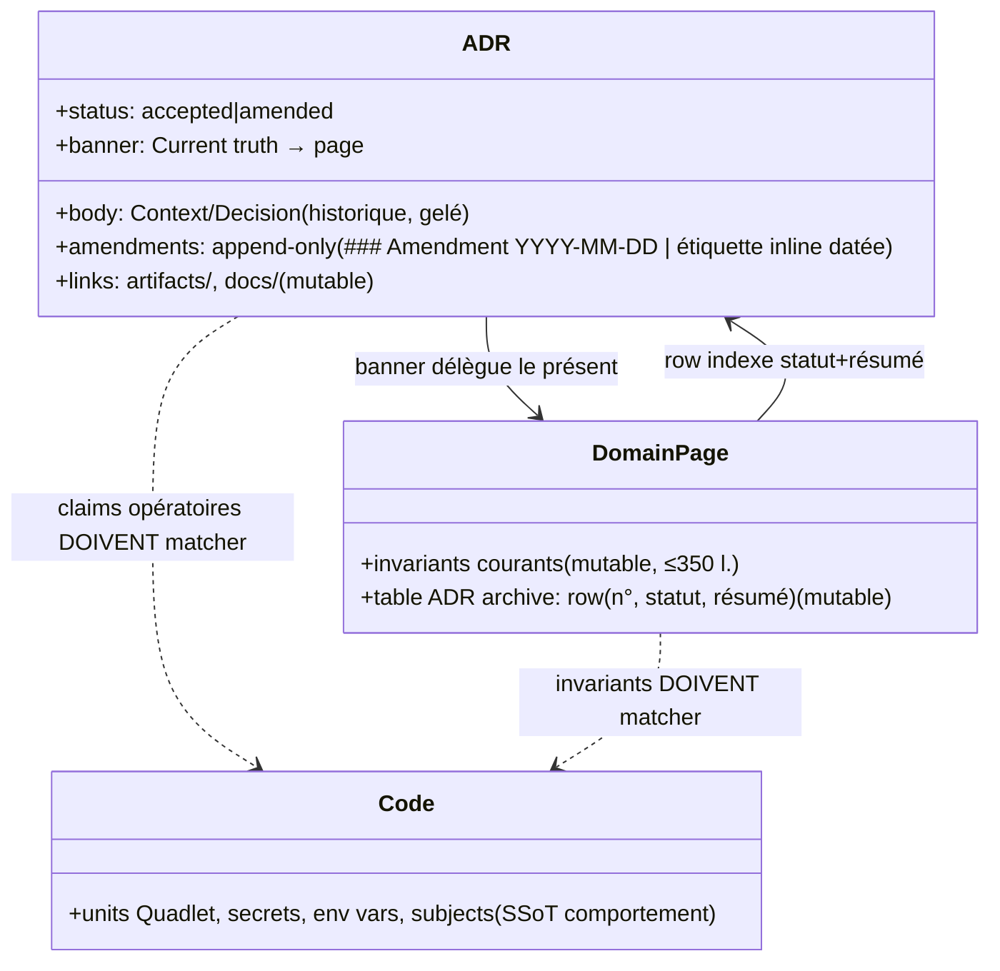
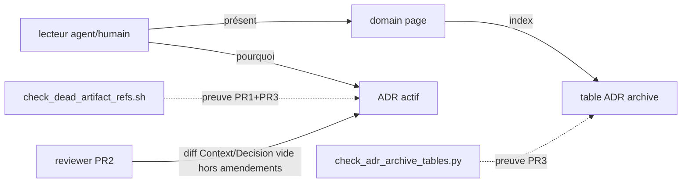

## Context

Audit #2221 terminé — SSoT des constats : `artifacts/analyses/2221-adr-coherence-audit-analysis.mdx` (« l'analyse ») : matrice 34×verdict (§ Matrice), 30 écarts med itemisés **M01-M30** (Appendix A), ~29 liens morts (§ Liens morts, rows #1-29), sweeps tables/relations (§ Sweeps), provers canoniques (Appendix B). Verdicts : 14 aligned · 14 amend-adr · 6 fix-page · 0 archive ; 0 high.

Règle transverse **N1** : lignes citées as-of `59d62150b` — chaque site se re-résout par **grep du contenu** au moment de l'édition, jamais par numéro de ligne (cas avéré : plan 1331 mort désormais adr/075:136).

## Goal

Un lecteur (agent ou humain) de n'importe quel ADR actif ou domain page n'y rencontre plus ni lien mort, ni commande/nom pré-rename qui échoue, ni index « ADR archive » mentant sur le sort d'un ADR — sans réécrire l'histoire décisionnelle.

## Users

- **Primary :** agents Claude + Mickael lisant `docs/architecture/` comme SSoT quotidien.
- **Secondary :** epic #2193 (AC lot 2) ; reviewers des 3 PRs.

## Expected Behavior

Tous les constats cités ci-dessous sont des rows de l'analyse (matrice / Page findings / Sweeps / table Liens morts) — l'implémenteur travaille depuis l'analyse, ce spec ordonne et arbitre.

1. **PR1 `docs(lot2): retarget liens morts artifacts/ + cibles déplacées`** — les rows #1-29 de la table « Liens morts » de l'analyse, **sauf #5 (079 `code-subjects.json`) qui part en PR2**. Retargets tombstone (`git show artifacts-archive/2026-06:…` / `cc05650ee^` / `84423dacb^` — vérifier `git show <ref>` résout AVANT d'écrire), cibles vivantes (spec 1331, `docs/history/PROD-MIGRATION-STRATEGY.md`), DROP + reformulation (#22, ligne plan de 075), docstring `image-request.py` → `artifacts/evidence/`. **Livre aussi les 2 provers** : `scripts/check_dead_artifact_refs.sh` + `scripts/check_adr_archive_tables.py` (source canonique = analyse Appendix B ; provers manuels, ¬wirés qg).
2. **PR2 `docs(lot2): amend 14 ADRs actifs — sections opératoires vs code`** — créée stacked sur la branche PR1, rebase après merge PR1 (fichiers partagés S1∩S2 : 071, 079, 055). Écarts amend-adr de M01-M29 : résidus lyra→factory opératoires (M01-M03, M09, M17, M22, M26), 079 `code-subjects.json`→`RESOURCES` (**5 occurrences, changement logique unique**), M14 note amendement 096 (ingress 4-segments), M15 banner 092 actualisé (trace+log engines déployés), M16 segment `generate`, M24 P1-6/7 done, M27 publish.yml bake self-contained, M29 `brand/core.css`+`reset.css`, + lows opportunistes (001 extract_scope_id, 076 progress subject…). **Mécanique d'amendement (template = ADR-046)** : frontmatter `status: amended` si pas déjà ; section `### Amendment (2026-07-04)` OU étiquette inline `*(2026-07-04 : …)*` au claim périmé (patterns 046:20, 046:87, 001:127) ; **les ADRs déjà amendés 2026-07-01 (001/008/046/049/068/073/076/010) reçoivent une note fraîche datée — ¬retoucher les blocs d'amendement existants** ; jamais de rewrite du Context/Decision historique.
3. **PR3 `docs(lot2): domain pages + tables ADR archive — index véridique`** — rebase après PR2 (fichier partagé S2∩S3 : **ADR-068 actif** — Application Map en PR2, note ① en PR3). Écarts fix-page de M01-M30 + Page findings + Sweeps :
   - messaging.md : extract_scope_id (M-page), producers Persistence=hub (M04), Typing=live, row 076 amendée ;
   - storage.md : CLI `factory`, data dir `blobstore/`, §memory → mention cortex/ADR-087 + row 087 (M12), rows 008/068 amended (M07/M10), row 075 ¬superseded (M11), rows archivés normalisés ;
   - security-routing.md : §nats-infra ×4 (M18-M20 : `gen_nkeys.py`, `_inbox.` minuscule, roster réel, `factory-check-flows`) + **création table « ADR archive »** (rows 046/051/090) ;
   - adapters.md : rows 073 (M21) / 083 (M23) + 7 rows archivés + header ;
   - job-model.md : « ADR-075 superseded by ADR-078 » supprimé — **re-grep `superseded by ADR-078` dans job-model.md, 3 occurrences** (Source header, See-also, row) (M30) + row 049 amended ;
   - deployment.md : **création table** (row 055).
   - **Arbitrages** : ① collision 068 = notes de désambiguïsation croisées (¬renumérotation — 0 lien cassé ; prochain numéro libre reste 102). Format (les 2 fichiers, sous le banner) :
     ```
     > **Numéro partagé** : ADR-068 désigne aussi [<l'autre décision>](<chemin relatif>) — accident historique, slugs distincts font foi.
     ```
     ② 11 rows archivés (adapters/storage) normalisées « Superseded by ADR-N — archived » (pattern messaging.md:298-305) ; ③ 086 + 101 : **mention prose courte** dans le ¶ « Decision archive » de `docs/ARCHITECTURE.md` (:26) — ¬table (ADR-086 a aboli les index séparés ; ne pas le re-violer en l'indexant) ; 093 statu quo (indexé via son banner target `docs/runbooks/operator-log.md:96`).

Chaque PR : `--base staging`, merge via label `reviewed`, ordre strict PR1 → PR2 → PR3.

## Data Model & Consumers



Format amendements (existant, template ADR-046) : section `### Amendment (YYYY-MM-DD)` après `## Status`, ou étiquette inline `*(YYYY-MM-DD : correction — …)*` collée au claim ; append-only.



| Consommateur | Champs consommés | Quand | Statut |
|---|---|---|---|
| Lecteur agent/humain | banner, amendments, rows, liens | quotidien | cette issue |
| `scripts/check_dead_artifact_refs.sh` | liens `artifacts/` hors artifacts/ | preuve SC1, PR1+PR3 | cette issue (livré PR1) |
| `scripts/check_adr_archive_tables.py` | rows × frontmatter status | preuve SC2, PR3 | cette issue (livré PR1) |
| Gate CI link-check | idem scan | si trigger failure 2027-01 (frame) | futur |

## Breadboard

| ID | Affordance | Edits | Slice |
|---|---|---|---|
| N1 | **règle première** : re-résolution des sites par grep de contenu, ¬numéros de ligne | avant CHAQUE édition | S1-S3 |
| U1 | liens/refs morts (analyse § Liens morts #1-29 moins #5) | retarget/DROP par row | S1 |
| U2 | 14 ADRs amend (M-amend de l'Appendix A + lows opportunistes) | notes datées / étiquettes inline (template 046) | S2 |
| U3 | 6 domain pages (M-fix-page + Page findings) | fix invariants | S3 |
| U4 | tables « ADR archive » (rows faux/manquants, 2 créations, arbitrages ①②③) | normalisation index | S3 |
| S1b | `scripts/check_dead_artifact_refs.sh` (livré PR1, canonique Appendix B) | sortie collée dans corps PR1 ET PR3 | S1, S3 |
| S2b | `scripts/check_adr_archive_tables.py` (livré PR1, canonique Appendix B) | sortie collée dans corps PR3 | S3 |

Wiring : U1→S1b (PR1 : 0 mort hors #5 documenté) ; U2 sans script (review humaine : diff des sections Context/Decision vide hors ajouts pattern amendement) ; U3+U4→S2b (PR3 : 0 mismatch) + S1b re-run (0 mort total).

## Slices

| # | Slice | Contenu | Démo/preuve | Dépend |
|---|---|---|---|---|
| S1 | PR liens + provers | U1, N1, S1b, S2b (livraison scripts) | sortie S1b dans corps PR : 0 mort (sauf #5 documenté) | — |
| S2 | PR amend-adr | U2, N1 | spot-check grep claims opératoires vs code ; diff Context/Decision vide hors amendements | S1 (rebase — fichiers partagés 071/079/055) |
| S3 | PR pages+tables | U3, U4, N1, S1b, S2b | sorties S1b (0 mort total) + S2b (0 mismatch) dans corps PR | S2 (rebase — fichier partagé ADR-068 actif) |

## Success Criteria

- [ ] `scripts/check_dead_artifact_refs.sh` → **0 mort** sur docs/ deploy/ scripts/ src/ packages/ tools/ tests/ .github/ README.md (post-S3 ; post-S1 : 0 sauf #5) — sortie collée dans les corps de PR1 et PR3.
- [ ] `scripts/check_adr_archive_tables.py` → **0 mismatch** post-S3 : rows × frontmatter cohérents, tables présentes sur deployment.md + security-routing.md, rows 083/087 présentes, 0 ADR actif non indexé (hors 086/093/101 arbitrés).
- [ ] `grep -c "superseded by ADR-078" docs/architecture/job-model.md` → **0** (3 occurrences supprimées).
- [ ] Les **30 écarts M01-M30** (analyse Appendix A) ont chacun une édition traçable — mapping M-ID → PR collé dans le corps de chaque PR (les 4 retarget-link M06/M13/M25/M28 prouvés via PR1).
- [ ] 0 réécriture d'histoire : diff PR2 des sections Context/Decision de chaque ADR vide hors ajouts au pattern amendement (template ADR-046) ; blocs d'amendement 2026-07-01 existants intacts.
- [ ] Les 2 fichiers `068-*` portent chacun la note de désambiguïsation croisée (format §Expected Behavior 3①).
- [ ] Gates CI verts sur les 3 PRs, merges via `reviewed` dans l'ordre S1→S2→S3.
- [ ] Issue #2221 fermée avec liens matrice + 3 PRs (AC3 : 0 high — satisfait par vacuité, 30 med fixés en bonus).

## Out of Scope

- Corps des 66 ADRs **archivés** (seuls leurs liens morts sont fixés en S1).
- Renumérotation de l'ADR-068 archivé (arbitrage ① = notes croisées).
- Gate CI link-check automatisé — déféré ; trigger = critère de failure 2027-01 du frame (>5 liens morts au re-scan).
- Les écarts **low** : fixés opportunistes dans S2/S3 quand co-localisés avec un med, sans SC dédié.
- Changements de code runtime (seule exception : docstring `scripts/smoke/image-request.py`, cosmétique) ; toute anomalie code réelle → issue séparée.
- `~/projects/docs/` écosystème (hors périmètre du 1er audit, inchangé).

## Edge cases

| Cas | Stratégie |
|---|---|
| Ligne citée driftée (HEAD a avancé) | N1 : re-grep du contenu (cas avéré 075:135→:136) |
| Retarget tombstone dont le ref ne résout pas | `git show <ref>` AVANT d'écrire ; sinon fallback table artifacts/README.md |
| doc_drift_bundle rouge inattendu | le gate ne couvre pas ces classes d'édits (liens markdown, chemins deploy/, tokens lyra grandfatherés baseline — vérifié par l'architect) ; si rouge : investiguer, ¬exemption |
| Conflit de rebase PR2 (071/079/055) ou PR3 (068) | attendu et accepté (ordre S1→S2→S3) ; re-résoudre par grep |
| Nouveau lien mort introduit entre audit et merge | S1b re-run au moment du PR — le scan est la preuve, pas la liste figée |
