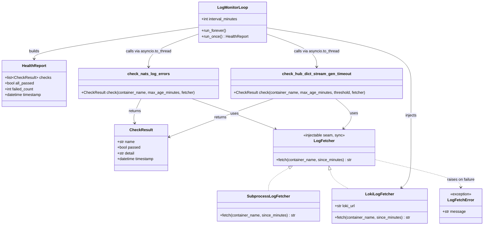
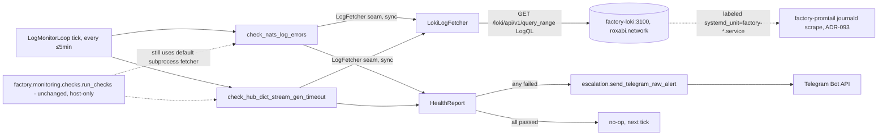

## Context

Source: `artifacts/frames/2245-thin-v1-pull-detection-slice-frame.mdx` (approved
2026-07-05). Split out of #2203 (incident-response runbook) per architect/
axial-drift/security/devops panel review, 2026-07-04.

The 2026-04-27 NATS ACL incident took 2h44m to detect because its only detector —
`check_nats_log_errors` in `src/factory/monitoring/checks_log.py`, escalating via
`src/factory/monitoring/escalation.py` → Telegram — had no scheduler. Its old
scheduler, the host-side `deploy/lyra-monitor.{service,timer}` systemd unit, was
retired in `deploy/provision.sh` when #1035 ("Monitoring v2") closed without
shipping a replacement. ADR-091 plane③ prescribes **V1: pull** (`/health/detail`,
monitoring checks) as the current-correct mechanism until #1035's V2
(`factory.metric.*` subscribe) ships.

This spec designs the V1-pull scheduler: reuse the two pure log-check functions
and the existing Telegram escalation path, run them on a ≤5 min cadence from
inside the container stack, with no host-timer / `systemctl --user` dependency.

## Goal

A new, minimal, always-on container periodically scans `factory-nats` and
`factory-hub` container logs for permissions violations and
`_dict_stream_gen` timeouts, and fires a Telegram alert on anomaly — closing
the April 2026 detection gap without resurrecting the host-timer or previewing
full Monitoring v2/Sentinelle.

## Users

- **Primary:** Mickael (sole on-call operator) — gets paged via Telegram instead
  of discovering an incident by manually reading container logs.
- **Secondary:** future Sentinelle/#1035 work — this V1-pull mechanism must stay
  swappable for the eventual V2 subscribe-based plane③ implementation; it must
  not hard-code assumptions that would need undoing later (e.g. it must not
  itself become a `factory.event.*`/`factory.metric.*` producer — that is #1035's
  job, not this slice's).

## Expected Behavior

1. A new container (`factory-log-monitor`) starts as part of the normal Quadlet
   fleet and runs a loop with a configurable interval (default 5 minutes, hard
   cap ≤5 minutes per acceptance criteria).
2. Each tick, it calls `check_nats_log_errors(container="factory-nats", ...)` and
   `check_hub_dict_stream_gen_timeout(container="factory-hub", ...)` — the exact
   same pure functions and thresholds already shipped in `checks_log.py`.
3. Log text for those two functions is fetched via **Loki HTTP query
   (`GET http://factory-loki:3100/loki/api/v1/query_range`, LogQL
   `{systemd_unit="<container>.service"} |= "<pattern>"`)** over the existing
   `roxabi.network`, not by shelling out to a `podman` CLI binary or mounting
   the Podman socket. Two alternatives were rejected during expert review:
   mounting the rootless Podman socket (even read-only) grants full Podman
   control-plane access — start/stop/exec/create on every container, readable
   env vars/secrets of every other container — because Podman's REST API does
   not enforce read-only at the protocol level, only the bind-mount's
   filesystem flag does; independent architect and devops review both called
   this out as the "`docker.sock`-mount antipattern" and rejected it outright.
   Adding the Podman CLI to a container image was rejected because none of the
   existing runtime images (`svc-runtime`, `agent-runtime`) ship it, and
   building/publishing a brand-new image target is out of proportion for this
   slice. Loki is already the destination for exactly these logs
   (`factory-promtail.container` ships journald → Loki per ADR-093, already
   labeled `systemd_unit="factory-nats.service"` /
   `systemd_unit="factory-hub.service"` — see
   `deploy/observability/promtail-config.yml`), so this reuses existing,
   already-running infra with zero new image and zero new privileged mount.
   **Accepted residual risk (documented, not solved by this slice):** if
   Promtail or Loki itself is down, this detector goes silently blind — the
   same class of gap #2245 exists to close. Monitoring Loki's own liveness is
   out of scope here (that edges toward full Sentinelle/#1035); this is the
   thin V1-pull slice, not the complete answer.
   `checks_log.py`'s log-fetch step is refactored behind a small injectable,
   **synchronous** seam (see Data Model) so the **counting/threshold logic is
   byte-for-byte reused**, unchanged for any other caller (the default
   `SubprocessLogFetcher` still shells `podman logs`, exactly as today), while
   the new component supplies a `LokiLogFetcher` instead. Both fetchers raise a
   single new `LogFetchError` on failure so the check functions' exception
   handling stays fetcher-agnostic (today's `_LOG_EXCEPTIONS` tuple is
   subprocess-specific and would not catch an HTTP failure).
4. On any failed check, the monitor calls `escalation.py`'s existing raw-alert
   path (`send_telegram_raw_alert`) with a synthesized `HealthReport` containing
   just the two check results — reusing the exact Telegram formatting/delivery
   code already shipped. LLM diagnosis (`escalate_to_llm`, which shells to the
   `claude` CLI) is intentionally **not** wired in this container — it would add
   a heavyweight, unnecessary dependency to a container whose only job is a
   2-check safety net; the raw-alert path alone satisfies the acceptance
   criterion ("a Telegram alert fires via the existing `escalation.py` path").
5. `src/factory/monitoring/__init__.py`'s package-level `DeprecationWarning`
   ("factory.monitoring is deprecated... will be removed when v2 lands") is
   corrected: `checks_log.py` and `escalation.py` are now live production code
   (imported by a container that ships and runs continuously), not "retained for
   spec mining." The warning is narrowed so it no longer fires for these two
   modules — the rest of the package (`checks.py`'s `run_checks()` pipeline,
   `check_process`/`check_http_health`, `__main__.py`) remains explicitly
   deprecated/host-bound and untouched.
6. `deploy/lyra-monitor.{service,timer}` is not modified, added back, or
   referenced by the new code path.
7. The PR description includes a design note stating explicitly: this is the
   ADR-091 plane③ V1-pull mechanism (pull via `podman logs`-equivalent, not
   subscribe via `factory.metric.*`); it is not a revival of the retired
   host-timer (no `systemctl --user`, no bare host process, no `localhost:8443`
   dependency); it is not a preview of full Monitoring v2/Sentinelle (no event
   bus producer/consumer, no dashboard).

### Edge cases

| Case | Handling |
|------|----------|
| Loki temporarily unreachable / query error | `LokiLogFetcher` raises `LogFetchError`; check functions catch it (fetcher-agnostic, same code path as a subprocess failure) and return a failed `CheckResult` with the error as detail — loggable, does NOT crash the loop; next tick retries. This is the documented accepted-risk case (detection blind while Loki is down) |
| Telegram delivery fails after a real anomaly | `escalation.py`'s existing fallback: log the full report at `error` level (already implemented in `send_telegram_raw_alert`'s caller contract) — no new fallback needed, mirrors `__main__.py`'s existing pattern |
| Both checks pass | No-op, no alert, loop continues |
| Sustained/repeated anomaly (log keeps matching every tick) | Re-alerts every tick (≤5 min) — no dedup/cooldown. This is inherited, unmodified `escalation.py` behavior (no debounce exists anywhere in `src/factory/monitoring/` today), not a regression introduced here; accepted as-is for this thin slice |
| Container restarts mid-incident | Next tick after restart re-evaluates the same `max_age_minutes` window — no state carried across restarts is required by the acceptance criteria (unlike `checks_varz.py`'s stateful counters, these two checks are stateless window-scans) |
| `factory-nats`/`factory-hub` unit renamed or Loki has no matching label | Empty/error result from Loki is treated as a failed `CheckResult` (fail-safe: absent data reports as anomaly rather than silently passing) |

## Data Model & Consumers

### Data structure diagram



### Consumer map



### Consumer summary

| Consumer | Fields / output | When | Status |
|----------|------------------|------|--------|
| `LogMonitorLoop` (new) | `HealthReport` from the 2 log checks | Every ≤5 min tick, inside `factory-log-monitor` | **This issue** |
| `escalation.send_telegram_raw_alert` | Formatted alert text | On any failed check | **This issue** (reused, unmodified) |
| `factory-loki` (existing, ADR-093) | Log lines matching LogQL query | Each tick's fetch | Existing infra, newly read by this issue (not modified) |
| `factory.monitoring.checks.run_checks` (existing, host-only, dormant) | Same `CheckResult`s, via default `SubprocessLogFetcher` | N/A — not invoked in production today (no scheduler wires it; kept behavior-identical) | Unchanged — explicitly out of scope |
| Future Sentinelle plane③ V2 (#1035) | Would replace pull with `factory.metric.*` subscribe | Not yet built | Future / out of scope |

## Breadboard

### Affordances

| ID | Affordance | Handler | Data |
|----|------------|---------|------|
| A1 | Periodic tick (≤5 min) | `LogMonitorLoop.run_forever` | `interval_minutes` config |
| A2 | NATS log scan | `check_nats_log_errors` | `factory-nats` logs via `LogFetcher` |
| A3 | Hub log scan | `check_hub_dict_stream_gen_timeout` | `factory-hub` logs via `LogFetcher` |
| A4 | Telegram alert | `send_telegram_raw_alert` | synthesized `HealthReport` |

### Nodes

| ID | Node | Input | Output |
|----|------|-------|--------|
| N1 | `LokiLogFetcher.fetch` | container name, minutes | raw matched log lines (text) |
| N2 | `check_nats_log_errors` (refactored, seam added) | container name, minutes, fetcher | `CheckResult` |
| N3 | `check_hub_dict_stream_gen_timeout` (refactored, seam added) | container name, minutes, threshold, fetcher | `CheckResult` |
| N4 | `LogMonitorLoop.run_once` | config | `HealthReport` |
| N5 | `LogMonitorLoop.run_forever` | `HealthReport` from N4 | calls `send_telegram_raw_alert` iff `not all_passed` |
| N6 | `factory log-monitor` CLI subcommand | — | invokes N5, mirrors `factory hub`/`factory turn-writer` entrypoint pattern |
| N7 | `factory-log-monitor.container` Quadlet unit | `Exec=factory log-monitor`, `Network=roxabi.network`, Telegram secrets | running container, existing `svc-runtime` image (no image change) |

### Wiring

```
Quadlet start → N7 → N6 (factory log-monitor) → N5.run_forever
  loop tick → N4.run_once → asyncio.to_thread(N2) + asyncio.to_thread(N3) (via N1 fetcher) → HealthReport
  HealthReport.all_passed=false → send_telegram_raw_alert → Telegram API
  HealthReport.all_passed=true → no-op, sleep(interval_minutes), repeat
```

## Slices

| Slice | Scope | Files (expected) | Demo |
|-------|-------|-------------------|------|
| SL1 | Injectable, synchronous log-fetch seam in `checks_log.py` — `SubprocessLogFetcher` (default, current behavior, unchanged) + `LokiLogFetcher` (new); both check functions gain an optional `fetcher` param defaulting to the subprocess one; unify error handling behind a single `LogFetchError` raised by either fetcher | `src/factory/monitoring/checks_log.py` | Existing tests for `check_nats_log_errors`/`check_hub_dict_stream_gen_timeout` pass unmodified (behavior-identical default) + new unit tests for `LokiLogFetcher` (mocked Loki HTTP response, including malformed/error response → `LogFetchError`) |
| SL2 | `LogMonitorLoop` (run_once/run_forever) composing the 2 checks (via `asyncio.to_thread`, matching `checks.py`'s existing pattern) + `escalation.send_telegram_raw_alert` | `src/factory/monitoring/log_watch.py` (new) | Unit test: anomaly in one check → `send_telegram_raw_alert` called once with both results; all-pass → not called; both-fail → single alert with both failures listed |
| SL3 | `factory log-monitor` CLI subcommand wiring `LogMonitorLoop.run_forever` | `src/factory/cli.py` (or wherever the Typer app registers subcommands) | `factory log-monitor --once` (test-only flag) runs one tick and exits 0/1; `grep` confirms no `factory.event.*`/`factory.metric.*` producer registration (SC10) |
| SL4 | `factory-log-monitor` Quadlet unit + `deploy/quadlet.toml` component entry — `Network=roxabi.network` (reaches `factory-loki:3100`), `After=factory-hub.service factory-nats.service factory-loki.service` (no `Requires=`, matching the adapter pattern), Telegram secret wiring via `Secret=<name>,type=env,target=TELEGRAM_TOKEN`/`TELEGRAM_ADMIN_CHAT_ID` (exact secret identity — which bot/chat — resolved in `/plan`; the mechanism mirrors `factory-clipool.container`'s `type=env` secret pattern) | `deploy/quadlet/factory-log-monitor.container`, `deploy/quadlet.toml` | `quadlet-lint` passes; unit renders via existing Quadlet validation gate; no new image/Dockerfile/docker-bake.hcl/publish.yml changes (reuses `svc-runtime`) |
| SL5 | `factory.monitoring.__init__` deprecation-warning narrowing | `src/factory/monitoring/__init__.py`, `pyproject.toml` (matching `ignore:factory.monitoring is deprecated` filter updated in lockstep) | Importing `factory.monitoring.checks_log`/`escalation` no longer emits the "will be removed" warning; importing `factory.monitoring.checks`/`__main__` still does (or an equivalent module-level warning moves there) |
| SL6 | PR design note (plane③ V1-pull, not host-timer, not Sentinelle preview) + explicit statement of the accepted Loki-availability residual risk | PR description; `git diff` confirms zero changes under `deploy/lyra-monitor.*` (SC6) | Reviewer can confirm the note answers all 3 framings from acceptance #4, and that no event-bus code was added (SC10) |

## Success Criteria

- [ ] `factory-log-monitor` runs `check_nats_log_errors` and `check_hub_dict_stream_gen_timeout` against `factory-nats`/`factory-hub` on an interval ≤5 minutes, with no `systemctl --user` call and no host-timer unit anywhere in the change (SC1)
- [ ] Log content is fetched via a Loki LogQL query over the existing `roxabi.network` — no Podman socket mounted, no Podman CLI binary added to any image, no new image/Dockerfile/docker-bake.hcl/publish.yml changes (SC2)
- [ ] `check_nats_log_errors`/`check_hub_dict_stream_gen_timeout`'s existing counting/threshold behavior is unchanged for the default (subprocess) fetcher — all pre-existing tests for these functions pass without modification (SC3)
- [ ] Both fetchers (subprocess, Loki) raise a single shared `LogFetchError` on failure, caught uniformly by the check functions (SC3b)
- [ ] On a failed check, `send_telegram_raw_alert` is called and a Telegram alert is sent via the existing `escalation.py` path — verified by a unit test asserting the call with the correct `HealthReport` (SC4)
- [ ] All checks passing produces zero Telegram calls (SC5)
- [ ] `deploy/lyra-monitor.{service,timer}` has zero diff in this PR (SC6)
- [ ] `factory.monitoring`'s package-level `DeprecationWarning` no longer fires on `import factory.monitoring.checks_log` / `import factory.monitoring.escalation` (SC7 — value-add beyond the issue's 4 literal acceptance bullets, flagged for reviewer sign-off since the panel didn't explicitly scope it; justified because these modules become live production code by this change, no longer "spec mining only")
- [ ] PR description contains a design note explicitly framing this as ADR-091 plane③ V1-pull, distinguishing it from both the retired host-timer and full Monitoring-v2/Sentinelle, and states the accepted Loki-availability residual risk (SC8)
- [ ] `quadlet-lint` (or equivalent CI validation for Quadlet units) passes for the new `.container` unit (SC9)
- [ ] No `factory.event.*`/`factory.metric.*` bus producer or consumer is introduced by this change (SC10 — guards against V2/Sentinelle scope creep)
