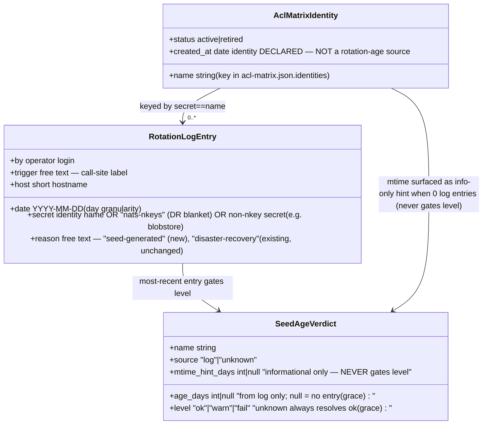
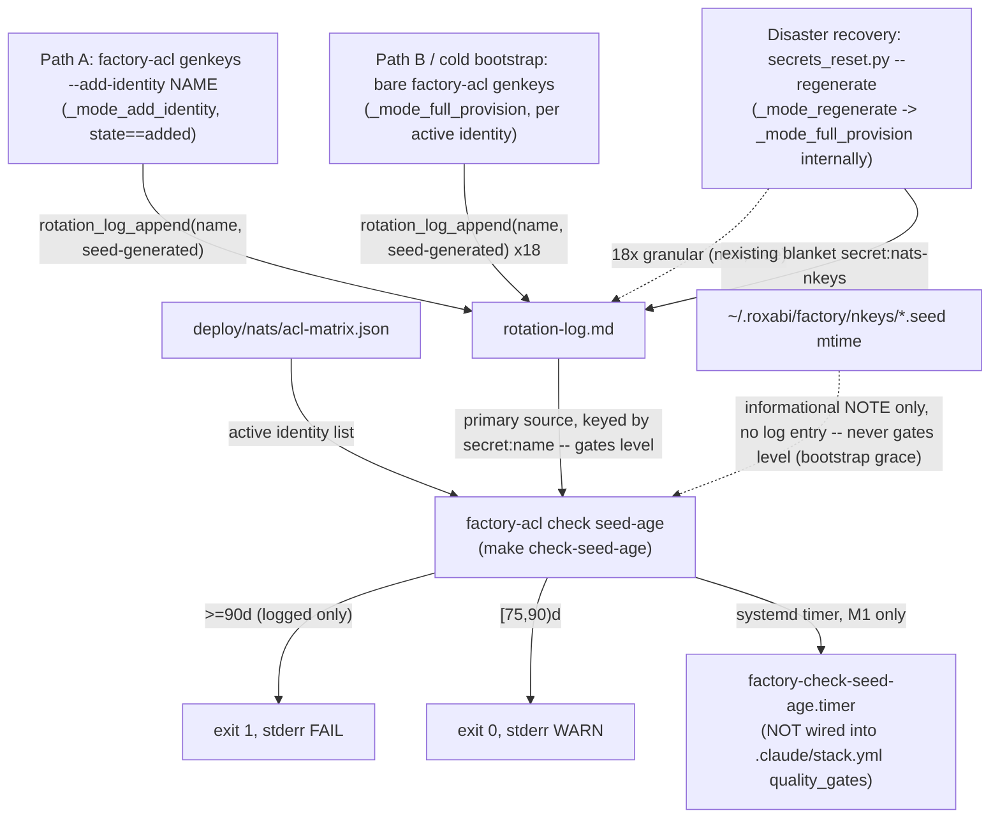

## Context

Promoted from the approved frame. Origin: #2204 (credential rotation policy doc), split out by architect/security/devops panel review (2026-07-04).

Read directly from source (not inferred):

- `rotation_log_append()` (`src/factory/operator_audit.py:34`) is a fail-soft Python→bash bridge to `deploy/lib/operator-log.sh::rotation_log_append()`, which appends one line to `~/.roxabi/factory/rotation-log.md` (Markdown, general-purpose — already used for `blobstore` token rotations too, not nkey-exclusive) and one JSONL event to `operator.log`.
- Today it is called from exactly **one** site: `src/factory/cli/secrets_reset.py:161` (disaster recovery, `secret="nats-nkeys", reason="disaster-recovery"` — a single blanket entry, not per-identity).
- `docs/runbooks/nkey-rotation.md` documents two **routine** (non-DR) rotation paths, neither of which logs:
  - **Path A** (single/few identities): `rm <name>.seed && make nats-add-identity NAME=<name>` → `factory-acl genkeys --add-identity <name>` → `scripts/_modes.py::_mode_add_identity()`. Fresh key material only when `_add_identity_detect_state()` returns `"added"` (seed was absent).
  - **Path B** (hub compromised → rotate every seed): bare `factory-acl genkeys` → `scripts/_modes.py::_mode_full_provision()`. Unconditionally mints a fresh seed for **every** of the 18 active identities (`deploy/nats/acl-matrix.json`). This is the *same* function used for cold bootstrap and internally by `_mode_regenerate` (the `--regenerate` flag, DR-only, invoked exclusively via `secrets_reset.py`).
  - `_mode_regen_authconf` (pure ACL re-render, no new key material) is correctly out of scope — never logs, never should.
- `deploy/nats/acl-matrix.json` identities carry a `created_at` field (when the identity was *declared*, not when its seed was last rotated) — not usable as a rotation-age source; not touched by this issue.
- Existing `factory-acl check {retired,flows,grants}` subcommands (`scripts/gen_nkeys.py`) follow one consistent shape: matrix-driven, `scripts/check_grants.py`-style standalone module, print errors to stderr, `sys.exit(1)` on failure. `.claude/stack.yml` wires all three with `stages: [ci]` — **merge-blocking**.

## Goal

Every seed regenerated via the routine rotation paths (A and B) gets a `rotation_log_append()` entry, and `make check-seed-age` reads `rotation-log.md` to warn at ≥75 days and hard-fail at ≥90 days per active identity — identities with no log entry yet get bootstrap grace (never warn/fail; seed mtime is surfaced only as an informational, non-gating hint) — wired as a **scheduled** check (systemd timer, mirroring existing ops timers), never as a blocking CI gate.

## Users

| User | Workflow |
|------|----------|
| M₁ operator (Mickael) | Runs `nkey-rotation.md` Path A or Path B by hand; today gets no record of it in `rotation-log.md`. After this change, the rotation is auto-logged as a side effect of the same commands they already run. |
| Scheduled check (systemd timer, M₁) | Runs `make check-seed-age` periodically; surfaces stale seeds without touching CI. |
| #2204 policy doc (concurrent, separate issue) | Cites this mechanism as its enforcement arm by path/name only — no code coupling. |

## Expected Behavior

1. Operator runs Path A: `rm ~/.roxabi/factory/nkeys/telegram-adapter.seed && make nats-add-identity NAME=telegram-adapter`.
2. `_mode_add_identity` detects `state == "added"`, generates the fresh seed, re-renders `auth.conf` from all active seeds (existing behavior — this **is** the revocation: the old public key is structurally absent from the next `auth.conf`, dropping the compromised connection on the next auth check, per the runbook's own A.2 note). New: it then calls `rotation_log_append(repo_root, "telegram-adapter", "seed-generated", trigger="factory-acl-add-identity")`.
3. `rotation-log.md` gains one line: `2026-07-05 | secret:telegram-adapter | reason:seed-generated | by:mickael | trigger:factory-acl-add-identity | host:roxabituwer`.
4. Operator runs Path B: bare `factory-acl genkeys` (hub compromised). `_mode_full_provision` mints fresh seeds for all 18 active identities; **each** identity now gets its own `rotation_log_append(..., "seed-generated", trigger="factory-acl-genkeys")` call inside the same loop that generates its seed — 18 new log lines, one per identity.
5. Cold bootstrap (first-ever run, no prior seeds) goes through the same `_mode_full_provision` path and is logged identically — correct: the seed's age clock legitimately starts at first mint, not just at rotation.
6. `_mode_regen_authconf` (no new key material) and the existing DR blanket entry in `secrets_reset.py` are untouched; DR now *additionally* gets 18 granular per-identity lines "for free" (from the same `_mode_full_provision` loop, since `_mode_regenerate` calls it internally) alongside its existing summary line — a net improvement in log granularity for DR too, not a regression, and not a new call site to maintain.
7. Operator (or, in practice, a systemd timer on M₁) runs `factory-acl check seed-age` (`make check-seed-age`). For each active identity: look up its most recent `rotation-log.md` entry by `secret:` field → age in days, computed against UTC `today` (matches the log's UTC date granularity). **No log entry → bootstrap grace: always ok, never warn/fail**, regardless of the identity's seed-file mtime. Revised from the original mtime-fallback design after two independent reviewers (product-lead, architect) and adversarial re-analysis confirmed it would fire fleet-wide false signals on rollout day: all 18 active identities have zero log entries today, and several seeds' real mtimes (≈ their `acl-matrix.json` `created_at`, 2026-04-21) already sit at ~75 days — a mtime-gated verdict would hard-warn most of the fleet on day one purely because the feature is new, exactly the "spurious CI red / alert fatigue" the issue's own scope (item 3) warns against, and the opposite of item 4's explicit "assume now" grace intent.
8. `{name}.seed` mtime, when the log has no entry for that identity, is still read and printed — but purely as an **informational hint** (e.g. `NOTE: telegram-adapter has no rotation-log entry; seed mtime is 75d old (informational, not policy-enforced — bootstrap grace applies)`). It never feeds `level`/exit-code computation. This keeps the issue's item-2 permission ("mtime may be used... as a documented fallback for identities with no log entry") satisfied in an operator-visibility sense without letting an unreliable, sync-resettable signal gate pass/fail.
9. Age (from a real log entry) ≥ 90 days → printed to stderr as `FAIL:`, exit code 1. Age ∈ [75, 90) days → printed as `WARN:`, exit code 0 (non-blocking). Age < 75 → silent, exit 0. No log entry → silent except the informational NOTE, exit 0 (grace).
10. `make check-seed-age` is registered in a new `deploy/systemd/factory-check-seed-age.{service,timer}` pair (mirrors `factory-fleet-digest-poll.{service,timer}` — a host Python/`uv` invocation with `WorkingDirectory=`/`PATH=` set, not `factory-operator-logrotate`'s bare-bash shape, which lacks both and would leave `factory-acl`'s relative `deploy/nats/acl-matrix.json` default unresolvable under systemd) and in `Makefile`'s `quadlet-sync-install`. It is **not** added to `.claude/stack.yml`'s `quality_gates:` — unlike `acl_matrix_retired`/`request_reply_flows`/`acl_grants` (all `stages: [ci]`), this check must never block an unrelated PR (explicit acceptance criterion; also technically correct since seeds/log only exist on M₁, not in the CI sandbox or a dev laptop).

## Data Model & Consumers

| Consumer | Reads | When | Status |
|----------|-------|------|--------|
| `_mode_add_identity` | writes `rotation-log.md` (via bridge) | on `state == "added"` | this issue |
| `_mode_full_provision` | writes `rotation-log.md` (via bridge), once per active identity | every call (Path B, bootstrap, DR-internal) | this issue |
| `factory-acl check seed-age` | `rotation-log.md` (primary, gates verdict), `acl-matrix.json` (active set), `*.seed` mtime (informational-only hint when no log entry — never gates verdict) | on demand / scheduled | this issue |
| `factory-check-seed-age.timer` (systemd, M₁) | invokes `make check-seed-age` | scheduled (e.g. daily) | this issue |
| `secrets_reset.py` DR blanket entry | writes `rotation-log.md` | on `--regenerate` | unchanged (existing) |
| `.claude/stack.yml` `quality_gates` / CI | — | — | explicitly **not** wired here (out of scope by acceptance criterion) |
| #2204 policy doc | references this mechanism by path/name | — | out of scope, separate issue |

## Breadboard

| ID | Affordance | Handler | Data / Effect |
|----|-----------|---------|----------------|
| N1 | `_mode_add_identity` (`scripts/_modes.py`) — `state == "added"` branch, **explicit guard required**: `_add_identity_write(...)` runs for both `"added"` and `"repaired"`, so the call must be gated `if state == "added":`, not placed unconditionally after the write | `if state == "added": rotation_log_append(_repo_root(), name, "seed-generated", trigger="factory-acl-add-identity")` | one new `rotation-log.md` line per routine single-identity rotation, none on repair/noop |
| N2 | `_mode_full_provision` (`scripts/_modes.py`) — per-identity loop | inside `for name in active:`, after `pubkeys[name] = provider.pubkey_from_seed(seed)`, call `rotation_log_append(_repo_root(), name, "seed-generated", trigger="factory-acl-genkeys")` | N lines per full provision (Path B, bootstrap, DR-internal) |
| N3 | new `_repo_root()` helper in `scripts/_modes.py` | `Path(__file__).resolve().parents[1]` (same depth/pattern as `gen_nkeys.py::_REPO_ROOT`) | resolves the repo root `rotation_log_append` needs to find `deploy/lib/operator-log.sh` |
| N4 | new `scripts/check_seed_age.py` (mirrors `scripts/check_grants.py` shape) | `WARN_DAYS=75`, `FAIL_DAYS=90` constants; `run(matrix, rotation_log_path, seeds_dir, *, today=None) -> (warnings, failures)`, `today` defaults to `datetime.now(timezone.utc).date()` to match the log's UTC date granularity; parses `rotation-log.md` lines via a regex matching the exact bash-emitted format (`operator-log.sh:77`: `{ts} \| secret:{name} \| reason:{reason} \| by:{user} \| trigger:{trigger} \| host:{host}`), skips the header line and any malformed line, keeps latest date per `secret:` value, ignores `secret:` values not in the active identity set. **Identity WITH a log entry → real age gates warn/fail. Identity with NO log entry → bootstrap grace: always ok, no warn/fail** — its `{name}.seed` mtime (if the file exists) is read and returned/printed as an informational hint only, never used to compute `level` | pure, testable — no subprocess, no I/O side effects beyond reads |
| N5 | `scripts/gen_nkeys.py::_cmd_check_seed_age` + `ck_seed_age = ck_sub.add_parser("seed-age", ...)` | wires `factory-acl check seed-age [--matrix PATH]`; reads `ROTATION_LOG` env (default `~/.roxabi/factory/rotation-log.md`, matching `operator-log.sh`'s own default) and `scripts._modes._seeds_dir()` (existing `SEEDS_DIR`-overridable resolver) | consistent with `check retired`/`check flows`/`check grants`; prints `WARN:`/`FAIL:`/`NOTE:` (informational, ungated) to stderr, `sys.exit(1)` iff any failure, else prints `check-seed-age: OK (n warning(s))` |
| N6 | `Makefile` — new `check-seed-age:` target, placed after the `nats-add-identity` block | `uv run --frozen factory-acl check seed-age` — **not** a bare `uv run`: `nats-add-identity`'s own target already uses `--frozen --project .`, and `deploy/fleet-digest-poll.sh:16` carries an explicit incident-scar comment ("a bare `uv run` here jammed the M1 deploy for 12h on 2026-07-02") for the identical failure mode (bare `uv run`/`sync` on the M1 prod checkout dirties `uv.lock`, breaking `factory-quadlet-sync`'s ff-only guard) — `check-seed-age` is unattended-timer-executed on M1 prod daily, same risk class | `make check-seed-age` per issue's literal acceptance wording, without the uv.lock-churn failure mode |
| N7 | new `deploy/systemd/factory-check-seed-age.service` + `.timer` — **mirrors `factory-fleet-digest-poll.{service,timer}`, not `factory-operator-logrotate`**: `factory-operator-logrotate.service` is a bare bash script with no `WorkingDirectory=`/`PATH=`, wrong shape for a `uv run`/Python CLI invocation under systemd's minimal `--user` PATH; `factory-fleet-digest-poll.service` already has `WorkingDirectory=%h/projects/roxabi-factory` + `Environment="PATH=%h/projects/roxabi-factory/.venv/bin:%h/.local/bin:/usr/local/bin:/usr/bin:/bin"` and its script runs `uv run --frozen --project ...` — exactly what `factory-acl check seed-age` needs (its `_DEFAULT_MATRIX = Path("deploy/nats/acl-matrix.json")` is cwd-relative and would otherwise resolve against systemd's default cwd, not the repo root) | `Type=oneshot`, `WorkingDirectory=`/`PATH=` per fleet-digest-poll's shape, `ExecStart=... make check-seed-age`, `OnCalendar=` daily | scheduled, non-blocking-CI wiring satisfying acceptance criterion 4, without the cwd/PATH failure mode |
| N8 | `Makefile` `quadlet-sync-install` target | add `cp .../factory-check-seed-age.service` + `.timer` lines + `systemctl --user enable --now factory-check-seed-age.timer` (mirrors the 5 existing timer registrations) | timer actually gets installed on the next M₁ `make quadlet-sync-install` (out-of-band from this PR's merge — M₁-only per `hosts.ssot.md`, not run by this pipeline) |
| N9 | test hardening: `tests/scripts/test_genkeys_modes_add_identity.py` + `tests/scripts/test_genkeys_modes.py` — **two distinct mechanisms, both required**: (a) subprocess-based tests (`subprocess.run(..., env={...})`) → add `"ROTATION_LOG": str(tmp_path / "rotation-log.md")` **and** `"OPERATOR_LOG": str(tmp_path / "operator.log")` to every relevant `env={...}` dict; (b) in-process tests that call `_mode_add_identity`/`_mode_full_provision`/`_mode_regenerate` directly via `monkeypatch.setenv("SEEDS_DIR"/"AUTH_DIR", ...)` (e.g. `test_genkeys_modes.py::test_full_provision_returns_externals_list` near line 677, and the `_mode_regenerate` rollback test near line 921 — implementer greps for every direct call site to confirm the full list) → add matching `monkeypatch.setenv("ROTATION_LOG", ...)` + `monkeypatch.setenv("OPERATOR_LOG", ...)` calls. Both env vars are **mandatory, not conditional** — `rotation_log_append()` unconditionally writes both `rotation-log.md` and a JSONL line to `operator.log` (`operator-log.sh:87`) on every call | hermetic tests across both call styles; the Falsification Gate would otherwise pass green while leaking real filesystem writes to `~/.roxabi/factory/{rotation-log.md,operator.log}` |
| N10 | new tests: rotation-log gets an entry on `state == "added"`, no entry on `"repaired"`/`"noop"`; `_mode_full_provision` writes N entries for N active identities | new assertions in the two files above (or a new `tests/scripts/test_rotation_log_wiring.py`) | proves N1/N2, not just their absence of crash |
| N11 | new tests: `scripts/check_seed_age.py::run()` — zero log entries (grace: always ok, no warn/fail, regardless of mtime), log entry at 74/75/89/90/91 days (boundary), informational mtime hint returned/printed but does not affect `level` when no log entry exists, no log entry **and** no seed file (grace, no hint to print) | `tests/scripts/test_check_seed_age.py` | pure unit tests, no subprocess needed (unlike N9/N10) |
| N12 | doc, three files: (a) `docs/runbooks/nkey-rotation.md` — one-line addition near Path A.2/B.2 noting the rotation is now auto-logged, plus a "Bootstrap grace" callout explaining the log-gates/mtime-is-informational-only design (issue item 4); (b) `docs/runbooks/operator-log.md` — ADR-093's canonical "What gets logged automatically" table (lines 63-75) has a stale placeholder at line 10 ("future nkey rotations") for exactly this feature; replace it with two concrete rows for the `_mode_add_identity`/`_mode_full_provision` → `rotation-log.md` writes; (c) `deploy/AGENTS.md` operator-audit section carries the same stale "future nkey rotations" phrasing — update it too | prose only | operator-visible; item 4's "document the grace" acceptance line, and keeps ADR-093's canonical registry table from going stale the moment this ships (devops review finding) |

## Slices

| Slice | Scope | Independently demo-able |
|-------|-------|--------------------------|
| **S1 — Wire the write path** | N1, N2, N3, N9, N10 | Run `factory-acl genkeys --add-identity <name>` (or bare `genkeys`) against a tmp `SEEDS_DIR`/`ROTATION_LOG` fixture → new line(s) appear in the fixture `rotation-log.md`; existing add-identity/full-provision test suites stay green **and** hermetic (no writes outside `tmp_path`) |
| **S2 — `make check-seed-age`** | N4, N5, N6, N11 | `uv run --frozen factory-acl check seed-age` (or `make check-seed-age`) against a fixture `rotation-log.md` + `acl-matrix.json` exits 0/0-with-warnings/1 correctly at the 75/90-day boundaries, independent of S1 |
| **S3 — Scheduled wiring + docs** | N7, N8, N12 | `deploy/systemd/factory-check-seed-age.{service,timer}` files exist, `Makefile quadlet-sync-install` references them, `.claude/stack.yml` has **no** new `quality_gates` entry (grep-verifiable), runbook doc updated |

**Order:** S1 → S2 → S3. S2 does not depend on S1 landing first (its tests use a synthetic `rotation-log.md` fixture) but the acceptance criteria as a whole require both to be real before the feature is complete.

## Success Criteria

- [ ] `_mode_add_identity` calls `rotation_log_append()` when (and only when) `state == "added"` — not on `"repaired"` or `"noop"` (N1, N10)
- [ ] `_mode_full_provision` calls `rotation_log_append()` once per active identity, every invocation (bare `genkeys`, cold bootstrap, and internally via `_mode_regenerate`/DR) (N2, N10)
- [ ] Existing `_mode_regen_authconf` and the existing `secrets_reset.py:161` DR call site are unmodified (no regression, no duplication of the DR blanket entry itself)
- [ ] `factory-acl check seed-age` (`make check-seed-age`) exits 0 when all active identities either have a logged age <75 days, or have no log entry at all (bootstrap grace — never gated by mtime) (N4, N5, N11)
- [ ] For identities **with** a log entry: exits 0 with `WARN:` lines on stderr in [75, 90) days; exits 1 with `FAIL:` lines on stderr at ≥90 days. Identities with **no** log entry never warn/fail regardless of their seed's mtime (N4, N11)
- [ ] Identity with zero `rotation-log.md` entries → bootstrap grace (always ok); if `{name}.seed` exists, its mtime-derived age is printed as an informational `NOTE:` only — verified to never flip `level`/exit code even when that mtime exceeds 90 days (N4, N11)
- [ ] `make check-seed-age` target exists in `Makefile` and invokes `uv run --frozen` (not a bare `uv run`) (N6)
- [ ] `deploy/systemd/factory-check-seed-age.service` + `.timer` exist, structurally mirroring `factory-fleet-digest-poll.{service,timer}` (host `WorkingDirectory=`/`PATH=` + `uv run --frozen`, not `factory-operator-logrotate`'s bare-bash shape); `Makefile quadlet-sync-install` copies + enables them (N7, N8)
- [ ] `.claude/stack.yml` `quality_gates:` section gains **no** new entry for this check (grep `check-seed-age` / `check_seed_age` in `.claude/stack.yml` → no match) — verifies the "not merge-blocking" acceptance criterion directly
- [ ] All pre-existing tests in `tests/scripts/test_genkeys_modes_add_identity.py` and `tests/scripts/test_genkeys_modes.py` that exercise `_mode_add_identity`/`_mode_full_provision`/`_mode_regenerate` — both subprocess-based (`env={...}`) and in-process (`monkeypatch.setenv`) — set **both** `ROTATION_LOG` and `OPERATOR_LOG` to `tmp_path` locations; no test writes to the real `~/.roxabi/factory/rotation-log.md` or `operator.log` (N9)
- [ ] `docs/runbooks/nkey-rotation.md` documents (a) that routine rotation is now auto-logged and (b) the bootstrap "log gates, mtime is informational-only" grace design (N12)
- [ ] `docs/runbooks/operator-log.md`'s "What gets logged automatically" table and `deploy/AGENTS.md`'s operator-audit section no longer say "future nkey rotations" — both cite the now-implemented mechanism by name (N12)
- [ ] `uv run pytest tests/scripts/test_genkeys_modes.py tests/scripts/test_genkeys_modes_add_identity.py tests/scripts/test_check_seed_age.py tests/test_operator_audit.py tests/cli/test_cli_secrets_reset.py -q` green

## Edge Cases

| Edge | Handling |
|------|----------|
| `state == "noop"` (identity already provisioned, nothing changed) | No log call — no key material changed, nothing to record (N1) |
| `state == "repaired"` (seed exists, only `auth.conf` re-rendered) | No log call — same seed, no age reset (N1) |
| `rotation-log.md` does not exist yet (very first run on a host), or an identity has zero entries in it | Bootstrap grace: `check_seed_age.run()` never warns/fails for that identity, regardless of mtime; must not crash on a missing file. `{name}.seed` mtime, if present, is read and printed as an informational-only `NOTE:` — never used to compute `level`. Deliberate design change from an earlier mtime-fallback draft: mtime is silently reset by Syncthing/rsync/restore, and on real rollout all 18 active identities start with zero log entries — several seeds' actual mtimes already sit near the 75-day WARN threshold (≈ their `acl-matrix.json` `created_at`), so gating on mtime would produce fleet-wide false signals on day one, exactly the alert-fatigue risk the issue's own scope warns against and the opposite of its "assume now" bootstrap-grace intent (independently flagged by /spec's product-lead and architect reviewers) (N4, N11) |
| Two rotation events for the same identity, different dates | Keep the **most recent** date only — `check_seed_age` must not average or accidentally pick an older line if the file isn't strictly chronological (N4, N11) |
| A `rotation-log.md` line for a *non*-identity secret (e.g. `secret:blobstore`, `secret:nats-nkeys`) | Ignored by `check_seed_age` — only lines whose `secret:` matches an **active** identity name in `acl-matrix.json` are consulted; the checker must not warn/fail on a made-up "identity" that doesn't exist (N4, N11) |
| Malformed / hand-edited `rotation-log.md` line that doesn't match the expected format | Skip the line silently (defensive parse — a malformed audit line must not crash the checker or hard-fail the fleet) (N4) |
| `rotation_log_append()` itself fails (e.g. bash/`operator-log.sh` missing or errors) | Already fail-soft by design (`subprocess.run(..., check=False)`, swallowed) — N1/N2 inherit this for free, no new error handling needed |
| Revocation confirmation (issue item 5) | No new code: `_add_identity_write`/`_mode_full_provision` already rebuild `pubkeys` fresh from **current** seed files only on every call — a rotated-away identity's old public key structurally cannot survive into the next rendered `auth.conf`. `nkey-rotation.md` A.2/A.3 and B.4/B.5 already mandate the consuming-unit restart. Satisfied by inspection + the doc already stating it; N12 adds a one-line explicit cross-reference, not new mechanism. |
| DR path (`--regenerate`) now also gets 18 granular per-identity log lines in addition to its existing blanket entry | Intentional, not a bug — improves DR's own age-tracking granularity for free; the existing blanket `secret:nats-nkeys` line is untouched and simply becomes redundant-but-harmless for per-identity age lookups (N2) |
