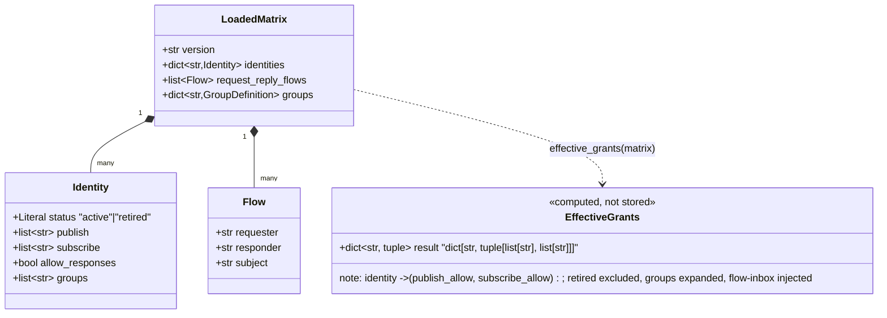
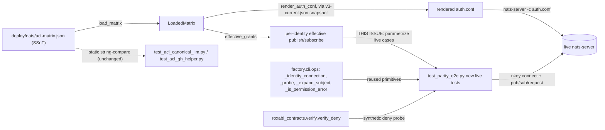

## Context

Promoted from `artifacts/frames/2247-matrix-driven-live-acl-round-trip-frame.mdx` (approved). Source: issue #2247, itself the reopened P0 action item from `docs/history/nats-acl-inbox-case-postmortem.md` ("Fix 3 — `make test-acl` in pre-push" — status: **skipped**, until now).

### SSoT structure

`deploy/nats/acl-matrix.json` — 19 identities (18 `active`, 1 `retired`: `monitor`), `groups` (1: `audio-consumer`), 9 `request_reply_flows` entries (`{requester, responder, subject}` triples). `scripts/_acl_models.py` defines the TypedDicts: `LoadedMatrix`, `Identity` (`status: Literal["active","retired"]`, `publish`, `subscribe`, `allow_responses`, `groups`), `Flow`.

### Existing live-server test harness

`tests/scripts/test_parity_e2e.py` (504 lines) already boots a real `nats-server` with ephemeral nkeys via `SubprocessNkeyProvider`, renders `auth.conf` from `tests/scripts/fixtures/v3-current.json` (an `effective_grants()` snapshot of `deploy/nats/acl-matrix.json`, freshness-gated by `scripts/check-acl-specs-drift.sh`), and hand-asserts allow/deny for hub, voice-tts, clipool-worker + retired-identity rejection (`old-worker` via `v2-with-retired.json`). The violation-detection idiom already in the file (`test_hub_publish_acl_enforced`, lines 309-340; same pattern at 347-378 and 385-416): register an `error_cb` on the connection, attempt the denied action, sleep 0.2s for the delivery/rejection window, then assert `"permissions violation" in str(e).lower()` appears in a captured error.

### `effective_grants()` — the canonical expansion path

`scripts/_effective.py::effective_grants(matrix: LoadedMatrix) -> dict[str, tuple[list[str], list[str]]]` — keyed by identity name, value = `(publish_subjects, subscribe_subjects)`. Already documented as built for this exact purpose: *"Used by both `_renderer.render_auth_conf` (T2) and the CI falsification gate (T3+)."* This issue is that gate. Two transforms happen inside it that this spec's coverage depends on:
- **Group-expansion** — an identity's `groups` membership (e.g. `audio-consumer`) is expanded into that group's member subjects, merged into the identity's own publish/subscribe lists.
- **Flow-inbox-injection** — for every `request_reply_flows` entry, the responder gets `_inbox.<requester>.>` added to its subscribe grants, and each identity gets its own `_inbox.<self>.>` added.

`status: retired` identities are excluded structurally by `effective_grants()`. Also exports `subject_covered()` (NATS-wildcard-aware coverage check).

### Pre-existing live-ACL primitives in `factory.cli.ops` — reused, not reimplemented

Discovered during expert review (architect pass) and verified directly: `factory ops verify` (`src/factory/cli/ops.py`) is a **production CLI command** that already implements live per-identity publish-ACL verification against a real broker, using:
- `_expand_subject(subject) -> str` (line 115) — replaces NATS wildcards with a concrete token, **handling mid-token wildcards** (`foo.*.bar` → `foo.verify.bar`), not just trailing `>`. Verified: several real grants need this (`factory.job.*.{progress,result,steer}` on hub/clipool/omp; `factory.voice.tts.request.>` on a flow subject).
- `_is_permission_error(message) -> bool` (line 191) — case-insensitive `"permission" in msg and "publish" in msg` check.
- `_identity_connection(nats_url, seed_path, error_sink)` (line 157, `@asynccontextmanager`) — connects with the *correct* production inbox prefix via `ops_nats.inbox_prefix_for_seed(seed_path)` (derives `_inbox.<name>` from the seed filename stem — the exact ADR-051 convention, not nats.py's `_INBOX` default), captures async `error_cb` violations into a list.
- `_probe(nc, subject, errors, *, expect_deny)` (line 196) — publishes, `flush(timeout=2)`, yields once, then inspects only the errors captured *since this call* — a more reliable idiom than a fixed `sleep(0.2)`, and already correctly asymmetric (allow ⇒ assert *zero* new violations; deny ⇒ assert *one*).
- `_read_seed(seed_path)` (line 125) — `O_NOFOLLOW` + live `fstat`, rejects symlinks/non-files/group-or-world-readable modes (requires `0o600`/`0o400`).
- `roxabi_contracts.verify.verify_deny(identity) -> str` (`packages/roxabi-contracts/src/roxabi_contracts/verify/subjects.py`) — the canonical, SSoT, guaranteed-uncovered negative-control subject `factory.verify.deny.<identity>`, **"intentionally granted to no one in `deploy/nats/acl-matrix.json`"** by explicit design (module docstring). This is a better deny-probe than mining another identity's subject: no case-fold risk, no `subject_covered()` wildcard-blindness risk, works uniformly for every identity including ones with empty grant lists.
- `tests/cli/test_ops_verify.py` already imports `_expand_subject`/`_is_permission_error`/`_load_matrix` directly from `factory.cli.ops` into test code — importing these "private" helpers into a test module is an established idiom in this repo, not a new pattern.

`factory ops verify` itself is **not** reused wholesale: it iterates the *raw* per-identity `publish` list (no group-expansion, no flow-inbox-injection) and is publish-only (no subscribe checks, no request/reply). This issue's new tests source from `effective_grants()` instead (strictly more complete) but call down into the same low-level primitives above for the actual connect/probe mechanics — closing the "two divergent live-probe implementations" risk the architect review flagged, without inheriting `factory ops verify`'s narrower coverage.

**Seed-file permission note:** `_read_seed()`'s hardening rejects world/group-readable files. The existing `rendered_auth_conf` fixture writes seeds via `write_bytes` (default mode, umask-dependent — typically `0o644`, which fails the check). Reusing `_identity_connection`/`_read_seed` requires the fixture to `chmod(0o600)` each seed file after writing — a small, additive, backward-compatible change (does not alter what the fixture sources data from, only hardens the files it already writes).

### Static pre-check layer (unchanged)

`tests/scripts/test_acl_canonical_llm.py` / `test_acl_gh_helper.py` — static string-membership checks against the raw JSON (no live server); the two per-identity files the issue forbids a 3rd of.

### Known bug class (grounding for N5)

The April 2026 incident (`docs/history/nats-acl-inbox-case-postmortem.md`): `packages/roxabi-nats/src/roxabi_nats/connect.py`'s `nats_connect(identity_name=...)` sets `inbox_prefix=f"_inbox.{identity_name}"` (lowercase, ADR-051 Fix 1) while `nats.py`'s own client default is `inbox_prefix=b'_INBOX'` (uppercase). NATS subject matching is case-sensitive **at the core protocol level** — for both ACL authorization and subscription-delivery matching — independent of each other; the postmortem notes the server *lowercases subject names in `-ERR` messages* for display only, which caused the original misdiagnosis. **Consequence for design:** a test that merely asserts "the reply never arrives" after a case-mutated publish cannot distinguish "ACL correctly denied" from "ACL allowed it but core subject-matching still didn't route it" — both produce an identical requester-side timeout. Rejected design; see Design Note.

### Other facts checked

No `make test-acl` target exists yet. `.github/workflows/ci.yml`'s `tests` job already installs `nats-server` + `nk` unconditionally before running `uv run pytest tests/` (which includes `test_parity_e2e.py`, not under any `--ignore`); the aggregate required check `ci` (`needs: [gates, tests, package-coverage]`, `ci.yml:273-287`) fails if `tests` fails — so a red parity file already blocks merge today. CI runs the **broad `tests/` suite**, not literally `make test-acl` — `make test-acl` is the local/pre-push-facing alias the issue asks for; the two are wired to the same file, not the same invocation. `pyproject.toml:22` documents `nats-py`/`nkeys` as arriving transitively (never added directly) — `nats-py` is therefore a **hard dependency** in any correctly-installed environment, not an optional one.

## Goal

Close the postmortem's P0 gap: extend the existing live-`nats-server` harness in `tests/scripts/test_parity_e2e.py` so it (a) auto-covers every active identity/subject in `acl-matrix.json` instead of 3 hand-picked ones, and (b) proves a live cross-identity request/reply round-trip actually delivers, and that an identity outside a flow's pairing is denied the reply-path — reproducing, and permanently gating, the class of bug the April 2026 `_INBOX` incident belongs to (unauthorized cross-identity inbox access).

## Users

- **Primary:** CI (the `tests` job, via the broad `pytest tests/` run) and any dev running `make test-acl` locally — the gate that must go red the next time an `acl-matrix.json` edit reintroduces a missing derived grant, an over-broad grant, or an unreachable reply path.
- **Secondary:** future editors of `acl-matrix.json` (new identity/subject/flow ships with coverage for free); the axial-drift reviewer (no 3rd per-identity file).

## Design Note — three judgment calls (read before Breadboard)

**1. Parametrization source.** Coverage parametrizes off `effective_grants()` called directly on `deploy/nats/acl-matrix.json` (matches the issue's literal wording and `_effective.py`'s own docstring anticipating "the CI falsification gate (T3+)"). The *live broker* itself still boots off the pre-existing `v3-current.json` snapshot fixture (unchanged) — freshness between the two is normally gated separately (`check-acl-specs-drift.sh`), but see N8 below: this spec adds one cheap, labeled assertion of its own so a drift shows up as a clear message instead of confusing per-identity ACL failures.

**2. The flow-negative test is a non-flow-pair denial, not a case-mismatch timeout.** An earlier draft of this spec proposed the negative flow test as: responder replies to a case-mutated (`_INBOX` vs `_inbox`) version of the reply-to subject, asserting the requester's `request()` times out. **That design was rejected during expert review**: per the Context section, a case-mutated publish times out regardless of whether the server's ACL allows or denies it — a test that passes unconditionally, independent of the thing it claims to gate, provides false confidence.

In its place, the negative flow test (N5) asserts **actual ACL denial** for a **non-flow pair**: for each `request_reply_flows` entry `(requester=Z, responder=Y)`, pick a different active identity `T` such that `(Y, T)` does not itself appear as `(responder, requester)` in any flow entry and `T != Z`. `Y` attempts to publish into `_inbox.<T>.<token>`. Because `Y` never received a request from `T`, no `allow_responses`-derived dynamic grant is in play — denial is deterministic, and the assertion is on an actual captured `"permissions violation"` error, not a timeout. This directly satisfies issue Scope item 2's literal wording ("non-flow pairs are denied"), which a case-mismatch test never covered. The April bug shape is still exercised, just not as a live round-trip: `test_inbox_grant_derived_from_flows` (pre-existing, unchanged) already proves injected inbox grants are lowercase and flow-derived; N5's proof that a responder outside its granted flow set gets a real, captured violation closes the general class (unauthorized cross-identity inbox access) the April incident was one instance of, using an assertion that can actually fail.

**Known limitation, documented not fixed:** 17 of 18 active identities have `allow_responses: true`. N4 (positive round-trip) can therefore succeed via the dynamic `allow_responses` grant even if a flow's explicit static `_inbox.<requester>.>` injected grant were hypothetically removed — N4 does not isolate the static grant's contribution from the dynamic one. The postmortem's own "Fix 3" §8 (an `allow_responses`-removed fixture) is the remedy for that and is correctly out of scope here.

**3. Reuse `factory.cli.ops`'s live-ACL primitives instead of reimplementing them in the test file.** See Context's "Pre-existing live-ACL primitives" subsection. `_identity_connection`, `_probe`, `_expand_subject`, `_is_permission_error`, and `roxabi_contracts.verify.verify_deny` are imported into the new tests rather than re-derived — avoiding a second, divergent implementation of subject-concretization and violation-detection logic (the wrong-axis-duplication risk the axial doctrine warns about). No equivalent exists for subscribe-direction checks or request/reply round-trips, so N3/N4/N5's orchestration is new code, built on top of the same reused connection/concretization/deny-subject primitives.

## Expected Behavior

1. A developer or CI runs `make test-acl` (local/pre-push) or CI's existing broad `pytest tests/` run picks the file up automatically. Both execute `tests/scripts/test_parity_e2e.py`. **(→ N1)**
2. `nats-server` boots once (module-scoped fixture) with `auth.conf` rendered from the existing `v3-current.json` fixture; seed files are additionally `chmod(0o600)` so the reused `_read_seed` accepts them. **(→ pre-existing `rendered_auth_conf`/`nats_server` fixtures, minimally extended)**
3. For every active identity, a live connection (via reused `_identity_connection`, nkey-authenticated, correct `_inbox.<identity>` prefix) is opened. Every effective publish subject (post group-expansion, post flow-inbox-injection; concretized via reused `_expand_subject`) is probed via reused `_probe(..., expect_deny=False)` and the batch must show **zero** captured violations; one additional probe against the SSoT deny-probe subject `roxabi_contracts.verify.verify_deny(identity)` must show **one** captured violation. Mirrored for subscribe direction (new local probe helper, same connection/concretization/deny-subject primitives, since `factory.cli.ops` has no subscribe-direction equivalent). Sourced from `deploy/nats/acl-matrix.json` via `effective_grants()` — add an identity or a subject there, and the next test run picks it up with zero test-file edits. **(→ N2, N3)**
4. For every `request_reply_flows` entry, requester and responder connect with their real `inbox_prefix` (`_inbox.<identity>`, matching production `nats_connect(identity_name=...)` for every identity **except `llm-worker`**, whose real production inbox is `_inbox.llmcli-llm` per #1142 — documented directly in `acl-matrix.json`'s `llm-worker.description`; harmless here since `llm-worker` only ever appears as a flow *responder*, never a requester, so its own inbox is never exercised by this test). The flow's `subject` is concretized via `_expand_subject` if it contains a wildcard (e.g. `factory.voice.tts.request.>`). The requester issues a live `request()`, and the responder's real reply is asserted delivered back. **(→ N4)**
5. A parallel negative case per flow: the responder attempts to publish into a **non-flow-paired** identity's inbox (`_inbox.<T>.>` for some `T` outside its flow set), via the reused `_probe(..., expect_deny=True)` primitive — a pure one-way publish-ACL check (no `request()`, no round-trip). Asserted denied via a captured permissions-violation error, not a timeout; timing is governed by `_probe`'s own flush window, not a bespoke budget. See Design Note for why this replaces a case-mismatch/timeout design. **(→ N5)**
6. `status: retired` identities (`monitor`) are excluded from every new parametrized case — enforced structurally because `effective_grants()` already filters them out; the two pre-existing retired-identity tests are untouched. A regression guard asserts the active-identity list used for parametrization is non-empty (protects against a future matrix edit silently zeroing out coverage). **(→ verified by parametrize-ID assertion + Edge Cases)**
7. If `nats-server`, `nk`, **or `nats-py`** is missing and the run is inside GitHub Actions (`GITHUB_ACTIONS=true`), the module fails collection outright (`pytest.fail`) instead of silently skipping — a red X, not a green skip. `nats-py` is included in this guard because it is a hard transitive dependency (`pyproject.toml:22`), not an optional one — its absence in CI would indicate a broken environment, and the pre-existing per-test `skipif(not NATS_PY_AVAILABLE)` decorators would otherwise mask that as "N skipped." Outside GitHub Actions (local dev, including a bare pre-push run), the existing skip behavior is preserved. **(→ N6 — see judgment call below on `GITHUB_ACTIONS` vs generic `CI`)**
8. `test_acl_canonical_llm.py` and `test_acl_gh_helper.py` are untouched code-wise; a one-line cross-reference comment is added to each pointing at the new live-broker layer, and the new test file's module docstring points back. **(→ N7)**
9. A dedicated, cheap test compares `effective_grants()` over `deploy/nats/acl-matrix.json` against `effective_grants()` over `tests/scripts/fixtures/v3-current.json` and asserts equality (verified equal today: 18/18 identities, no key or value diff) — so if the two ever drift, this test fails with a clearly-labeled message instead of a batch of confusing per-identity ACL failures. **(→ N8)**

**Judgment call — `GITHUB_ACTIONS` instead of generic `CI` for the hard-fail guard:** the existing repo precedent (`tests/integration/test_voice_routing.py`) keys a similar check on `os.getenv("CI") == "true"`. This spec deliberately deviates: `.claude/stack.yml`'s `pytest_smoke` pre-push gate still *imports* `test_parity_e2e.py` to inspect its markers even though none of its tests carry the `smoke` marker — so the module-level guard executes on every local pre-push too. A developer whose shell or tooling happens to export generic `CI=true` but lacks `nats-server`/`nk` locally would hard-fail pre-push unexpectedly. `GITHUB_ACTIONS=true` is set only by actual GitHub Actions runners, eliminating that false-positive path while still satisfying the constraint. Flagged as a deviation from precedent, not silently made.

## Data Model & Consumers

| Consumer | Fields consumed | When | Status |
|---|---|---|---|
| `effective_grants()` | `identities[*].{status,publish,subscribe,groups}`, `groups`, `request_reply_flows` | test collection, cached once at module scope | reused as-is |
| `factory.cli.ops` primitives | `_identity_connection`, `_probe`, `_expand_subject`, `_is_permission_error` | test execution, per identity | reused as-is, imported |
| `roxabi_contracts.verify.verify_deny` | canonical deny-probe subject | test execution, per identity | reused as-is, imported |
| New live parametrized tests (N2, N3) | output of `effective_grants()` + raw `identities[*].status` | test execution, per active identity | **this issue** |
| New flow round-trip tests (N4, N5) | `request_reply_flows[*].{requester,responder,subject}` + active-identity list (N5 target selection) | test execution, per flow | **this issue** |
| New drift-label test (N8) | `effective_grants()` over both `acl-matrix.json` and `v3-current.json` | test execution, once | **this issue** |
| `rendered_auth_conf` fixture | `tests/scripts/fixtures/v3-current.json` (unchanged source) + new `chmod(0o600)` on seed files | module setup | minimally extended |
| `test_acl_canonical_llm.py` / `test_acl_gh_helper.py` | raw `identities.hub/llm-worker/gh-helper.{publish,subscribe}` | test execution | unchanged, cross-referenced |

## Code Touches

| File | Change |
|---|---|
| `tests/scripts/test_parity_e2e.py` | Add parametrized tests N2, N3, N4, N5, N8; extend N6's guard condition; add `chmod(0o600)` to `rendered_auth_conf`'s seed-writing loop; import reused primitives from `factory.cli.ops`, `factory.cli.ops_nats`, `roxabi_contracts.verify` |
| `Makefile` | Add `test-acl` target (N1) |
| `tests/scripts/test_acl_canonical_llm.py` | One-line cross-reference comment only (N7) |
| `tests/scripts/test_acl_gh_helper.py` | One-line cross-reference comment only (N7) |
| **Not touched** | `deploy/nats/acl-matrix.json`, `tests/scripts/fixtures/v3-current.json`, `scripts/_effective.py`, `scripts/_loader.py`, `scripts/_acl_models.py`, `scripts/_nk.py`, `src/factory/cli/ops.py`, `src/factory/cli/ops_nats.py`, `packages/roxabi-contracts/**`, `.github/workflows/ci.yml`, `.github/workflows/renderer-roundtrip.yml` |

## Breadboard

| ID | Affordance | Trigger | Handler | Data touched | Parametrize ID format |
|---|---|---|---|---|---|
| N1 | `make test-acl` | `make test-acl` invoked | new Makefile target → `uv run pytest tests/scripts/test_parity_e2e.py -v` | — | — |
| N2 | Per-identity live grant check (publish) | pytest collection parametrizes over active identities | reused `_identity_connection` + `_expand_subject` + `_probe(expect_deny=False)` over every effective publish subject (assert zero new violations across the batch); one `_probe(verify_deny(name), expect_deny=True)` (assert one violation). Tolerates empty publish lists (e.g. `dashboard-reader`). | `effective_grants()[identity].publish`, `verify_deny()` | `test_acl_matrix_publish[<identity>]` |
| N3 | Per-identity live grant check (subscribe) | same collection | reused `_identity_connection` + `_expand_subject`; new local subscribe-probe helper (mirrors `_probe`'s flush+yield idiom) over every effective subscribe subject (assert zero violations); one subscribe attempt on `verify_deny(name)` (assert one violation). Tolerates empty subscribe lists (e.g. `gh-helper`, `ingress`). | `effective_grants()[identity].subscribe`, `verify_deny()` | `test_acl_matrix_subscribe[<identity>]` |
| N4 | Flow round-trip (positive) | pytest collection parametrizes over `request_reply_flows` | requester/responder connect via reused `_identity_connection`; flow `subject` concretized via `_expand_subject` if wildcarded; requester `request(subject, payload)`; responder `subscribe(subject, cb=respond)`; assert reply delivered | `request_reply_flows[i]` | `test_flow_round_trip_positive[<requester>-<responder>]` |
| N5 | Non-flow-pair denial (negative, one-way publish check — not a round-trip) | same collection | responder `Y` (connected via reused `_identity_connection`) attempts to publish into `_inbox.<T>.<token>` for a non-flow-paired identity `T`, via reused `_probe(..., expect_deny=True)`; assert a captured permissions-violation error (reused `_is_permission_error`). One-way only: no `request()`, no reply, no callback to observe — `_probe`'s own `flush(timeout=2)` governs timing | `request_reply_flows[i]` + active-identity list (`T` selection) | `test_flow_round_trip_denies_non_flow_pair[<requester>-<responder>]` |
| N6 | CI hard-fail guard | module import, `GITHUB_ACTIONS=true` env + `nats-server`/`nk`/`nats-py` missing | `pytest.fail()` at collection instead of relying solely on skip | `shutil.which("nats-server")`, `shutil.which("nk")`, `NATS_PY_AVAILABLE`, `os.getenv("GITHUB_ACTIONS")` | — |
| N7 | Cross-reference comment | code review / future reader | one-liner in `test_acl_canonical_llm.py` + `test_acl_gh_helper.py` docstrings pointing to `test_parity_e2e.py`; module docstring there points back | — | — |
| N8 | Drift-labeling assertion | test execution, once | `effective_grants(load_matrix(acl-matrix.json)) == effective_grants(load_matrix(v3-current.json))` (verified equal today: 18/18 identities, no diff) — fails loud and labeled if the two ever diverge, instead of surfacing as confusing per-identity failures elsewhere in the file | both matrix files | `test_acl_matrix_v3_current_in_sync` |

Wiring: N1 → runs the whole file (N2–N8 included). N2/N3/N4/N5/N8 are matrix-driven off the same `effective_grants()` call already used at collection time — one loader call, cached at module scope.

## Edge Cases

| Case | Handling |
|---|---|
| Malformed/unparseable `deploy/nats/acl-matrix.json` at collection | Pre-existing `load_matrix()` behavior — raises at collection, same as today. Not this issue's concern. |
| Zero active identities (matrix somehow empty) | Would silently parametrize to zero test nodes. Mitigated by a non-parametrized guard test asserting `len(active_identities) > 0`. |
| Empty-grant identities: `dashboard-reader` (publish=[]), `gh-helper`/`ingress` (subscribe=[]) — confirmed via direct computation against current `acl-matrix.json` | N2/N3's per-subject loop must tolerate zero iterations without erroring or vacuously passing the whole node — the deny-probe assertion still fires and is the substance of the test for these identities. |
| Seed files need `0o600` for reused `_read_seed` to accept them | `rendered_auth_conf` fixture adds `os.chmod(path, 0o600)` after each `write_bytes` call. |
| N4/N5 timeout duration | N4 (round-trip): existing `request()` timeout idiom, short and fixed. N5 (one-way publish check, no round-trip, no callback to await): governed entirely by reused `_probe`'s own `flush(timeout=2)` — no bespoke budget. Neither made configurable. |
| `nats-server`/`nk`/`nats-py` missing outside `GITHUB_ACTIONS` | Existing skip behavior preserved — see Judgment Call above. |

## Slices

| Slice | Scope | Demo |
|---|---|---|
| S1 — Matrix-driven grant parametrization + Makefile alias | N1, N2, N3 | `make test-acl -- -k "acl_matrix"` (or `uv run pytest ... -k "acl_matrix" -v`) shows one node per active identity (publish + subscribe), all green against current `acl-matrix.json`, including a mid-token-wildcard grant (e.g. clipool's `factory.job.*.progress`) and the empty-grant identities; temporarily removing a grant in a scratch copy flips the corresponding node red, and temporarily over-granting flips a deny-probe node red. |
| S2 — Flow round-trip (positive) + non-flow-pair denial (negative) | N4, N5, N8 | `-k "flow_round_trip or v3_current"` shows 9 positive nodes (all flows deliver) + 9 negative nodes (non-flow-pair publish denied) + 1 drift-label node; temporarily adding an over-broad `_inbox.>` grant to a scratch responder flips the corresponding negative node red. |
| S3 — CI hard-fail + cross-reference | N6, N7 | `GITHUB_ACTIONS=true PATH=/usr/bin uv run pytest tests/scripts/test_parity_e2e.py` (binaries + nats-py hidden) fails loudly with a clear message instead of reporting "N skipped"; `git grep -n "test_parity_e2e" tests/scripts/test_acl_*.py` shows the cross-reference. |

## Success Criteria

- [ ] Every active `(identity, subject)` pair from `deploy/nats/acl-matrix.json`'s effective grants (publish + subscribe, post group-expansion, post flow-inbox-injection) is exercised against a live `nats-server`, sourced via `effective_grants()` and driven through the reused `factory.cli.ops` connect/probe/concretize primitives plus the SSoT `verify_deny()` negative-control subject.
- [ ] Every `request_reply_flows` entry has a live positive round-trip test (reply actually delivered, N4) and a live one-way negative test asserting that a non-flow-paired identity's inbox publish triggers an actual captured permissions-violation error (N5, via reused `_probe(..., expect_deny=True)`; no round-trip, no callback involved).
- [ ] A dedicated test (N8) asserts `effective_grants()` agrees between `acl-matrix.json` and `v3-current.json`, so future drift between the two surfaces as its own labeled failure.
- [ ] `status: retired` identities never appear in the new parametrized cases; a non-empty-active-identity-list guard exists.
- [ ] `make test-acl` exists and runs exactly `tests/scripts/test_parity_e2e.py`.
- [ ] Running the file with `nats-server`/`nk`/`nats-py` absent and `GITHUB_ACTIONS=true` set produces a hard failure (non-zero exit, collection error), not a skip; the same run without `GITHUB_ACTIONS=true` still skips gracefully.
- [ ] `test_acl_canonical_llm.py` and `test_acl_gh_helper.py` are functionally unchanged — only a cross-reference comment added.
- [ ] No 3rd per-identity static ACL test file is added.
- [ ] Ephemeral nkeys remain generated fresh per test run into `tmp_path_factory` (pytest tmpfs), never committed; seed files are `chmod(0o600)` to satisfy the reused hardened `_read_seed`.
- [ ] `uv run pytest tests/scripts/test_parity_e2e.py -v` passes locally with `nats-server`/`nk` installed.

## Out of Scope

- Rewriting or removing `test_acl_canonical_llm.py` / `test_acl_gh_helper.py`.
- Epic #2193 doc-strategy work.
- Any change to `acl-matrix.json` content itself.
- Any change to `v3-current.json`'s generation source, `scripts/_effective.py`, `scripts/_loader.py`, `scripts/_acl_models.py`, or `factory.cli.ops`/`ops_nats`/`roxabi_contracts.verify` themselves — all reused as-is, none modified.
- Reusing `factory ops verify`'s `_verify_identity`/`_verify_all` orchestration wholesale — its coverage is narrower (raw per-identity dict, publish-only) than what this issue needs (`effective_grants()`-sourced, both directions, plus flows); only its low-level primitives are reused.
- Isolating the static flow-derived `_inbox.<requester>.>` grant's contribution to N4 from the `allow_responses` dynamic grant's contribution (postmortem's own Fix 3 §8) — documented as a known limitation in the Design Note.
- A named CI workflow step for `make test-acl` (vs. riding along inside the `tests` job's existing `pytest tests/` collection). Noted residual risk: a future CI change that stops *collecting* `test_parity_e2e.py` would silently drop this coverage without tripping N6, since N6 only fires when the module is imported. Out of scope to harden against; flagged for the PR description.
