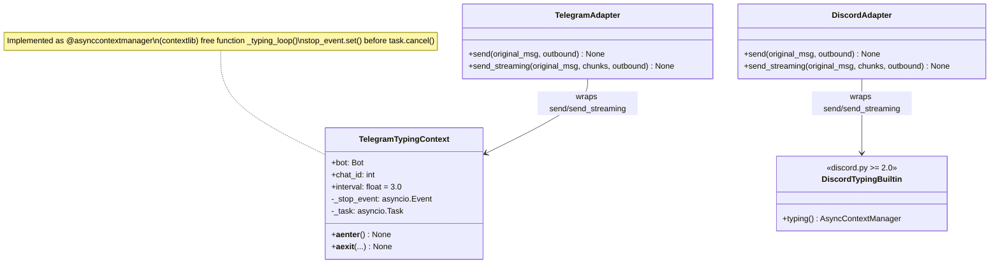
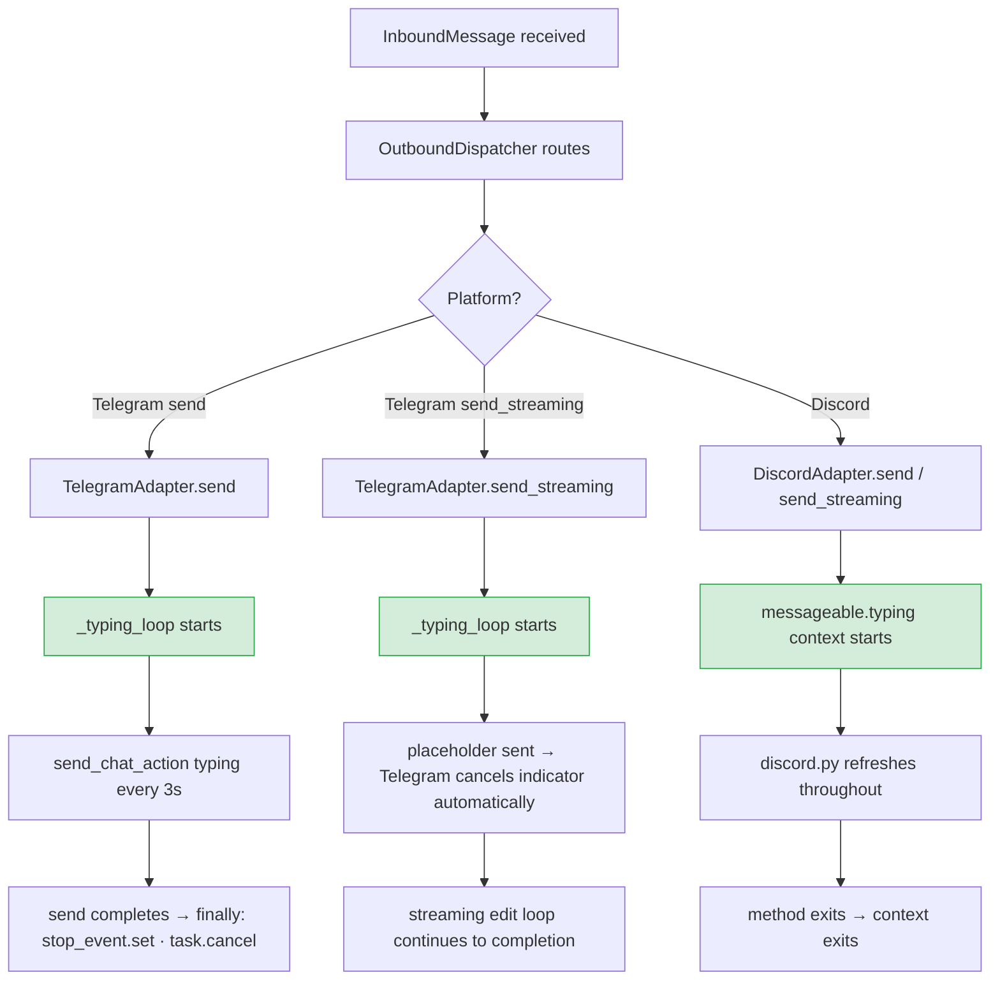

## Context

Promoted from: `artifacts/frames/229-show-typing-indicator-frame.mdx`

Both platform adapters (`telegram.py`, `discord.py`) expose `send()` and `send_streaming()`. Currently neither sends a typing indicator before the first reply appears. This spec covers wrapping those four method bodies with platform-appropriate typing context managers.

Reference implementation: `~/projects/2ndBrain/telegram_bot/scripts/telegram_utils.py` lines 390–431.

## Goal

Show a live typing indicator on both Telegram and Discord from the moment the adapter begins processing until the first reply is delivered (or, for Discord, until the stream is complete), with no changes outside the two adapter files.

## Users

- **Primary:** Lyra users on Telegram and Discord — waiting for a response after sending a message.

## Out of Scope

- Other adapters (future platforms).
- Changes to Hub, OutboundDispatcher, or message pipeline.
- Error recovery / fallback messages when `send()` raises — the spec only requires the indicator stops cleanly on exception, not that a fallback is sent.
- Telegram group topics (`message_thread_id`) — `send_chat_action` is called with `chat_id` only; topic-specific indicators are not in scope.
- Configurable interval (hardcode 3.0s default).

## Expected Behavior

1. User sends a message on Telegram or Discord.
2. Lyra processes the request (Hub → OutboundDispatcher → adapter `send()` or `send_streaming()` is called).
3. **Immediately upon entering** `send()` / `send_streaming()`, the typing indicator starts.

### `send()` path (both platforms)

4. Typing indicator remains visible while the LLM reply is being sent.
5. When `send()` exits (normally or via exception), the indicator stops automatically via `finally`.

### `send_streaming()` path — Telegram

4. Typing indicator shows briefly, then Telegram itself cancels it as soon as the placeholder message is sent (`bot.send_message(chat_id, "…")`). This is Telegram's platform behavior: any message sent by the bot cancels the typing indicator. The indicator therefore covers the pre-placeholder latency gap.
5. The `_typing_loop` context manager wraps the entire `send_streaming()` body (after `chat_id` validation); Telegram's platform behavior naturally terminates the indicator when the placeholder is delivered.
6. The streaming edit loop continues until the full response is in the placeholder — no indicator is needed for this phase since the placeholder itself signals activity.

### `send_streaming()` path — Discord

4. `discord.py`'s built-in `typing()` context manager continues refreshing even after the placeholder is sent — the typing indicator remains visible throughout the full streaming session.
5. When the `async with messageable.typing():` block exits (stream complete, or exception), the indicator stops. The `finally` guarantee is provided by `discord.py` internally.

## Data Model & Consumers

| Consumer | Fields/APIs consumed | When | Status |
|----------|---------------------|------|--------|
| `TelegramAdapter.send()` | `bot`, `chat_id` from `original_msg.platform_meta` | On entry to send | This issue |
| `TelegramAdapter.send_streaming()` | `bot`, `chat_id` from `original_msg.platform_meta` | On entry to send_streaming | This issue |
| `DiscordAdapter.send()` | `messageable` (resolved channel/thread) | On entry to send | This issue |
| `DiscordAdapter.send_streaming()` | `messageable` (resolved channel/thread) | On entry to send_streaming | This issue |

## Breadboard

### Telegram — `_typing_loop` context manager

| Affordance | Handler | Data |
|-----------|---------|------|
| Import | `from contextlib import asynccontextmanager` | stdlib, no new dependency |
| `async with _typing_loop(bot, chat_id)` | `@asynccontextmanager` free function | `bot: Bot`, `chat_id: int`, `interval: float = 3.0` |
| Entry: send initial typing action | `await bot.send_chat_action(chat_id, "typing")` | fires immediately |
| Background loop: refresh every interval | `asyncio.create_task(keep_typing())` with `asyncio.wait_for(stop_event.wait(), timeout=interval)` | auto-restarts until stop_event set |
| Exit ordering (critical): 1) set stop, 2) cancel, 3) await | `stop_event.set(); task.cancel(); await task` in `finally` | `stop_event.set()` must precede `task.cancel()` to allow clean loop exit; swallows `CancelledError` |

### Telegram — wrap `send()` (U1)

| Affordance | Handler | Data |
|-----------|---------|------|
| `async with _typing_loop(self.bot, chat_id):` | wraps entire send body after `chat_id` is extracted and validated | `chat_id` already validated at top of method |

### Telegram — wrap `send_streaming()` (U2)

| Affordance | Handler | Data |
|-----------|---------|------|
| `async with _typing_loop(self.bot, chat_id):` | wraps entire send_streaming body after `chat_id` is extracted and validated | Telegram platform cancels indicator when placeholder is sent — this is by design |

### Discord — wrap `send()` (U3)

| Affordance | Handler | Data |
|-----------|---------|------|
| `async with messageable.typing():` | wraps send body after `messageable = await self._resolve_channel(...)` | `messageable` already available; `typing()` available on `discord.abc.Messageable` since discord.py 2.0 |
| Exception cleanup | guaranteed by `discord.py` `finally` internally | no custom cleanup needed |

### Discord — wrap `send_streaming()` (U4)

| Affordance | Handler | Data |
|-----------|---------|------|
| `async with messageable.typing():` | wraps send_streaming body after messageable is resolved | indicator persists through placeholder send and full streaming session — discord.py does not cancel on bot messages |

## Slices

| # | Slice | Files | Demo-able when |
|---|-------|-------|----------------|
| 1 | Telegram typing indicator | `adapters/telegram.py` | Send a message on Telegram → see typing bubble before placeholder/reply appears |
| 2 | Discord typing indicator | `adapters/discord.py` | Send a message on Discord → see typing indicator throughout response |

## Success Criteria

- [ ] Sending a message on Telegram shows a typing indicator before any reply text appears
- [ ] Telegram typing indicator refreshes and remains visible for `send()` responses taking >5 seconds
- [ ] Telegram typing indicator stops (does not persist) after `send()` completes
- [ ] Telegram typing indicator stops cleanly even if `send()` raises an exception
- [ ] Sending a message on Discord shows a typing indicator before any reply text appears
- [ ] Discord typing indicator stops after `send()` / `send_streaming()` exits (including on exception — guaranteed by discord.py built-in)
- [ ] No new package dependencies introduced
- [ ] All existing tests pass after the change
