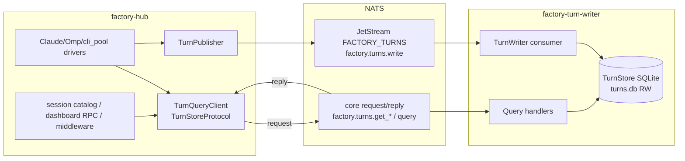

## Context

Source: approved frame `artifacts/frames/2309-drop-turn-writer-ro-mount-frame.md` + issue #2309 + live code (post-#2308 / ADR-075).

**Today (hub process):**

| Concern | Mechanism |
|---------|-----------|
| Writes (`set_cli_session`, log_turn, start/end session, …) | `TurnPublisher` → JetStream `factory.turns.write` → `factory-turn-writer` |
| Reads (`get_cli_session`, `get_resume_count`, catalog, history, …) | Hub opens SQLite `TurnStore` on **RO** bind `%h/.roxabi/factory/turn-writer/:ro` |
| Deploy | `deploy/quadlet/factory-hub.container` Volume line for `turn-writer/` |

Hub call sites that still require a live `TurnStore` / `TurnStoreProtocol` (grep-verified):

| Method | Call sites (hub path) |
|--------|------------------------|
| `get_cli_session` | `claude_rpc`, `omp_rpc`, `llm_client`, `cli_pool` |
| `get_cli_session_by_pool` | `cli_pool` |
| `get_resume_count` | `TurnPublisherAdapter` ← `middleware_pool` |
| `list_sessions` | `session_commands` |
| `list_recent_sessions` | `session_catalog` / dashboard RPC |
| `get_turns_by_session` | `dashboard_rpc` |
| `get_turns` | `session_lifecycle` |
| `get_last_session` | `path_validation` |

Issue body sketches **only** `factory.turns.get_cli_session` first. Acceptance however requires **no hub Volume** and **no hub open FD on `turns.db`**. That forces every hub read above onto the bus in this issue — not a follow-up — otherwise the mount cannot be removed.

Write path and JetStream consumer (`turn-writer-v1`) stay unchanged.

## Goal

Hub never opens `turns.db`; all hub session/turn **reads** go over NATS request/reply to `factory-turn-writer` (sole SQLite owner); RO `turn-writer/` Volume is removed from the hub unit.

## Users

| User | Workflow |
|------|----------|
| Claude / Omp resume (`queue_resume`) | After cold hub restart, lookup `cli_session_id` via bus, not local SQLite |
| Hub session / catalog / dashboard BFF | list/history/resume-count still work without shared FS |
| M₁ operator | One fewer bind on `factory-hub`; turn-writer remains only process with RW `turns.db` |

## Expected Behavior

1. **Cold start:** `factory-turn-writer` alone mounts `turn-writer/` RW and opens `TurnStore`. Hub does **not** call `factory_turns_db_path()` / does not construct SQLite `TurnStore` in `open_stores`.
2. **Resume path:** Claude/Omp/cli_pool call `get_cli_session(session_id)` on a wired `TurnQueryClient` → NATS request → turn-writer handler reads SQLite → JSON reply `{cli_session_id: str|null}` (or error envelope). Timeout / no-responders → same fail-soft behavior as today when store missing (no crash; resume skipped / null).
3. **Other hub reads:** same client implements the remaining `TurnStoreProtocol` (+ `get_resume_count` for `ResumePublisherPort`) via request/reply; dashboard list turns and session catalog keep working.
4. **Writes:** unchanged — still `TurnPublisher` / JetStream `factory.turns.write`.
5. **ACL:** matrix updated; `auth.conf` regenerated drift-clean. Hub **publishes** query subjects (enumerate or `factory.turns.get_>` / list_* as needed); turn-writer **subscribes** (already `factory.turns.>`) + **replies** (`allow_responses` already true). Hub already has `_inbox.hub.>`. **Must** add `request_reply_flows[]` entries (`requester: hub`, `responder: turn-writer`) so `check_request_reply_flows` / grant inject stays green.
6. **Stream isolation (S1, not optional):** `FACTORY_TURNS` stream subjects today are `factory.turns.>` — core publishes under `factory.turns.get_*` would still be **ingested** as orphan WorkQueue messages. S1 **narrows stream subjects to `["factory.turns.write"]`** (idempotent `update_stream`). Consumer filter already write-only; stream must match.
7. **Deploy order:** ship turn-writer handlers + ACL reload **before** hub switches to TurnQueryClient and drops the RO Volume. `factory-hub.container` drops the dedicated `turn-writer/:ro` Volume; install.sh comments that assumed hub binds `turns.db` are corrected (pre-create file remains for turn-writer only).
8. **factory-data.volume caveat:** hub also mounts the whole factory data dir **rw** (includes `turn-writer/` path). Removing the RO overlay **without** stopping SQLite open would give hub **RW** on `turns.db` (worse than today). Real invariant: hub never opens `turns.db` (no `factory_turns_db_path` / no SQLite TurnStore in hub bootstrap). Volume line drop is necessary but not sufficient.
9. **Verification:** unit file has no hub `turn-writer` RO volume; runtime open FDs on hub exclude `turns.db`; smoke web Lyra + Claude/Omp resume after cold restart.

## Data Model & Consumers

| Consumer | Fields / ops | When | Status |
|----------|--------------|------|--------|
| Drivers (`claude_rpc`, `omp_rpc`, `llm_client`, `cli_pool`) | `get_cli_session`, `get_cli_session_by_pool` | resume / queue | this issue |
| `TurnPublisherAdapter` | `get_resume_count` | middleware resume | this issue |
| `session_commands` / `session_lifecycle` | `list_sessions`, `get_turns` | /session UX | this issue |
| `session_catalog` / `dashboard_rpc` | `list_recent_sessions`, `get_turns_by_session` | dashboard BFF | this issue |
| `path_validation` | `get_last_session` | path checks | this issue |
| `TurnPublisher` | write events | every turn | unchanged (#2308) |
| `TurnWriter` | mutators on SQLite | consume writes | unchanged |

**Wire format (normative for implement):**

- Transport: **core NATS** request/reply (not JetStream). Subjects live under `factory.turns.*` so turn-writer’s existing `subscribe: factory.turns.>` covers them without a new top-level namespace.
- **Contracts:** add subject constants to `roxabi-contracts` (alongside existing `SUBJECTS.turn_write`) and keep `subject_literals` / matrix in sync.
- Preferred shape (one subject family, least ACL churn):

  | Subject | Request JSON | Response JSON |
  |---------||--------------|---------------|
  | `factory.turns.get_cli_session` | `{ "session_id": str }` | `{ "cli_session_id": str \| null }` |
  | `factory.turns.get_cli_session_by_pool` | `{ "pool_id": str }` | `{ "cli_session_id": str \| null }` |
  | `factory.turns.get_resume_count` | `{ "session_id": str }` | `{ "resume_count": int }` |
  | `factory.turns.get_last_session` | `{ "pool_id": str }` | `{ "session_id": str \| null }` |
  | `factory.turns.list_sessions` | `{ "pool_id": str, "limit": int }` | `{ "sessions": SessionRow[] }` |
  | `factory.turns.list_recent_sessions` | `{ "limit": int }` | `{ "sessions": CatalogSessionRow[] }` |
  | `factory.turns.get_turns` | `{ "pool_id": str, "user_id": str, "limit": int }` | `{ "turns": TurnRow[] }` |
  | `factory.turns.get_turns_by_session` | `{ "session_id": str, "limit": int }` | `{ "turns": TurnRow[] }` |

- **Row schemas:** response arrays **mirror existing** `TurnRow` / `SessionRow` / `CatalogSessionRow` TypedDicts in `factory.core.stores.turn_store_protocol` (same field names as SQLite query layer returns today — no BFF schema fork).
- Errors: empty body / timeout → client returns null / empty list / 0 per method semantics (fail-soft, match current “store unavailable” behavior). Poison/invalid request → turn-writer responds with `{ "error": { "code": str, "message": str } }` and client maps to null/empty (no hub crash).
- Timeout default: short (e.g. 2–5 s) — these are local SQLite lookups, not LLM calls.
- **Identity:** hub uses hub nkey (`_inbox.hub.`); turn-writer responds with `allow_responses` (already true).
- **Ops coupling:** after mount drop, resume/catalog **require** turn-writer liveness (RO SQLite used to tolerate writer restart for reads). Document in runbook/ops note if one exists for turns; fail-soft logs make outages visible.

## Breadboard

| ID | Affordance | Handler | Data |
|----|------------|---------|------|
| U1 | Resume Claude/Omp after restart | Driver `get_cli_session` → TurnQueryClient | `cli_session_id` |
| U2 | Increment / read resume count | Middleware → ResumePublisherPort → client | `resume_count` |
| U3 | Dashboard session list / turn history | dashboard_rpc → client | SessionRow / TurnRow |
| U4 | `/session` commands | session_commands → client | list_sessions |
| N1 | NATS request subjects `factory.turns.get_*` | turn-writer query subscriber | request/reply JSON |
| N2 | JetStream `factory.turns.write` | TurnWriter (unchanged) | TurnWriteEvent |
| S1 | Hub bootstrap | open_stores **without** SQLite TurnStore; wire TurnQueryClient(nc) | StoreBundle.turn type → protocol |
| S2 | Hub unit | remove RO Volume | `factory-hub.container` |
| S3 | ACL matrix | hub publish query subjects; regen auth.conf | `acl-matrix.json` |
| S4 | turn-writer process | start query subscription alongside JetStream loop | same process, same TurnStore |

## Slices

| Slice | Delivers | Demo | Depends |
|-------|----------|------|---------|
| **S1 — Query surface + stream narrow** | Core NATS handlers for all get_* subjects; **narrow `FACTORY_TURNS` stream subjects to `factory.turns.write`**; unit tests against temp TurnStore | `nats req factory.turns.get_cli_session …`; stream info subjects == write only | — |
| **S2 — TurnQueryClient + hub wire** | Client implements protocol (+ `get_resume_count`); bootstrap + drivers + `TurnPublisherAdapter` use it; hub no longer opens turns.db; unified mode shares one in-proc TurnStore (never double-open) | Unit tests: client ok/timeout/no-responders; hub open_stores does not create SQLite TurnStore | S1 |
| **S3 — ACL + deploy** | Hub publish grants + `request_reply_flows`; auth.conf regen; drop hub RO Volume **after** code switch; install.sh comment fix | unit file greps clean; ACL + request_reply_flows gates green | S2 |
| **S4 — Integration / smoke** | Resume after cold restart; dashboard list turns still works | Claude/Omp queue_resume + web Lyra smoke | S3 |

## Success Criteria

- [ ] `deploy/quadlet/factory-hub.container` has **no** dedicated Volume bind for `turn-writer/` or `turns.db`
- [ ] Hub bootstrap path does **not** call `factory_turns_db_path()` / does not open SQLite `TurnStore` (turn-writer process still does) — so hub open FDs never include `turns.db` despite factory-data rw volume
- [ ] `FACTORY_TURNS` stream subjects are exactly `factory.turns.write` (no `factory.turns.>` capture of query traffic)
- [ ] With hub + turn-writer + NATS up: for a **fixture** session with known `cli_session_id`, hub `get_cli_session` returns that same id
- [ ] Claude and Omp `queue_resume` after **cold hub restart** attach the known fixture `cli_session_id` (turn-writer left up; row already in `turns.db`)
- [ ] For the same fixture: `get_resume_count` returns the stored int; `get_turns_by_session` / session catalog return **non-empty** when the fixture has turns
- [ ] `acl-matrix.json`: hub publish on query subjects + `request_reply_flows` hub→turn-writer; `auth.conf` regen drift-clean; request_reply_flows check green
- [ ] Unit tests cover: turn-writer handlers (happy + missing session), TurnQueryClient (ok / timeout / no-responders → fail-soft)
- [ ] Smoke: web chat Lyra + resume path (issue AC)

## Edge Cases

| Case | Handling |
|------|----------|
| turn-writer down / no responders | Client fail-soft: null / [] / 0; log warning; no hub crash |
| Request timeout | Same fail-soft; short timeout |
| Unknown session_id | Reply `cli_session_id: null` (not error) |
| Invalid JSON / missing fields | Reply error envelope; client fail-soft |
| JetStream write vs core query subject collision | Writes stay on `factory.turns.write` (JS); queries are core NATS only. **Must narrow stream subjects to `factory.turns.write`** (today stream is `factory.turns.>` and would orphan-ingest query traffic). Consumer filter alone is insufficient |
| WAL / concurrent read during write | Same SQLite process (turn-writer); default SQLite concurrency OK for RO queries in-process |
| Unified `factory start` (in-proc) | Same client over embedded NATS; no RO mount concept; still no second SQLite open if single process owns store — **implement must not double-open**; prefer shared TurnStore in unified mode if already one process |
| install.sh pre-create turns.db | Keep for turn-writer; drop wording that hub bind-mounts it |

## Out of Scope

- Changing JetStream write model / TurnPublisher payload kinds
- Multi-region replication of turns.db
- New analytics / export APIs beyond existing protocol methods
- Adapter-side TurnStore access (adapters already null `turn_store` on inbound context)

## Axis note (stage primacy)

- **Stage:** turns ownership stays on turn-writer process; hub is a **bus client**.
- **Thin adapters:** no per-platform session lookup — one `TurnQueryClient` implements `TurnStoreProtocol`.
- **Not:** re-introducing shared FS or per-adapter SQLite readers.
