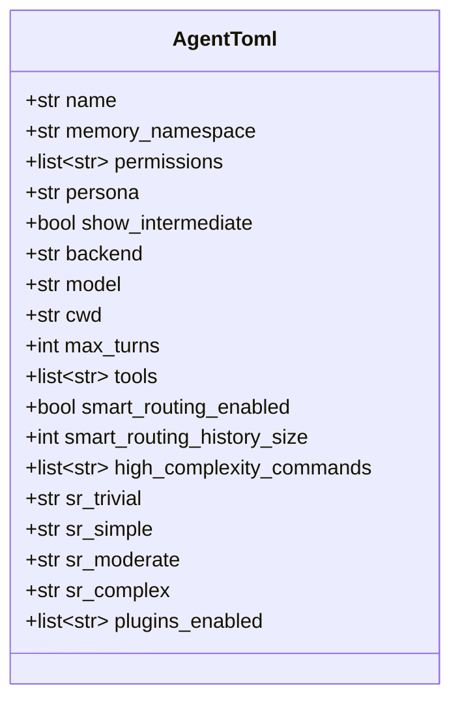
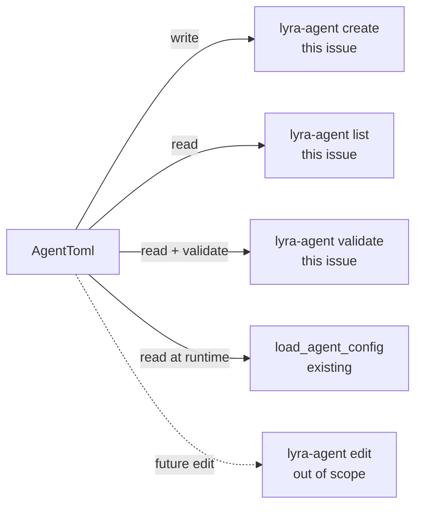

## Context

Promoted from approved frame: `artifacts/frames/242-agent-wizard-frame.mdx`.
Analysis was skipped (F-lite tier — frame is sufficient).

## Goal

Add `lyra-agent create | list | validate` CLI sub-commands via Typer so a new agent can be bootstrapped interactively without hand-editing TOML.

## Users

- **Primary:** Developer/maintainer bootstrapping a new Lyra agent (currently: Mickael)
- **Secondary:** Future contributors who lack institutional knowledge of the agent TOML schema and its constraints

## Expected Behavior

### Entry point

A new `[project.scripts]` entry is added to `pyproject.toml`:

```toml
[project.scripts]
lyra-agent = "lyra.cli:main"
```

`__main__.py` is **not modified** — `python -m lyra` continues to start the server exactly as today.

Invocation after `uv sync`: `uv run lyra-agent create|list|validate`.

`ollama` backend is intentionally excluded from the wizard (it is future/incomplete). Wizard only offers `claude-cli` and `anthropic-sdk`.

### `lyra agent create`

```
$ uv run lyra-agent create

Agent name: my_agent                          # validated: [a-zA-Z0-9_-], must not exist
Backend [claude-cli/anthropic-sdk]: anthropic-sdk
Model [claude-haiku-4-5-20251001/claude-sonnet-4-6/claude-opus-4-6]: claude-sonnet-4-6
Working directory (cwd) [leave blank = ~/projects]:
Max turns [10]:
Tools (comma-separated, or 'default') [default]:
Persona name (blank = none):
Show intermediate turns? [y/N]:
Enable smart routing? [y/N]: y
  → Smart routing requires backend=anthropic-sdk ✓
  history_size [50]:
  high_complexity_commands (comma-separated, blank = none):
  Model for TRIVIAL tier [claude-haiku-4-5-20251001]:
  Model for SIMPLE  tier [claude-haiku-4-5-20251001]:
  Model for MODERATE tier [claude-sonnet-4-6]:
  Model for COMPLEX  tier [claude-opus-4-6]:
Plugins (comma-separated, or 'default') [echo]:

✅ Created src/lyra/agents/my_agent.toml

Next steps:
  lyra.toml → add:  [[telegram.bots]] bot_id="my_agent" agent="my_agent"
              or:   [[discord.bots]]  bot_id="my_agent" agent="my_agent"
  .env      → add:  TELEGRAM_TOKEN_MY_AGENT=...
                    (or DISCORD_TOKEN_MY_AGENT=... for Discord)
```

**Constraint enforcement:** If the user enables `smart_routing` with `backend = "claude-cli"`, the wizard warns and forces `smart_routing.enabled = false`:
```
⚠ smart_routing requires backend=anthropic-sdk. Disabling smart_routing.
```

**Duplicate name:** If an agent with that name already exists, exit early:
```
Error: Agent 'my_agent' already exists at src/lyra/agents/my_agent.toml
```

**Missing directory:** If `src/lyra/agents/` does not exist, the wizard creates it before writing the TOML.

### `lyra-agent list`

```
$ uv run lyra-agent list

NAME             BACKEND         MODEL                       SMART ROUTING
lyra_default     claude-cli      claude-sonnet-4-6           disabled
aryl_default     claude-cli      claude-haiku-4-5-20251001   disabled
my_agent         anthropic-sdk   claude-sonnet-4-6           enabled
```

Reads all `src/lyra/agents/*.toml` via `load_agent_config`. Plain text output (no `rich` dependency). Exits 0 even if `agents/` is empty or absent (prints empty table with headers).

### `lyra-agent validate <name>`

```
$ uv run lyra-agent validate my_agent

Validating my_agent...
✅ Schema: OK
✅ smart_routing: backend=anthropic-sdk — constraint satisfied
```

Soft warnings (backend constraint mismatch) → exit **0** with `⚠` line:
```
$ uv run lyra-agent validate bad_agent

Validating bad_agent...
✅ Schema: OK
⚠ smart_routing.enabled=true but backend=claude-cli — smart routing will be ignored at runtime
```

Hard errors (file not found, missing required field, invalid backend value) → exit **non-zero**:
```
$ uv run lyra-agent validate missing_agent
Error: Agent config not found: src/lyra/agents/missing_agent.toml
```

**Hard schema error definition:** any exception raised by `load_agent_config(name)` (FileNotFoundError, ValueError, tomllib.TOMLDecodeError). These all exit non-zero. A successful load that reveals a soft constraint is a warning (exit 0).

## Data Model & Consumers





| Consumer | Fields consumed | When | Status |
|----------|----------------|------|--------|
| `lyra-agent create` | all prompted fields | write-time | this issue |
| `lyra-agent list` | name, backend, model, smart_routing.enabled | display | this issue |
| `lyra-agent validate` | all fields + constraint | validation | this issue |
| `load_agent_config` | all fields | runtime startup | existing |
| `lyra-agent edit` | all fields | future | out of scope |

### TOML section mapping

| Wizard prompt | TOML section | Key |
|---------------|-------------|-----|
| Agent name | `[agent]` | `name` (must equal filename stem) |
| — (fixed) | `[agent]` | `memory_namespace` = agent name |
| — (fixed) | `[agent]` | `permissions = []` |
| Persona name | `[agent]` | `persona` (omit if blank) |
| Show intermediate | `[agent]` | `show_intermediate` |
| Backend | `[model]` | `backend` |
| Model | `[model]` | `model` |
| Working dir | `[model]` | `cwd` (omit if blank) |
| Max turns | `[model]` | `max_turns` |
| Tools | `[model]` | `tools` |
| Smart routing enabled | `[agent.smart_routing]` | `enabled` |
| History size | `[agent.smart_routing]` | `history_size` (omit if default) |
| High complexity cmds | `[agent.smart_routing]` | `high_complexity_commands` |
| SR model (trivial) | `[agent.smart_routing.models]` | `trivial` |
| SR model (simple) | `[agent.smart_routing.models]` | `simple` |
| SR model (moderate) | `[agent.smart_routing.models]` | `moderate` |
| SR model (complex) | `[agent.smart_routing.models]` | `complex` |
| Plugins | `[plugins]` | `enabled` |

`[agent] name` must equal the filename stem (e.g. `my_agent.toml` → `name = "my_agent"`). `load_agent_config` raises `ValueError` if they differ.

## Breadboard

| Affordance | Handler | Data in | Data out |
|------------|---------|---------|----------|
| `lyra-agent create` | `create_cmd()` in `cli.py` | Typer prompts → wizard state | `agents/<name>.toml` + stdout next-steps |
| `lyra-agent list` | `list_cmd()` | `agents/*.toml` | Plain text table (stdout) |
| `lyra-agent validate <name>` | `validate_cmd(name)` | `agents/<name>.toml` | stdout pass/warn/fail + exit code |
| name uniqueness check | inside `create_cmd` | agent name + agents dir | FileExistsError → early exit with message |
| smart_routing constraint | inside `create_cmd` | backend + sr_enabled | warning + force sr_enabled=false |
| missing agents dir | inside `create_cmd` | agents dir path | mkdir before write |

**Wiring:**
- `src/lyra/cli.py` — new file. Typer app with `agent_app` group exposing `create`, `list`, `validate`.
- `pyproject.toml` — `typer` added to `[project.dependencies]`; `lyra-agent = "lyra.cli:main"` added to `[project.scripts]`.
- `src/lyra/__main__.py` — **unchanged**.

## Slices

| # | Slice | Affordances | Demo |
|---|-------|-------------|------|
| 1 | Create wizard | create, name validation, constraint check, mkdir, TOML write, next-steps | `uv run lyra-agent create` → fill prompts → file exists, loads cleanly |
| 2 | List agents | list, empty-dir handling | `uv run lyra-agent list` → table with all agents |
| 3 | Validate agent | validate, hard errors, soft warnings | valid → ✅; sr+cli → ⚠; missing → non-zero exit |

Each slice is independently demoable and mergeable.

## Success Criteria

- [ ] `typer` is added to `[project.dependencies]` and `lyra-agent = "lyra.cli:main"` to `[project.scripts]` in `pyproject.toml`
- [ ] `python -m lyra` with no arguments still starts the server (no regression)
- [ ] `uv run lyra-agent --help` prints usage and exits 0 — does **not** start the server
- [ ] `uv run lyra-agent create` completes a full happy-path run (all prompts answered) and writes a valid TOML to `src/lyra/agents/<name>.toml`
- [ ] Written TOML satisfies `load_agent_config(name)` without raising (programmatically verified in tests)
- [ ] Wizard rejects names with characters outside `[a-zA-Z0-9_-]`
- [ ] Wizard exits with a clear error message (non-zero) if the agent TOML already exists
- [ ] Wizard creates `src/lyra/agents/` if the directory is absent before writing
- [ ] Wizard forces `smart_routing.enabled = false` and prints a `⚠` warning when `backend = "claude-cli"` is selected with smart routing enabled
- [ ] Wizard prints actionable next steps: lyra.toml snippet + `.env` key name
- [ ] `uv run lyra-agent list` prints a plain-text table with: name, backend, model, smart_routing enabled/disabled
- [ ] `uv run lyra-agent list` exits 0 when `agents/` is empty or absent (prints empty table with headers)
- [ ] `uv run lyra-agent validate lyra_default` exits 0 with no warnings (lyra_default uses claude-cli + smart_routing disabled — valid config)
- [ ] `uv run lyra-agent validate <name-with-sr+cli>` exits 0 with a `⚠` warning line
- [ ] `uv run lyra-agent validate <nonexistent>` exits non-zero with a "not found" message (distinct from schema error)
- [ ] `uv run lyra-agent validate <invalid-toml>` exits non-zero with a schema error message
