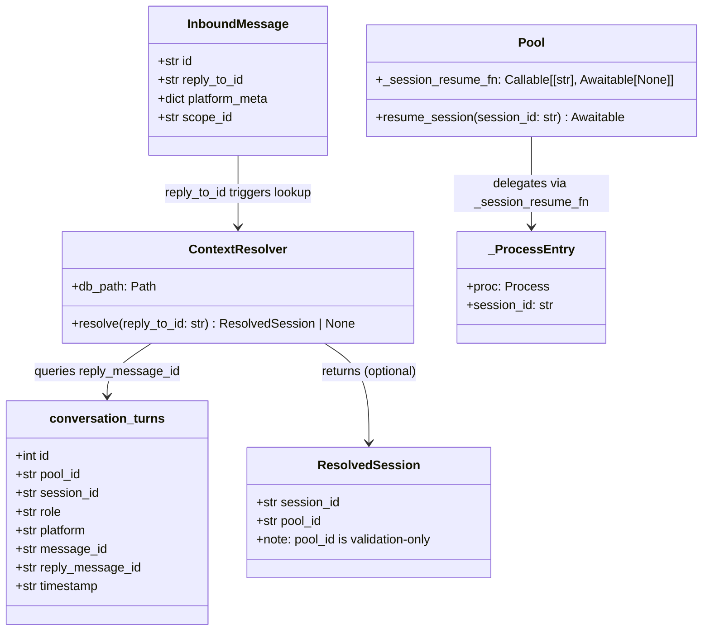
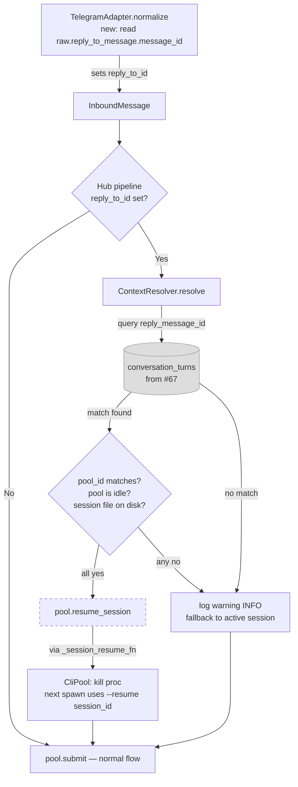

## Context

Promoted from: [`artifacts/frames/244-reply-to-resume-frame.mdx`](../frames/244-reply-to-resume-frame.mdx)

When a user replies to an old Telegram message, Lyra should resume the Claude session that generated that message. Currently `InboundMessage.reply_to_id` exists (defined at `core/message.py:82`) but is never populated by the Telegram adapter; the session lookup index (`conversation_turns`) is gated on #67.

**Full dependency chain:** `#83 (Pool session_id + append hook) → #67 (conversation_turns table) → #244 (this issue)`. #83 must land before #67; #67 must land before #244 can run end-to-end. Slices 1–3 of this spec are independently testable with a SQLite fixture.

Reference implementation: 2ndBrain `context_resolver.py` + `SessionArchive`.

## Goal

When a user replies to a bot message, Lyra resumes the Claude CLI session that produced that message — restoring full conversation context — instead of starting fresh or continuing the current active session.

## Users

- **Primary:** Telegram users who carry multi-thread conversations and want to resume old context by replying to a specific message.
- **Secondary:** The pool/session layer — needs a clean handoff API that doesn't break in-flight state.

## Expected Behavior

1. User sends a reply-to on Telegram (taps "Reply" on a bot message).
2. The aiogram `raw.reply_to_message.message_id` identifies the message being replied to.
3. Telegram adapter's `normalize()` reads `raw.reply_to_message` (net-new — this field is not currently read) → sets `InboundMessage.reply_to_id`.
4. The hub pipeline, before submitting to the pool, calls `ContextResolver.resolve(reply_to_id)`.
5. `ContextResolver` queries `conversation_turns` WHERE `reply_message_id = reply_to_id` → returns `ResolvedSession(session_id, pool_id)`.
6. Hub validates `resolved.pool_id == current_pool_id`; mismatch → log warning and fall back (cross-pool resume is rejected).
7. If idle pool + matching session + session file exists on disk: `pool.resume_session(session_id)` → CLI process killed and restarted with `--resume <session_id>` on next send.
8. Message is submitted to the pool normally — the agent responds with the old context restored.
9. If no match / session file pruned / pool not idle: log warning at INFO level and continue with the current active session. No error is surfaced to the user.

**Fallback tiers (3-tier):**

| Tier | Condition | Behaviour |
|------|-----------|-----------|
| 1 | `reply_to_id` found in DB AND session file on disk AND pool is idle | Resume old session |
| 2 | DB match but session file missing (pruned), or pool is not idle | Log warning, use active session |
| 3 | `reply_to_id` not in DB (no index yet, non-bot message, or cross-pool) | Silent fallback, use active session |

## Out of Scope

- Turn logging (`conversation_turns` population) — owned by #67.
- Discord support — `reply_to_message` not yet captured for Discord; deferred to follow-up.
- Session archiving / pruning / retention policy — separate concern.
- Backfilling `reply_message_id` for turns logged before #67 lands.
- Resuming a session across pool boundaries (different users/scopes).

## Data Model & Consumers

**Consumer summary:**

| Consumer | Fields consumed | When | Status |
|----------|----------------|------|--------|
| `ContextResolver.resolve()` | `reply_message_id`, `session_id`, `pool_id` | On inbound reply | This issue |
| `TurnLogger` (from #67) | `session_id`, `reply_message_id` | On every turn | #67 (prerequisite) |
| Future L1→L2 consolidation | `session_id`, `content`, `timestamp` | Background job | Future |

## Breadboard

Pure backend data-flow feature. No UI components.

**A — Adapter layer (reply_to_id capture)**

`normalize()` currently reads `raw.reply_to_message` only for audio; the text path (lines 404–479) does not read it at all. Net-new: read `raw.reply_to_message` in the text `normalize()`.

| Affordance | Handler | Data |
|-----------|---------|------|
| `raw.reply_to_message` present on aiogram Message | `TelegramAdapter.normalize()` — **new** | `raw.reply_to_message.message_id → InboundMessage.reply_to_id` |
| `raw.reply_to_message` absent | `TelegramAdapter.normalize()` | `InboundMessage.reply_to_id = None` (no change, existing behavior) |

**B — Context resolution (hub pipeline)**

| Affordance | Handler | Data |
|-----------|---------|------|
| `msg.reply_to_id is not None` | `MessagePipeline._resolve_context()` — **new** | calls `ContextResolver.resolve(reply_to_id)` |
| `ResolvedSession` returned, `pool_id` matches, pool idle, session file on disk | `MessagePipeline._resolve_context()` | calls `pool.resume_session(session_id)` before `pool.submit` |
| Any guard fails or `None` returned | `MessagePipeline._resolve_context()` | log at INFO + continue, no pool mutation |

**C — Session handoff (Pool + CliPool)**

Wiring follows the `_session_reset_fn` pattern: `SimpleAgent` registers `_session_resume_fn` lazily on first call (same pattern as `reset_backend` at `simple_agent.py:107–111`).

| Affordance | Handler | Data |
|-----------|---------|------|
| `SimpleAgent.resume_backend(pool_id, session_id)` | `SimpleAgent` — **new** | wires `pool._session_resume_fn = lambda sid: resume_fn(pool_id, sid)` on first call |
| `pool.resume_session(session_id)` | `Pool` — **new** | delegates to `_session_resume_fn(session_id): Callable[[str], Awaitable[None]]` |
| `_session_resume_fn(session_id)` | `CliPool.resume_and_reset(pool_id, session_id)` — **new** | kills current process; sets `entry.session_id = session_id`; next `_spawn_process()` uses `--resume session_id` |
| `pool._session_resume_fn is None` (SDK backend) | `Pool.resume_session()` | no-op, no error |

## Slices

| # | Name | Files | Demo |
|---|------|-------|------|
| 1 | Adapter: capture reply_to_id | `adapters/telegram.py` | `InboundMessage.reply_to_id` is set when user replies to a message; `None` otherwise |
| 2 | ContextResolver | `core/context_resolver.py` (new) | Given a `reply_message_id`, returns `ResolvedSession` from DB or `None`; returns `None` gracefully when DB absent |
| 3 | Pool handoff API | `core/pool.py`, `core/cli_pool.py`, `agents/simple_agent.py` | `pool.resume_session(session_id)` resets CLI process; next send spawns with `--resume`; no-op on SDK backend |
| 4 | Hub pipeline wiring | `core/hub.py` | End-to-end: reply → old session resumed (idle pool); non-reply or busy pool → unchanged |

## Success Criteria

- [ ] `TelegramAdapter.normalize()` sets `InboundMessage.reply_to_id` to `str(raw.reply_to_message.message_id)` when `raw.reply_to_message` is present; leaves it `None` otherwise.
- [ ] `ContextResolver.resolve(reply_to_id)` queries `conversation_turns.reply_message_id` and returns `ResolvedSession(session_id, pool_id)` on match, `None` on miss.
- [ ] `ContextResolver.resolve()` returns `None` (no exception raised) when the DB file does not exist or the `conversation_turns` table is absent.
- [ ] `Pool.resume_session(session_id)` delegates to `_session_resume_fn(session_id: str)` (signature: `Callable[[str], Awaitable[None]]`); is a no-op when `_session_resume_fn is None` (SDK backend).
- [ ] `CliPool.resume_and_reset(pool_id, session_id)` kills the current process and ensures the next `_spawn_process()` call uses `--resume <session_id>`.
- [ ] Hub pipeline calls `ContextResolver.resolve()` only when `msg.reply_to_id is not None`; non-reply messages are unaffected (zero regression).
- [ ] Hub rejects cross-pool resume: if `resolved.pool_id != current_pool_id`, falls back silently with an INFO-level warning.
- [ ] Hub skips resume if `pool.is_idle` is `False` (in-flight turn in progress); falls back silently with an INFO-level warning.
- [ ] Fallback (no DB match, pruned session, busy pool, cross-pool) is transparent to the user — no error message sent; conversation continues with the active session.
- [ ] Slices 1–3 are independently testable without #67 merged (use a SQLite fixture for `ContextResolver`); end-to-end (Slice 4) requires #67 for live `conversation_turns` data.
